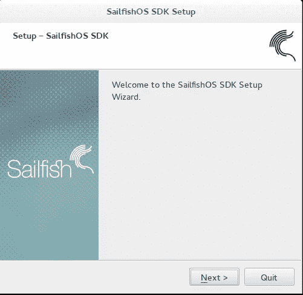
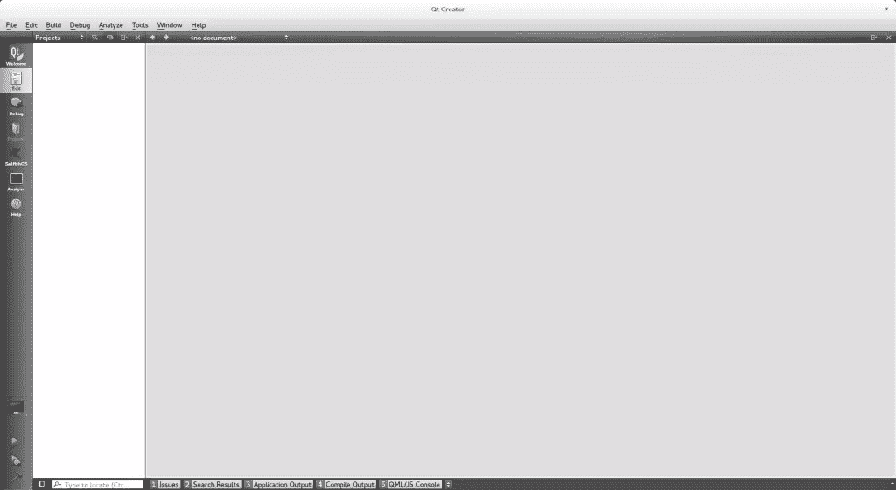
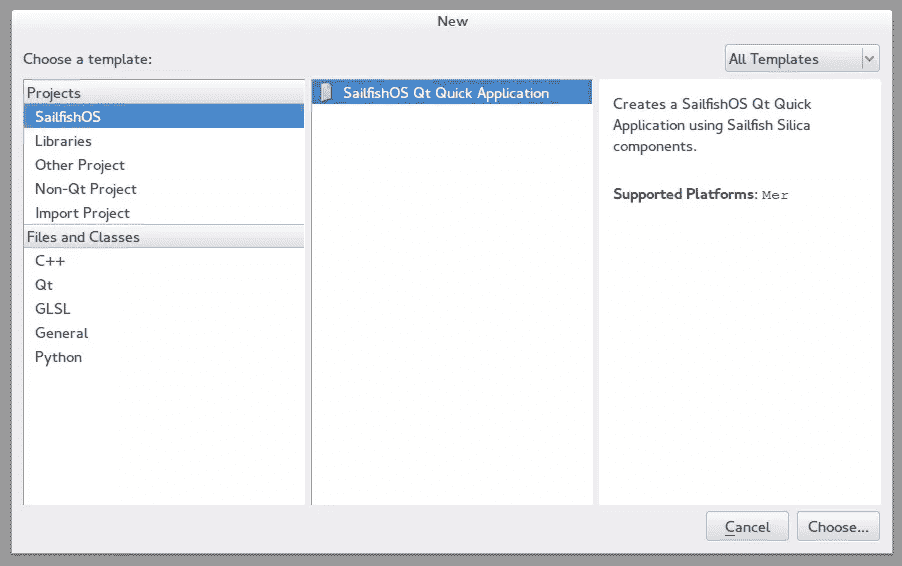
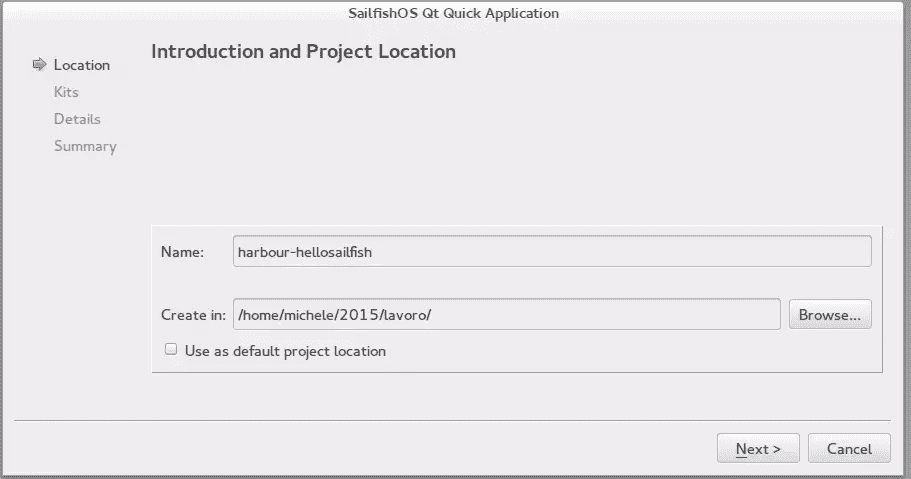
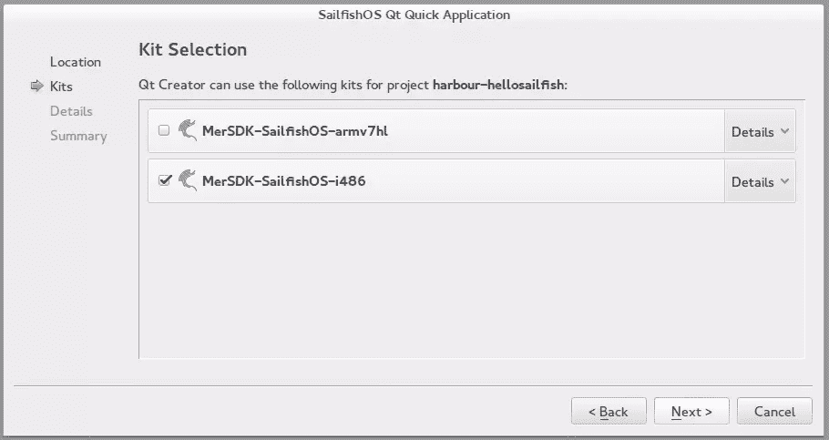
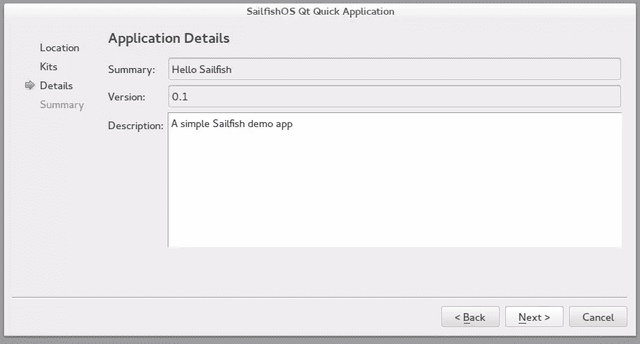
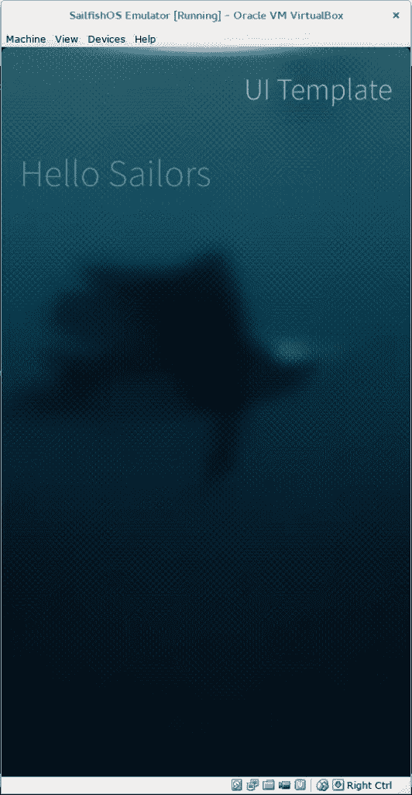

# 你好，旗鱼，旗鱼开发简介

> 原文：<https://www.sitepoint.com/hello-sailfish-introduction-developing-sailfishos/>

在 Jolla 获得上一届 T2 世界移动通信大会最佳平板电脑奖后，人们对他们的操作系统 T4 旗鱼 T5 的兴趣直线上升。

Sailfish 是一个现代而安全的操作系统，构建在 [Mer 开源项目](http://merproject.org/)之上，所以它就像一个经典的 Linux 发行版，添加了 Jolla 精心制作的 Sailfish UI。Sailfish 设备上没有按钮，一切都通过简单的手势来处理，由一个吸引人的设计风格来支持。对于用户和开发者来说，这是一个非常有趣的平台。在本文中，我将向您展示在这个新的、有前途的平台上进行开发是多么容易。

## 开发人员环境设置

SDK 基于 QT Creator 开发环境，有一系列工具可用于构建和测试应用程序。它包含用于交叉编译的 Mer 构建引擎、一个仿真器和所有 API 文档。Sailfish SDK 在 Linux、OS X 和 Windows 上都受支持，所以你没有理由不去尝试一下。

你需要安装 [VirtualBox](http://www.virtualbox.org/) ，然后在[这里](https://sailfishos.org/develop/)下载适用于你的平台的 SDK。
你可以在这里找到每个平台的详细安装说明[，但是一切都应该很简单。](https://sailfishos.org/develop/sdk-overview/develop-installation-article/)

双击安装文件，并点击“下一步”几次。



安装附带了预配置的一切，所以一旦您启动 Sailfish IDE，您就可以开始了。



## 创建项目

Qt creator 完成加载后，点击*文件>新文件*或项目，选择*应用>旗鱼* Qt 快速应用。



填写您的项目名称，并选择保存它的目录。如果您计划将应用程序提交到 Jolla Harbour(这是 Jolla 开发者门户的名称)，您应该使用类似“harbour-myApplicationName”的名称。

这将成为应用程序准备发货时的包名。



点击下一步，选择“MerSDK-SailfishOS-armv7hl”和“MerSDK-SailfishOS-i486”。第一个目标是 Jolla 手机，第二个目标是模拟器。



继续单击下一步，并填写项目摘要和描述。



最后，单击 next 并选择是否要将项目添加到 git 中进行版本控制。

项目现在已经准备好了。应用程序的入口点将是 *src/yourappname.cpp* :

## 编码时间

是时候看看 SDK 创建的示例项目了。打开文件 *src/yourappname.cpp*

```
int main(int argc, char *argv[])
    {
        return SailfishApp::main(argc, argv);
    }
```

这是您必须在应用程序中包含的唯一严格必要的 C++代码。它将创建一个`QGuiApplication`和一个`QQuickView`实例，并加载主 QML 文件，命名为您的目标名称。

Sailfish UI 使用 QML 语言，一种基于 JavaScript 的声明性语言，用于设计以用户界面为中心的应用程序。它是 QT 框架的一部分。

打开名为 *qml/yourappname.qml* 的 QML 文件:

```
import QtQuick 2.0
import Sailfish.Silica 1.0
import "pages"
```

前两行将导入 Qt Quick 和 Sailfish Silica 模块，因此我们可以使用操作系统提供的基本“小部件”(在 QML 上下文中这不是正确的名称)。

最后一次导入加载了 pages 子目录中的所有 QML 文件，并且它们将在当前的 QML 文件中可用。

```
ApplicationWindow
{
    initialPage: Component { FirstPage { } }
    cover: Qt.resolvedUrl("cover/CoverPage.qml")
}
```

应用程序窗口是所有 Sailfish Silica 应用程序的顶层元素。它设置了初始页面来显示应用程序何时启动，还定义了当应用程序在后台被推送时要显示的封面。

QML 对象由其类型指定，后跟一对大括号。对象类型总是以大写字母开头。基本 QML 元素的列表可以在[这里](http://qt.apidoc.info/4.8.5/qmlbasicelements.html)找到，Sailfish 特定元素，称为二氧化硅组件，在 SDK 文档中列出(*帮助>内容> Sailfish 二氧化硅参考文档*

*qml/pages/FirstPage.qml* 文件包含一个要显示的页面:

```
Page {
    id: page
```

页面对象是一个简单的容器。可以用我们选择的名称定义 id 属性，然后在每次需要引用特定对象时使用它。

可以为所有 QML 对象定义它。

```
SilicaFlickable {
        anchors.fill: parent
```

页面元素的第一个子元素是一个`SilicaFlickable`。这是一个将其子元素放在可以拖动和轻弹的表面上的元素。你可以使用[锚](http://doc.qt.io/qt-5/qtquick-positioning-anchors.html)来对齐和放置元素。这里需要 flickable 来使用下一个元素，滑轮菜单，这是 Sailfish UI 中的关键元素之一。滑轮菜单是页面的扩展，它可以放在顶部或底部，当用户移动内容时就会显示出来，使用户不必到达屏幕的顶部或底部来选择菜单项。

添加滑轮菜单很简单:

```
PullDownMenu {
            MenuItem {
                text: qsTr("Show Page 2")
                onClicked: pageStack.push(Qt.resolvedUrl("SecondPage.qml"))
            }
        }
```

滑轮菜单总是需要成为可滑动元素的子元素(`SilicaFlickable`、`SilicaListView`或`SilicaGridView`)。定义多个菜单项是可能的，但是指南建议您不要超过五个元素。

在上面的代码中，一个动作被附加到`onClicked`事件，使用 pageStack 对象将 *SecondPage.qml* 推入视图。

```
Column {
            id: column

            width: page.width
            spacing: Theme.paddingLarge
            PageHeader {
                title: "UI Template"
            }
            Label {
                x: Theme.paddingLarge
                text: "Hello Sailors"
                color: Theme.secondaryHighlightColor
                font.pixelSize: Theme.fontSizeExtraLarge
            }
        }
```

`Column`元素垂直定位其子元素以避免重叠。元素定义了显示在内容和标签顶部的标题，它只是一个标签。

注意如何使用主题对象定义间距、字体大小和颜色。没有必要硬编码任何东西，我相信我的应用程序将在多种设备上很好地扩展，并且文本将在用户选择的任何环境下都易于阅读。

Ambiances 是 Sailfish 中的一种“主题”,但也可以改变每个应用程序的外观，以匹配用户选择的颜色和背景。

现在打开 *qml/cover/CoverPage.qml* 文件。

```
CoverBackground {
    Label {
        id: label
        anchors.centerIn: parent
        text: "My Cover"
    }

    CoverActionList {
        id: coverAction

        CoverAction {
            iconSource: "image://theme/icon-cover-next"
        }

        CoverAction {
            iconSource: "image://theme/icon-cover-pause"
        }
}
```

Sailfish 中的 Covers 是后台应用程序的可视化表示，显示在正在运行的应用程序的屏幕上(类似于 Android 任务切换器)。在这个例子中，封面显示了一个标签，并提供了两个允许用户与应用程序交互的`coverAction`,即使它在后台。

每当 cover 动作被激活时，就会触发`onTriggered`事件，但在本例中没有使用。

## 运行应用程序

现在点击左侧工具条上的 Sailfish (Debug)图标，选择 *"MerSDK-SailfishOS-i486"* 工具包，选择在模拟器上构建和运行应用程序。


按绿色的 *play* 按钮编译并运行项目。当你第一次被要求启动 Mer 构建机器和模拟器时，点击“Yes”并等待模拟器弹出和你的应用程序启动。



“应用程序输出”选项卡将显示来自应用程序错误和“console.log”消息的所有日志。


## 总结

现在，您已经具备了编写一个基本但看起来很好的 Sailfish 应用程序所需的工具和知识。我发现 Sailfish SDK 比大多数其他移动 SDK 聪明，模拟器运行流畅，使得在这个平台上开发成为一种真正的乐趣。我将在以后的文章中讨论更多关于 Silica UI 组件及其与其他移动操作系统的相似之处，我很想知道你是如何发现使用 Sailfish 的。

黑客快乐。