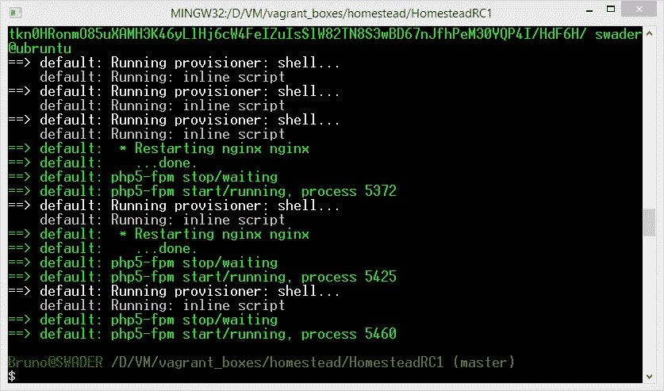
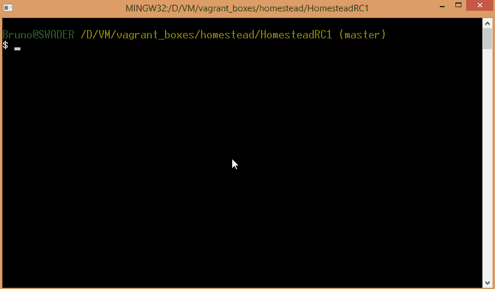
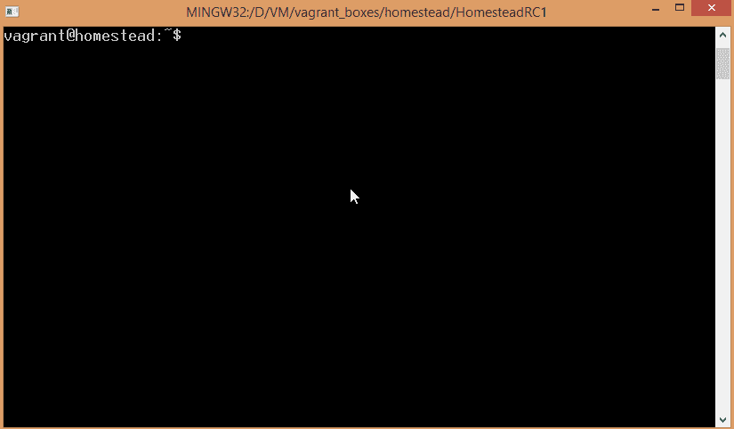
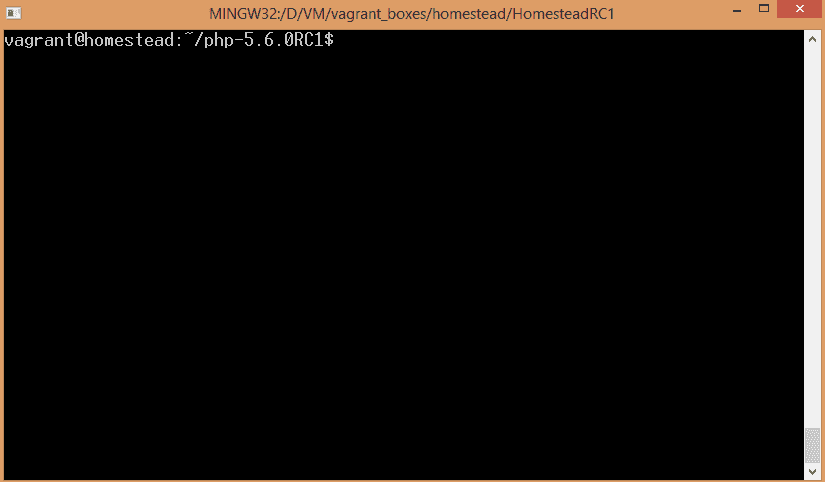
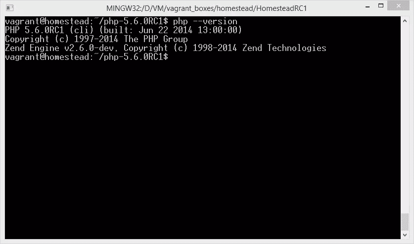

# 帮助开发 PHP: 5.6 RC1 家园

> 原文：<https://www.sitepoint.com/help-develop-php-5-6-rc1-homestead/>

上周我们谈到了 Laravel Homestead，这是一个由 Taylor Otwell 在 avange 上为 PHP 准备的本地开发环境，旨在作为所有 Laravel(可能还有其他 PHP)项目的公共起点。如果你错过了这篇文章，我鼓励你读一读，熟悉一下 Homestead 作为你的下一个开始环境。

在那之前的一周，我们讨论了 5.6 测试版的[结束，以及 RC 程序的开始。PHP 核心开发团队鼓励人们试用和测试 RC 版本，并向他们提交构建反馈，以便他们可以收集一些使用统计数据和可能的构建错误，以便在下一个版本中解决。PHP 5.6 RC1 已于日前发布，可以在](https://www.sitepoint.com/php-5-6-end-beta/)[下载](http://qa.php.net/)。

在本帖中，我们将快速浏览一下如何在 Laravel Homestead 中的常规 PHP 上安装它，并将构建反馈报告给 QA 站点。

### 建立

为了做好准备，请阅读原始的 [Homestead 文章](https://www.sitepoint.com/6-reasons-move-laravel-homestead/)并严格遵守，直到你有了一个可以运行的 VM。



然后，通过运行`vagrant ssh`SSH 到您的虚拟机。进入后，通过 wget 下载最新的源代码，如下所示:

```
wget http://downloads.php.net/tyrael/php-5.6.0RC1.tar.bz2
```



根据您阅读本文的时间，由于其他 RC 已经退出，链接可能会有所不同。接下来，解压缩下载的归档文件，并将目录更改为新创建的目录。

```
tar xvfj php-5.6.0RC1.tar.bz2
cd php-5.6.0RC1
```



### 先决条件

为了以最基本的形式从源代码构建 PHP，我们绝对需要一个依赖项。运行以下命令:

```
sudo apt-get install libxml2 libxml2-dev
```

如果 Aptitude 试图从 IP 地址获取 libxml2-dev 时出现错误，您可能必须运行`sudo apt-get update`。然后，重新运行上面的命令(见下面的 gif)。接下来，运行:

```
./configure --enable-fpm
```



我们需要启用 FPM，因为 Homestead PHP 是作为 FPM 构建的，Nginx 也是这样使用它的。如果我们想用自己的 PHP 替换 Homestead 安装的 PHP，我们需要在编译前启用-fpm。

### 编译和测试

为了在运行 configure 命令后从源代码编译 PHP，我们运行

```
make
```

将从源代码编译 PHP 并报告遇到的任何错误。这可能需要一段时间，取决于您的处理能力。

编译过程完成后，运行:

```
make test
```

这个命令将为编译后的 PHP 运行测试，可能需要一段时间，这取决于您的配置值，以及您的 VM 和主机的能力。PHP 的所有核心功能都将被测试，一旦测试完成，将被发送到总部(如果您愿意的话)——请这样做，这些报告有助于核心开发团队在问题出现在生产版本之前查明问题。提交过程是不确定的，当给出你的电子邮件地址时没有确认对话框，所以第一次也是唯一一次要注意写对——见下面的 gif。


### 装置

安装编译好的 PHP 就像运行

```
sudo make install
```

所有必需的二进制文件应该被复制到它们各自的文件夹中。在新的 PHP 被实际激活之前，还有最后一步你应该做——重启 PHP-FPM。这是通过运行以下命令完成的:

```
sudo /etc/init.d/php5-fpm restart
```

现在运行`php --version`应该会产生以下结果:



### 其他帮助方式

虽然在 Homestead 中构建和安装 RC1 纯粹是“自私的”,因为我们可以使用它并玩弄它，但我们可以通过提交来自其他平台的测试报告和其他配置值来进一步提高这种无私。

例如，看看不同的[配置值](http://www.php.net//manual/en/configure.about.php)，您可以更改它们来产生不同的 PHP 编译版本，然后提交这些迭代的测试结果。尝试在不同的虚拟机而不是 Homestead 中启动不同的操作系统，并在那里安装 RC1——他们正在寻找从 Windows 到 CentOS 等各种操作系统的测试结果。

最后，和 RC1 一起玩，测试[新特性](https://www.sitepoint.com/new-features-php-5-6/)并报告你发现的错误。让我们一起努力，让 PHP 的下一个版本成为最好的版本。

## 分享这篇文章