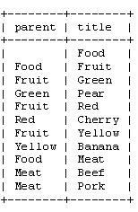

# 在数据库中存储分层数据

> 原文：<https://www.sitepoint.com/hierarchical-data-database/>

这篇文章写于 2003 年，至今仍是我们最受欢迎的帖子之一。如果你渴望学习更多关于掌握数据库管理的知识，你可能会对这篇关于 MySQL 的文章很感兴趣。

无论你是想建立自己的论坛，在网站上发布邮件列表中的消息，还是编写自己的 cms:总有一天你会想把分层数据存储在数据库中。而且，除非您使用类似 XML 的数据库，否则表是没有层次结构的；它们只是一个简单的列表。您必须找到一种方法来转换平面文件中的层次结构。

存储树是一个常见的问题，有多种解决方案。有两种主要的方法:邻接表模型和改进的前序树遍历算法。

在本文中，我们将探讨这两种保存分层数据的方法。我将用一个虚构的网上食品店的树作为例子。这家食品店按种类、颜色和类型来组织食物。这棵树看起来像这样:


本文包含许多代码示例，展示了如何保存和检索数据。因为我自己使用这种语言，而且许多其他人也使用或知道这种语言，所以我选择用 PHP 编写示例。你可以很容易地把它们翻译成你自己选择的语言。

## 邻接表模型

我们将尝试的第一种也是最优雅的方法叫做“邻接表模型”或“递归方法”。这是一个很好的方法，因为你只需要一个简单的函数来遍历你的树。在我们的食品商店中，邻接表看起来像这样:



如你所见，在邻接表方法中，你保存了每个节点的“父节点”。我们可以看到‘梨’是‘青’的子，是‘果’的子等等。根节点“Food”没有父值。为了简单起见，我使用“title”值来标识每个节点。当然，在真实的数据库中，您将使用每个节点的数字 id。

***给我树***

既然我们已经在数据库中插入了树，那么是时候编写一个显示函数了。该函数必须从根节点(没有父节点的节点)开始，然后应该显示该节点的所有子节点。对于这些子节点中的每一个，该函数都应该检索并显示该子节点的所有子节点。对于这些孩子，该函数应该再次显示所有孩子，依此类推。

您可能已经注意到，在这个函数的描述中有一个规则的模式。我们可以简单地编写一个函数，它检索某个父节点的子节点。然后，该函数应该为这些子节点中的每一个启动另一个自身实例，以显示它们的所有子节点。这就是“递归方法”得名的递归机制。

```
<?php 

// $parent is the parent of the children we want to see 

// $level is increased when we go deeper into the tree, 

//        used to display a nice indented tree 

function display_children($parent, $level) { 

    // retrieve all children of $parent 

    $result = mysql_query('SELECT title FROM tree '. 

                           'WHERE parent="'.$parent.'";'); 

    // display each child 

    while ($row = mysql_fetch_array($result)) { 

        // indent and display the title of this child 

        echo str_repeat('  ',$level).$row['title']."n"; 

        // call this function again to display this 

        // child's children 

        display_children($row['title'], $level+1); 

    } 

} 

?>
```

为了显示我们的整个树，我们将使用空字符串运行函数，对于我们的食品商店树，函数返回:

```
Food

  Fruit

    Red

      Cherry

    Yellow

      Banana

  Meat

    Beef

    Pork
```

注意，如果您只想查看一个子树，您可以告诉函数从另一个节点开始。例如，要显示“水果”子树，您可以运行`display_children('Fruit',0);`

***路径到一个节点***

使用几乎相同的函数，如果您只知道节点的名称或 id，就可以查找到该节点的路径。例如，通往“樱桃”的道路是“食物”>“水果”>“红色”。为了得到这条路径，我们的函数必须从最深层开始:“Cherry”。然后，它查找该节点的父节点，并将它添加到路径中。在我们的示例中，这将是“红色”。如果我们知道' Red '是' Cherry '的父节点，我们可以通过使用到' Red '的路径来计算到' Cherry '的路径。这是由我们刚刚使用的函数给出的:通过递归查找父节点，我们将得到树中任何节点的路径。

```
<?php 

// $node is the name of the node we want the path of 

function get_path($node) { 

    // look up the parent of this node 

    $result = mysql_query('SELECT parent FROM tree '. 

                           'WHERE title="'.$node.'";'); 

    $row = mysql_fetch_array($result); 

    // save the path in this array 

    $path = array(); 

    // only continue if this $node isn't the root node 

    // (that's the node with no parent) 

    if ($row['parent']!='') { 

        // the last part of the path to $node, is the name 

        // of the parent of $node 

        $path[] = $row['parent']; 

        // we should add the path to the parent of this node 

        // to the path 

        $path = array_merge(get_path($row['parent']), $path); 

    } 

    // return the path 

    return $path; 

} 

?>
```

这个函数现在返回给定节点的路径。它以数组的形式返回路径，所以为了显示路径，我们可以使用`print_r(get_path('Cherry'));`,如果你对‘Cherry’这样做，你会看到:

```
Array 

( 

    [0] => Food 

    [1] => Fruit 

    [2] => Red 

)
```

***缺点***

正如我们刚刚看到的，这是一个很好的方法。这很容易理解，我们需要的代码也很简单。那么，邻接表模型的缺点是什么？在大多数编程语言中，它既慢又低效。这主要是由递归引起的。我们需要对树中的每个节点进行一次数据库查询。

由于每个查询都需要一些时间，这使得函数在处理大树时非常慢。

这个方法没有那么快的第二个原因是你可能会用到的编程语言。与 Lisp 等语言不同，大多数语言不是为递归函数设计的。对于每个节点，该函数启动其自身的另一个实例。因此，对于一个有四层的树，您将同时运行该函数的四个实例。由于每个函数都占用一片内存，并且需要一些时间来初始化，所以当应用于大树时，递归非常慢。

**Go to page:** [1](/hierarchical-data-database) | [2](/hierarchical-data-database-2/) | [3](/hierarchical-data-database-3/)

## 分享这篇文章