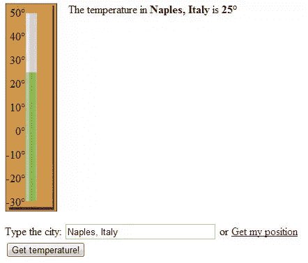

# 创建您自己的 HTML5 环境温度计

> 原文：<https://www.sitepoint.com/hot-stuff-make-your-own-html5-environmental-thermometer/>

毫无疑问:HTML5 和 CSS3，以及它们相关的 API，都是热门的东西。在这篇文章中，我将展示如何使用这些技术来创建一个完整的和功能的环境温度计。

## 配料

一个 HTML5 环境温度计是一个简单和自适应的温度计，允许您测量选定位置的温度。这个演示使用语义 HTML5 标记，CSS3 和 JavaScript 来设计和定位温度计，使它看起来像一个真正的环境温度计。

由于它使用 SVG 背景图像，因此可以适应不同的大小，而不会被拉伸。然而，在包含源代码的文件夹中，还有一个 PNG 背景图像来支持不支持 SVG 的旧浏览器。

所以，总的来说，这里是我们将要使用的各种技术:

*   标记的 HTML5
*   CSS3 设计温度计的样式
*   JavaScript 和 jQuery 来调整温度计的位置，并设置和定位其标签
*   背景自适应的 SVG
*   Polyfill 支持不支持标签的浏览器(使用 jonstipe/meter polyfill)
*   获取用户位置的地理定位 API
*   Google Maps API 将地理位置转换为地址
*   雅虎！用于检索 WOEID 代码和温度的天气 API

## 它是如何工作的

使用这种温度计很简单。要检索温度，您必须在相关字段中写下一个城市的名称——或者更好的是一个地址(例如，如下所示的“那不勒斯”),然后单击按钮“获取温度！”。



一旦检索到温度，您将看到指示条上升(或下降，取决于具体情况),直到达到正确的测量值，并且右上角的相关信息会自动填充数据。如果您需要当前位置的温度，您可以简单地利用代码中使用的地理定位 API。所以，你需要做的就是点击“获取我的位置”，字段会自动填充你当前的位置(说实话，这是一个近似值)。

## 让我们分析代码

在这一节中，我不会解释整个代码，只解释其中最有趣的部分；一些 CSS 规则或 JavaScript 行只是核心的补充。

### HTML5

支撑温度计的标记非常简单:

```
<div id="thermometer-wrapper"> 
  <meter id="thermometer" min="-30" max="50" value="0"></meter> 
  <div id="labels"></div> 
</div> 
<div id="info"> The temperature in <label id="city">-</label> is <output id="temperature" form="request">-</output> 
  <label id="error"></label> 
</div> 
<form id="request" name="request" action="#"> 
  <label>Type the city:</label> 
  <input type="text" id="location" name="location" size="30" placeholder="Frattamaggiore, Italy" required="required"/> or <a id="my-position" href="#">Get my position</a> 
  <br /> 
  <input type="submit" name="submit" value="Get temperature!" /> 
</form> 
```

外部`div`界定使用中的区域，并用于附加背景图像。第二行显示了一个`meter`标签，这是温度计实际使用的元素。`meter`标签赋予了演示一点语义，这从来不是一件坏事。第三行包含附加到温度计的标签，但是它们将使用 JavaScript 动态创建。

剩余的代码用于以书面形式显示信息并请求用户位置。这里重要的标签和属性是内部`div`中的`output`标签，用来显示附加在`form`上的当前温度；以及位置字段的`required`和`placeholder`属性。

### CSS3 和 SVG

CSS3 不仅用于简单地设计代码样式，还用于将标记转换成真正的环境温度计。背景图像是一个 SVG，这意味着它将很好地渲染，并确定演示的尺寸是否会改变。在这里，我使用了 CSS3 规则`background-size`。

```
#thermometer-wrapper { 
  background-image: url('background.svg'); 
  background-repeat: no-repeat; 
  position: relative; 
  height: 300px; 
  width: 75px; 
  float: left; 
  margin: 0em 1em 1em 0em; 
  -ms-background-size: cover; 
  -webkit-background-size: cover; 
  -moz-background-size: cover; 
  -o-background-size: cover; 
  background-size: cover;
}
```

为了给整个东西一个更好的外观和感觉，`meter`标签被旋转 90 度以垂直显示。然而，这带来了在`div`中调整元素大小和居中的问题。尺寸问题源于这样一个事实，即垂直显示时，为了延长条，我们必须改变高度属性。不幸的是，为了像预期的那样工作，这种改变必须在滚动条旋转后完成，所以这是通过 JavaScript 完成的。出于同样的原因，将滚动条居中是一个必须使用 JavaScript——特别是 jQuery——以编程方式解决的问题。转换规则是元素上使用的唯一 CSS3 规则，如下所示:

```
#thermometer { 
  position: absolute; 
  transform: rotate(-90deg); 
  -ms-transform: rotate(-90deg); 
  -webkit-transform: rotate(-90deg); 
  -o-transform: rotate(-90deg); 
  -moz-transform: rotate(-90deg); 
}
```

### JavaScript 和 jQuery

JavaScript 在这个演示中扮演了重要的角色。事实上，由于 CSS 不足以使温度计居中，所以必须使用 JavaScript。此外，后者已被用于动态设置标签的数量，并均匀地间隔东西。即使温度计包装的尺寸改变，标签也会相应地改变。代码的相关部分是:

```
// Calculates the space between each label 
margin = (thermometer.width() + (parseFloat(labels.css('font-size')) / 2)) / ((max - min) / step); 
margin -= parseFloat(labels.css('font-size'));
```

JavaScript 有助于使温度计更具适应性。事实上，通过简单地改变 JavaScript 文件中的一个或两个变量，就有可能得到不同数量的等级标签，而这些标签仍然是均匀分布的。如果你改变了`font-size`，同样的事情也会发生。这是你如何使酒吧居中的方法:

```
// Calculates the position of the thermometer 
thermometer.width(0.9 * wrapper.height()); 
thermometer.css('bottom', ((wrapper.height() - thermometer.height()) / 2) + 'px'); 
thermometer.css('left', (thermometer.width() - wrapper.width()) / -2);
```

### API

在这个演示中，我使用了几个 API。地理定位 API 用于检索用户的位置；这些数据立即被发送到 Google Maps API，以便从坐标中检索地址。最后，雅虎！Weather API 用于检索 WOEID(地球上的位置标识符)并获取所请求位置的当前温度。

这是用来创建这个环境温度计的标记和脚本的基本情况。看一下[在线演示](http://ug.audero.it/wp-content/uploads/demo/html5-environmental-thermometer/)，下载[源代码](https://bitbucket.org/AurelioDeRosa/html5-environmental-thermometer)，亲自检验一下，并随意摆弄一下。(HTML5 环境温度计是完全开源的，并在 MIT 和 GPL-3.0 许可下发布。)

## 分享这篇文章