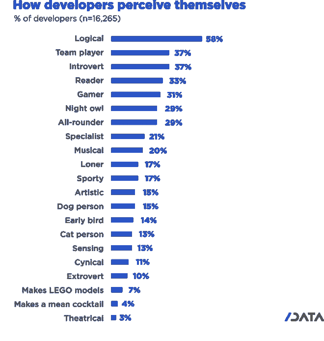
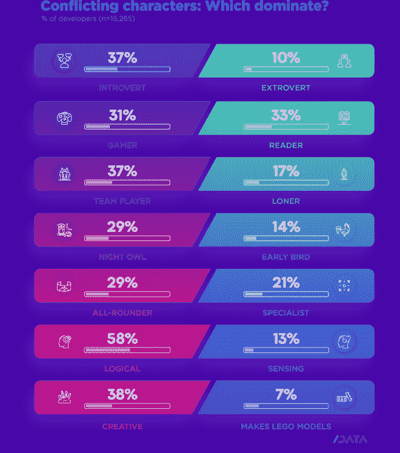

# 开发者如何看待自己？量化的外观

> 原文：<https://www.sitepoint.com/how-do-developers-see-themselves-a-quantified-look/>

*本文由 [SlashData](https://www.developereconomics.net/?member_id=sitepoint) 原创发布。感谢您对使 SitePoint 成为可能的合作伙伴的支持。*

在我们的 Q2 2019 开发者经济调查中，我们首次尝试用开发者自己的话介绍他们，询问他们如何看待自己。

我们提供了一组 21 个单词，并要求他们选择最多五个单词来组成他们的性格草图。我们还让他们有机会提供自己的文本描述。

这是我们得到的信息:

### 超过一半的开发者说他们是合乎逻辑的

也许并不奇怪，近十分之六的开发者说他们是合乎逻辑的。事实证明，这是所有软件开发领域中最受欢迎的描述，除了游戏开发。排在后面的是描述符**团队型选手**和**内向型选手**，各占 37%。相比之下，只有 10%的人认为自己是外向的人。但是你能猜到哪些程序员认为自己不那么内向吗？那些涉及 AR/VR 和物联网领域的公司。很有趣，对吧？

让我们来看一对稍微不同寻常的标签:在开发人员中，爱狗人士比爱猫人士稍微多一点，尽管这两个数字分别接近 15%和 13%。然而，在夜间工作的开发人员(**夜猫子，29%** )和喜欢清新晨风的开发人员(**早起的鸟儿，14%** )之间似乎存在着更大的差异。

### 爱好和业余时间呢？

三分之一(33%)的开发者表示他们是一名读者，这使得它成为业余活动中最受欢迎的选择。紧随其后的是 31%的人称自己是游戏玩家。我们的数据显示，随着年龄的增长，开发人员往往会对自己有不同的看法。34 岁以下的开发者中，超过三分之一的人认为自己是游戏玩家，相比之下，35 岁至 44 岁年龄段中，不到四分之一的人认为自己是游戏玩家，45 岁至 54 岁年龄段中，不到五分之一的人认为自己是游戏玩家。年长的程序员更可能将自己描述为读者。

> 你所说的“现实生活”是什么样的？和 WoW 类似吗？它能在 64 位操作系统上运行吗？”

音乐和体育等其他活动得分较低，分别为 20%和 17%。只有 7%的人制作乐高模型，尽管乐高的受欢迎程度似乎很大程度上取决于年龄。18 岁以下的开发者中有 12 %( T1)制作了**乐高模型**，但在 18-24 岁年龄段中，这个比例减半至 6%。

### 艺术类的呢？

尽管开发人员的工作要求高水平的创造力，但只有 14%的人用**来描述自己。那些参与游戏或增强现实和虚拟现实开发的人比其他人更有可能使用这个词来描述自己。21%的游戏开发者和大约 25%的 AR/VR 开发者认为自己是艺术家，相比之下 **16%或更少**的桌面、网页和后端开发者认为自己是艺术家。**

 **最后，在我们 Q2 2019 年开发者经济调查中，一些程序员对我们为什么要问这个问题感到困惑，并思考我们是否试图建立一个约会网站。好吧，我们没有！我们正在收集数据以创建第 17 版的[开发者国家报告的状态。](https://www.developereconomics.com/resources/reports/state-of-the-developer-nation-17th-q2-2019?member_id=sitepoint)

有兴趣与全球 40，000 名开发者联手打造开发者生态系统的未来吗？[参加我们的调查](https://www.developereconomics.net/?member_id=sitepoint)。** 

## **分享这篇文章**