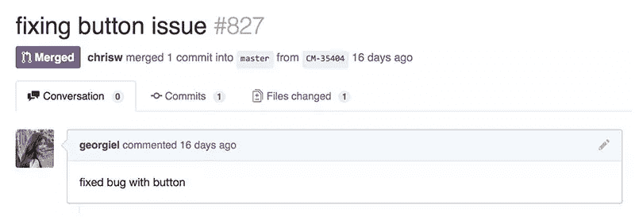
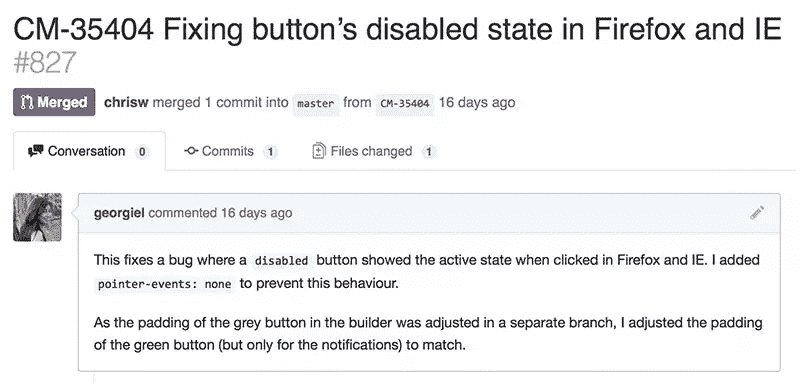

# 你的 HTML 和 CSS 注释有多好？

> 原文：<https://www.sitepoint.com/how-good-are-your-html-and-css-comments/>

当你开始学习基本的 HTML 或 CSS 时，你通常会学到的一件事是如何在你的代码中写注释。然而，许多 web 开发人员仍然没有将评论作为他们的优势。我们可能会在 HTML 和 CSS 中广泛使用注释，但是如果写得恰当，有意图，它们真的可以改善我们的工作流程。

当你开始在一家新公司工作时，看手册或许多页的文档可能会让人望而生畏。每个公司都是不同的——这意味着代码库、遗留代码的数量、框架的开发和模块化代码的数量都可能不同。

我们经常被告知“好的代码不需要注释”，但是你有没有发现自己在原地打转，完全迷失，并且因为缺少注释而搜索文档？

## 关于代码注释的两个事实

1.  浏览器会忽略注释。
2.  在缩小过程中，注释被删除。

基于这两个事实，我们知道评论并不是真的给机器看的——它们是给人类看的。

## 为什么注释代码很重要

当你是一名自由职业者，独自从事一个项目时，或者当你是唯一一个会查看你的代码的开发人员时，很容易按照你自己的方式去做，并做出你认为合适的评论，或者可能根本不留下任何评论。但是很多时候，开发人员说他们回头看自己的代码时会想，“我在想什么？”或者努力理解他们编写代码。

评论有助于保持一致性。如果你对你正在构建的东西有一致的、写得很好的评论，那么你更有可能每次都以同样的方式构建东西。

**注释便于理解。**这在团队中非常重要，因为有时一个人无法完成所有的工作。你可以写一些注释来帮助自己找出一些逻辑，即使你没有在项目结束时保留所有的注释，它也可以帮助你更好地理解你是如何找到解决方案的。它可以帮助您在以后更容易地改进该解决方案。

评论还有助于热修复或快速修复。在这里，评论实际上可以在三个方面有所帮助。如果开发人员需要快速修复，它们可以帮助他们理解代码(尤其是前端团队之外的开发人员，他们可能会提供帮助)，它可以通过标记出哪里需要这些修复来提供帮助，并可以显示快速修复在哪里已经应用，在某个时候需要删除。

评论有助于加快开发过程。如果包含相关评论，您可以更清楚地了解您正在创建、更改或删除的内容。

评论有助于更有效的协作。如果你知道一个项目或代码库的来龙去脉，你更有可能更快地完成一点点工作，从而改进工作流程。

**评论帮了很多人。**他们不仅帮助你自己，还能帮助你团队中的其他人。我们在人们的源代码中看到像`DO NOT STEAL MY CODE`这样的注释的日子已经一去不复返了。虽然我们过去非常保护自己的代码，不想分享我们的“秘密”，但我们现在生活在一个人们共享代码、一起从事项目并进行协作的世界。当谈到网络项目时，我们并不羞于相信像哈里·罗伯茨、克里斯·科伊尔或乔纳森·斯努克这样的人。随着协作的转变，我们也应该注意我们的评论实践，并帮助我们的同行。

## 在评论时要避免的一些事情

### 绝对避免评论任何事情

养成注释每个代码块的习惯可能很诱人，但这可能是多余的，而不是有用的或有帮助的。评论应该只在事情可能不完全清楚的地方进行。如果您在命名类时考虑了语义，您的代码可能已经很容易理解了。

这可能也是“好代码不需要注释”这个概念的来源。注释不应该完全避免，而应该只在必要的时候使用。

### 不要太啰嗦

我个人对在我的 CSS 中写一些相当长的注释感到内疚，因为我喜欢解释和记录事情。然而，你不应该写小说——长篇评论读起来和写起来一样痛苦。如果你能言简意赅，那就说吧。有时，在命名 CSS 类时，会给出以下建议:

使类名尽可能短，但要尽可能长。

这同样适用于评论。最好通读你写的任何评论，以确保你自己理解它们。假设你是代码的新手，你正在阅读注释作为指导。

### 不要花太多时间写评论

我曾经在我工作的一个项目中看到一个文件，上面有一行字:

```
// Update this with how many hours you have spent on this file:
// TIME_WASTED = 438;
```

你不需要花很多时间写评论。几句话通常就够了。如果你花了太多时间试图注释你的代码以确保其他人能理解它，考虑一下你的部分代码可能真的需要重构。

## 一些何时使用注释的例子

### 解释伪元素的用途

这个例子展示了一个填充了`content`值的伪元素。

```
.post__comment-container::after {
  background-color: #f9f9f9;
  border: 1px solid #dedede;
  border-radius: 0.25em;
  color: #888;
  content: 'Post author';
  display: inline-block;
  font-size: 0.7rem;
  margin-left: 0.5rem;
  padding: 0.2rem 0.45rem;
  vertical-align: middle;
}
```

可能不太清楚伪元素的用途，尤其是当内容属性显示为`content: ''`时。通过代码块上方的简短注释，我们可以改进这一点。

```
/* Post author label for comment */

.post__comment-container::after {
  background-color: #f9f9f9;
  border: 1px solid #dedede;
  border-radius: 0.25em;
  color: #888;
  content: 'Post author';
  display: inline-block;
  font-size: 0.7rem;
  margin-left: 0.5rem;
  padding: 0.2rem 0.45rem;
  vertical-align: middle;
}
```

### 解释嵌套代码块

虽然尽可能多地使用语义类肯定会有所帮助，但在使用预处理器时，为什么要嵌套 CSS 块可能并不总是很清楚:

```
.c-segment-controls.is-active {
  .c-segment-controls__panel {
    background-color: #fafafa;
    border: 1px solid #aaa;
    opacity: 1;
    transition: opacity 0.5s ease;
  }
}
```

六个字的注释足以说明这个代码块做了什么，让人们能够浏览文档，或者停止或者向前跳。

```
.c-segment-controls.is-active {

  /* Active state for segment controls panel */

  .c-segment-controls__panel {
    background-color: #fafafa;
    border: 1px solid #aaa;
    opacity: 1;
    transition: opacity 0.5s ease;
  }
}
```

### 解释为什么可能需要`!important`

我们经常看到`!important`并假设我们看到的是遗留代码或肮脏的黑客行为:

```
.c-accordion-container.ng-hide {
  display: block !important;
}
```

仔细观察，我们只是覆盖了框架的默认行为。

```
/**
 * Overriding some rogue Angular code.
 * Forces `display: block` so that the element can be animated.
 */

.c-accordion-container.ng-hide {
  display: block !important;
}
```

### 解释为什么代码块被注释掉而不是简单地删除

如果我们看下面的代码块，我们可能会认为删除它是好的。它肯定没有在任何地方被使用吧？如果我删除它，当我们以后需要它的时候，它无论如何都会在版本控制中，对吗？

```
// .c-segmented-button__icon {
//   transform: translateY(calc((40px - 100%)/2));
// }
```

但是如果我们删除它，有人可能根本不知道它的存在。把这个放在这里可能是个好主意:

```
/**
 * Calculation for vertical alignment.
 * Can be used when IE11 support is dropped.
 */

// .c-segmented-button__icon {
//   transform: translateY(calc((40px - 100%)/2));
// }
```

## 其他种类的文件

文档非常重要，不仅仅局限于代码中的注释。当我们完成一项任务时，我们可能会让它接受同行评审。

### 提交消息

当使用版本控制(例如 Git)时，我们可以利用我们所知道的在代码中编写有用的注释，并将其应用到我们的提交消息中。

错误的提交消息没有给出太多的上下文。它们看起来很邋遢，很难理解。它们对发行说明没有帮助。开发人员可能很难知道发生了什么变化。错误的提交消息通常是这样的。

```
commit 2faa2
    wip
commit 591ad
    tried to fix some weird box
commit af830
    made the triangle thing work
commit bd02a
    refactor
commit bed4b
    hotfix navigation
commit 22fe0
    oops
```

一个更好的例子是用动词描述提交中完成的任务。不同的次要任务将分布在不同的提交中。

```
commit 2faa2
    Adding form component housing
commit 591ad
    Fixing box-sizing issue
commit af830
    Implementing triangle for notification bubble
commit bd02a
    Refactoring list item for smaller viewports
commit bed4b
    Fixing navigation float issue
commit 22fe0
    Fixing typos in class names
```

Karma 有一个非常简单的指南来写更好的提交，而 Chris Beams 有一个[非常深入的指南](http://chris.beams.io/posts/git-commit/)。大卫·德马里甚至写了一篇文章，标题是[《承诺的艺术】](http://alistapart.com/article/the-art-of-the-commit)。提交消息绝对值得关注。

### 拉取请求

在编写了一些提交之后，您通常会创建一个 pull 请求供您的同事查看。我见过太多的拉取请求，这些请求几乎没有细节或者根本没有描述:



当你写一个拉请求的时候，你通常希望有人来检查你的代码。为了帮助那个人并简化这个过程，你应该写一份拉取请求包括什么的描述。这是我的心理清单:

*   票证编号、任务编号或问题编号
*   用几句话提一下任务
*   提及我更改了哪些类型的文件
*   如果是一个 bug，请说明修改前后这个 bug 是什么样的
*   描述变化后的预期行为(应该是一样的吗？)
*   列出在浏览器中或代码中检查更改所需的任何步骤
*   注意任何应该被忽略的东西，例如在另一个分支中解决的 bug
*   必要时包括界面截图

这个例子相对简单，如果没有必要，您绝对不必包括上面列表中的所有内容:



## 结论

尽管我已经提供了一些例子来说明在哪里包含注释，以及一些关于应该避免什么的建议，但是对于如何在代码中格式化注释并没有硬性的规则。行数、字数或包含的信息由你决定，或者由你和你的同事决定。只要你保持格式的一致性，它将保持事情的整洁，并鼓励其他使用代码的人也这样做。

让评论成为你发展过程的一部分有很多好处。养成在你认为合适的地方包含它们的习惯是很好的，尤其是当你有很多人在处理同一个文件的时候。它还有助于考虑嵌入工作流中的其他形式的文档——如提交消息和拉请求——而不仅仅是指导方针的外部文档。

你遵循注释代码的指导方针吗？或者也许你工作的公司有一种不同但有效的文档？

## 分享这篇文章