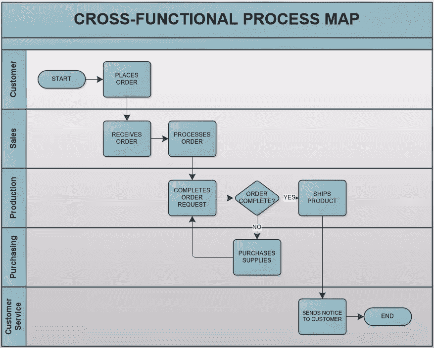

# 流程如何克服这些小企业生产力障碍

> 原文：<https://www.sitepoint.com/how-processes-overcome-these-small-business-productivity-hurdles/>

有了稳定的收入流和不断增长的客户群，让小企业变得更有利可图的一个重要关注领域就是生产率。大多数小型企业都在努力有效地管理他们的流程，最终导致不必要的成本增加。

想象一下，一个简单的业务流程有十个步骤，比如管理员工的上班时间、下班时间和出勤。您可以轻松减少这些流程所需的步骤，并实现自动化。

许多企业苦于使用过时的手动流程，而这些流程早就应该淘汰了。这里有一些小企业生产力的常见障碍，以及如何克服它们。

## 生产力目标没有到位

小型企业通常缺乏过程规划和组织目标。您通常知道您有与单个流程相关的成本，但不知道如何应对。

> “你生来就是为了赢，但要成为一个赢家，你必须计划赢，准备赢，期待赢。”金克拉

目标有助于推动团队前进，并保持实现特定目标的动力。您可以为团队实现生产力目标附加激励，以确保他们以更智能的方式主动执行任务。生产力目标必须是可衡量的，也是可实现的。它必须为团队提供路线图和正确的工具集，以便能够有效地实现它。

## 没有过程评审

大多数小企业未能恰当地审查他们的业务流程。作为企业所有者，您有责任跟踪与组织中每个流程相关的工作流。

你可以寻求专业人士的帮助，了解哪些领域的技术可以取代手工操作。

回顾有助于理解哪些过程可以自动化，哪些过程可以通过简化相关步骤来优化。它可以帮助您了解是否需要使用基于云的工具或创建定制的软件来使这些流程更有效地运行。

当您绘制每个流程时，您可以收集关于组织内存在的部门间集成和协作机会的见解。

必须定期进行流程审查，以消除冗余。

## 不正确的流程映射

很多时候，企业无法在粒度级别上映射流程。您需要为您的每个业务流程制定一个文档策略。这些方法必须在活动图表和工作流的帮助下定义，以便更容易分析它们。了解流程可能面临的瓶颈或找出某些流程中延迟的原因至关重要。

同样，如果某些操作的成本在上升，那么您需要记录成本上升背后的因素。

当以一种详细的方式审计一个过程时，你会意识到有很大的改进空间。

与每个过程和团队就当前的一系列问题达成共识，就有可能为他们创建长期的战略目标。以下是一个跨职能流程图的示例:

[(来源)](https://www.batimes.com/articles/five-really-good-reasons-to-map-business-processes.html)

## 对新技术犹豫不决

许多小企业主不愿意采用最新的技术。他们担心如何管理公司将不得不经历的结构变化。现有的团队也经常担心这些变化。

企业必须接受与时俱进的变革。自动化一个或多个流程可以提高生产效率和成本效益。

一些小企业主认为自动化只适用于大企业，而其他人则认为它可能不适合他们的组织。对于一个企业来说，在做出最终决定之前，了解投资一项新技术的成本和收益是至关重要的。

## 缺乏训练

技术日新月异，组织及其员工必须跟上技术的发展。您需要确保在工作场所定期实施更新、更高效的流程。实施过程包括沟通和培训。

很多时候，企业希望创新和转换到更新的方法，但培训过程没有达到适当的标准，使其在实践中发挥作用。

您需要确保每个新过程都被清楚地解释，以便团队知道如何遵循它。

如果他们不理解新实现的技术，必须给他们参加培训的自由，直到他们精通为止。

## 会议

作为小型企业，将时间作为一种资源进行管理同样重要。根据这篇[帖子](http://digitalsynopsis.com/tools/meetings-are-a-waste-of-time/)，每年有超过 370 亿美元被浪费在会议上。我们在这里还发现，大多数高管认为会议没有成效。为每个会议设定一个时间限制可以帮助你提高效率。

你还可以安排一种会议形式，鼓励员工提前做好准备。像 [Cisco Spark Meeting Notes](https://notes.ciscospark.com/) 这样的协作议程设置应用程序可以促进这一点——培训团队专注于会议结果将使所花的时间更有成效。

限制每个团队每周可以召开的会议次数。这鼓励他们更有效地利用会议时间，并在规定的时间内完成工作。你可以通过交流会议如何帮助团队更有效地实现工作目标来激励团队充分利用会议时间。

## 组织文化

有时，企业无法发展一种鼓励创新的组织文化。每个企业都需要持续不断地发展壮大。

您需要根据客户不断变化的需求不断改变您的产品和服务，并使您的产品适应动态的业务环境。

你必须建立一个适应新技术的团队，并利用它为个人和组织带来好处。团队需要接受培训和激励，以创新更好的工作流，同时以持续的方式执行日常任务。“顾客至上”的方法有助于你培养一种持续改进的文化。

## 沟通和协作问题

向员工传达你的组织目标至关重要。这将激励你的团队，激励他们为实现这些目标提供新的想法。必须清楚地表达个人目标和指标，以便他们的任务可以与业务目标保持一致。

必须鼓励公司的每个员工与他人交流。知识共享有助于提高技能，使每个员工更有效率。使用协作技术是确保组织内自由交流的另一种方式。确保在与客户打交道时没有沟通障碍，可以改善客户服务，减少客户投诉数量，同时优化解决问题的时间。

## 跟踪流程投资回报率

每个新的和现有的业务流程都必须有一个跟踪其投资回报的机制。确保你在每个过程中投入的资源得到适当的回报是至关重要的。为此，必须设定 ROI 基准。

必须定期分析实际结果，团队必须对相关目标负责。

## 管理内部的一切

作为一个小企业主，你不应该自己管理所有的流程。专注于你的核心业务和外包一些支持活动可以提高你组织中所有流程的生产力。

假设你从事餐饮和食品供应业务，你希望开发一个网站和一个移动应用程序。你不需要雇佣内部开发人员来做这项工作。

在这个例子中，你甚至可以考虑外包一些其他的非核心活动，比如送餐。雇用专门从事这些任务的第三方供应商，并让他们对预期的生产力水平负责。

外包可以帮助你以经济高效的方式完成短期项目。精益方法将帮助你保持竞争力。

## 士气低落的员工

如果你的团队没有足够的动力去充满激情地工作，那将是生产力的一大障碍。作为企业主，你必须记录员工的幸福水平。激励、绩效奖金和感谢邮件都至关重要。你需要时不时地与每位员工交谈，了解他们在日常工作中面临的问题。定期或在赢得新客户的情况下组织有趣的活动和事件，有助于提升团队活力水平。

生产力是任何企业都不能忽视的一件事。不要忽视技术的进步，始终建立一个快乐和积极的团队。关注你的过程，并努力提高它们的质量。有了正确的意图和方法，您的企业将保持高效和更具竞争力。

## 分享这篇文章