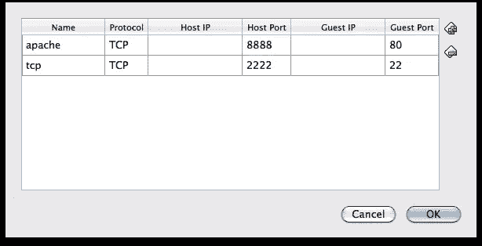
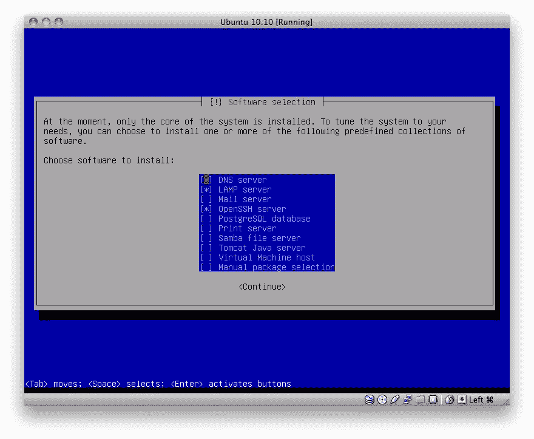
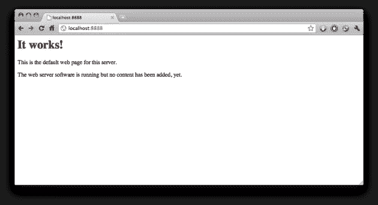
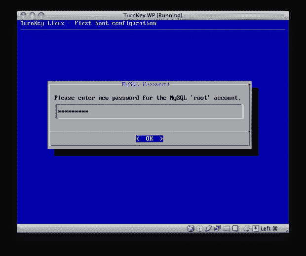
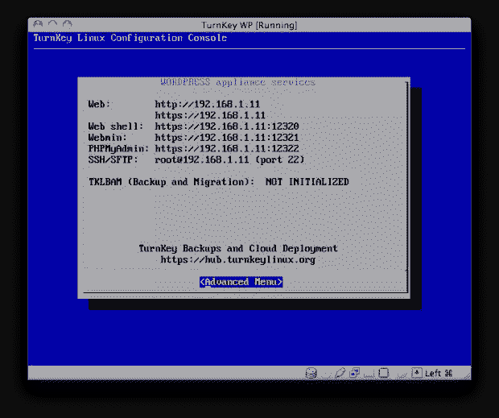

# 如何建立一个快速的 WordPress 沙盒虚拟机

> 原文：<https://www.sitepoint.com/how-to-build-a-speedy-wordpress-sandbox-vm/>

如果你打算进入 WordPress 开发领域，建立一个专用的开发环境是有意义的——最好的方法之一就是使用虚拟机。我更喜欢虚拟机，而不是我 Mac 的内置服务器或 MAMP 之类的服务器，因为你可以只在需要时运行它们，完成后将它们打包，根据需要设置多个不同的虚拟机，并轻松地与朋友和同事分享。如果您是 web 服务器管理的新手，设置和维护 Linux VM 是练习您的技能的完美初学者项目。

在这篇文章中，我们将看看如何设置一个 Linux 虚拟服务器，并提供支持 WordPress 安装所需的所有细节。如果“Linux”、“administer”和“server”这几个词让你紧张，那么你很幸运——我们还将向你展示如何使用一个预打包的 WordPress 服务器，它只需要几分钟就可以安装完毕，并且不需要命令行知识。更重要的是，由于我们将利用免费和开源软件，所有的成本是你的一点时间和硬盘空间！

## 下载并安装 VirtualBox

您的第一步是为您的台式机购买一个虚拟化系统。我们将专注于 VirtualBox，这是一款面向 Windows、Mac 和 Linux 的免费开源虚拟化系统，你可以从 VirtualBox 网站上免费下载。

那些已经购买了其他应用程序(如 VMWare Fusion 或 Parallels)的人，不要担心——您仍然可以在您已经拥有的系统中设置这些虚拟机，但是您需要查阅您产品的文档来了解如何进行设置。

## 设置 Ubuntu 虚拟机

如果你对命令行有信心，或者你想变得有信心，从头开始安装和配置一个 VM 可能是适合你的方法。在 2009 年末，Louis 向我们展示了用 VirtualBox 构建自己的开发服务器是多么容易。在 2011 年，这样做的步骤基本上是相同的，所以我们没有必要重复本文中的每一步——请继续阅读该文章以获得完整的详细介绍。但是，在这样做之前，请记住以下三点:

1.  In the article, Louis shows us how to set up port forwarding with an XML configuration file. In the latest version of VirtualBox, you can now also set up port forwarding in the VM’s **Network Adapter** settings panel. You can see these settings in figures 1 and 2, below.

    [](https://www.sitepoint.com/wp-content/uploads/2011/03/wpvm-portforwarding.png)

    [](https://www.sitepoint.com/wp-content/uploads/2011/03/wpvm-portforwarding2.png)

2.  During the installation process, the Ubuntu 10.10 Server installer will ask you to choose the type of system you’d like to run. We’re after a LAMP server and we’d like to be able to log in using OpenSSH, so be sure to select that when asked. You can see this panel in figure 3, below:

    [](https://www.sitepoint.com/wp-content/uploads/2011/03/wpvm-choosepackages.png)

    这样做可以确保从一开始就下载并安装 Apache、MySQL、PHP 和 OpenSSH 包。

3.  这个过程需要一段时间，你需要设置几个密码，回答几个提示——去沏些茶或咖啡，密切关注每个问题，*尤其是*那些要求你输入密码的问题。

如果您严格按照 Louis 的说明去做，并且一切顺利，那么您现在应该有一个工作正常的 Linux web 服务器了。打开网页浏览器，进入 [http://localhost:8888](http://localhost:8888) 进行测试。如果你看到一个页面惊呼“它的工作！”，你是在正确的轨道上。

[](https://www.sitepoint.com/wp-content/uploads/2011/03/wpvm-itworks.png)

在您的 VM 窗口中，您还应该看到一个登录提示。现在登录，使用你安装 Ubuntu 时选择的管理员用户名和密码。

### 抓取 WordPress

虽然可以用 Ubuntu 的包管理器安装 WordPress，但这有点特殊和复杂。WordPress 著名的五分钟安装之所以这么叫是有原因的，它运行得非常好，所以让我们用这种方式安装它。首先，前往 web 目录，它应该是`/var/www`:

```
cd /var/www 
```

要获取最新的 WordPress 版本，省去一些繁琐的 FTP 操作，让你的虚拟机直接用`wget`下载:

```
wget http://wordpress.org/latest.tar.gz 
```

现在，打开拉链:

```
tar -zvxf latest.tar.gz 
```

所有的 WordPress 文件将被解压到你的网站的一个名为`wordpress`的子目录中。我更喜欢把我的博客放在我网站的根目录下，所以我会把这些都提升一个层次:

```
mv wordpress/* /var/www 
```

默认的`index.html`文件(就是说“它工作了！”)和空的`wordpress`目录可以删除:

```
rm -r index.html wordpress 
```

### 创建数据库用户和密码

在 Ubuntu 安装过程中，向导要求您为 MySQL 指定一个“root”密码。你现在需要它，因为我们要为 WordPress 创建一个数据库。这样做的过程在 WordPress codex 上有解释，大概是这样的:

```
raena@wordpress:~$ mysql -u root -p
Enter password:
Welcome to the MySQL monitor.  Commands end with ; or g.
...
mysql> 
```

现在，您将创建新的数据库:

```
mysql> CREATE DATABASE wordpress;
Query OK, 1 row affected (0.00 sec) 
```

接下来，设置一个数据库用户:

```
mysql> GRANT ALL PRIVILEGES ON wordpress.*
    -> TO "wp_user"@"localhost"
    -> IDENTIFIED BY "password"; 
```

自己收拾干净，就大功告成了:

```
mysql> FLUSH PRIVILEGES;
mysql> EXIT
Bye
raena@wordpress:~$ 
```

轻松点。你现在可以开始使用基于网络的安装程序安装 WordPress 了——再次进入 [http://localhost:8888](http://localhost:8888) ,然后[按照 WordPress Codex 的指示进行操作。](http://codex.wordpress.org/Installing_WordPress#Step_5:_Run_the_Install_Script)

## 设置预打包的 WordPress 工具

如果您对命令行不太有信心，或者如果您喜欢更简单、更快速的安装过程，预打包的虚拟机设备可能是您的解决方案。虚拟机设备是已经安装和配置好的虚拟机文件，您只需很少或不需要进行调整。WordPress 的 Codex 建议使用两种设备: [BitNami 的 WordPress VM](http://bitnami.org/stack/wordpress) 和[交钥匙 Linux 的 WordPress 设备。](http://www.turnkeylinux.org/wordpress)统包式 Linux 虚拟机是最用户友好的，尤其是对于不太自信的 Linux 用户，这也是我们在本例中使用的虚拟机。

首先，你需要拿起设备。TurnKey 提供多种不同格式的设备，其中一种是开放式虚拟化格式，即 OVF。这是设备的常见格式，将虚拟机需要的所有软件捆绑在一个易于理解的包中。在下载栏中寻找 OVF 的链接，在 WordPress 页面顶部附近。

一旦你有了那个文件，只需在 VirtualBox 中打开它——你会被要求确认里面的设置。除了虚拟机的名称(`vm`是默认名称)之外，应该没什么必要玩这里找到的任何东西——有点通用，对吧？).VirtualBox 将导入文件并将其转换为虚拟机；完成后，您会看到它出现在 VirtualBox 窗口的左侧。

接下来，启动机器，盯着屏幕。你将通过一个向导来设置你的机器，这个向导将要求你为机器的`root`帐户、MySQL 和 WordPress 的管理帐户设置用户名和密码。您可以在下面的图 5 中看到该向导的运行:

[](https://www.sitepoint.com/wp-content/uploads/2011/03/wpvm-passwordsetup.png)

请务必记下这些密码。你还会被要求设置[交钥匙云备份服务](http://www.turnkeylinux.org/blog/announcing-tklbam)，每日安全检查，以及你是否想要立即更新你的机器。暂时跳过交钥匙备份设置是没问题的(你总是可以在以后启用它)，但是现在设置你的安全更新是绝对重要的。这需要几分钟的时间，所以当你的机器开始工作时，你可以喝杯茶或咖啡。完成后，您将看到交钥匙配置控制台，它会告诉您访问网站和管理网站所需的一切信息——查看下图。你的 WordPress 博客已经安装好了，可以在“Web”下指定的地址运行了，你可以使用命令行或者简单的 Webmin 界面来管理你的新服务器的其他功能。仔细检查，现在你可以登录到你的系统，并且 WordPress 站点已经安装。

[](https://www.sitepoint.com/wp-content/uploads/2011/03/wpvm-turnkey.png)

由于你的设备可能是几天前甚至几周前创建的，你可能会发现你需要更新一些插件，甚至是 WordPress 本身。一旦你做到了这一点，你就准备好了！

## 结论

现在你已经启动并运行了，你已经准备好用有趣的测试内容填充你的博客，并开始破解你的插件或主题。就像 WordPress 的大多数东西一样， [Codex](http://codex.wordpress.org/) 是你最好的朋友，当涉及到提示、技巧和故障排除建议时——从[高级主题页面](http://codex.wordpress.org/Advanced_Topics)上的服务器和数据库标题开始，获得一些关于那里正在发生的事情的重要信息。别忘了我们论坛的 [WordPress、托管和 Apache 版块！](https://www.sitepoint.com/forums)

## 分享这篇文章