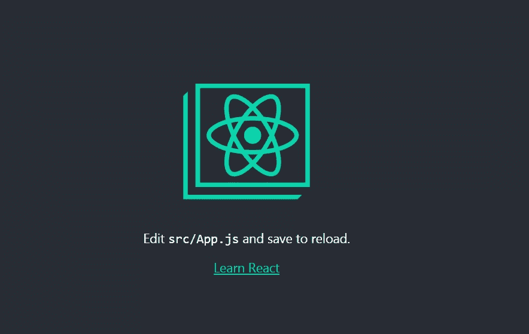

# 如何用 GraphQL 和 React 构建 Web 应用程序

> 原文：<https://www.sitepoint.com/how-to-build-a-web-app-with-graphql-and-react/>

在本教程中，我们将学习用 React 和 GraphQL 构建一个 web 应用程序。我们将使用从 [graphql-pokemon](https://github.com/lucasbento/graphql-pokemon) 获得的 API，并从这个[链接](https://graphql-pokemon.now.sh/)提供服务，它允许你获得关于神奇宝贝的信息。

GraphQL 是一种 API 查询语言，也是一种由脸书创建的用于完成这些查询的运行时。GraphQL 为 API 中的数据提供了完整且易于理解的描述，使客户能够准确地要求他们需要的东西，使 API 更容易随时间发展，并支持强大的开发工具。

在本教程中，我们将只学习 GraphQL 应用程序的前端，它利用 [Apollo](https://www.apollographql.com/) 从 web 上托管的现成 GraphQL API 获取数据。

让我们从先决条件开始！

## 先决条件

本教程有几个先决条件:

*   系统上安装的 Node.js 和 npm 的最新版本
*   JavaScript/ES6 知识
*   熟悉 React

如果您的开发机器上没有安装 Node 和 npm，您可以简单地从[官方网站](https://nodejs.org/en/download/)为您的系统下载二进制文件。您还可以使用 [NVM](https://github.com/nvm-sh/nvm) ，一个符合 POSIX 的 bash 脚本来管理多个活动的 Node.js 版本。

## 正在安装 create-react-app

让我们安装 create-react-app 工具，它允许您快速初始化和使用 react 项目。

打开一个新终端并运行以下命令:

```
npm install -g create-react-app 
```

*注意:在 Linux 和 macOS 中，如果在机器上全局安装软件包时出现 EACCESS 错误，您可能需要在命令前使用`sudo`,或者使用具有管理员权限的命令提示符。你也可以简单地修改你的 [npm 权限](https://docs.npmjs.com/resolving-eacces-permissions-errors-when-installing-packages-globally)。*

在撰写本文时，这将安装 **create-react-app v3.1.1** 。

## 创建 React 项目

现在我们准备创建我们的 React 项目。

回到您的终端，运行以下命令:

```
create-react-app react-pokemon 
```

接下来，导航到您的项目文件夹并启动本地开发服务器:

```
cd react-pokemon
npm start 
```

在您的网络浏览器中进入`http://localhost:3000`查看您的应用启动并运行。

这是此时应用程序的屏幕截图:



## 安装 Apollo 客户端

Apollo Client 是一个完整的数据管理解决方案，通常与 React 一起使用，但也可以与任何其他库或框架一起使用。

Apollo 提供了智能缓存，使其成为应用程序中本地和远程数据的单一来源。

您需要在 React 项目中安装以下包，以便使用 Apollo:

*   [graph QL](https://www.npmjs.com/package/graphql):graph QL 的 JavaScript 参考实现
*   apollo-client:一个全功能的缓存 GraphQL 客户端，集成了 React、Angular 等等
*   [Apollo-cache-in memory](https://www.npmjs.com/package/apollo-cache-inmemory):Apollo 客户端 2.0 推荐的缓存实现
*   apollo-link-http :最常见的 Apollo Link，一种用于 GraphQL 网络的模块化组件系统
*   react-apollo :这个包允许你从 GraphQL 服务器获取数据，并使用 react 框架在构建复杂的反应式 ui 时使用它
*   [graphql-tag](https://www.npmjs.com/package/graphql-tag) :这个包为解析 graphql 查询提供了有用的工具，比如`gql` tag。

打开一个新的终端，导航到您的项目文件夹，然后运行以下命令:

```
npm install graphql --save
npm install apollo-client --save
npm install apollo-cache-inmemory --save
npm install apollo-link-http --save
npm install react-apollo --save
npm install graphql-tag --save 
```

现在我们已经安装了必要的包，我们需要创建一个 ApolloClient 的实例。

打开`src/index.js`文件并添加以下代码:

```
import { ApolloClient } from 'apollo-client';
import { InMemoryCache } from 'apollo-cache-inmemory';
import { HttpLink } from 'apollo-link-http';

const cache = new InMemoryCache();
const link = new HttpLink({
  uri: 'https://graphql-pokemon.now.sh/'
})

const client = new ApolloClient({
  cache,
  link
}) 
```

我们首先创建一个`InMemoryCache`的实例，然后创建一个`HttpLink`的实例，并传入我们的 GraphQL API URI。接下来，我们创建一个`ApolloClient`的实例，并提供缓存和链接实例。

## 将 Apollo 客户端连接到 React 组件

在创建了`ApolloClient`的实例之后，我们需要将它连接到我们的 React 组件。

我们将使用新的 Apollo 钩子，它允许我们轻松地将 GraphQL 操作绑定到我们的 UI。

我们可以通过简单地用从`@apollo/react-hooks`包导出的`ApolloProvider`组件包装根`App`组件，并通过客户端属性传递客户端实例，将 Apollo 客户端连接到 React 应用程序。

`ApolloProvider`组件类似于 React 的上下文提供者。它包装您的 React 应用程序并将客户端放在上下文中，这使您能够从应用程序中的任何位置访问它。

现在让我们将`ApolloProvider`组件导入到我们的`src/index.js`文件中，并将`App`组件包装如下:

```
import React from 'react';
import ReactDOM from 'react-dom';
import './index.css';
import App from './App';
import * as serviceWorker from './serviceWorker';

import { ApolloClient } from 'apollo-client';
import { InMemoryCache } from 'apollo-cache-inmemory';
import { HttpLink } from 'apollo-link-http';
import { ApolloProvider } from '@apollo/react-hooks';

const cache = new InMemoryCache();
const link = new HttpLink({
  uri: 'https://graphql-pokemon.now.sh/'
})

const client = new ApolloClient({
  cache,
  link
})

ReactDOM.render(<ApolloProvider client={client}><App /></ApolloProvider>, document.getElementById('root'));

serviceWorker.unregister(); 
```

## 使用查询提取数据

在我们的应用程序中添加和配置了 Apollo 客户端之后，让我们获取一些神奇宝贝数据并在我们的组件中呈现它。

打开`src/App.js`文件，开始添加以下导入:

```
import { useQuery } from '@apollo/react-hooks';
import gql from "graphql-tag"; 
```

我们从`@apollo/react-hooks`包中导入了`useQuery`钩子。这是一个 React 挂钩，它获取 GraphQL 查询并公开结果，这样您就可以根据它返回的数据呈现您的 UI。我们还导入了`gql`标签，它允许我们解析 GraphQL 查询。

`useQuery` hook 构建在 React 的 Hooks API 之上，从 GraphQL 查询中获取数据并加载到我们应用程序的 UI 中。它通过一个结果对象公开错误、加载和数据属性，用于填充和呈现我们的组件。

导入后，定义以下 GraphQL 查询:

```
const GET_POKEMON_INFO = gql`
{
    pokemons(first: 150) {
      id
      number
      name,
      image,
      evolutions {
        id,
        number,
        name,
        image
      }
    }
  } 
```

该查询将允许我们获取前 150 个神奇宝贝及其 ID、编号、名称、图像和进化。

接下来，让我们通过用我们的`GET_POKEMON_INFO`查询调用`useQuery`钩子来针对我们的 GraphQL API 运行查询:

```
function App() {
  const { data, loading, error } = useQuery(GET_POKEMON_INFO);

  if (loading) return <p>Loading...</p>;
  if (error) return <p>Error</p>; 
```

我们使用对象析构从`useQuery`钩子的返回值中获取数据、加载和错误部分。

如果`loading`为真，这意味着数据仍在被获取，因此我们简单地呈现**正在加载…** 消息代码，以向用户表明数据仍在加载。

如果在查询过程中出现错误，`error`变量的值将为 true。在这种情况下，我们简单地呈现一个**错误**消息。

接下来，如果数据加载成功，我们将呈现神奇宝贝列表:

```
return (
  <React.Fragment>  <h1>Pokémons</h1>  <p>  <a href="https://en.wikipedia.org/wiki/List_of_Pok%C3%A9mon"> The Pokémon franchise </a>{" "} revolves around 832 fictional species of collectible monsters, each having
      unique designs and skills. Conceived by Satoshi Tajiri in early 1989,
      Pokémon are creatures that inhabit the fictional Pokémon World. This is
      the list of the first 150 Pokémon as they appear in Pokémon Stadium,
      starting with Bulbasaur in the top left corner and ending with Mewtwo in
      the bottom right corner. </p>  <div className="container">  {data &&
        data.pokemons &&
        data.pokemons.map((pokemon, index) => (
          <div key={index} className="card">    <div class="card-body">  <h3>{pokemon.name}</h3>  <p>  {pokemon.evolutions && pokemon.evolutions.length !== 0 && (
                  <p>  {" "} Evolutions: {pokemon.evolutions.map((e, indx) => {
                      return <p key={indx}>  {e.name}  </p>;
                    })}  </p>
                )}  </p>  </div>  </div>
        ))}  </div>  </React.Fragment>
); 
```

## 设计应用程序

在 React 应用程序中获取和呈现数据之后，让我们为界面添加一些样式。

打开`public/index.html`文件，给[卡拉姆字体](https://fonts.googleapis.com/css?family=Kalam)添加一个`<link>`标签:

```
<!DOCTYPE html>
<html lang="en">
  <head>
    <meta charset="utf-8" />
    <link rel="shortcut icon" href="%PUBLIC_URL%/favicon.ico" />
    <link href="https://fonts.googleapis.com/css?family=Kalam" rel="stylesheet"> 
```

接下来，打开`src/index.css`文件并添加以下 CSS 样式:

```
body {
  margin: 5px;
  font-family: 'kalam';
  -webkit-font-smoothing: antialiased;
  -moz-osx-font-smoothing: grayscale;
}

.container {
    display: grid;
    grid-template-columns: repeat(auto-fill, minmax(140px, 1fr));
    grid-gap: 19px;
}

.container > .card img {
    max-width: 100%;
} 
```

这是我们的应用程序在这个阶段的屏幕截图:


## 构建和托管应用程序

现在我们已经创建了我们的应用程序，我们可以使用以下命令构建生产包:

```
npm run build 
```

该命令将在`build`文件夹中生成一个缩小并优化的生产包，您可以将它上传到您的服务器。

我们将使用 [ZEIT Now](https://zeit.co/now) 来托管应用程序。

ZEIT Now 是一个网站和无服务器功能的云平台，你可以使用它将你的项目部署到一个`.now.sh`或个人域。

回到您的终端，执行以下命令立即安装 CLI:

```
npm  install -g now 
```

接下来，导航到`build`文件夹并运行`now`命令:

```
cd build
now 
```

就是这样！您的应用程序将被上传到托管服务器。在[https://build-cy 9 hwmjpe . now . sh](https://build-cy9hwmjpe.now.sh)可以看到 app 直播。

您还可以在这个 [GitHub 存储库](https://github.com/techiediaries/react-pokemon)中找到这个应用程序的源代码。

## 结论

在本教程中，我们构建了一个 React 应用程序，当第一个 150 个神奇宝贝出现在[神奇宝贝体育场](https://en.wikipedia.org/wiki/Pok%C3%A9mon_Stadium)时，它会获取并渲染它们。我们使用带有 React hooks 的 Apollo 客户端来获取和管理应用程序中的数据。

## 分享这篇文章