# 如何用 Vuforia 和 Unity 搭建一个 AR 安卓 App

> 原文：<https://www.sitepoint.com/how-to-build-an-ar-android-app-with-vuforia-and-unity/>

虚拟和增强现实最近受到了很多关注。许多真正酷的头戴设备(HMD)已经出现，如 [Oculus](https://www.oculus.com/en-us/rift/) 、 [Hololens](https://www.microsoft.com/microsoft-hololens/en-us) 、 [HTC Vive](http://www.htcvr.com/) 、 [FOVE](http://www.getfove.com/) 和 [Magic Leap](http://www.magicleap.com/) 。所有这些 HMD 中最简单和最便宜的是[谷歌 Cardboard](https://www.google.com/get/cardboard/) ，它已经在全球拥有超过 100 万用户。

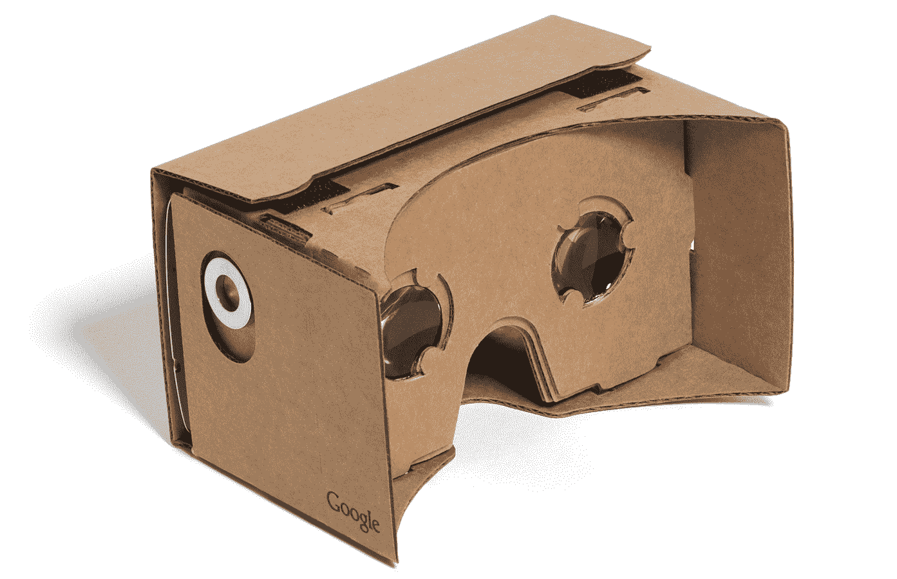

Patrick 在最近的帖子中介绍了如何在 Unity 中构建 Google Cardboard VR 应用。在接下来的两个教程中，我们将使用 Unity3D 为 Google Cardboard 开发一个基本的 Android 增强现实应用程序。我们将使用名为“Vuforia”的增强现实 SDK 来制作这个应用程序。

以下两个帖子将使用以下软件和相应的版本:

*   Vuforia 5
*   Unity 3D 5.x
*   Cardboard SDK 版本 0.5.x(下一个教程需要)
*   Android Studio 和 SDK 工具(需要安装和设置这些工具，Unity builds 才能工作。更多信息可以在“与 Unity 集成”部分找到。)

## 简要概述

有几种方法可以制作增强现实应用程序。我们将使用基于*标记的方法*为移动设备制作 AR 应用。在下一个教程中，我们将添加纸板支持。

**标记/图像目标**–这是由移动设备的摄像头识别和跟踪的图像。这充当了增强的来源。一旦被识别，就可以相对于它显示内容。

本教程大致分为三个部分:

1.  Vuforia 入门
2.  与 Unity 整合
3.  演示(有趣的部分)

## Vuforia 入门

首先，我们需要访问 [Vuforia 的开发者门户](https://developer.vuforia.com/)并创建一个账户。

登录后，我们可以进入“开发”页面。要在 Unity 中使用 Vuforia，我们需要做两件事:

1.  为我们的应用程序创建一个许可证密钥

    许可证密钥是在 Unity 中创建使用 Vuforia 的应用程序所需的唯一 ID。要创建许可证密钥，我们需要转到“开发>>许可证管理器”并选择“添加许可证密钥”。我们将看到这样一个页面提示:

    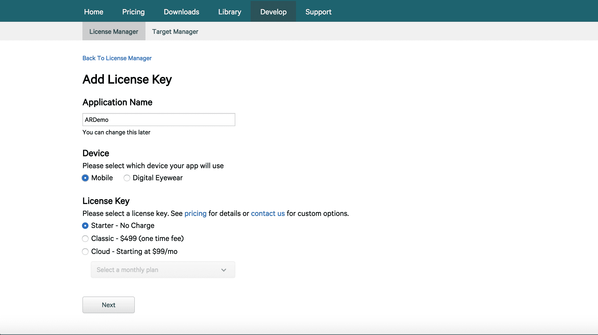

    填写完详细信息后，我们可以选择“下一步”，然后选择“确认”。这将引导我们回到“许可证管理器”页面，应用程序的名称将出现在这里。

    

    一旦我们选择“ARDemo”，我们将获得许可证密钥。稍后将在 Unity 中使用该密钥。

    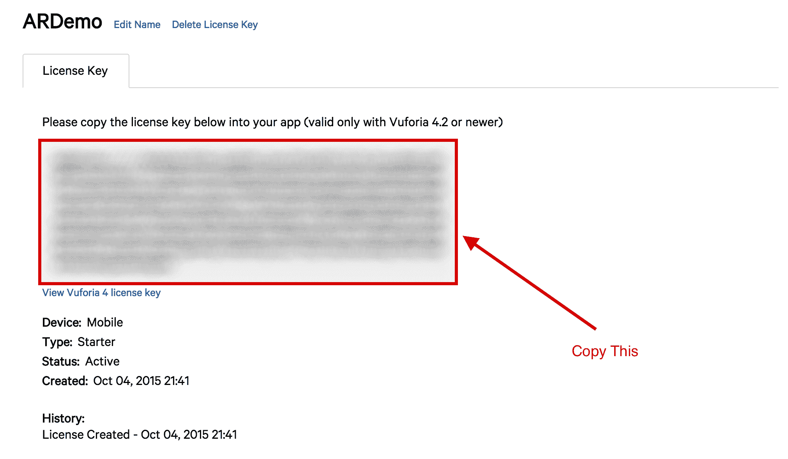

2.  创建数据库和图像目标

    下一步是设置一个图像作为目标。我们转到“开发>>目标管理器”,选择“添加数据库”,并填写详细信息:

    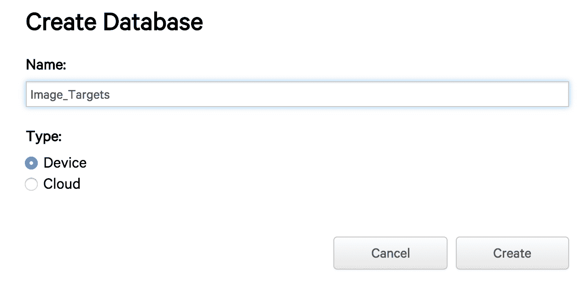

    接下来，我们需要向新创建的数据库添加图像。因此，我们选择数据库并单击“添加目标”。Vuforia 支持各种类型的目标，如单幅图像，圆柱，立方体，三维图像等。在本教程中，我们将使用单个图像目标和 [stones_hires](https://github.com/gsssrao/ARCardboardDemo/blob/master/Augmented%20Reality%20with%20Vuforiaimg/stones_hires.jpg) 图像。宽度可以选择任意值，比如 50。

    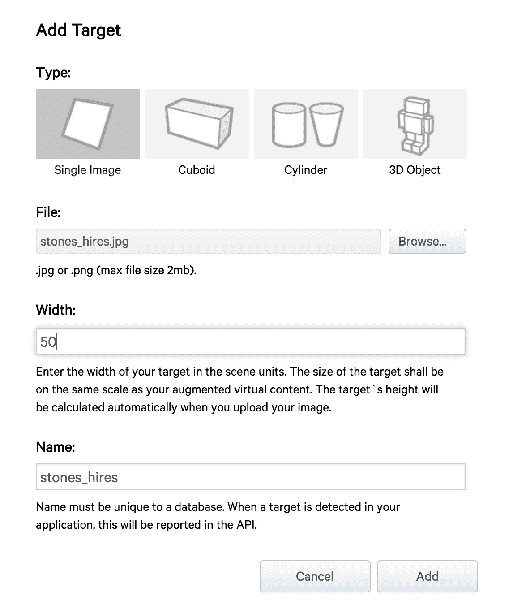

    在短暂的上传时间后，目标将被添加，我们将有一个“下载数据集”选项。

    这里需要注意的重要一点是“评级”。好的评级意味着它可以用于跟踪，而差的评级意味着图像没有足够的特征点(图像中感兴趣的点，如边缘、角等，用于图像处理中的跟踪)。

    

    我们还可以通过选择“stones_hires >> Show features”来查看我们图像的特征点

    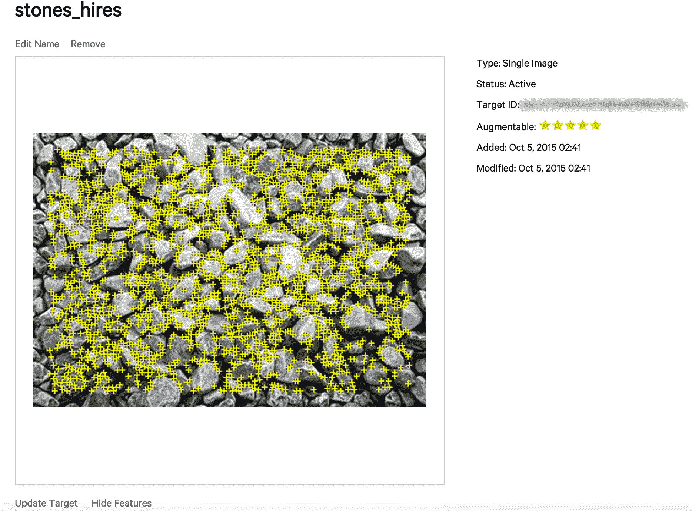

让我们通过选择“下载数据集> > Unity 编辑器”来下载数据集。

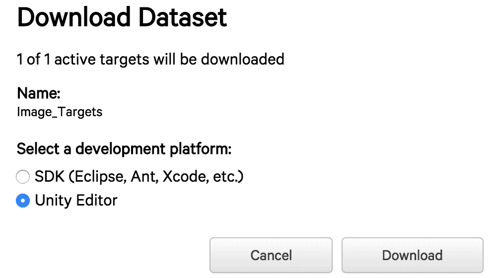

这将生成一个 Unity 包，其中包含有关该可跟踪数据库的可跟踪信息。

## 与 Unity 整合

Unity 是一个强大且广泛使用的游戏引擎。最近，它也成为了头盔显示器的游戏引擎。本教程假设对 Unity 有非常基本的了解。你可以在这里找到更多关于 Unity 的有趣教程。

让我们首先创建一个名为“ARDemo”的新 Unity3D 项目。

接下来，我们必须导入 Vuforia Unity 包。这可以通过转到“资产>>导入包>>自定义包”来完成。我们将有两个包，一个对应于我们的数据集(`Image_Targets.unitypackage`)，另一个对应于 Vuforia 5 SDK for Unity ( `vuforia-unity-5-0-5.unitypackage`)，可以在这里找到。

是时候给我们的项目添加一些 3D 模型了。让我们进入“窗口>>资产商店”。在这里我们可以免费找到一个名为“红色武士”的武士模型。我们必须使用我们的 Unity 帐户登录，才能下载和导入该模型。

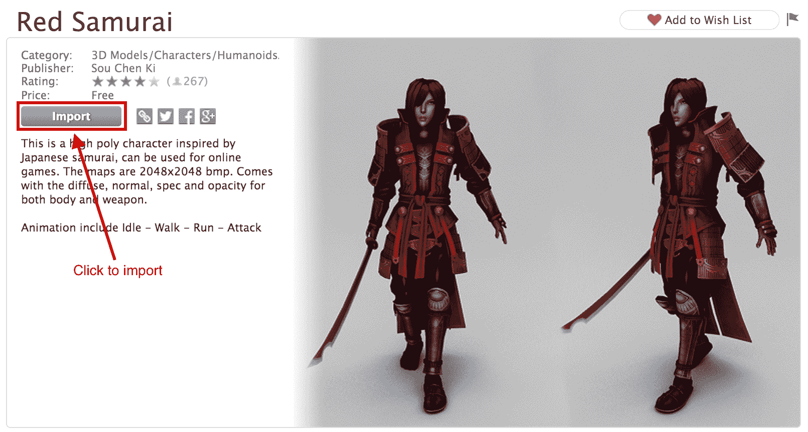

导入后，我们的资产文件夹将如下所示:

接下来，我们将不得不添加一个 ARCamera 到我们的场景中。“ARCamera”是 Vuforia 的一款增强现实相机，与普通相机非常相似。我们可以在“Assets >> Vuforia >> Prefabs”下找到它，并在 X=0，Y=0，Z=0 处将其拖动到我们的场景中。让我们也从场景中删除主摄像机(它可以在层级面板下找到，“右键单击>>删除”)，因为我们已经有了一个 ARCamera。

为了运行我们的 ARCamera，我们必须添加应用程序许可证密钥。在 Inspector 面板中，我们必须粘贴之前从 Vuforia 的许可证管理器收到的唯一密钥。

此时，如果我们按下 Unity 编辑器中的播放按钮，我们应该能够在游戏视图中看到我们的网络摄像头。

接下来，让我们将 ImageTarget 添加到场景中。它可以在“资产> > Vuforia > >预制屋”下找到。让我们在 X=0，Y=-50，Z=0 时将其添加到我们的场景中。现在，在图像目标的检查面板中，我们将不得不进行一些更改。在“图像目标行为(脚本)”下，我们必须将“数据集”更改为“图像目标”，将“图像目标”更改为“石头雇佣”。一旦完成，`stone_hires`图像将出现在我们的场景视图中。

接下来，让我们把我们的武士拖到现场。可以在“资产>>预制> > samuzai”下找到。为了让武士出现在 ImageTarget 上，它需要成为 ImageTarget 的子对象(只需在层级面板中拖动 samuzai 预设即可)。然后，每当移动设备的摄像头检测到 ImageTarget 时，该目标的所有子对象也会一起出现。萨穆宰的比例需要改为 X=0.5，Y=0.5，Z=0.5。

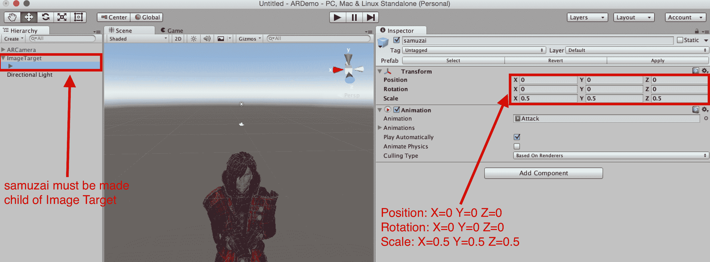

现在我们需要激活 Image_Targets 数据集。这可以通过选择“ARCamera”来完成，在检查器面板中，在“数据集加载行为(脚本)”下，我们需要选择“加载数据集 Image_Targets”，然后选择“激活”。

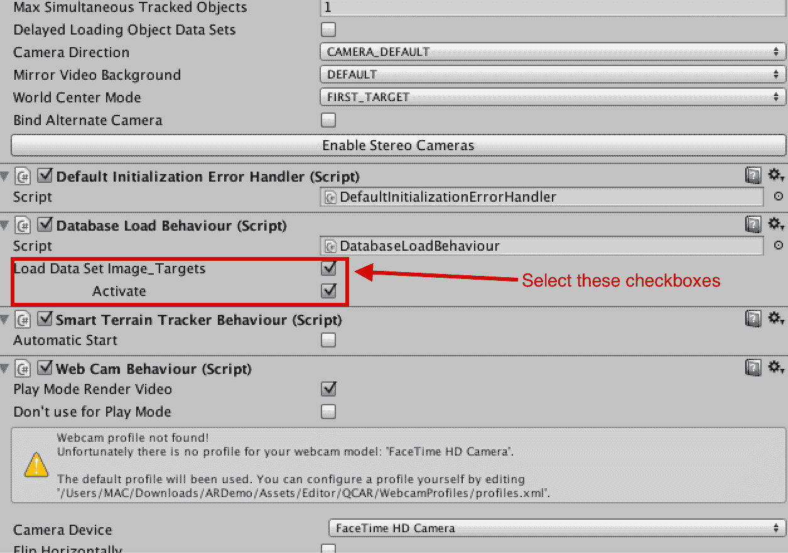

在这一点上，如果我们选择“运行”并将图像打印出来指向我们的网络摄像头，我们应该会看到武士在上面做“攻击动画”，这是它的默认动画。

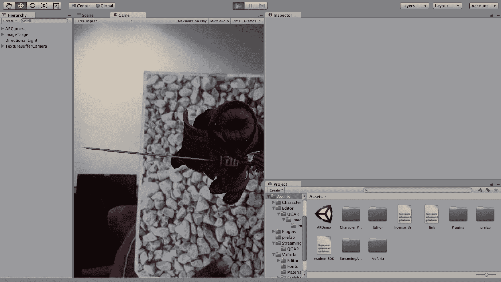

我们差不多完成了。让我们用“ARDemo”这个名字来保存这个场景。

最后一步是为 Android 构建项目。我们需要转到“文件>>构建设置”。我们需要通过选择“添加当前”来添加当前场景。然后，我们需要选择一个平台(Android)。在这里，我们将有多种选择:

*   Google Android 项目:这将允许我们将当前的 Unity 项目导出到 Android Studio，这样它就可以被编辑并用于添加更多元素。
*   开发构建:启用此选项将启用 [Profiler](http://docs.unity3d.com/ScriptReference/Profiler.html) 功能，并使 Autoconnect Profiler 和脚本调试选项可用。

我们将进行如下的简单构建:

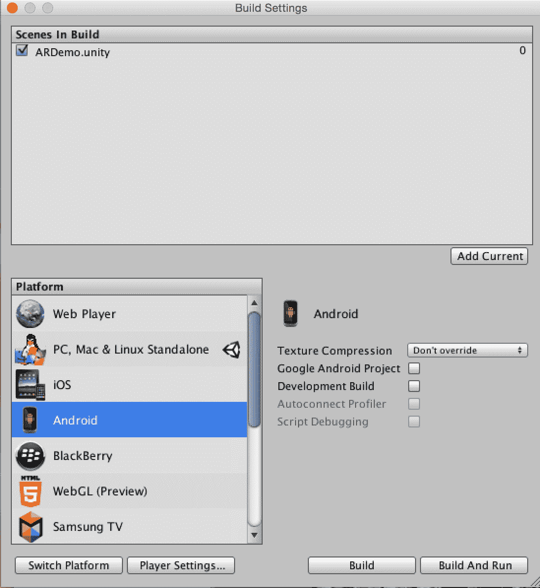

在按下“构建”按钮之前，我们需要在检查面板的“播放器设置”选项中做更多的修改。这里，公司名称需要更改；例如“站点点”。接下来，我们需要将“其他设置”下的包标识符更改为“com”。SitePoint.ARDemo”。

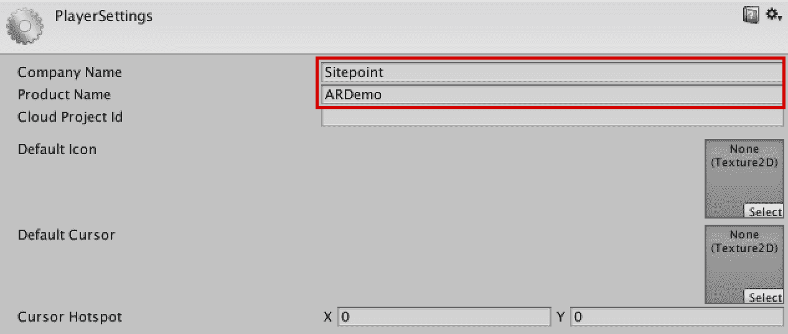

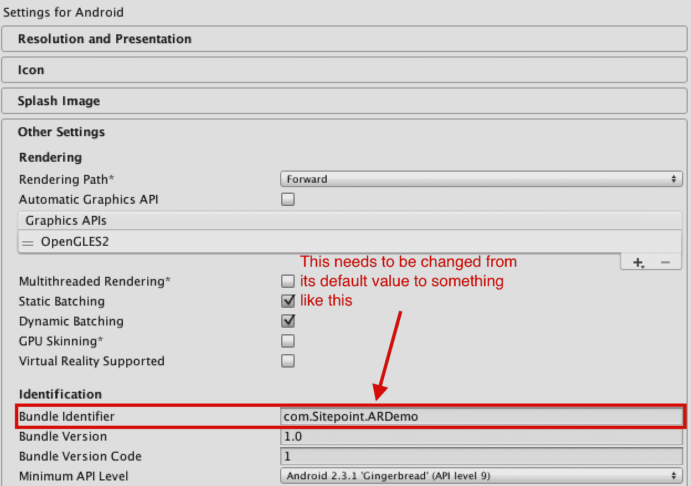

现在，我们可以继续“构建并运行”了。其他变化，如最低 API 等级等。可根据额外要求制造。我们将需要通过 USB 连接一个 Android 移动设备，并启用 USB 调试。

我们还需要建立一个 Android 开发者环境，然后才能在设备上测试我们的 Unity 游戏。这包括下载和安装不同 Android 平台的 Android SDK，并将我们的物理设备添加到我们的系统中(根据我们是在 Windows 还是 Mac 上进行开发，这一点会有所不同)。

由于这是一个复杂的过程，Unity 文档中提供了在我们的 Android 设备或 Android 模拟器上运行代码之前必须完成的任务的基本概要。然而，更详细的指南可以在 Patrick 的关于 VR 的[教程的第一部分找到。](https://www.sitepoint.com/building-a-google-cardboard-vr-app-in-unity/)

## 最终结果(演示)

最后，有趣又神奇的部分！

一旦应用程序在 Android 上构建并运行，我们就可以将移动设备的摄像头指向标记并观看动画。这是我的 Nexus 5 中的动画。

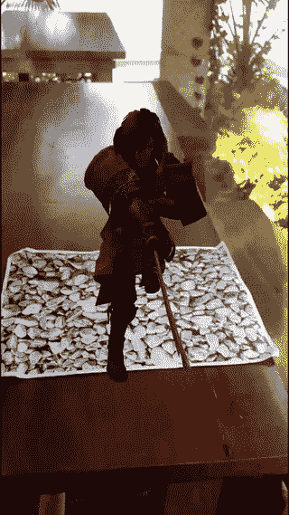

AR 应用程序甚至可以处理宝石的黑白图像，因为特征点仍然会保留下来(它们通常取决于其他因素，如梯度等)。而不是颜色)。

## 结论

Unity 和 Vuforia 可以做很多非常酷的事情。在本教程中，我们在没有编写脚本的情况下，用动画制作了一个简单的 AR app！在接下来的教程中，我们将为我们的应用添加 cardboard 支持和一些更有趣的 Vuforia 特性。

如果你在任何一点卡住了，或者想查看源代码，可以在 [Github](https://github.com/gsssrao/ARCardboardDemo/tree/master/Augmented%20Reality%20with%20Vuforia-1/ARDemo) 上找到。你只需输入你的 Vuforia 应用许可证密钥即可构建该应用。

如果你想下载或者测试这个应用，你可以在这里找到 apk。

如果你觉得本教程很酷，或者有任何疑问/反馈，请在下面的评论中留言！

## 分享这篇文章