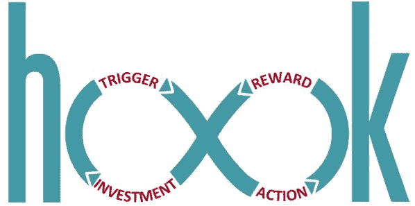

# 打造习惯形成产品的诀窍

> 原文：<https://www.sitepoint.com/how-to-build-habit-forming-products/>

你知道吗，79%的人会在起床后 15 分钟内查看手机。

脸书用户平均每天访问该网站 13.8 次，每次访问只花费大约 2 分 22 秒。

这些仅仅是技术几乎成为许多人的嗜好的几个例子。电子邮件、Twitter、LinkedIn、What's App 和其他流行的网络应用程序怎么样？当你需要和别人交流时，你可能会打开其中的一个。当你有问题时，你立即打开谷歌。

一个相对简单的产品怎么可能消耗掉用户的大部分生活？这是《养成习惯产品的作者 Nir Eyal 在 TED 研究所的一次演讲中提出的问题。

## 什么是习惯？

在我们讨论如何制造一种“基于习惯”的产品之前，可能最好准确地定义一下 a . Nir 所说的习惯是一种很少或根本没有意识到的行为。

就本文的目的而言，我们讨论的是您不用花太多心思就能使用的程序和服务。例如，当你试图解决一个编程错误时，你可能会去谷歌搜索。如果你是一个吃货，你大概有打开 Instagram 拍照的习惯，只是出于直觉。甚至像发短信这样基本的事情——当你需要和某人说话时，你可能会打开 Facebook Messenger 或其他应用程序，而不是打电话。

习惯不一定是你反复做的事情。更确切地说，当涉及到用户体验时，这是一个保持使用你的产品的摩擦最小化的问题。如果你提供了一个问题的解决方案，你希望用户在需要的时候能立即找到你。

## 养成习惯

为了在这个领域取得成功，你需要改进你的钩子；将用户的问题与解决方案联系起来的方式。完成后，您将拥有适合客户的产品。
在企业产品开发部门，挂钩有四个部分:**触发**、**行动**、**奖励**、**投资**。"

## 触发器

触发阶段有两种类型。作为一名 UX 设计师，你可能对术语很熟悉——内部和外部触发器。后者包括动作调用和其他直接告诉用户下一步做什么的元素。内部触发最好被描述为潜意识。当用户遇到一个人、一个地点、一个习惯、一种情绪或一种情况时，他们可能会根据这些细节改变自己的行为。

## 动作

动作只是用户为了获得奖励而做的事情。例如，打开一个文件、输入优惠券代码或注册一份时事通讯。这也是 UX 专业人员的关键要素之一，因为这也依赖于可用性。以优步为例；他们让安排搭车变得像轻点按钮一样简单。你最后一次在黄页上找出租车是什么时候？这里成功的关键是使行动尽可能无摩擦。

## 奖励

奖励阶段，顾名思义就是行动完成后发生的事情。例如，当用户注册订阅你的时事通讯时，你可以提供免费送货服务。另一个例子是在应用优惠券代码时提供折扣。为了在这里取得成功，奖励需要与行动相匹配。如果你赠送 100 美元，用户将比你赠送 5 美元的 100 美元购物经历更多的麻烦。

## 投资

现在到了投资阶段。这是你让用户做一点工作的时候。到目前为止，你已经吸引了用户，他们已经准备好完成任务了。与标准销售漏斗不同，这个阶段与金钱无关。这是关于从用户那里获得反馈，以确保你在正确的轨道上。无论是金钱、时间、数据、社会资本，还是其他，这个阶段都是为了未来的用户完善你的方法。

## 实现钩子模型

虽然这可能看起来势不可挡，但是让你的项目符合这些原则的最好方法是以正确的方式采访你的潜在用户。当然，你要记住，你不能只关注你的产品将如何被使用。这些原则成功的关键是你考虑用户的生活方式，让你的产品无缝地融入他们的日常生活。

## 分享这篇文章