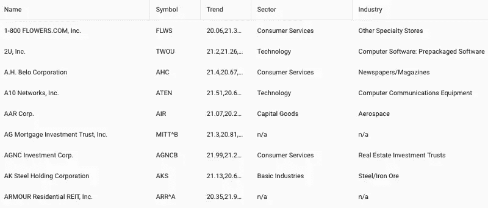
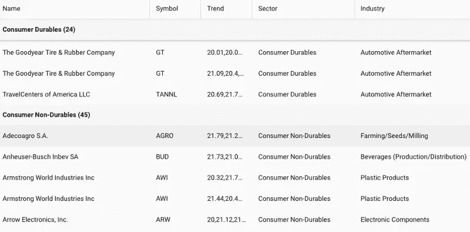
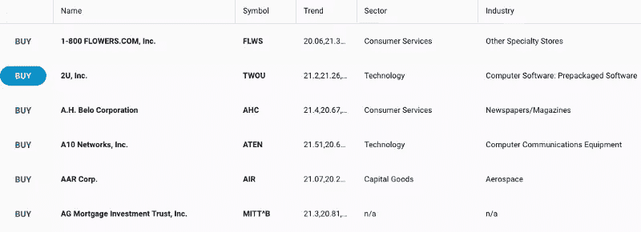
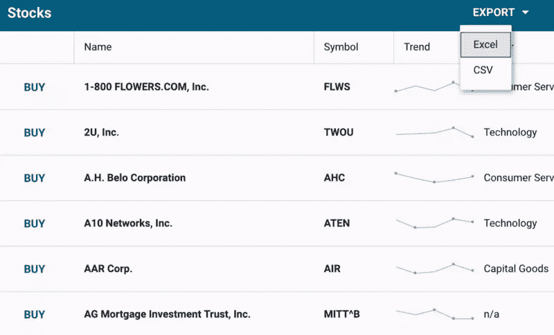
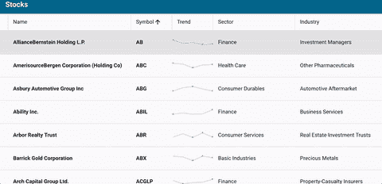

# 如何用 Sencha 网格构建 React 16 Web 应用

> 原文：<https://www.sitepoint.com/how-to-build-react-16-web-apps-with-the-sencha-grid/>

*本文最初发表于 [Sencha](https://www.sencha.com/blog/learn-how-to-build-react-16-based-web-applications-with-the-sencha-grid/) 。感谢您对使 SitePoint 成为可能的合作伙伴的支持。*

React 16 是基于 React 全新核心架构打造的 React 首个版本，代号“纤程”。React 16 的设计完全支持异步渲染，允许处理大型组件树，而不会阻塞主执行线程。它支持许多关键特性，如使用错误边界捕捉异常、从渲染返回多个组件、减小文件大小和支持 MIT 许可证。

如果您正在使用 React 16 开发一个数据驱动的 web 应用程序，您可能会在某个时候使用网格或类似电子表格的界面来为用户显示数据。根据上下文，用户可能希望应用程序中的网格能够:

*   使用固定标题滚动
*   通过单击列标题进行排序
*   显示和隐藏特定列
*   分页、分组和总结
*   编辑单元格中的数据
*   导出到 Excel
*   向下钻取/行扩展

网格可能是 React 中构建的最棘手和最复杂的 UI 组件之一，因为许多必要的特性既需要丰富的 React 专业知识，也需要深入研究 DOM 的意愿和能力。幸运的是，ExtReact 网格提供了所有这些功能，甚至更多。

在本文中，我们将使用 Sencha ExtReact 网格创建一个示例，显示股票和股票公司的信息。如果您想使用 HTML 表或另一个第三方组件来编写网格代码，您可能需要做一些事情，比如单击列标题进行排序，或者单击列标题之间的分隔线来调整大小，或者滑动分页器并获取下一页数据。使用 ExtReact Grid，这些功能是内置的。想自己试试吗？立即开始免费试用 ExtReact 天— [在此注册](https://www.sencha.com/products/extreact/evaluate/?utm_source=sitepoint&utm_medium=advertising&utm_campaign=sncextreact&utm_content=180921-ft-sncextreact)。

让我们从使用 ExtReact Grid 构建应用程序开始。

## 开始生成提取应用程序

要开始使用 ExtReact 组件开发 React 应用程序，请遵循以下步骤:

**确保您已经设置了一个节点环境**

首先，确保您的系统上安装了 Node 8.11+和 NPM 6+。您可以从[节点网站](https://nodejs.org/en/download/)下载最新的节点版本。如果已经安装了 node，可以使用以下命令轻松检查 Node 和 npm 版本:

```
node -v
npm -v 
```

**获取 ExtReact npm repo 的登录凭据**

ExtReact npm 包托管在 Sencha 的私有 npm repo 上。您只需登录 repo 一次，就可以访问所有 ExtReact 包。要获得登录凭证，请转到[extra 30 天免费试用](https://www.sencha.com/products/extreact/evaluate/?utm_source=sitepoint&utm_medium=advertising&utm_campaign=sncextreact&utm_content=180921-ft-sncextreact)页面并填写表格。我们将向您发送一封电子邮件，其中包含登录详细信息以及一些资源链接，如文档和示例项目。

**登录 ExtReact npm repo 并获取 extract app generator**

下一步是登录 Sencha 的私有 npm repo，它托管 ExtReact 包。使用您的 npm 登录名(在电子邮件中提供)将 repo 与@sencha 范围相关联，并在出现提示时输入凭据:

```
npm login — registry=http://npm.sencha.com — scope=@sencha 
```

下一步是安装 ExtReact 生成器包。

```
npm install -g @sencha/ext-react-gen 
```

**创建你的第一个 React 应用**

运行 Yeoman 生成器，创建您的第一个 ExtReact 应用程序:

```
ext-react-gen app your-app-name-here -i 
```

生成器将要求您命名您的应用程序，命名 npm 包，并选择一个主题。默认的材质主题(基于 [Google 的材质设计指南](https://material.io/guidelines/))作为起始主题是个不错的选择。选择“生成空应用程序”。生成器还会提示您为项目创建一个新目录。然后，生成器将下载并创建您的示例应用程序，包括相关的依赖项。

**运行你的 React 应用**

在生成器输出中，您将找到运行应用程序的步骤。非常简单，只需转到新的应用程序目录，并使用以下命令运行应用程序:

```
npm start 
```

这将启动应用程序，您的空 React 应用程序将只显示应用程序的标题。应用程序中的主要组件(例如 StocksGrid)在根处有一个容器，它被标记为全屏，布局被设置为适合，这意味着它将拉伸其子组件以填充它。

[在 GitHub 上查看到此步骤](https://github.com/adwankar/react16-stocks-grid/tree/empty-extreact-app)的代码。

## 向应用程序添加网格

**添加股票数据**

我们将向应用程序添加一个名为 stocks.json 的示例数据集。这是一个相当大的数据集，在 json 中大约有 10，000 行，每一行代表一家公司或股票代码——所以我们有公司的名称、股票代码、部门、他们所在的行业，以及该股票最近 5 次销售的一组记号。这是我们将要在网格中显示的数据。在现实世界的应用程序中，所有这些数据都将在后端返回。对于这个示例应用程序，我们将静态地加载它，而不是遍历如何构建后端 rest API 的所有机制。但是它的加载方式和你从真实的后端获取的方式完全一样。

**创建基本网格**

在 StockGrid 组件呈现方法中，我们将返回一个包含列的网格。

为了在网格中放置列，我们使用了一个列组件，它接受一个与股票数据的名称字段相同的数据索引。它需要一个文本属性，即列标题文本，然后我们还可以给列一个宽度，比如固定宽度或伸缩宽度，或者伸缩宽度和最小值或最大值的组合。我们将为公司名称、符号、记号、部门和行业添加列组件。用 Grid 创建一个新的 StocksGrid 类，如下所示:

```
<Grid >
      <Column dataIndex="name" text="Name" width={300} />
      <Column dataIndex="symbol" text="Symbol" />
      <Column dataIndex="ticks" text="Trend" />
      <Column dataIndex="sector" text="Sector" width={200} />
      <Column dataIndex="industry" text="Industry" width={350} />
</Grid> 
```

现在，将 StockGrid 添加到类 App 中，如下所示:

```
export default class App extends Component {
  render() {
       return (
           <ExtReact>
               <StocksGrid />
           </ExtReact>   
       )
   }
} 
```

[在 GitHub 上查看到此步骤](https://github.com/adwankar/react16-stocks-grid/tree/adding-stocks-grid-component-6.6)的代码。您将能够在 npm 启动时看到带有空网格的 web 应用程序。

## 将股票数据与网格绑定

ExtReact 中的网格是一个数据表，它从 Ext 数据存储中提取并呈现数据。在 ExtReact 中，我们的 store 实现是一种数据结构，它允许您对网格或组件(如列表或图表)的数据进行排序和过滤。

我们现在可以开始加载股票数据并创建一个商店。同样，网格总是从存储中获取数据，与网格的一些交互会触发存储中的事件，比如重新加载、排序或分页。为此，我们将在这里创建我们的商店。

外部数据存储不同于通量存储。网格和存储与标准的 React 方法有一点不同，这是因为两者是紧密集成的。通常，您可以将数据直接传递给存储，或者存储可以使用代理从后端自行提取数据。使用 ExtReact Grid，您可以获得交互式功能，如过滤、排序、分页、分组和汇总，而无需实际编写代码。

对于这个例子，我们将数据从股票数据文件直接传递到商店。您还可以创建一个带有代理配置的存储——有了代理，我们可以做各种各样很棒的事情，比如远程分页、过滤和排序。我们将 autoload 设置为 true，因此它会自动加载网格。数据没有按照任何标准进行排序，所以我们将通过指定 name 属性在客户端对数据进行排序。

```
 this.store = new Ext.data.Store({
           data: stocks,
           autoLoad: true,
           sorters: [{
               property: 'name'
           }],
           listeners: {
               update: this.onRecordUpdated
           }
       }) 
```

在网格中，将商店配置分配给已创建的商店。

```
<Grid store={this.store}>
      ...
</Grid> 
```

现在，我们有一个包含所有数据的网格，如下所示:



通过这个简单的代码，您可以免费获得许多功能，例如排序，这允许您单击任何列标题，它会自动排序(参见下面示例中的符号列)。

在这种情况下，排序在客户端完成。但是如果我们实现了一个真正的后端 API，我们可以配置代理在后端进行远程排序，并在数据库中使用“order by 子句”进行排序。

您还可以免费获得可调整大小的列。因此，即使我们在这些列上设置了宽度，如果用户想要查看或关闭某些内容，他也可以通过左右拖动列来实现。

您还可以获得一个很好的分组功能。因此，如果我们想按行业分组，我们可以说按此字段分组，它将按行业值对所有数据进行分组，当您向下滚动每个分组时，它会为您提供一个固定标题。



您会注意到，对于 10，000 条记录，这些数据呈现得非常快。它渲染速度如此之快是因为它使用了我们所说的缓冲渲染。因此，尽管这个表看起来很满，你可以向下滚动，它会一直滚动，但在初始加载时，它只比你实际看到的“视口高度”多一点点

当您向下滚动时，实际上是在商店中向下翻页时用较新的记录替换单元格的内容。因此，它实际上是尽可能地保存 DOM 元素，保持 DOM 较小，保持较小的内存消耗，并确保高性能。

[在 GitHub 上查看到此步骤](https://github.com/adwankar/react16-stocks-grid/tree/adding-stocks-store-6.6)的代码。

## 设计您的网格

有多种方法可以设置网格的样式，因此数据更容易分析。

**使用单元格属性**

让我们来看看如何控制单元格的样式。我们可以将名称加粗—最好的方法是使用单元格属性。该单元采用多种配置来控制单元的外观。我们将在那里放一个样式配置，然后我们说 fontWeight 等于 bold。

```
cell={ { style: {fontWeight:'bold'}}} 
```

**在一行中添加一个按钮**

现在，我们将做一些更适用于现实世界的事情。假设我们希望有一个按钮，我们可以点击它来购买左边栏中的这些股票之一。为此，我们可以添加一个列，这次我们不打算添加数据索引，因为它不对应于字段中的任何特定项，也不对应于存储中的任何字段。我们将添加一个带有按钮的 WidgetCell。我们将进行一些样式设计，我们将在它上面放置一个圆形的动作 UI，这样该按钮将具有圆形的动作外观:

```
<Column >
   <WidgetCell>
       <Button ui ="round action"
               handler = {this.buyHandler} 
               text = "Buy"/>
   </WidgetCell>
</Column> 
```

我们将要使用的购买处理程序非常简单。当您单击“购买”按钮时，我们将使用名为 ext.toast 的假设，它将在顶部显示一条简短的 toast 消息，显示您所购买股票的符号。同样，我们有我们要为每一行渲染的列。我们将呈现这个按钮，然后当您单击它时，它将调用这个函数:

```
buyHandler = (button) => {
     let gridrow = button.up('gridrow'),
     record = gridrow.getRecord();
     Ext.toast(`Buy ${record.get('name')}`)
} 
```



从这个例子中可以看出，你基本上可以在一个网格单元中嵌入任何 ExtReact 组件，并且它是完全交互式的。它作为一个完整的反应组件。

[在 GitHub 上查看到此步骤](https://github.com/adwankar/react16-stocks-grid/tree/adding-stocks-grid-component-6.6)的代码。

## 添加趋势迷你图

在股票数据中，我们有最近五次股票销售的价格点数组。让我们将它作为迷你图嵌入网格中。我们将使用 widgetcell 在网格单元中呈现 ExtReact 组件。

```
<Column dataIndex="ticks"
                   text="Trend"
                   sortable={false}
                   cell = { {
                           xtype: 'widgetcell',
                           forceWidth: true,
                           widget: {
                                   xtype: 'sparklineline',
                                   tipTpl:
                                   'Price: {y:number("0.00")}'
                             }
                   } }
               /> 
```

当您将鼠标悬停在线图中的不同点上时，它会显示带有两个小数点的 Y 值。


[在 GitHub 上查看到此步骤](https://github.com/adwankar/react16-stocks-grid/tree/adding-sparkline-chart-6.6)的代码。

## 将数据导出到 Excel

数据密集型应用程序的一个常见需求是将数据导出到 Excel。ExtReact 通过使用网格的插件来简化这一过程。

```
<Grid
               ..
               plugins={{
                   gridexporter: true,
                 }}

           > 
```

为了方便调用导出功能，我们将添加几个组件。我们将在网格顶部添加标题栏和停靠标题栏，并在里面放一个菜单。当您单击“导出”按钮时，您可以选择导出到 Excel 或 CSV 格式。

```
<TitleBar docked="top" title="Stocks">
          <Button align="right" text="Export">
                   <Menu indented={false}>
                          <MenuItem text="Excel"
                               handler=
                              {this.export.bind(this, 'excel07')}/>
                           <MenuItem text="CSV"
                                handler=
                                 {this.export.bind(this, 'csv')}/>
                    </Menu>
           </Button>
</TitleBar> 
```

导出处理程序将传递导出的类型和文件名的扩展名:

```
export = (type) => { this.grid.cmp.saveDocumentAs(
                             { type, title: 'Stocks' });
} 
```

确保在 package.json 依赖项中有导出器。例如:

```
"@sencha/ext-exporter": "~6.6.0" 
```

安装依赖项。

```
npm install
npm start 
```

Exporter 插件支持将数据导出为各种文件格式。它支持原生的 XSLX、Excel XML 以及 HTML 和 CSV/TSV(逗号/制表符分隔值)格式。



[在 GitHub 上查看到此步骤](https://github.com/adwankar/react16-stocks-grid/tree/adding-exporter-6.6)的代码。

## 向网格添加编辑功能

通过添加编辑数据的功能，我们可以使网格更像一个电子表格。为了增加这种能力，我们需要添加另一个名为 gridcellediting 的插件。通过添加这个插件并将可以编辑的列标记为可编辑，您现在拥有了可以通过双击任何网格单元来编辑的网格数据。您可以通过在网格单元格间切换来继续编辑网格。

添加网格单元编辑插件:

```
gridcellediting: true 
```

使“名称”可编辑:

```
<Column dataIndex="name" text="Name" width={300} cell={ { style: {fontWeight:'bold'}}} editable/> 
```


**处理编辑事件**

如果您想在编辑网格单元后做一些特殊的事情，您可以在存储中监听该事件以了解数据更改。您可以通过添加一个监听器配置和一个用于“更新事件”的监听器来实现。

“更新事件”将传递许多参数，包括 store、updated record、描述发生的操作的对象，然后传递一组已更改的字段名。您将在处理程序中添加它。在这种情况下，我们只是显示一个祝酒词。在现实世界的应用程序中，您将实际应用业务逻辑，比如在数据库中持久化更改。

```
...
listeners: {
           update: this.onRecordUpdated
}
...
onRecordUpdated = (store, record, operation, modifiedFieldNames) => {
     const field = modifiedFieldNames[0];
     Ext.toast(`${record.get('name')}  ${field} updated to ${record.get(field)}`)
} 
```

**向网格单元格添加选择选项**

如果您想在网格单元格中添加“选择”选项，可以使用另一个名为 SelectField 的 ExtReact 组件。您只需在 required 列中添加 SelectField ExtReact 组件。

```
<Column dataIndex="sector" text="Sector" width={200} editable>
        <SelectField options={sectors}/>
</Column> 
```



[在 GitHub 上查看到此步骤](https://github.com/adwankar/react16-stocks-grid/tree/adding-grid-editing-6.6)的代码。

## 优化跨平台体验

这对于桌面体验很有效，但是当你最小化手机体验的屏幕尺寸时，单元格编辑可能不是最好的编辑体验。对于小屏幕设备，您可能想要选择不同的编辑样式。

platformconfig 选项允许您指定桌面或移动的行为。你可以基于 platformConfig 将任何道具设置为不同的值，这里我们基于平台设置插件。在这个例子中，当应用程序在桌面上时，我们将使用 gridcellediting。当应用程序在移动设备上时，我们将使用 grideditable，它提供了一种在移动设备上编辑数据的更好方法。

```
platformConfig={{
                   desktop: {
                       plugins: {
                           gridexporter: true,
                           gridcellediting: true
                       }
                   },
                   '!desktop': {
                       plugins: {
                           gridexporter: true,
                           grideditable: true
                       }
                   }
               }} 
```

[在 GitHub 上查看到此步骤](https://github.com/adwankar/react16-stocks-grid)的代码。

您可以使用 ExtReact 6.6 grid，并使用 React 16 在数据驱动的 web 应用程序中轻松添加类似电子表格的界面。使用 ExtReact，您可以使用任何 Ext JS modern 组件，包括网格、树网格、透视网格、图表、D3 可视化等等——不需要定制。你可以构建一个优化的最小化的包，只包含你在应用中使用的组件。您可以通过使用在桌面和移动设备上看起来都很棒的布局和自适应设计功能来建立身临其境的用户参与。提醒一下，你可以从今天开始免费试用 30 天— [在这里注册](https://www.sencha.com/products/extreact/evaluate/?utm_source=sitepoint&utm_medium=advertising&utm_campaign=sncextreact&utm_content=180921-ft-sncextreact)。

## 分享这篇文章