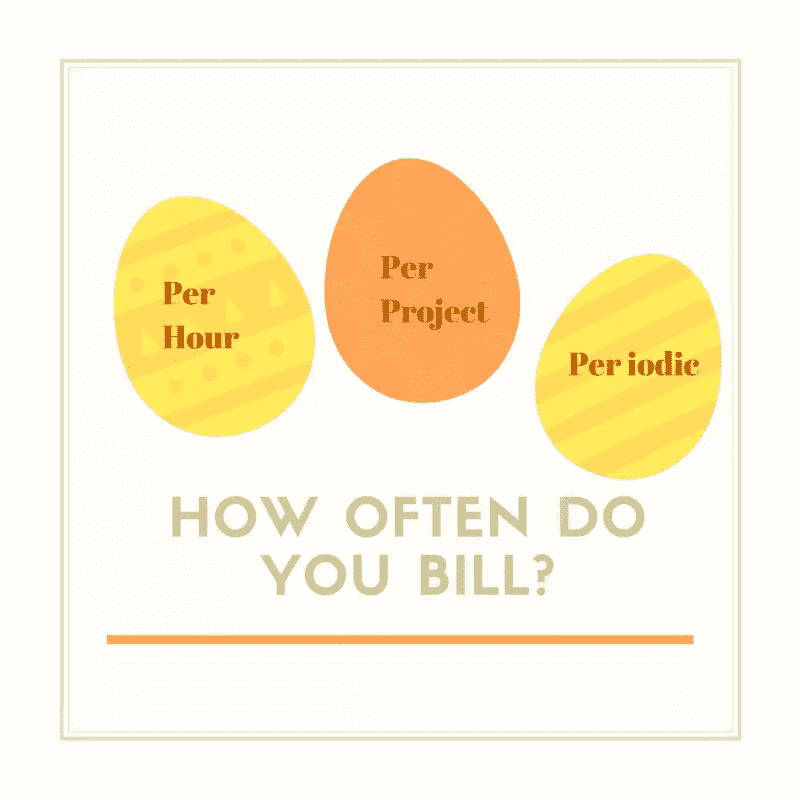
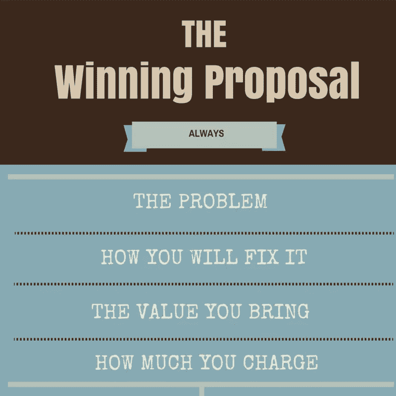

# 设计工作如何收费

> 原文：<https://www.sitepoint.com/how-to-charge-for-design-work/>

#### “没有简单通用的答案。就我自己而言，即使我在这个行业已经工作了 25 年，定价仍然是一个不断发展的过程。”——[杰夫·费舍尔](http://creativelatitude.com/articles/article_1004_fisher.html)

“那你收多少钱？”

当客户要求他们报价时，大多数自由职业者都会经历轻微的恐慌。

这是一种复杂的情绪——一部分是兴奋，因为客户非常喜欢他们的作品，所以要求报价，另一部分是绝望，不知道价格应该是多少。

那么你应该报价多少呢？在我们进入定价策略之前，让我们走一点弯路来理解为什么它会引起如此多的心痛。

## 为什么害怕定价？

如果你明白为什么和如何为你的服务定价，围绕定价的许多痛苦就可以消除。我问了一些自由职业者，为什么他们如此纠结于决定他们的服务收费。以下是他们回答的摘要。

### 我不想(或承受不起)失去这个客户。

他们担心报价太高(可能超出他们的预算)或太低(他们会认为你很便宜，不够好)。

### 我不想给人留下势利的印象。

他们希望客户喜欢他们。他们担心如果他们报价更高，客户会认为他们华而不实。

### 即使 XYZ 收了，我也不可能收那么多。

他们对自己的技能不自信。他们担心自己不够好，要求更高的价格。

### 太低级了。

他们认为报价过高是可耻的。他们不想让任何人认为他们是在敲诈客户！

### 但是，与此同时，我不想挨饿。

对吗？！谁不想银行里有更多的钱呢？

注意到所有这些的共同点了吗？是恐惧。

他们害怕了。他们害怕自己不够好。他们不敢要求更多。他们想让客户自动知道他们工作的价值，但他们不愿意努力询问他们的价值。

在继续之前，反思一下为什么你对服务收费不确定可能是件好事。

恐惧让你退缩了吗？或者仅仅是因为你还在寻找难以捉摸的甜蜜点？

好吧，是时候迈出这一步，开始为你的价值充电了。

## 如何为您的服务确定最佳价位

### 1.发现客户的预算和回报。

第一步是找出客户的前期预算，至少是一个大概的数字，这样你就可以快速判断这个项目是否值得你花时间。如果客户有明确的预算，那就太好了。你马上就知道是否要努力向他们推销，因为准备估价和报价可能要花上几个小时。

如果客户不愿意报出具体的预算，甚至是一个范围，你可以要求他们填写一份调查工作表，并包括与他们的目标有关的询问，而不是纠缠他们要一个数字。

试着得到具体的数字，你可以转换成有形的美元价值。

Ryan Castillo 举了一个有趣的例子,说明公司如何为解决方案付费，而不是为工作时间付费，以及定价从来就不是非黑即白的。

这实际上是关于价值——客户赋予你工作的价值。

例如，如果你为客户创建网站或撰写网页内容，目标可能是增加 X%的潜在客户，Y%的收入增长或 Z%的订户。

一旦你知道你能给客户增加多少收入，事情就变得简单多了。你可以要求增加的收入的一部分，或者用它作为杠杆来引用一个更高的利率。

### 2.算出你的最小值。

花一些时间来记下客户真正需要什么，客户的要求有多高，以及你的技能是否符合要求。

然后画一张所需功能的草图，并估计一下你需要付出的努力。

你可以简单地用这个乘以你的时薪(这里有一个[好的计算器](https://motivapp.com/freelance-hourly-rate-calculator)来计算出你的最低时薪),然后给出一个报价，但是这将是一个很大的错误。

请将此视为最低基线。您总是会有额外的成本-您可能需要购买的任何额外的软件、产品或服务，由于范围蔓延或工作溢出而需要投入的任何额外的时间。

通常在你的最低基线上增加 10 %,以考虑到经常出现的不可预见的情况。

### 3.冻结计费方法和时间表。

向客户收费有多种方式——固定项目费、按小时收费或递增收费。

许多自由职业者默认按小时计费，并且多年来一直停留在这个水平。

其他时候，他们发现固定价格的项目导致许多未计费的工作时间。重要的是要认识到，不是所有的项目或客户都应该以相同的方式计费。这里有一个简短的纲要，说明哪种类型的定价最适合每种类型的项目。

#### 每小时费用

这种[适用于定义不明确的项目](https://www.sitepoint.com/charge-websites-pay-per-hour-projects/)或者难以确定应该计费的离散任务的项目。

**优点:**

*   对客户来说效果很好，因为他们不必预先支付大笔费用。他们只为可交付成果付费。
*   对自由职业者来说效果很好，因为他们只为完成的工作获得报酬。

**缺点:**

*   客户可能会犹豫，因为他们很难知道总的前期成本。
*   收入潜力有限，因为你一天只能工作这么多小时。

#### 固定价格项目

固定价格合同适用于小型项目，并且每个可交付成果都很容易定义。这个[不能很好地适应更大、更易流动的项目](https://www.sitepoint.com/charge-websites-fixed-price-projects/)。

**优点:**

*   特性和可交付性在一开始就明确定义了。没有最后一分钟延期。
*   客户从一开始就知道项目的成本。没有讨厌的惊喜。
*   没有范围蔓延和最后一分钟的自由职业者实施增加。

**缺点:**

*   如果你没有足够详细地估计工作量和时间表，或者客户决定他们想要新的特性，就会失败。
*   需要大量的初始工作来规划任务和交付件的细节，这通常是不收费的。

#### 固定周期

对于大型项目来说，这是一个很好的选择，这些项目可能没有预先的完整细节，而是随着时间的推移而发展。在这里，随着项目的大图，你制定小的交付里程碑，并为每个交付里程碑开账单，很像一个[敏捷项目](https://www.sitepoint.com/charge-websites-agile-way/)。

**优点:**

*   风险更小。由于交付是在可管理的小块中进行的，客户可以在每个周期后监控进度并验证可交付成果，而自由职业者可以获得早期的定期反馈，而不是在项目结束时。
*   在每个周期开始时，付款是按时间分布的。如果客户不喜欢自由职业者的工作、质量甚至态度，他们可以在任何周期停止。自由职业者仍然可以从已经完成的工作中获得报酬。

**缺点:**

*   到目前为止，很少有客户，或者自由职业者，对在这样的敏捷周期中工作感到舒服。

## 4.写一份建议书

现在，你已经具备了三个基本要素，你应该开始定价了。

不仅要考虑你的最低费率和工时，还要考虑你给客户带来的收益、潜在客户或其他目标。

这没有直接的公式。你必须根据你之前制定的参数做出决定。

如果你仍然难以做出决定，请阅读[这篇关于每小时还是固定项目定价的辩论](https://blog.bidsketch.com/clients/hourly-vs-fixed/)，以及[回应一般报价请求的有趣方式](http://www.fastcodesign.com/3025992/how-much-should-you-charge-for-design-work-a-guide)。

许多自由职业者在这一阶段犯的最大错误是在电子邮件中一笔勾销他们的成本估算(就像你在这个[链接](http://www.fastcodesign.com/3025992/how-much-should-you-charge-for-design-work-a-guide)中看到的那样)。

取而代之的是，学会正确地设计你的提议(注意，我说的是提议，而不是价格)，会有很大的不同。

写一份提案，强调客户的问题(如果可能的话，强调他们的成本)以及你打算如何解决这些问题。然后，也只有到那时，写下你会为解决这些问题收取多少费用。

写一份成功的建议书本身就是一门艺术。

你可以在[这篇 Bidsketch 帖子](https://blog.bidsketch.com/selling-web-design/how-to-write-a-web-design-proposal/)中了解更多。

关键是要突出你正在解决的问题和你带来的价值主张。这有助于从积极的角度向客户阐述你的价值主张。

## 结论

不管你在网上的其他地方读到什么，实际上并不是想出最好的价格。

一种尺寸不适合所有人。

不要依赖单一的方法或公式来为你的项目定价。

相反，使用上面的指导方针来计算出你能为你的客户创造的价值，并展示你如何解决他们的问题。这将使你更容易收取你的价值，但也有客户愿意为你掏出钱包。

#### PS:这里有一些关于定价的其他重要资源:

*   [如何撰写一份获奖的网页设计方案](https://blog.bidsketch.com/selling-web-design/how-to-write-a-web-design-proposal/)
*   [如何为你的价值充电——比你现在得到的价值多 3 到 10 倍](http://blog.chasejarvis.com/blog/2014/06/how-to-charge-what-youre-worth-which-is-3-to-10x-more-than-youre-getting-today-with-ramit-sethi/)
*   [12 设计服务定价的现实](http://www.vandelaydesign.com/12-realities-of-pricing-web-design-services/)
*   [自由职业项目报价的 7 个技巧](http://wakeuplater.com/freelance-lessons/7-tips-on-quoting-freelance-projects.aspx)
*   [又快又好又便宜的定价方法](http://freelancefolder.com/the-fast-good-and-cheap-pricing-method/)

## 分享这篇文章