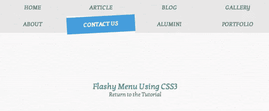

# 如何使用 CSS 创建一个华丽的菜单

> 原文：<https://www.sitepoint.com/how-to-create-a-flashy-menu-using-css/>

今天我将向你展示如何使用 CSS3 创建一个华丽的菜单。本教程是为初学者准备的，可以很快完成。请确保您点击下面的链接来查看菜单演示并获取源代码。

[下载试玩&来源](https://www.sitepoint.com/wp-content/uploads/2012/02/FlashyMenuDemo.zip)

**最终结果:**



### HTML

我们的 HTML 文档包含一个无序列表，每个列表项都是一个带有锚标记的链接。span 包含菜单项的名称。

```
<ul class="main-ul">
        		<li><a href="#"><span>Home</span></a></li>
        		<li><a href="#"><span>Article</span></a></li>
        		<li><a href="#"><span>Blog</span></a></li>
       		 <li><a href="#"><span>Gallery</span></a></li>
       		 <li><a href="#"><span>About</span></a></li>
        		<li><a href="#"><span>Contact Us</span></a></li>
        		<li><a href="#"><span>Alumini</span></a></li>
       		 <li><a href="#"><span>Portfolio</span></a></li>
	 </ul>
```

### CSS

我使用来自[子图案](http://subtlepatterns.com)的图案作为页面背景。

```
body{
		background: #eee url(img/white_paperboard.png) repeat top right;
	}
```

现在让我们定位菜单列表项。我为每个项目使用 25%的宽度，所以每行可以放置四个菜单项。我将每个列表项的文本居中对齐。

```
.main-ul li {
		  float:left;
  		  position:relative;
   		  width:25%;
  		  text-align:center;
  	}
```

接下来，让我们定位每个锚标签，并将文本装饰改为无。我使用浅灰色背景。我还为这些元素添加了持续一秒钟的 [CSS3 过渡](http://dev.w3.org/csswg/css3-transitions/)效果。

```
.main-ul li a {
	                      display:block;
		    padding-bottom:20px;
		    padding-right:10px;
		    padding-top:10px;
		    padding-left:10px;
	 	    text-decoration:none;
		    position: relative;
	 	    z-index: 100;
		    background-color: rgba(164, 164, 164, 0.2);
	  	   -webkit-transition: all 1s;
	 	   -moz-transition: all 1s;
	  	   -o-transition: all 1s;
	  	   transition: all 1s;
	   }
```

我正在使用' Kotta One '字体的跨度文本，正常字体大小和重量分别为 20px 和 700。我已经为悬停状态的文本设置了白色字体。

```
.main-ul li a span{
		          display:block;
		          padding-top:10px;
		          font-weight:700;
		          font-size: 20px;
		          color: rgba(120, 120, 120, 0.9);
		          text-transform:uppercase;
		          font-family: 'Kotta One', serif;
 	}

	.main-ul li:hover span{
		                  color: #fff;
	}
```

下面是我们的主要部分，我已经为锚标签添加了过渡效果。现在，通过改变背景颜色，为每个锚定标签列表项添加悬停效果。因此，当有人悬停在每个列表菜单项，它会改变背景颜色为新的颜色。我还添加了 3 度的 CSS3 变换和旋转效果。

```
.main-ul li:nth-child(1):hover a{
			              background-color: rgba(175,54,55,0.8);
			              -moz-transform: rotate(-3deg);
			              -webkit-transform: rotate(-3deg);
			              -o-transform: rotate(-3deg);
			               transform: rotate(-3deg);
	}
```

现在用你选择的新背景色对所有列表项重复上述步骤！

```
.main-ul li:nth-child(2):hover a{
				background-color: rgba(199, 204, 73, 0.8);
				-moz-transform: rotate(-3deg);
				-webkit-transform: rotate(-3deg);
				-o-transform: rotate(-3deg);
				transform: rotate(-3deg);
	}
	.main-ul li:nth-child(3):hover a{
				background-color: rgba(213, 135, 11, 0.8);
				-moz-transform: rotate(3deg);
				-webkit-transform: rotate(3deg);
				-o-transform: rotate(3deg);
				transform: rotate(3deg);
	}
	.main-ul li:nth-child(4):hover a{
				background-color: rgba(51, 143, 144, 0.8);
				-moz-transform: rotate(3deg);
				-webkit-transform: rotate(3deg);
				-o-transform: rotate(3deg);
				transform: rotate(3deg);
	}
	.main-ul li:nth-child(5):hover a{
				background-color: rgba(117,18,98,0.8);
				-moz-transform: rotate(-3deg);
				-webkit-transform: rotate(-3deg);
				-o-transform: rotate(-3deg);
				transform: rotate(-3deg);
	}
	.main-ul li:nth-child(6):hover a{
				background-color: rgba(33, 136, 215, 0.8);
				-moz-transform: rotate(-3deg);
				-webkit-transform: rotate(-3deg);
				-o-transform: rotate(-3deg);
				transform: rotate(-3deg);
	}
	.main-ul li:nth-child(7):hover a{
				background-color: rgba(109, 109, 109, 0.8);
				-moz-transform: rotate(3deg);
				-webkit-transform: rotate(3deg);
				-o-transform: rotate(3deg);
				transform: rotate(3deg);
	}
	.main-ul li:nth-child(8):hover a{
				background-color: rgba(152, 120, 92, 0.8);
				-moz-transform: rotate(3deg);
				-webkit-transform: rotate(3deg);
				-o-transform: rotate(3deg);
				transform: rotate(3deg);
	}
```

就这样，我们完成了一个简单的华丽菜单，这样当有人同时悬停在我们的菜单项上时，它会改变背景颜色并轻微旋转。感谢阅读！

## 分享这篇文章