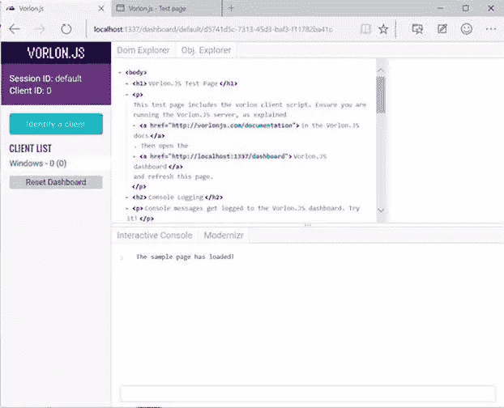
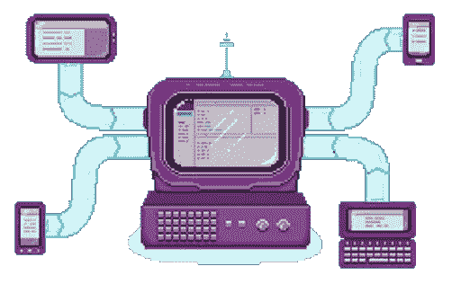
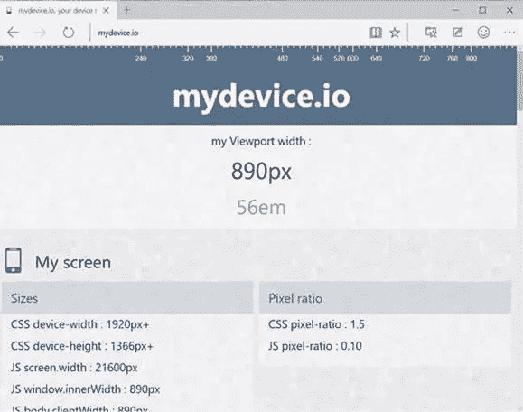
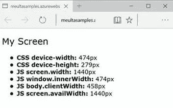
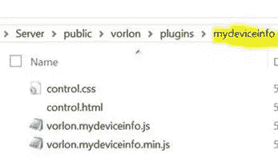
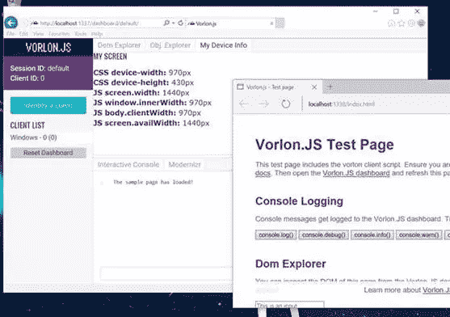

# 如何创建 Vorlon.js 插件

> 原文：<https://www.sitepoint.com/how-to-create-a-vorlon-js-plugin/>

本文是微软网站开发系列的一部分。感谢您对使 SitePoint 成为可能的合作伙伴的支持。

在最近//BUILD 2015 大会的主题演讲中，我们在微软的团队发布了 [Vorlon.js](http://vorlonjs.io/?WT.mc_id=13408-DEV-sitepoint-article32) ，这是一款调试网站的工具。Vorlon.js 主要由一个显示来自您站点的数据的仪表板组成。为了让它工作，你只需要在你的站点代码中引用一个脚本。



我们([皮耶·拉加德](http://twitter.com/pierlag)、[大卫·卡图赫](http://twitter.com/deltakosh)、[大卫·罗塞特](http://twitter.com/davrous)和[我自己](http://twitter.com/meulta))建立这个主要是为了帮助网站开发者在移动设备上调试他们的网站。当然，专有解决方案已经存在，比如用于调试 chrome mobile 的 Chrome 开发者工具，或者用于 Internet Explorer 甚至 Weinre 的 Safari 和 Visual Studio 的等效工具；但是这些都不是真正的技术和平台无关的。这就是我们想要用 Vorlon.js 填补的空白。



您可以从 npm 安装 Vorlon.js，也可以通过克隆 GitHub 存储库并使用 gulp 使其准备就绪来安装。

你可以在我们的网站([http://vorlonjs.io/](http://vorlonjs.io/?WT.mc_id=13408-DEV-sitepoint-article32))或[我的朋友大卫写的博客文章](http://blogs.msdn.com/b/eternalcoding/archive/2015/04/30/why-we-made-vorlon-js-and-how-to-use-it-to-debug-your-javascript-remotely.aspx?WT.mc_id=13408-DEV-sitepoint-article32)中找到更多的信息。

要为 Vorlon 创建插件，可以使用 TypeScript 或直接使用 JavaScript。

我会给你 JavaScript 和 TypeScript 代码，所以你可以用你最喜欢的语言阅读:)

## 我们将要创造的东西

在这篇文章中，我选择创建一个插件来获取设备信息。这是基于拉斐尔·戈特创建的 http://mydevice.io/网站。为了简单起见，我将只从“我的屏幕”类别的“大小”部分获取数据。



激活此插件后，Vorlon.js 仪表板将显示来自客户端的尺寸信息。

在进入更多细节之前，先看一下这个视频，它向你展示了我们将要创造的东西。

在这个视频中，我在桌面浏览器上做了一个演示，但这显然也适用于手机或平板电脑。

## 第一步:在 Vorlon.js 之外编写代码

一个 vorlon.js 插件无非就是 HTML，CSS，JavaScript 代码。您的插件正在从客户端获取数据，并将其发送到服务器以显示在仪表板上。

这意味着你可以先不使用 Vorlon.js，在一个简单的 web 项目上编写所有内容，然后将它包含在 Vorlon.js 插件架构中。

我们的插件将获得一些与客户端大小相关的信息，并将其显示在一个 HTML 列表中。它还会在调整浏览器大小时刷新数据。您可以[在这里看到完整的示例运行](http://meultasamples.azurewebsites.net/vorlonpluginsample/control.html?WT.mc_id=13408-DEV-sitepoint-article32)(它并不漂亮，但确实有效！；-)).



HTML 代码相当简单:

```
<!DOCTYPE html> 
<html xmlns="https://www.w3.org/1999/xhtml"> 
    <head> 
        <title></title> 
        <link href="control.css" rel="stylesheet" /> 
        <script src="vorlon.deviceinfo.js"></script> 
    </head> 
    <body> 
        <div id="deviceinfo" class="deviceinfo-container"> 
            <h2>My Screen</h2> 
            <ul> 
                <li>CSS device-width: <span id="devicewidth"></span></li> 
                <li>CSS device-height: <span id="deviceheight"></span></li> 
                <li>JS screen.width: <span id="screenwidth"></span></li> 
                <li>JS window.innerWidth: <span id="windowinnerwidth"></span></li> 
                <li>JS body.clientWidth: <span id="bodyclientwidth"></span></li> 
                <li>JS screen.availWidth: <span id="screenavailwidth"></span></li> 
            </ul> 
        </div> 
    </body> 
</html>
```

它使用以下 control.css 文件:

```
.deviceinfo-container { 
    font-family: "Verdana", "Comic Sans MS"; 
} 

.deviceinfo-container h2 { 
    font-weight: normal; 
} 

.deviceinfo-container ul li { 
    font-weight: bold; 
} 

.deviceinfo-container ul span { 
    font-weight: normal; 
}
```

JavaScript 代码在页面加载后获取数据，并在每次调整窗口大小时更新列表:

```
(function(){ 
    var compute = function() { 
        document.getElementById('devicewidth').innerText = document.documentElement.clientWidth + 'px'; 
        document.getElementById('deviceheight').innerText = document.documentElement.clientHeight + 'px'; 
        document.getElementById('screenwidth').innerText =  screen.width + 'px';; 
        document.getElementById('windowinnerwidth').innerText = window.innerWidth + 'px'; 
        document.getElementById('bodyclientwidth').innerText = document.body.clientWidth + 'px'; 
        document.getElementById('screenavailwidth').innerText = screen.availWidth + 'px'; 
    }; 

    window.onresize = function(event) { 
        compute(); 
    }; 

    document.addEventListener("DOMContentLoaded", compute); 

})();
```

所以，直到现在我们只写简单的经典 web 代码:)

现在让我们看看如何将它转换成一个 Vorlon.js 插件！

## 为插件创建基本的 JavaScript/TypeScript 代码

在 Vorlon.js 中，插件是继承自 plugin 类的 JavaScript 类。最小代码包含一个`constructor`和`getID`函数。

[JavaScript](http://blogs.msdn.com/b/emargraff/archive/2015/06/01/how-to-create-a-vorlon-js-plugin.aspx#one4)

```
var __extends = this.__extends || function (d, b) { 
    for (var p in b) if (b.hasOwnProperty(p)) d[p] = b[p]; 
    function __() { this.constructor = d; } 
    __.prototype = b.prototype; 
    d.prototype = new __(); 
}; 
var VORLON; 
(function (VORLON) { 
    var MyDeviceInfo = (function (_super) { 
        __extends(MyDeviceInfo, _super); 
        function MyDeviceInfo() { 
            _super.call(this, "mydeviceinfo", "control.html", "control.css"); 
            this._ready = true; 
        } 
        MyDeviceInfo.prototype.getID = function () { 
            return "MYDEVICEINFO"; 
        }; 
        return MyDeviceInfo; 
    })(Plugin); 
    VORLON.MyDeviceInfo = MyDeviceInfo; 

    //Register the plugin with vorlon core 
    Core.RegisterPlugin(new MyDeviceInfo()); 
})(VORLON || (VORLON = {}));
TypeScript 
module VORLON { 
    export class MyDeviceInfo extends Plugin { 

        constructor() { 
            super("mydeviceinfo", "control.html", "control.css"); 
            this._ready = true; 
        } 

        public getID(): string { 
            return "MYDEVICEINFO"; 
        } 
    } 

    //Register the plugin with vorlon core 
    Core.RegisterPlugin(new MyDeviceInfo()); 
}
```

ID 只是一个你可以选择的字符串。当您将插件添加到仪表板时，您将需要它。

构造函数调用`super`函数并给它命名，control.css 和 control.css 文件。这是它知道这些文件并在必要时加载它们的先决条件。

最后一行代码是将插件注册到核心管理的列表中。核心角色是处理客户端和仪表板之间的所有通信和数据交换。

## 仪表板上的渲染

每次加载插件时，仪表板都会在其右窗格中创建一个新的选项卡。这是你的插件渲染的空间。

Vorlon.js 插件的布局部分包含在 HTML 文件中。在我们将要创建的示例中，它被称为 control.html，这是 Vorlon.js 插件中的一个约定。它不是默认显示的，你必须在你的插件代码中管理它。这是使用`_insertHtmlContentAsync`完成的，通常在`startDashboardSide`函数中。

当仪表板在服务器端实例化您的插件时，会调用`startDashboardSide`。它只有一个参数，即 HTML div，您可以在其中呈现您的控件。基本上，它是显示在插件选项卡上的 div。

`_insertHtmlContentAsync`是一个助手，它异步加载你在插件构建过程中给定的所有文件。第一个参数是 render div，第二个参数是回调函数，一旦一切完成，它就给你加载的 div。

[JavaScript](http://blogs.msdn.com/b/emargraff/archive/2015/06/01/how-to-create-a-vorlon-js-plugin.aspx#one5)

```
MyDeviceInfo.prototype.startDashboardSide = function (div) { 
    if (div === void 0) { div = null; } 
    this._insertHtmlContentAsync(div, function (filledDiv) { 
        //load data 
    }); 
};
TypeScript 
public startDashboardSide(div: HTMLDivElement = null): void { 
    this._insertHtmlContentAsync(div, (filledDiv) => { 
        //load data 
    }) 
}
```

在 control.html 部分，您只需删除 JavaScript 引用，这会产生以下代码:

[HTML](http://blogs.msdn.com/b/emargraff/archive/2015/06/01/how-to-create-a-vorlon-js-plugin.aspx#one6)

```
< !DOCTYPE html> 
<html xmlns="https://www.w3.org/1999/xhtml"> 
    <head> 
        <title></title> 
        <link href="control.css" rel="stylesheet" /> 
    </head> 
    <body> 
        <div id="mydeviceinfocontainer" class="deviceinfo-container"> 
            <h2>My Screen</h2> 
            <ul> 
                <li>CSS device-width: <span id="devicewidth"></span></li> 
                <li>CSS device-height: <span id="deviceheight"></span></li> 
                <li>JS screen.width: <span id="screenwidth"></span></li> 
                <li>JS window.innerWidth: <span id="windowinnerwidth"></span></li> 
                <li>JS body.clientWidth: <span id="bodyclientwidth"></span></li> 
                <li>JS screen.availWidth: <span id="screenavailwidth"></span></li> 
            </ul> 
        </div> 
    </body> 
</html>
```

## 从客户端向插件发送数据

因此，现在您已经在仪表板中呈现了您的控件模板，您需要从客户端向它发送数据。在初始代码中，它是在同一页上完成的。现在你需要把所有的东西打包然后寄出去。

所有的沟通过程都是为你处理的。你只需要创建一个包含数据的对象并调用正确的函数。它是`Core.Messenger`中可用的助手，名为`sendRealTimeMessage`。

在 MyDeviceInfo 类中，我们添加了一个名为 sendClientData 的自定义函数。它将获得所有当前的大小信息并发送出去。

[JavaScript](http://blogs.msdn.com/b/emargraff/archive/2015/06/01/how-to-create-a-vorlon-js-plugin.aspx#one61)

```
MyDeviceInfo.prototype.sendClientData = function () { 
    var data = { 
        "devicewidth": document.documentElement.clientWidth, 
        "deviceheight": document.documentElement.clientHeight, 
        "screenwidth": screen.width, 
        "windowinnerwidth": window.innerWidth, 
        "bodyclientwidth": document.body.clientWidth, 
        "screenavailwidth": screen.availWidth 
    }; 
    VORLON.Core.Messenger.sendRealtimeMessage(this.getID(), data, 0 /* Client */); 
};
TypeScript 
public sendClientData(): void { 
    var data = { 
        "devicewidth" : document.documentElement.clientWidth, 
        "deviceheight" : document.documentElement.clientHeight, 
        "screenwidth" :  screen.width, 
        "windowinnerwidth" : window.innerWidth, 
        "bodyclientwidth" : document.body.clientWidth, 
        "screenavailwidth" : screen.availWidth 
    }; 

    Core.Messenger.sendRealtimeMessage(this.getID(), data, RuntimeSide.Client); 
}
```

SendRealtimeMessage 有 3 个强制参数:

*   插件 ID(这是 getID 函数返回的字符串)
*   要发送的对象(此处包含大小信息)
*   发出请求的租户。(客户端或仪表板)

每当仪表板需要这个函数时(例如，当用户切换到这个客户机时)以及每次浏览器大小改变时，都需要调用这个函数。

我们添加了`startClientSide`函数，该函数将在客户端初始化时被调用，以注册到窗口。

[JavaScript](http://blogs.msdn.com/b/emargraff/archive/2015/06/01/how-to-create-a-vorlon-js-plugin.aspx#one7)

```
MyDeviceInfo.prototype.startClientSide = function () { 
    var that = this; 
    window.onresize = function (event) { 
        that.sendClientData(); 
    }; 
};
TypeScript 
public startClientSide(): void { 
    var that = this; 
    window.onresize = (event) => { 
        that.sendClientData(); 
    }; 
}
```

每当用户改变浏览器的大小时，这段代码就会将新的信息发送到仪表板。

最后我们需要添加`refresh`函数。每次仪表板需要来自客户端的当前信息时，都会调用它。

[JavaScript](http://blogs.msdn.com/b/emargraff/archive/2015/06/01/how-to-create-a-vorlon-js-plugin.aspx#one8)

```
MyDeviceInfo.prototype.refresh = function () { 
    this.sendClientData(); 
};
TypeScript 
public refresh(): void { 
    this.sendClientData(); 
}
```

仅此而已！:-)

### 在仪表板上显示数据

既然数据已经从客户机发送到仪表板，您仍然需要在另一端处理它们。

为此，您可以使用`onRealtimeMessageReceivedFromClientSide`功能。每次客户端通过 Core.Messenger 发送消息时都会调用这个函数，它只有一个参数，在这个参数中您可以获取您发送的对象。

在这个示例中，我们只需使用每个值并设置正确的 DOM 元素来用新值更新列表。

[JavaScript](http://blogs.msdn.com/b/emargraff/archive/2015/06/01/how-to-create-a-vorlon-js-plugin.aspx#one9)

```
MyDeviceInfo.prototype.onRealtimeMessageReceivedFromClientSide = function (receivedObject) { 
    document.getElementById('devicewidth').innerText = receivedObject.devicewidth + 'px'; 
    document.getElementById('deviceheight').innerText = receivedObject.deviceheight + 'px'; 
    document.getElementById('screenwidth').innerText = receivedObject.screenwidth + 'px'; 
    ; 
    document.getElementById('windowinnerwidth').innerText = receivedObject.windowinnerwidth + 'px'; 
    document.getElementById('bodyclientwidth').innerText = receivedObject.bodyclientwidth + 'px'; 
    document.getElementById('screenavailwidth').innerText = receivedObject.screenavailwidth + 'px'; 
};
```

[打字稿](http://blogs.msdn.com/b/emargraff/archive/2015/06/01/how-to-create-a-vorlon-js-plugin.aspx#two9)

```
public onRealtimeMessageReceivedFromClientSide(receivedObject: any): void { 
    document.getElementById('devicewidth').innerText = receivedObject.devicewidth + 'px'; 
    document.getElementById('deviceheight').innerText = receivedObject.deviceheight + 'px'; 
    document.getElementById('screenwidth').innerText =  receivedObject.screenwidth + 'px';; 
    document.getElementById('windowinnerwidth').innerText = receivedObject.windowinnerwidth + 'px'; 
    document.getElementById('bodyclientwidth').innerText = receivedObject.bodyclientwidth + 'px'; 
    document.getElementById('screenavailwidth').innerText = receivedObject.screenavailwidth + 'px'; 
}
```

## 我们来测试一下这个！

为了能够测试这个插件，您需要执行一些简单的步骤。

### 编译并缩小

如果您选择了 TypeScript，您将需要使用 npm 上提供的 TypeScript 编译器之类的工具，或者通过修改/Plugins 文件夹中提供的 gulpfile.js 将您自己集成到 gulp 过程中。

从 TypeScript 到 JavaScript 的编译完成后，您需要缩小 JS 文件。使用以下约定很重要:

*   yourPluginName.js(最大化版本)
*   yourPluginName.min.js(缩小版)

## 复制服务器中的所有内容

第二步是复制/Server/public/vorlon/plugins 文件夹中的所有文件。在那里你必须用你的插件名创建一个文件夹，并把所有东西放在它下面。这包括你的 html，css 和 js 文件。

下面是我们在本文中创建的插件是如何做到的:



### 将插件添加到 catalog.json 文件中

下一步是在服务器上注册你的插件。为此，在 Server/public/catalog.json 文件中添加一行:

```
JSON 
{ 
    "IncludeSocketIO": true, 
    "plugins": [ 
        { "id": "CONSOLE", "name": "Interactive Console", "panel": "bottom", "foldername" : "interactiveConsole"}, 
        { "id": "DOM", "name": "Dom Explorer", "panel": "top", "foldername" : "domExplorer" }, 
        { "id": "MODERNIZR", "name": "Modernizr","panel": "bottom", "foldername" : "modernizrReport" }, 
        { "id" : "OBJEXPLORER", "name" : "Obj. Explorer","panel": "top", "foldername" : "objectExplorer" }, 
        { "id" : "MYDEVICEINFO", "name" : "My Device Info","panel": "top", "foldername" : "mydeviceinfo" } 
    ] 
}
```

你可以在这里找到更多相关信息:[http://vorlonjs . io/documentation/# vorlonjs-server-advanced-topics](http://vorlonjs.io/documentation/#vorlonjs-server-advanced-topics?WT.mc_id=13408-DEV-sitepoint-article32)

### 启动服务器

在/Server 文件夹上打开命令行，并运行以下命令:

node server.js

### 启动客户端

最后，启动一个引用您的 vorlon.js 本地实例的客户机。您可以使用/Plugins/samples 文件夹中提供的示例。

使用[http://localhost:1337/dashboard/default](http://localhost:1337/dashboard/default?WT.mc_id=13408-DEV-sitepoint-article32)浏览仪表板

还有…摇滚！:-)



您可以尝试改变显示客户端代码的浏览器的大小，您将在仪表板上看到它的实时变化。

很简单，不是吗？:-)

## 现在该怎么办？

我希望我说明了我们希望插件创建是多么容易。你真的只需要像编写经典的 web 代码一样，把它分成两部分:

*   在客户端收集数据的那个
*   在仪表板上显示的那个

Vorlon.js 不仅是我们的项目，也是您的项目。我很确定你会有很多插件的想法，我们很乐意将它们集成到项目中。

不要犹豫叉[https://github.com/MicrosoftDX/Vorlonjs](https://github.com/MicrosoftDX/Vorlonjs?WT.mc_id=13408-DEV-sitepoint-article32)和发送您的创作拉请求给我们！

你可以在这里找到完整的示例:[https://github . com/meulta/meultas samples/tree/master/vorlonpluginsample](https://github.com/meulta/meultasamples/tree/master/vorlonpluginsample?WT.mc_id=13408-DEV-sitepoint-article32)

*如果您对本文或 Vorlon.js 有任何疑问，欢迎在 twitter 上联系我:*[*http://twitter.com/meulta*](http://twitter.com/meulta)

## JavaScript 的更多实践

微软有许多关于开源 JavaScript 主题的免费学习，我们的任务是用 [Microsoft Edge](http://blogs.windows.com/msedgedev/2015/04/29/introducing-microsoft-edge-the-browser-built-for-windows-10/?WT.mc_id=13408-DEV-sitepoint-article32) 创造更多。以下是一些要检查的:

*   【2015 年微软 Edge 网络峰会(关于新浏览器、新网络平台功能和社区演讲嘉宾的完整系列)
*   //BUILD/和 Windows 10 的构建(包括网站和应用的新 JavaScript 引擎)
*   [在不破坏网络的情况下推进 JavaScript](http://channel9.msdn.com/Events/WebPlatformSummit/2015/Advancing-JavaScript-without-breaking-the-web?WT.mc_id=13408-DEV-sitepoint-article32)(Christian heil Mann 最近的主题演讲)
*   [托管网络应用和网络平台创新](http://channel9.msdn.com/Events/Build/2015/2-665?WT.mc_id=13408-DEV-sitepoint-article32)(深入探讨流形等主题。JS)
*   [让你的 HTML/JavaScript 更快的实用性能技巧](http://channel9.msdn.com/Series/Practical-Performance-Tips-to-Make-Your-HTMLJavaScript-Faster/06?WT.mc_id=13408-DEV-sitepoint-article32)(从响应式设计到休闲游戏再到性能优化的 7 部分系列)
*   现代网络平台快速启动(HTML、CSS 和 JS 的基础)

以及一些免费的入门工具: [Visual Studio Code](https://code.visualstudio.com/?WT.mc_id=13408-DEV-sitepoint-article32) 、 [Azure 试用版](http://azure.microsoft.com/en-us/pricing/free-trial/?WT.mc_id=13408-DEV-sitepoint-article32)和[跨浏览器测试工具](http://dev.modern.ie/?utm_source=SitePoint&utm_medium=article32&utm_campaign=SitePoint)——都适用于 Mac、Linux 或 Windows。

本文是微软网站开发技术系列的一部分。我们很高兴与您分享[微软 Edge](http://blogs.windows.com/msedgedev/2015/04/29/introducing-microsoft-edge-the-browser-built-for-windows-10/?WT.mc_id=13408-DEV-sitepoint-article32) 和新的 [EdgeHTML 渲染引擎](http://blogs.windows.com/msedgedev/2015/02/26/a-break-from-the-past-the-birth-of-microsofts-new-web-rendering-engine/?WT.mc_id=13408-DEV-sitepoint-article32)。获得免费虚拟机或在您的 Mac、iOS、Android 或 Windows 设备上进行远程测试@ [modern。IE](http://dev.modern.ie/?utm_source=SitePoint&utm_medium=article32&utm_campaign=SitePoint)

## 分享这篇文章