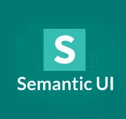

# 如何用语义 UI 设计丰富的基于卡片的布局

> 原文：<https://www.sitepoint.com/how-to-design-rich-card-based-layouts-with-semantic-ui/>


在 2016 年，毫无疑问，“基于卡片”的设计模式是现代 web 开发人员工具箱中的一个重要工具。

卡片已经在大多数社交和分享网站和应用程序(Dribbble、Twitter、脸书、Pinterest、Trello 等)中获得了巨大成功。)，尤其是在移动设计方面。它们的紧凑性、可移植性和高度灵活性为开发人员提供了一种便捷的方式来构建响应性布局，并轻松地使内容适应不同的上下文。

您可以在各种各样的场景中使用卡片，例如列出博客帖子、食谱文章、产品概述、特色亮点、制作独立的小部件等。关于什么是卡以及为什么你应该使用卡的更详细的概述[见本文](https://www.sitepoint.com/card-tricks-using-cards-in-web-design-layouts/)。



今天，我们将探讨两个基于卡的设计模式实现的例子

*   图像相册
*   和一个食谱小部件

我们将使用[语义 UI](http://semantic-ui.com/) ，它是最流行和易于使用的 CSS 框架之一，提供了现成可用的 [**卡**](http://semantic-ui.com/views/card.html) 组件。任何对 HTML/CSS 有所了解的设计师都应该可以很容易地理解这篇教程。

在开始使用示例之前，请确保您已经准备了两个空的 HTML 文件，每个文件都引用了 jQuery ( [jquery.js](https://cdnjs.com/libraries/jquery/) )和 Semantic UI (semantic.css，semantic.js)。如果你不想下载它们，你可以从 CDN 链接它们。

```
<!DOCTYPE HTML>
<html>
<head>
    <meta charset="utf-8" />
    <title>Semantic UI CDN</title>
    <link rel="stylesheet" href="https://cdnjs.cloudflare.com/ajax/libs/semantic-ui/1.11.8/semantic.min.css"/>
    <script src="https://cdnjs.cloudflare.com/ajax/libs/jquery/2.1.3/jquery.min.js"></script>
    <script src="https://cdnjs.cloudflare.com/ajax/libs/semantic-ui/1.11.8/semantic.min.js"></script>
</head>
<body>
      <!-- Your Semantic UI Code -->
</body>
</html>
```

## 示例 1:一个简单的相册

对于第一个例子，假设我们需要一个应用程序来存储和管理我们在不同相册中分组的图像。我们还希望每个相册看起来像一堆图像。要达到这种效果，请在您的第一个 HTML 文件中添加以下代码:

```
<div id="album">
  <div class="ui piled compact segment">
  <div class="floating ui red label">9</div>
    <div class="ui card">

       <!-- Album Card Content -->

    </div>
  </div>
</div>
```

我们用一个`<div id="album">`标签包装这张专辑。然后，我们使用一个**片段**组件，使相册看起来像一堆图像。我们还在右上角放了一个标签，显示相册包含了多少张图片。最后，我们添加一个空的**卡**组件。

在这个阶段，我们需要一些 CSS 来给专辑周围一点喘息的空间，并将其与背景区分开来:

```
body {
  margin: 30px;
  background-color: whitesmoke;
}
```

现在，这张专辑看起来有点奇怪。但是不要担心，我们很快就会把它整理好。

我们希望有一个显示相册的第一个图像的正面图像。当我们将鼠标悬停在该图像上时，它将变暗，一个按钮将出现在中间。当我们点击按钮时，我们将进入相册。我们通过在空的**卡**组件中添加以下代码来实现这一切。

```
<div class="blurring dimmable image">
  <div class="ui inverted dimmer">
   <div class="content">
     <div class="center">
       <div class="ui red button view">VIEW</div>
     </div>
   </div>
  </div>
  
</div>
```

要激活上面使用的**调光器**组件，我们需要添加以下 jQuery 代码:

```
$( document ).ready(function() {
  $('.ui.card .image').dimmer({on: 'hover'});
});
```

相册现在看起来更好了，但是`VIEW`按钮没有任何作用。现在，就让它保持原样，我们稍后会激活它。

让我们通过添加以下代码来继续构建相册“face ”:

```
<div class="content">
  <div id="rate" class="ui star rating right floated" data-rating="3"></div>
  <div class="header">Animals</div>
  <div class="meta">
    <span class="date"><i class="calendar icon"></i>Created 7/27/2014</span>
    <span class="right floated date"><i class="history icon"></i> Modified 8/4/2014</span>
  </div>
  <div class="description">
  Different animals from around the world
  </div>
</div>
```

在这里，我们使用`content`类对 header、meta 和 description 元素进行分组，这些元素表示相册的标题、相册的详细信息(如相册的创建时间和修改时间)以及相册内容的简短描述。此外，我们添加了一个与标题右侧对齐的**评级**组件。为了激活它并使它可见，我们再次使用 jQuery:

```
$('.ui.rating').rating({maxRating: 5});
```

你可能会注意到专辑的细节太大，不适合一行。当所有的卡片都被创建后，我们将在最后修正这个问题。

我们继续在相册卡底部添加两个按钮:

```
<div  class="extra content" >
  <div class="ui right labeled button" data-content="Like it!" data-variation="tiny">
    <div class="ui red icon tiny button">
      <i class="thumbs outline up large icon"></i>
    </div>
    <a class="ui basic red left pointing label">365</a>
  </div>
  <div class="ui left labeled right floated button" data-content="Share it!" data-variation="tiny">
    <a class="ui basic red right pointing label">183</a>
    <div class="ui red icon tiny button">
      <i class="external share large icon"></i>
    </div>
  </div>
</div>
```

这里，我们使用两个复杂的按钮，包装在一个`extra content`类中——一个是喜欢相册，一个是分享相册。另外，我们需要每个按钮的工具提示，所以我们添加了一个包含工具提示消息的`data-content`属性。同样，为了激活**弹出窗口**组件，我们使用以下 jQuery 代码:

```
$('.ui.button').popup();
```

现在，相册的“表面”已经准备好了，是时候为相册图像构建内部视图了。我们添加下面的代码，但是这次是在`<div id="album">`标签之后(**在**之外):

```
<div id="album_items">
  <button class="ui labeled icon button back">
    <i class="arrow lircle left icon"></i>Back
  </button>
  <div class="ui cards">

    <!-- Album Images Cards -->

  </div>
</div>
```

这里，我们用一个`<div id="album_items">`标签包装相册图像，并添加一个按钮返回相册“face”。然后，我们添加`<div class="ui cards">`标签，其目的是保存各个图像卡。我们还放置了下面的 CSS 来隐藏最初的相册图像，并在它们周围留出一些空间:

```
#album_items {
  display: none;
}

#album_items .ui.cards {
  margin: 10px;
}
```

现在，是时候让`VIEW`按钮工作了。我们添加以下代码:

```
$('.button.view').on('click', (function() {
  $('#album').fadeOut('slow', function () {
    $('#album_items').fadeIn('slow');
  });
}));

$('.button.back').on('click', (function() {
  $('#album_items').fadeOut('slow', function () {
    $('#album').fadeIn('slow');
  });
}));
```

很好。如果你现在试一试，你会发现它是有效的。但是专辑里还没有什么可以展示的。所以，让我们开始添加图像卡。这是第一张卡的代码:

```
<div class="card">
  <div class="image">
    
  </div>
  <div class="content">
    <div class="header">giraffes.jpg</div>
    <div class="meta">263 KB</div>
  </div>
  <div class="ui bottom attached basic buttons">
    <button class="ui button"><i class="pencil icon"></i></button>
    <button class="ui button"><i class="trash icon"></i></button>
  </div>
</div>
```

对于每个图像卡，我们添加图像本身，一个包含图像标题和大小的内容部分，以及两个用于图像编辑和删除的按钮。我们再这样做八次，直到相册中有 9 张卡片图像，这在右上角的相册标签中有标注。(关于其他八张卡，请参考下面的最终结果)

我们需要做的最后一件事是稍微调整一下图像卡的外观。为此，我们使用以下 CSS:

```
.ui.cards > .card  {
  width: 210px;
}

.ui.cards > .card > .content > .header:not(.ui) {
  font-size: 1.1em;
  font-weight: normal;
}

.ui.cards > .card .meta,
.ui.card .meta {
  font-size: 0.8em;
}
```

现在一切都应该正常工作和显示。你可以在这里看到最后的结果 [JS Bin](http://jsbin.com/balamaqova/edit?output)

[jsbin.com](http://jsbin.com/balamaqova/1/embed?output&height=500px)T2【上 JS 斌】

## 示例 2:食谱小部件

注:配方内容取自此处的。

对于第二个示例，假设我们想要创建一个 recipe 小部件，在其前卡上包含食谱图像、名称、描述和一些细节(准备时间、份数和难度)。当我们将鼠标悬停在卡片上时，主要内容会隐藏起来，显示另一张卡片，上面有两个列表:一个是食谱的成分，另一个是食谱的说明。

使用您的第二个 HTML 文件，并添加以下起始代码:

```
<div class="ui move reveal">
  <div class="visible content">
    <div class="ui card">

    </div>
  </div>
  <div class="hidden content">
    <div class="ui card">

    </div>
  </div>
</div>
```

这里，我们使用一个 **Reveal** 组件，它有两个部分:可见内容和隐藏内容。对于每个部分，我们放置一个空的**卡**组件。我们还添加了一些 CSS——我们在食谱卡周围留出一些空间，并使用`lightgrey`颜色来区分这些卡片。我们覆盖了 **Reveal** 的样式，使其宽度为`290px`以匹配 **Card** 组件的默认宽度，并且我们将`white-space`属性设置为`normal`以便在卡片内换行。同样，我们给一张卡一个`420px`的高度。

```
body {
  margin: 30px;
  background-color: lightgrey;
}

.ui.move.reveal {
  width: 290px;
  white-space: normal;
}

.ui.card {
  height: 420px;
}
```

现在，让我们添加可见卡的代码:

```

<div class="content">
  <div class="header">Pizza Margherita</div>
  <div class="description">Invented in Naples in honor of the first queen of Italy, the Margherita pizza is the triumph of Italian cuisine in the world.</div>
</div>
<div  class="extra content" >
  <div class="ui labeled icon menu">
    <a class="item"><i class="wait icon"></i>2h 16min</a>
    <a class="item"><i class="food icon"></i>6 servings</a>
    <a class="item"><i class="signal icon"></i>Easy</a>
  </div>
</div>
```

首先，我们放入食谱的图片。接下来，我们使用内容部分来显示菜谱的标题和描述。最后，我们在额外内容部分使用了一个**菜单**组件来显示食谱的细节——准备时间、份量和难度。剩下要做的唯一一件事就是调整菜单的外观，以均匀地显示它的三个部分。

此外，我们降低了一点字体大小，并调整了填充，使左右两边的空间更大，上下两边的空间更小。

```
.ui.labeled.icon.menu .item{
  min-width: 33.3333%;
  max-width: 33.3333%;
  font-size: 0.8em;
  padding: 6px 2px;
}
```

太好了。现在你可以测试它。它工作正常，但是我们需要为隐藏的卡片添加内容:

```
<div class="content">
  <div class="ui pointing secondary menu">
    <div class="item active" data-tab="ingredients">Ingredients</div>
    <div class="item" data-tab="directions">Directions</div>
  </div>
  <div class="ui tab active" data-tab="ingredients">

  </div>
  <div class="ui tab" data-tab="directions">

  </div>
</div>
```

这里，我们使用一个**标签**组件，结合**菜单**组件，为*配料*和*方向*列表创建标签。

要激活**选项卡**组件，我们需要使用以下 jQuery 代码:

```
$( document ).ready(function() {
  $('.menu .item').tab();
});
```

现在标签可以工作了，但是内容丢失了。让我们添加第一个选项卡的内容:

```
<h3>For pasta</h3>
<div class="ui list">
  <div class="item"><i class="check circle red icon"></i>2 lb Italian "00" flour or all-purpose flour</div>
  <div class="item"><i class="check circle red icon"></i>1 oz fresh yeast</div>
  <div class="item"><i class="check circle red icon"></i>2 cups water</div>
  <div class="item"><i class="check circle red icon"></i>⅜ oz salt</div>
</div>
<h3>For dressing</h3>
<div class="ui small list">
  <div class="item"><i class="check circle red icon"></i>½ cup extra virgin olive oil</div>
  <div class="item"><i class="check circle red icon"></i>1 lb mozzarella cheese</div>
  <div class="item"><i class="check circle red icon"></i>basil leaves to taste</div>
  <div class="item"><i class="check circle red icon"></i>1 lb canned tomatoes</div>
  <div class="item"><i class="check circle red icon"></i>salt to taste</div>
</div>
```

现在，让我们为第二个选项卡添加内容:

```
<div class="ui small list">
  <div class="item"><span class="ui red circular label">1</span> On a wooden...</div>
  <div class="item"><span class="ui red circular label">2</span> Knead the dough...</div>
  ...
  <div class="item"><span class="ui red circular label">8</span> Once ready...</div>
</div>
```

这里，为了简洁起见，我没有给出完整的方向列表。完整版请看下面的最终结果。

我们需要做的最后一件事是添加一些 CSS 来正确显示这些东西。首先，当我们悬停在选项卡上时，我们将光标设置为`pointer`。接下来，我们将选项卡的高度设置为`320px`，将`overflow-y`属性设置为`auto`，以便在列表变得过长时显示滚动条，因为这种情况发生在*方向*列表中。

```
.ui.pointing.menu {
  cursor: pointer;
}

.ui.tab {
  height: 320px;
  overflow-y: auto;
}
```

完美。现在一切都应该正常工作了。你可以在这里看到最后的结果 [JS Bin](http://jsbin.com/ximaxujafi/edit?output)

[jsbin.com 上的 JS Bin](http://jsbin.com/ximaxujafi/1/embed?output&height=500px)

## 总结

到目前为止，我们已经看到了两个展示基于卡的设计模式的实际实现的例子。一路上，我们探索了语义 UI 的卡片组件，以及如何使用它来实现不同种类的基于卡片的设计。现在你可以继续尝试你自己的想法。

对于那些喜欢 Bootstrap 的人来说，好消息是他们的[下一个主要版本](http://v4-alpha.getbootstrap.com/)也将提供内置卡组件。

## 分享这篇文章