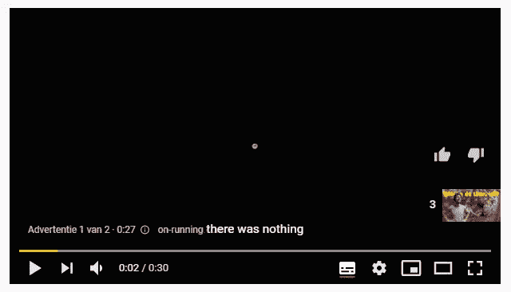

# 如何设计你的 UX 视频播放器

> 原文：<https://www.sitepoint.com/how-to-design-your-video-player-with-ux-in-mind/>

**本文探讨了不同的视频播放器控件、它们的用途，以及针对学习平台、社交媒体平台、高级用户或移动用户等特定使用情形选择哪些控件。你知道 YouTube 上有多少很酷的超级用户控件吗？请继续阅读！**

吸引人的视频播放器可以吸引更多的观众。现代视频播放器可以提供比早期简单的播放暂停按钮更多的控制。

看看现在的 YouTube 吧。用户可以使用 YouTube 的章节功能浏览视频片段。这项功能可以帮助用户快速搜索视频中与他们相关的片段。

你有多少次观看视频，希望找到特定的信息，却发现它没有回答你的特定问题？真令人沮丧！

精明的 YouTubers 找到了一个临时的解决方案。他们发现在视频描述中列出不同的片段和时间戳很有帮助。这种解决方案仍然意味着您必须打开描述来搜索您的特定问题。最重要的是，对于谷歌来说，索引处理关于特定主题的不同问题的视频并不容易。

视频播放器用户体验包含的不仅仅是添加章节。在线学习平台的视频播放器需要不同于 YouTube 视频或产品网站上简单的预告视频的控制。

## 为什么 UX 对视频播放器如此重要？

以 YouTube 这样的视频平台为例。用户以各种方式消费内容。让我们来探索三个不同的人物角色如何使用 YouTube:

1.  爱丽丝使用 YouTube 快速查找教育信息。她使用章节功能扫描相关章节。她还使用箭头键以小的增量步骤快速跳过各个部分，以找到她需要的信息。
2.  本喜欢看游戏视频。他是一个传统的超级用户，使用快捷键，如`F`进入全屏，`M`静音，或空格键暂停视频。
3.  亚历克斯喜欢在背景音乐中学习。他使用 YouTube 的自动播放功能，所以他不需要担心选择合适的学习音乐。他经常选择一些背景音乐，并信任 YouTube 算法在视频结束时选择类似的音乐。

上述场景说明了一个视频平台承载着许多以不同方式使用它的不同用户。因此，选择正确的控件和快捷键来为所有用户提供最佳体验是一项挑战。

那么，我们可以找到哪些视频播放器控件呢？

## 存在哪些视频播放器控件？

存在许多不同的视频播放器控件。此列表总结了您最常找到的控件:

*   **播放/暂停按钮**。
*   **跳到下一个视频**。
*   **调节音量**。
*   **切换字幕**。
*   **调整屏幕尺寸**(迷你播放器、影院模式或全屏模式)。大多数情况下，你会发现一个按钮进入全屏模式。然而，YouTube 允许你进入影院模式，根据屏幕大小调整视频大小。他们还提供了一个迷你播放器，这样你就可以在观看视频的同时使用一个小的视频播放器来浏览 YouTube。
*   **改变视频质量**。不是每个人都有很好的网络连接。因此，允许用户调整质量。确保提供自动调整视频质量的选项。对于互联网连接不稳定的用户，视频播放器可以根据连接速度自动调整视频质量。大多数用户喜欢降低质量，以便不受干扰地继续观看视频。

不太常见的控制包括:

*   **调整视频播放器速度**。此控件允许您减慢或加快视频速度。您通常可以在 0.25 到 2 的范围内以 25%的步长调整视频播放器的速度。
*   **切换启用自动播放功能**。对于听音乐或者您更喜欢内容算法来决定接下来要看什么非常有用。
*   **倒带和快进**。虽然很有用，但这种控制通常是隐藏的。例如，YouTube 只允许您使用键盘快捷键来使用此控件。很少有视频播放器将此功能作为默认视频控件的一部分来实现。
*   **设置**。YouTube 实现了一个齿轮图标，作为其默认控件集的一部分。然而，YouTube 的视频播放器很复杂。他们使用设置控制来隐藏其他不常用的视频控制。

最后，我们不应该忘记如何显示当前的时间戳和视频长度。最直接的解决方案是首先显示当前的视频时间戳，然后显示总的视频长度。在本例中，我们将视频暂停了 40 秒，视频总长度为 2 分 13 秒——“0:40/2:13”。另一方面，一些视频播放器显示视频的剩余长度。*不要这样做*，因为这会让用户感到困惑。

下一节将介绍常见的和更具实验性的键盘快捷键来导航视频播放器。

## 如何为高级用户设计一个视频播放器？

随着越来越多的用户熟悉键盘快捷键，缺少键盘快捷键将越来越导致令人沮丧的视频播放器体验。

键盘快捷键改善了高级用户的用户体验。

举个个人的例子，我喜欢用他们的视频平台在线看比利时的电视。该平台实现了一个定制的视频播放器。不幸的是，你不能使用箭头键来倒带或快进视频。最重要的是，你不能通过按空格键来暂停或取消暂停视频。视频播放器迫使我使用触摸板，将鼠标导航到小的暂停图标。很沮丧，对吧？

如今的视频播放器至少应该实现一套基本的键盘快捷键来满足*超级用户*。

*   **空格键**:开始/暂停视频
*   **右箭头键**:快进视频 5 秒或 10 秒
*   **左箭头键**:回放视频 5 秒或 10 秒
*   `M`:静音或取消静音视频声音
*   `F`:进入或退出全屏模式

但是为什么要把选项限制在这些快捷键上呢？YouTube 是实现键盘快捷键的领先企业。以下是我们可以从 YouTube 的超级用户身上学到的东西:

*   按`J`将视频倒回 10 秒，而左箭头键将视频倒回 5 秒。
*   按`L`将视频快进 10 秒，而右箭头键将快进 5 秒。
*   数字键是一种不太为人所知的键盘快捷键。按下`0`可将您带到视频的开头。YouTube 还将每个视频分成等长的九个部分。不管有多长，按下任何一个数字键(除了零)都会把你带到视频中的那个点。这是跳到结尾、回到开头或中间某处的好方法。

YouTube 都实现了 5 秒或 10 秒的快进/快退，这很棒。如果您错过了视频的一个小细节，您可以使用左箭头键快速倒回。当您想浏览一段视频时，可以按下`L`键，以 10 秒的间隔浏览视频。

## 不同用途的不同类型的视频控制

让我们讨论一下为不同目的实现的各种控件，例如教育视频、社交视频和移动视频。

### 教育视频

像 Udemy 或 Coursera 这样的平台上的教育视频实现了与常规视频播放器不同的控制。例如，用户通常喜欢提高教程视频的速度。因此，这是这些平台上常见的控件。

此外，教育视频与书签功能密切相关。用户可以将视频中的特定时刻加入书签，并添加注释。该功能允许用户标记视频中的重要时刻以供参考。

### 社交视频

社交视频从快速分享选项中受益最大。YouTube 允许你分享视频，但这不是他们标准控制的一部分。他们在视频播放器下面增加了这项功能。

尽管如此，将快速共享选项作为视频播放器控制的一部分还是值得的。不要忘记添加从特定时间戳共享的能力。大多数情况下，用户希望与朋友分享视频中的特定时刻。

另一方面，Twitch 允许用户直接从视频播放器中剪辑视频。

> Clips 允许 Twitch 观众快速分享广播中最独特的 Twitch 时刻，同时使广播公司能够通过社交分享扩大他们的频道！

这是一个很好的功能，可以快速剪辑有趣的时刻，精彩的游戏，或其他值得分享的时刻。

<video class="wp-video-shortcode" id="video-180734-1" width="1280" height="720" preload="metadata" controls=""><source type="video/mp4" src="https://uploads.sitepoint.com/wp-content/uploads/2021/01/1611195184twitch-settings.mp4?_=1">[https://uploads.sitepoint.com/wp-content/uploads/2021/01/1611195184twitch-settings.mp4](https://uploads.sitepoint.com/wp-content/uploads/2021/01/1611195184twitch-settings.mp4)</video>

来源: [Twitch](https://twitch.tv) 视频播放器

### 移动视频播放器

移动视频播放器需要更简单的设计。不可能在移动设备的屏幕上添加多个控件。

例如，YouTube 的移动视频播放器提供了以下控件:

*   进入全屏模式
*   前往下一个或上一个视频
*   暂停视频
*   启用标题
*   打开视频设置

然而，对于移动视频来说，快捷方式改善了用户体验。例如，双击屏幕右侧将视频快进十秒。这同样适用于在屏幕左侧将视频倒回十秒。此外，你可以上下滑动来放大视频或再次显示搜索结果。在这里，重点在于使用速度，这对用户体验有积极的影响。

## 结论:定义你的受众

要设计合适的视频播放器，一定要明确你的受众。与您的用户交谈，了解他们如何使用您的平台和视频播放器。

例如，Twitch 的剪辑功能在其他视频播放器中是独一无二的。这一功能是为其用户群量身定制的，可以在直播过程中快速保存精彩瞬间。

不要忘记记住超级用户。他们喜欢使用键盘快捷键来执行基本的视频操作，如静音、快进视频或进入全屏模式。

看看所有可用的 [YouTube 键盘快捷键](https://support.google.com/youtube/answer/7631406?hl=en)来汲取一些灵感吧！

最后，如果你有能力构建自己的视频播放器，请记住上面提供的建议。但是，如果你只是在寻找一个现成的解决方案，上面的讨论应该在你寻找可用选项时提供思考的食粮。

## 分享这篇文章