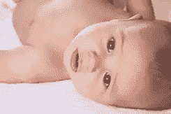
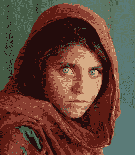
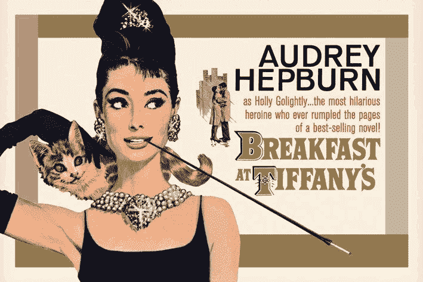
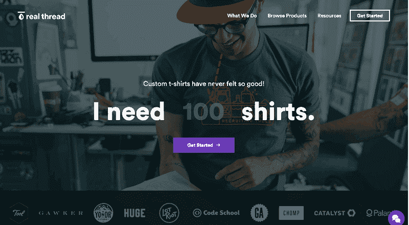

# 如何抓住用户的眼球(以及其他残忍的陷阱)

> 原文：<https://www.sitepoint.com/how-to-direct-the-eye/>

人类 ***爱用*** 地眼神看着。我们没办法。

测试表明，从出生开始，婴儿就会寻找那些相互凝视的面孔。这是我们自己的“内置读眼软件”，随着年龄的增长，它只会变得越来越敏感。

作为设计师，当我们在设计中使用人脸时，我们会利用这种能力。这些脸可能是笑着和满足的，或者是严肃和沉思的，但通常他们会凝视着与读者的眼睛相遇。

这很好，对吗？

有时候。但不是*总是* …让我解释一下。

## 看着我的眼睛…

虽然看着另一个人的眼睛有一种深深的力量，但它确实产生了一个巨大的潜在设计问题——我们的眼睛喜欢停留在任何回应我们目光的眼睛上。

令人难忘的国家地理杂志《阿富汗女孩》。

著名的国家地理杂志《阿富汗女孩》可能是你见过的最纯粹的例子。我们大多数人发现很难阻止我们的目光回到她的身上。当你读到这封信的时候，你可能正在和地心引力做斗争，对吗？

这也是这张照片本身如此令人震惊的强大的原因。

但是当你需要你的用户注意到其他重要的页面元素——文本、导航、订阅框、购买按钮等，这就成了一个问题。简而言之，当我们试图让用户前进时，有强烈目光接触的照片会减慢甚至麻痹他们。

你可以把它想象成一种“视觉流沙”。

幸运的是，我们可以用设计师的超能力以另一种方式驾驭他们的“读眼软件”。

## 你 在看什么 ***？*** 

事实证明，人类也非常善于注意到其他人在看什么。我们天生爱管闲事，想知道别人对什么感兴趣。我们跟踪他们的目光。

让我们看看它在布局中是如何工作的。

蒂凡尼的早餐海报:不要跟着奥黛丽的眼睛走..

在这张来自'[蒂凡尼的早餐](https://en.wikipedia.org/wiki/Breakfast_at_Tiffany%27s_%28film%29)'的空前经典的海报中，一个相当妖艳的奥黛丽·赫本向她的左边瞥了一眼(她的猫也是)。我们几乎情不自禁地跟着她的目光越过她的名字，往下读到标题文字，然后自动跟着她长长的香烟延伸器回到她的脸上。

然后你很可能又开始跟踪了！

但是如果我们对她眼睛的位置做一个小小的编辑会发生什么呢？让我们看看。

等等。奥黛丽在看着我！现在谁还在乎那条愚蠢的短信？？

对于这样一个微不足道的变化——不超过几个像素——它极大地改变了海报的动态。

奥黛丽对文本不感兴趣，所以它对我们来说也变得不那么有趣了。当然，如果我们尝试的话，我们可以阅读它，但是我们的眼睛不再容易地在整个作品中滑动。相反，我们花更多的时间在奥黛丽身上。

这对用户如何与我们的界面交互有很大的影响。

## 付诸实践

好的 UI 设计通常是在正确的时间将注意力吸引到正确的事情上。我认为这种“视线”技术在网络上没有得到充分利用，但是这里有一些很好的例子。

我特别喜欢 t 恤制造商 [Real Thread](https://www.realthread.com/) 运用这一理念的方式。

他在看哪里？

Real Thread 网站采取了一种极其大胆、严肃的销售方式。他们没有试图向你推销制作 t 恤的想法，而是直接把话题转到了“*你想要多少件？*“这一页 95%专注于一项任务——让你输入一个数字来完成句子“*我需要 X 衬衫*”。

在背景中，我们看到一个快乐的、有纹身的、制作 t 恤的潮人在设置场景。他在看哪里？

*   针对我们？
*   在房间周围？

**他直视着*闪烁的光标——这是他们唯一想让你做的事情。***

 *这是一个非常简单的布局，但我怀疑这个页面设计正在扼杀它。

请注意:这种“视线”技术通常需要更多的工作来实现，因为你需要从一开始就为它做好计划，而不是在项目结束时硬塞进图像。

你*可能*运气好，找到了合适的库存照片，但更有可能的是，你需要拍摄原始照片来获得你想要的视线角度。在 2016 年，这应该不是什么大事——我们大多数人都可以在必要时购买一台像样的相机。

明智地使用，这是强大的设计魔法。在你的 A/B 测试中试试吧。

*原载于 [SitePoint 设计简讯](https://www.sitepoint.com/newsletter/)* 。* 

## *分享这篇文章*