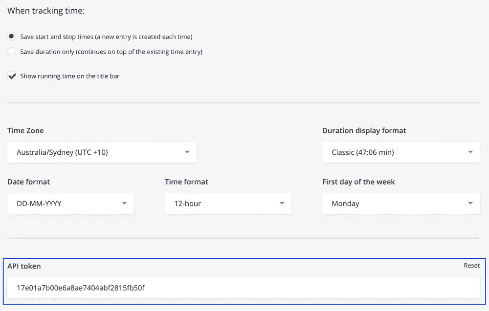
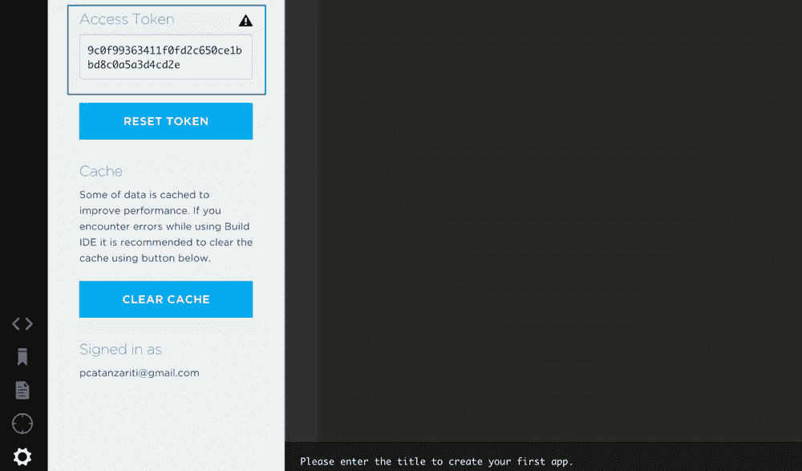
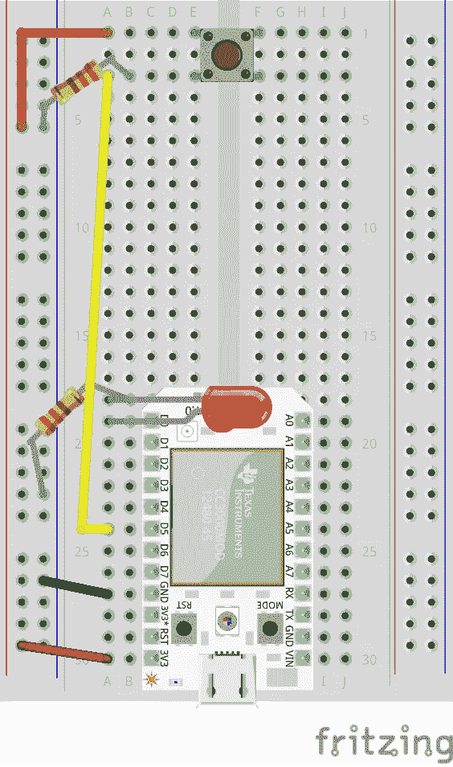
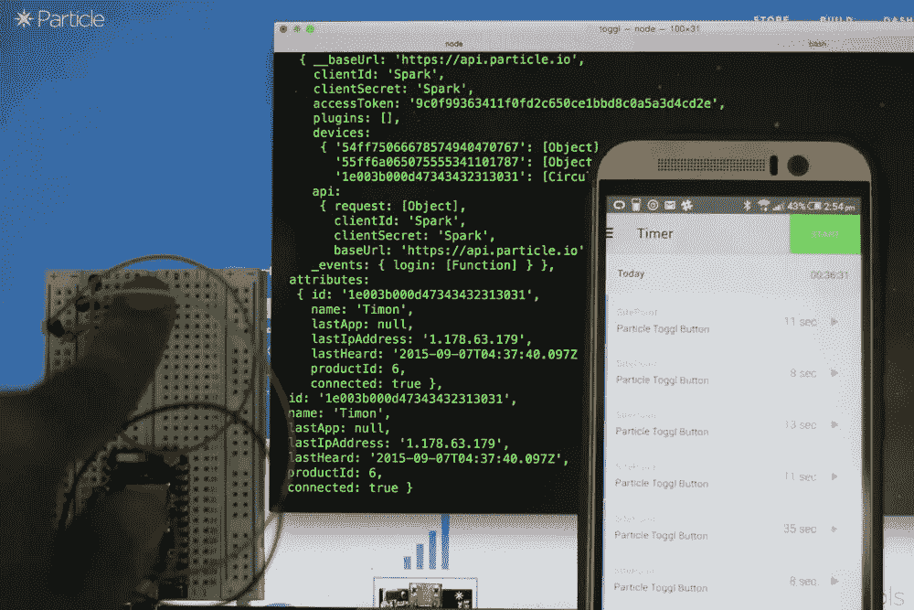
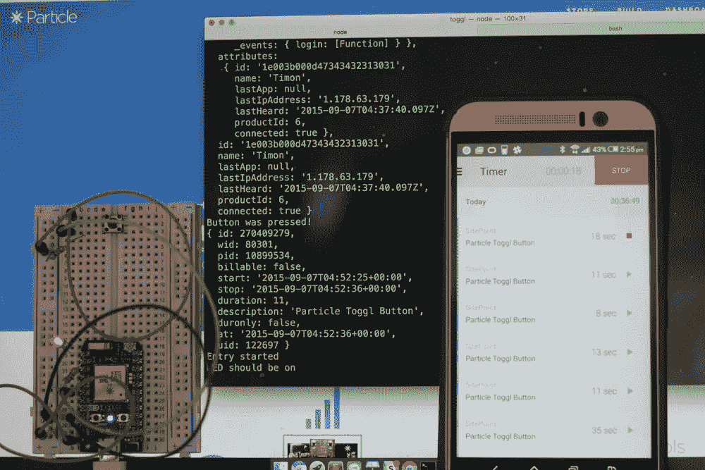

# 如何用粒子和节点制作一个有用的 Toggl 时间跟踪器

> 原文：<https://www.sitepoint.com/how-to-make-a-useful-toggl-time-tracker-with-particle-and-node/>

我最近一整天都在更密切地跟踪我在项目上的时间。这有助于了解哪些项目比其他项目占用更多时间，并帮助我衡量哪一天我最有效率(以及什么让我分心！).我为此选择的服务是 [Toggl](https://www.toggl.com) 。它简单、干净，可以跨设备同步。最重要的是，它有一个 API，你可以把自己的应用程序和设备连接起来。我决定设置一个连接到我的粒子光子的按钮，它将为我启动和停止我的 Toggl 计时器。我使用了一个简单的节点服务器来管理我的粒子设备和 Toggl 之间的通信。

点击一个物理按钮感觉比点击一个软件按钮更有力量，这样我就不需要拿出我的智能手机或者在我的 Mac 上点击来找到计时器了！

## 你需要什么

*   粒子核心或光子——我将使用粒子光子，但两者都应该与演示兼容
*   某种物理按钮
*   一块试验板、电阻和跳线——如果你是摆弄微控制器的新手， [SparkFun 为光子](https://www.sparkfun.com/products/13320)提供了一个很棒的新发明家工具包
*   一个 Toggl 账户——如果你还没有，去 Toggl 网站注册吧！
*   关于如何把代码放到你的粒子设备上的知识——如果你是新手，几周前我在 SitePoint 上发表了一篇关于[连接光子](https://www.sitepoint.com/getting-started-with-the-particle-photon/)的文章。[粒子核心是相似的。](https://docs.particle.io/guide/getting-started/start/core/)
*   对运行节点服务器和使用 npm 的基本理解——从 npm 开始，SitePoint 的 Peter Dierx 写了一个关于[的非常全面的指南。](https://www.sitepoint.com/beginners-guide-node-package-manager/)

注:粒子还卖[一个大的物理按钮](https://docs.particle.io/guide/getting-started/button/core/)。你很可能会把这个概念应用到大按钮上来获得很多乐趣，我只是还没有拥有一个这样的按钮。

## 查找您的 API 密钥

要获取您的 Toggl API 密钥，请访问 [Toggl“我的个人资料”页面](https://www.toggl.com/app/profile)。如果您向下滚动到该页面的底部，您会发现一个独特的 API 令牌，您可以像这样使用:



将该令牌复制到安全的地方。你会需要它的！

你也可以使用右边的“重置”链接来重置它(这在我向你们展示我的 API 密匙的时候很有用)。

如果距离上次粒子构建会话已经有一段时间了，并且您需要复习查找您的粒子 API 密钥，请转到[粒子构建](https://build.particle.io)在线编辑器，并单击最底部的齿轮图标以进入设置页面。在那里，您将看到一个屏幕，显示您的访问令牌。



把那个也抄下来。

## 我们的粒子草图

我们的草图包括试验板、粒子设备(在这张图片中显示为核心，但这个和光子都可以工作)、LED 和按钮的布局，如下所示:



## 下载代码

这个例子的所有代码都可以在 GitHub 上找到。

## 我们的粒子代码

我们的粒子代码将跟踪按钮是否被按下，以及我们是否希望 LED 灯亮起。所有其余的功能将由我们的节点服务器负责。

粒子代码看起来像这样:

```
int ledPin = D0;
int buttonPin = D5;
bool ready = true;
int last;

void setup() {
    pinMode(ledPin, OUTPUT);
    pinMode(buttonPin, INPUT);
    last = millis();
    digitalWrite(ledPin, LOW);

    Spark.function("ledTrigger", ledTrigger);
}

void loop() {
    if (millis() - last > 200) {
        if (digitalRead(buttonPin)) {
          if (ready) {
            ready = false;
            Spark.publish("buttonPressed");
            last = millis();
          }
        } else {
          ready = true; // button ready to be pressed again
        }
    }
}

int ledTrigger(String value) {
    if (value == "ON") {
      digitalWrite(ledPin, HIGH);
    } else {
        digitalWrite(ledPin, LOW);
    }

  return 0;
}
```

我会解释每一位代码的含义。首先，我们定义两个组件以及它们所连接的引脚。我们的按钮连接到 D5，我们的 LED 连接到引脚 D0。

```
int ledPin = D0;
int buttonPin = D5;
```

接下来的两个变量是用来记录循环中的时间的。跟踪我们的按钮是否准备好再次被按下。我们希望确保在第一次单击它和可以再次单击它之间有一段时间间隔。`last`是帮助跟踪这段时间的变量，它记录循环运行的最后时间。当你很快看到它的运行时，这可能更有意义。

```
bool ready = true;
int last;
```

在我们的`setup()`函数中，我们首先将 LED 的引脚模式设置为输出，并将它设置为按钮的输入。

```
void setup() {
    pinMode(ledPin, OUTPUT);
    pinMode(buttonPin, INPUT);

    // more code explained next!
}
```

之后，我们使用我之前解释过的`last`变量。我们最初将其设置为`millis()`。`millis()`函数返回这个程序开始在我们的粒子设备上运行以来的毫秒数。这样，我们就知道了我们的`setup()`函数开始运行的时间。

```
last = millis();
```

我们最初将 LED 设置为`LOW`，这将关闭它。

```
digitalWrite(ledPin, LOW);
```

最后，在我们的`setup()`函数中，我们定义了一个节点代码能够访问的公共函数。这个函数是我们的`ledTrigger()`函数，因为我们希望我们的节点代码能够打开和关闭 LED。

```
Spark.function("ledTrigger", ledTrigger);
```

在我们的`loop()`函数中，我们每 200 毫秒运行一次代码。我们通过读取`millis()`的当前值并从我们的`last`值中取出它来计算。还有其他替代方法来检查按钮按下，但这是一个由粒子团队展示的，也是唯一一个对我有用的方法！

```
void loop() {
    if (millis() - last > 200) {
      // Our checks for button presses
    }
}
```

每隔 200 毫秒，我们检查是否有来自按钮的信号。如果我们看到来自按钮的信号，并且我们的`ready`变量为真，那么我们发布一个`"buttonPressed"`事件让我们的节点服务器听到。我们还将`ready`设置为`false`，这样按钮就不会被多次按下，并将`last`设置为当前的`millis()`(这样我们现在可以在再次运行之前再等待 200 毫秒)。

```
if (digitalRead(buttonPin)) {
  if (ready) {
    ready = false;
    Spark.publish("buttonPressed");
    last = millis();
  }
}
```

如果在 200 毫秒后我们的按钮没有信号，我们将`ready`设置为`true`，因为我们的按钮已经被释放，因此当它被再次按下时，我们可以开始观察下一个 200 毫秒的间隔。

```
else {
  ready = true; // button ready to be pressed again
}
```

最后一点代码是我们之前提到的公共`ledTrigger()`函数。这是我们的节点代码将用来打开和关闭我们的 LED。每个函数调用还会被传递一个字符串`"ON"`或`"OFF"`。如果我们看到`"ON"`被传递到函数中，我们将 LED 设置为`HIGH`。否则，我们将其设置为`LOW`关闭。

```
int ledTrigger(String value) {
    if (value == "ON") {
      digitalWrite(ledPin, HIGH);
    } else {
        digitalWrite(ledPin, LOW);
    }

  return 0;
}
```

## 我们的节点服务器

在我们的节点服务器中，我们负责 Toggl 帐户和粒子设备之间的所有集成。我们的节点服务器看起来像这样:

```
var spark = require("spark"),
  TogglClient = require("toggl-api"),
  toggl = new TogglClient({apiToken: "YOURAPITOKEN"}),
  _ = require("underscore"),
  currentParticle;

initParticle();

function initParticle() {
  spark.on("login", function(err, body) {
    console.log("Particle Core login successful: ", body);
    var deviceList = spark.listDevices();

    deviceList.then(function(devices) {
      currentParticle = _.find(devices, function(device) {
        return device.name == "Timon";
      });

      console.log("Timon was found: ", currentParticle);

      currentParticle.onEvent("buttonPressed", function() {
        console.log("Button was pressed!");

        toggl.getCurrentTimeEntry(function(err, currentEntry) {
          if (currentEntry) {
            console.log(currentEntry.description + " is running");

            toggl.stopTimeEntry(currentEntry.id, function(err, stoppedEntry) {
              console.log(stoppedEntry.description + " was stopped");

              currentParticle.callFunction("ledTrigger", "OFF", function(result) {
                console.log("LED should be off");
              });
            });
          } else {
            var currentDate = new Date(),
                yesterday = new Date();

            yesterday.setDate(currentDate.getDate() - 1);

            toggl.getTimeEntries(yesterday.toISOString(), currentDate.toISOString(), function(err, data) {
              if (!err) {
                var lastEntry = data[data.length - 1];
                console.log(lastEntry);

                toggl.startTimeEntry({
                  description: lastEntry.description,
                  pid: lastEntry.pid,
                  wid: lastEntry.wid
                }, function(err, timeEntry) {
                  console.log("Entry started");

                  currentParticle.callFunction("ledTrigger", "ON", function(result) {
                    console.log("LED should be on");
                  });
                });
              }
            });
          }
        });
      });
    });
  });

  spark.login({
    accessToken: "YOURACCESSTOKEN"
  }, function(err, body) {
    if (!err) console.log("API login complete!");
  });
}
```

首先，我们需要`spark`、`toggl-api`和`underscore` npm 库。`spark`是我们用来访问粒子核心的库(它过去被称为“火花核心”)，`toggl-api`是一个[漂亮而简单的库](https://github.com/7eggs/node-toggl-api)，它让我们可以访问我们的 Toggl API，我们只需要传入我们的 API 令牌，如下所示。`underscore`将用于简化查看从 Toggl API 返回的数据。`currentParticle`是我们存储我们正在使用的粒子核心的细节的地方。

```
var spark = require("spark"),
  TogglClient = require("toggl-api"),
  toggl = new TogglClient({apiToken: "YOURAPITOKEN"}),
  _ = require("underscore"),
  currentParticle;
```

一切都发生在一个叫做`initParticle()`的函数中。我们最初使用我们的访问令牌登录粒子服务，然后在`spark.on("login")`事件中使用我们的访问权:

```
function initParticle() {
  spark.on("login", function(err, body) {
    console.log("Particle device login successful: ", body);

    // We'll be accessing our Particle here
  });

  spark.login({
    accessToken: "YOURACCESSTOKEN"
  }, function(err, body) {
    if (!err) console.log("API login complete!");
  });
}
```

在我们的登录状态下，我们使用`spark.listDevices()`来获取连接到该帐户的所有设备的列表。一旦返回，我们使用`underscore`库来搜索结果，并找到按钮所连接的特定粒子设备。我把我的粒子设备命名为“丁满”，所以我在下面寻找这个名字。一旦我们找到这个装置，我们就把它连接到`currentParticle`上。

```
var deviceList = spark.listDevices();

deviceList.then(function(devices) {
  currentParticle = _.find(devices, function(device) {
    return device.name == "Timon";
  });

  console.log("Timon was found: ", currentParticle);
```

一旦我们有了粒子设备，我们就观察`"buttonPressed"`事件，我们设置粒子设备在发现我们的按钮被按下时发射。如果我们看到这个事件，我们会回应:

```
currentParticle.onEvent("buttonPressed", function() {
  console.log("Button was pressed!");

  // We'll talk to Toggl here next!
});
```

我们已经到达了代码中需要与 Toggl 对话的地方，让他们知道我们想对我们的时间跟踪做些什么。我们首先想知道是否有一个项目已经被跟踪。我们可以用`toggl.getCurrentTimeEntry()`做到这一点。如果有一个当前时间条目，它将在`currentEntry`变量中返回。我们检查该变量，如果已经有一个条目在运行，我们希望按下按钮来停止计时器。我们通过`toggl.stopTimeEntry()`功能来实现。当这个功能成功时，我们通过下面的`currentParticle.callFunction("ledTrigger")`调用告诉我们的粒子设备关闭我们的 LED。

```
toggl.getCurrentTimeEntry(function(err, currentEntry) {
  if (currentEntry) {
    console.log(currentEntry.description + " is running");

    toggl.stopTimeEntry(currentEntry.id, function(err, stoppedEntry) {
      console.log(stoppedEntry.description + " was stopped");

      currentParticle.callFunction("ledTrigger", "OFF", function(result) {
        console.log("LED should be off");
      });
    });
  }
  // We will have an else statement next!
}
```

如果当前没有运行的事件，我们希望找到运行的最后一个事件，并通过按下按钮来恢复它(因为我们不能真正在按下按钮时定义事件，我们将假设我们正在重新启动我们在桌面或移动应用程序中定义的最后一个事件)。

为了找到过去的事件，我们使用了`toggl.getTimeEntries()`函数。这个函数有两个变量，开始日期和结束日期。我们只想要最后一个事件，所以我们将它设置为查看过去的一天。我们为此设置了两个变量，`currentDate`是 JavaScript 中典型的`new Date()`，而`yesterday`是我们的`currentDate`减一。这些需要是 ISO 8601 的日期时间格式，以便与 Toggl 一起工作，所以我们使用`toISOString()`来转换它们。

```
else {
  var currentDate = new Date(),
      yesterday = new Date();

  yesterday.setDate(currentDate.getDate() - 1);

  toggl.getTimeEntries(yesterday.toISOString(), currentDate.toISOString(), function(err, data) {
    if (!err) {
      // We have a time entry to begin!
    }
  });
}
```

如果我们没有返回错误，我们将拥有一个名为`data`的数组，其中包含了前一天的 Toggl 时间条目。为了获取我们记录的最后一个元素，我们通过`data[data.length - 1]`获取数组中的最后一个元素，并将其分配给`lastEntry`。

```
var lastEntry = data[data.length - 1];
console.log(lastEntry);
```

现在，我们知道了最后一个条目，可以开始相同项目和任务的新条目。为了开始新的时间输入，我们运行`toggl.startTimeEntry()`函数。我们传入我们的`lastEntry`的`description`(您在 Toggl 中的条目名称)、`pid`(项目 ID)和`wid`(工作区 ID)，以便它启动相同的任务并将其分配给相同的项目。当它成功启动我们的时间跟踪时，我们再次调用我们的`"ledTrigger"`函数，这一次打开我们的 LED 显示我们正在通过粒子设备跟踪一个项目。

```
toggl.startTimeEntry({
  description: lastEntry.description,
  pid: lastEntry.pid,
  wid: lastEntry.wid
}, function(err, timeEntry) {
  console.log("Entry started");

  currentParticle.callFunction("ledTrigger", "ON", function(result) {
    console.log("LED should be on");
  });
});
```

## 在活动

将这段代码放到你的粒子设备上，运行通常的`npm install`和`node index.js`来让你的节点服务器运行起来。

现在，您应该能够点击按钮开始和停止您的 Toggl 跟踪！我注意到的一件事是，我的 Mac Toggl 应用程序不会立即获取时间条目，如果它们最初不是从应用程序运行的话。然而，我的 Android Toggl 应用程序同步速度快得多，对我的按钮按压几乎有实时响应，显示新的时间条目开始和停止。

这是我的一个视频:

[youtube Qat3GeA1KcI]

对于那些不想看视频的人，这里有一张按下按钮前的照片，我的 Toggl 跟踪已经准备好了，正在等待:



一旦记录了点击，Toggl 就开始跟踪我之前工作的最后一个任务和项目。LED 也会亮起，表示粒子设备已成功开始跟踪某些东西:



当您准备好停止项目跟踪时，再次单击该按钮！

## 结论

有了这些知识，你就可以构建自己的物联网连接到 gl 应用。将它与任何东西连接起来，以跟踪你的生产力，发挥你的想象力，看看你有什么好主意！这个演示绝对可以做得更多。当在其他设备上开始跟踪时，一个肯定需要做更多工作的领域是将 LED 与 Toggl 同步。

如果你真的基于这段代码做了一个非常有趣和独特的 Toggl 时间跟踪器应用程序，请在评论中分享它，或者在 Twitter 上与我联系( [@thatpatrickguy](http://www.twitter.com/thatpatrickguy) )。我很想去看看！

如果你正在寻找更多的链接和示例项目来指导你的粒子开发，我有一套精选的链接可能会有所帮助！去 Dev Diner 看看我的 [Dev Diner 粒子开发者指南](http://devdiner.com/guides/particle/)。

## 分享这篇文章