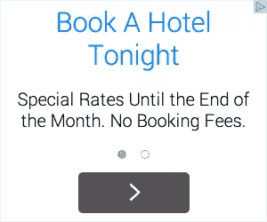
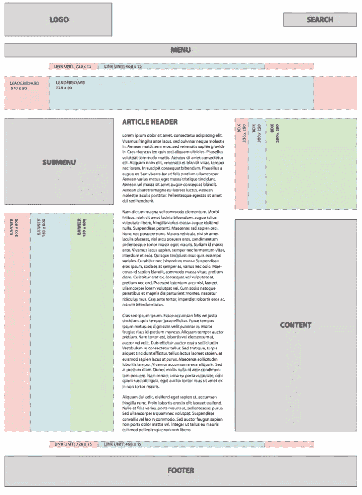
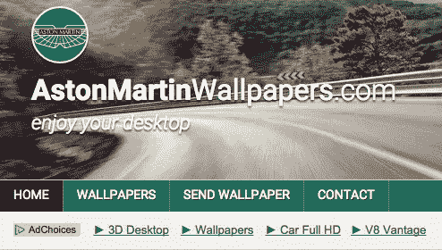
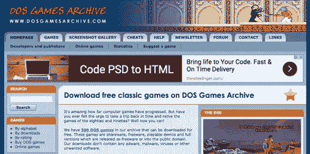
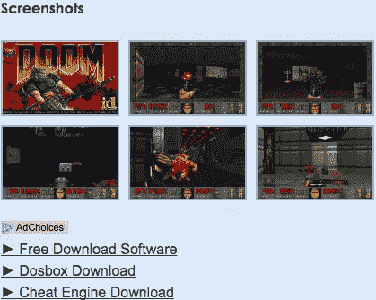
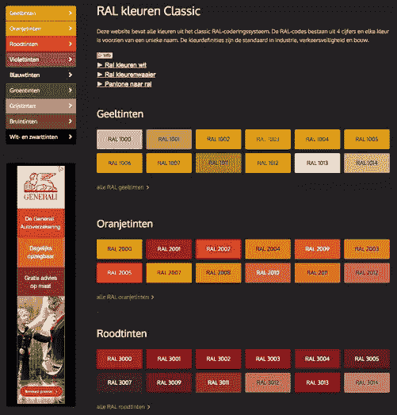
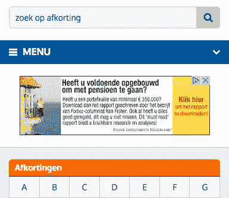

# 如何利用谷歌广告来赚钱

> 原文：<https://www.sitepoint.com/how-to-monetize-your-website-with-google-adsense/>

Google AdSense 是最流行的网站盈利方法之一，尽管你可能听说过，但它仍然是支持你的内容制作工作的一种很好的方式。为了获得最佳效果，尝试不同的广告策略是很重要的。在本文中，我将向您介绍 AdSense，并向您展示如何充分利用这一广告服务。

这些建议是基于我自己对多个网站的体验。

## 关于 Google AdSense

AdSense 的概念是基于展示尽可能适合你的网站内容的广告的想法。例如，如果你的网站是关于鞋子的，你很可能会看到与鞋子相关的广告。AdSense 服务检查您的页面内容，找出最符合您的读者兴趣的广告。你的网站和广告匹配得越好，效果就越好。

## 广告格式

AdSense 提供多种广告格式，网站发布者可以从中选择。有大量广泛使用的广告形式，如摩天大楼、排行榜和矩形。这些横幅广告既有文字广告，也有图形广告。您可以调整文本广告的字体和颜色，使它们与您的网站设计相匹配，或者使它们更加突出。图形广告可以是静态图像、Flash 动画横幅或现代 HTML5 动画横幅。

当然，您也可以选择移动横幅。这种横幅类型设计用于在移动设备(如智能手机)的较小屏幕上显示。如果你有一个响应式网站，并且也想让你的横幅广告具有响应性，你可以选择响应式广告。AdSense 会查看您网站布局中的可用空间，并自动显示最佳横幅尺寸。除此之外，AdSense 还提供了使用链接单元的选项。这种横幅类型基于文本链接，其字体和颜色也可以调整。

Google AdSense 文本横幅示例(300×250)

## 申请 Google AdSense

为了在你的网站上显示 Google AdSense 横幅，你需要先申请 AdSense 计划，可以通过 [AdSense 网站](https://www.google.com/adsense)来完成。审查过程需要几天时间。谷歌将评估你的网站，看看它是否符合[项目政策](https://support.google.com/adsense/answer/48182?hl=en)，以及他们是否允许你成为新的 AdSense 发布者。请咨询 Google AdSense 网站，了解更多规则和注册程序。

## 我们开始吧

一旦您注册了该计划，您就可以开始在您的网站上发布 AdSense 广告。使用 AdSense 管理面板，您可以创建一个新的广告。首先，输入名称，例如您的网站名称和广告大小(如果您发布多个网站，这是一个好主意，这样更容易识别您的广告)。然后选择广告尺寸、广告类型(文字和/或图形广告)并调整字体和配色方案(如果适用)。出于分析目的，您可以创建频道并向其分配广告。

您还可以决定在没有横幅广告的情况下，您希望 AdSense 做什么，例如显示空白、纯色或自定义备份广告。几乎任何网站谷歌都有很多广告，所以在大多数情况下你不会看到这些横幅占位符。在这一步之后，你需要在你的网站上运行广告的 HTML 代码就会显示出来。复制代码并将其粘贴到网站模板中的适当位置。

## 广告统计

Google AdSense 提供了网站广告使用的大量统计数据。例如，您可以看到广告浏览量和广告点击数。根据广告的类型，AdSense 会向您支付广告展示费(CPI)或广告点击费(CPC)。在这篇文章的下一部分，我将为你提供如何优化展示和点击数量的技巧。

## 如何充分利用 AdSense

发布 AdSense 广告时，最重要的一点是使用可接受的广告数量。谷歌允许每个页面上最多有三个横幅和三个链接单元。在我看来，你应该发布的条幅数量取决于你页面上的内容量。例如，如果你的网页包含大量内容(相当于印刷报纸的一页),显示最大数量的横幅是没有问题的，特别是当它们很好地集成到页面内容中时。毕竟，你不希望因为激进的广告位置而失去访问者——例如，如果用户不得不滚动几个横幅才能到达网页的“真正”内容。

虽然最大化你的广告效果很诱人，但是考虑用户体验也很重要。用户访问你的网站是因为他们对你的内容感兴趣，但同时你也想从这些访问中获得最大的收益。成功的关键是把广告放在用户访问时间最长的地方:在你的主要内容旁边或里面，靠近导航部分。例如，重要的位置是主菜单和页面内容末尾的位置。通过这样做，你可以给你的访问者他们想要的，同时也得到你想要的。

横幅广告的放置不应该是事后的想法。我建议在设计你的网站布局时考虑横幅的位置。一般来说，这些是表现最好的广告形式，按比例排序:

<colgroup><col style="text-align:left;"> <col style="text-align:left;"></colgroup> 
| 横幅类型 | 横幅尺寸 |
| --- | --- |
| 排行榜 | 728×90 和 970×90 |
| 矩形横幅 | 250×250、300×250 和 336×280 |
| 摩天大楼 | 120×600、160×600 和 300×600 |
| 水平链接单元 | 728×15 和 468×15 |
| 垂直链接单元 | 160×90、180×90 和 200×90 |

## 典型内容页面上的广告示例

典型的内容站点由一个带有徽标的标题、一个主导航菜单、一篇内容文章和一个页脚组成。在下图中，你可以看到我在这种情况下建议的几个广告位置。您选择的横幅尺寸取决于网站布局中的可用空间。

广告位置示例(不要在一个页面上使用所有这些内容！)

### 网站标题

不要将横幅作为网页的第一个元素。最好先显示你的网站标题，比如一个标志，一个搜索框和主菜单。如果您将横幅作为第一个元素显示，用户将忽略该横幅并自动向下滚动。

因为主菜单是与你的站点交互的一个非常重要的方式，你的访问者会经常使用它。由于你网站的这一部分受到了如此多的关注，所以在它旁边显示一个 AdSense 横幅是一个好主意，例如在主菜单下面，以保持你网站标题的整洁。

在一些网站上，在主菜单下面显示一个水平的 AdSense 链接是有利可图的。链接单元由适合主菜单外观的文本链接组成，主菜单通常也是一个水平链接列表。通过调整链接单元的颜色，使其与您的网站布局相匹配，您将获得最佳效果。

主菜单下的水平 AdSense 链接单元示例

水平主菜单下方的空间也是展示排行榜横幅的绝佳位置。该横幅将显示在网页主要内容的上方，因此在大多数情况下无需滚动即可看到(在折叠上方可见)。当用户浏览网页以查看主要内容从哪里开始时，他会注意到横幅。当他开始看主要内容时，排行榜横幅就会在视力范围内。

网站标题和内容区域之间的排行榜横幅示例

### 内容区域

矩形横幅，如 250×250、300×250 和 336×280 也是很好的表现。由于它们的大小，它们可以集成到你的网页内容中，例如对齐到你文章的右上角。

在我自己的网站上，我了解到如果放置得好，链接单元可以盈利。由于这种横幅看起来像是网页的一部分，它可以提供很好的结果，例如当在文章末尾显示链接单元时。当用户读完一篇他们喜欢的文章时，他们很可能会点击链接单元中的一个链接来了解关于同一主题的更多信息。注意让它无缝，但不要试图欺骗用户，让他们认为链接是实际网站的一部分——如果他们查看你的页面，谷歌不仅会禁止你，而且不会给你的读者带来良好的体验，他们也不会再回来。如果你的文章有一个白色的背景，给链接单元一个白色的边框和白色的背景会很好，这样可以很好地融入你的网站布局。除此之外，你可以从一些字体中选择，这样 AdSense 的横幅就和你的网站有相同的外观和感觉。这种布局策略也适用于其他横幅尺寸。

整合到网站布局中的垂直 AdSense 链接单元示例

### 内容区域旁边的列

大多数网站在左侧或右侧有一个较小的栏目，展示最新或最受欢迎的文章、附加内容或其他信息的概述。这种位于主要内容旁边的列是显示广告的绝佳位置，例如垂直方向的横幅，如 120×600、160×600 和 300×600 的摩天大楼。

## 在广告空间显示较小的横幅

我建议允许 Google AdSense 在广告空间显示较小的横幅，而这些横幅实际上是为较大的横幅准备的。例如，336 x 280 的广告空间也可以显示 300 x 250 的横幅。这同样适用于 970 x 90 的广告空间:它可以毫无问题地显示 728 x 90 的横幅。在这种情况下，较小的横幅将显示在广告空间的中心，这样一切看起来仍然很好。通过启用此选项，您可以从更大的横幅广告池中接收横幅广告，这意味着更高的收入。

## 移动版中的移动横幅

随着越来越多的人使用智能手机访问网站，在网站的移动版本中显示 AdSense mobile 横幅是一个好主意，例如在移动导航菜单下。

移动版网站中的移动 AdSense 横幅示例

## 页面级广告

2016 年 4 月，谷歌推出了 AdSense 的下一代广告，名为‘页面级广告’。这些广告是专门为移动网站设计的，可以在正确的时间以正确的格式自动显示广告。页面级广告只有在最有价值的时候才会展示；谷歌自动为你的访问者确定这一点。

在屏幕底部锚定/覆盖广告

页面级广告分为锚定/覆盖广告(屏幕底部的固定水平横幅)和插图广告(全屏横幅)。你只需要在你希望这些广告出现的页面中包含一段代码。页面级广告不计入页面广告限额。如果你的网站有移动版本，我建议至少使用锚定/覆盖广告，并尝试小广告的表现。

## 显示文本和图形广告

创建新的 AdSense 横幅时，请确保选择显示文本和图形广告。通过这样做，您增加了可用的广告库存。大多数文字广告是基于 CPC 的(按点击付费)，大多数图形广告是 CPM(按印象付费)。AdSense 有一个先进的系统，可以确定哪些广告会给你带来最高的收入，通过启用文本和图像广告，你会收到最好的效果。

## 赌博相关广告

默认情况下，赌博相关的广告被谷歌广告关闭。如果您的网站是针对成人的，您可以更改此设置，这样赌博广告可能会出现在您的网站中。这对于某些类型的网站来说是有利可图的，你必须自己做出决定。登录您的 AdSense 帐户，进入“允许和阻止广告”，在左侧列表中选择您的网站，然后单击“敏感类别”选项卡。在该页面的底部，您可以允许赌博相关的广告。

## 第一段中有趣的关键词

在网页内容的第一段包含有趣的关键词是很重要的。当网页加载并请求 AdSense 横幅时，Google 会扫描您的网页并确定哪些广告最适合您的内容。谷歌认为网页的第一段是最重要的，这就是为什么广告会尽可能基于这些段落中的关键词。当您被设置为接收尽可能适合您的内容和目标受众的横幅时，您可以增加收入，同时为读者提供更多价值。

## 首先加载点击率最高的 AdSense 横幅

假设你的网页上有三个广告横幅。使用 AdSense，你可以看到哪些横幅广告的点击率最高。先载入点击率最高的横幅是个好主意。表现最好的横幅应该出现在页面的 HTML 结构中，即使它显示在页面的中间或底部。这背后的原因？当页面被加载并且 AdSense 横幅被请求时，AdSense 用最高付费广告填充第一个横幅。

## 实验和实验

因为所有的网站都是不同的，所以找出最适合你的广告策略是很重要的。我建议尝试不同的横幅格式、广告位置、字体和颜色。即使是颜色调整这样的小变化也会对横幅的表现产生很大的影响。AdSense 帮助你做这些实验。使用您的 AdSense 帐户登录，进入*我的广告>内容>实验*了解更多信息。

## 关于 AdSense 的更多信息

如果你想了解更多关于 Google AdSense 以及如何优化网站收入的信息，我建议你去看看 Google AdSense 官方博客，名为 [Inside AdSense](http://adsense.blogspot.com/) 。在官方的 [Google AdSense YouTube 频道](https://www.youtube.com/user/InsideAdSense)上，你也可以找到有趣的优化技巧视频。

## 结论

Google AdSense 仍然是一个很好的网站盈利方式。AdSense 提供了多种横幅格式供站长选择。尽可能无缝地将 AdSense 横幅整合到您的网站布局中非常重要；设计商业网站时，广告位置不应该是事后才想到的。成功的关键是把广告放在用户访问时间最长的地方:在你的主要内容旁边或里面，靠近导航区域。

一定要多做实验，找出最适合你的广告策略。

## 分享这篇文章