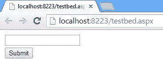
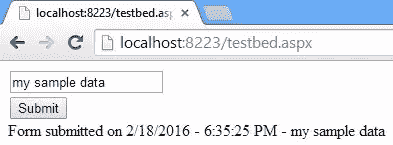
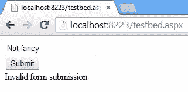
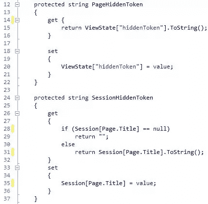
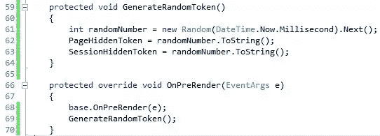
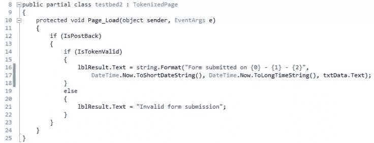
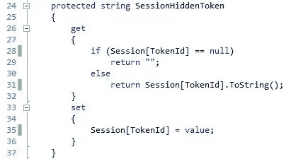

# 如何防止你的网站受到重放攻击

> 原文：<https://www.sitepoint.com/how-to-prevent-replay-attacks-on-your-website/>

*这篇文章最初发表在本的[科技讲座](https://bdtechtalks.com/2016/02/19/a-token-of-gratitude-prevent-replay-attacks-on-your-website/)网站上。*

[重放攻击](https://en.wikipedia.org/wiki/Replay_attack)，攻击者拦截并重新发送不属于他们的网络数据包，这种攻击极其危险，在某些情况下会造成严重的破坏。使这些类型的攻击更加令人讨厌的是，它们甚至可以在加密的通信信道上进行，而无需获得解密密钥。攻击者只需窃听您的线路，并大致了解一组特定的数据包正在执行什么任务，通过重新发送这些数据包或请求，他们就能够中断您的通信或造成更大的破坏。

在本文中，我将向您展示一个基本的、易于实现的方法，它将防止您的网站遭受重放攻击。它还有一个好处，就是防止困惑的用户在错误的时间不断刷新浏览器，从而重复上一次的发布请求。

这远远不是一个完整的解决方案。它有缺陷和悬而未决的问题，但它让您大致了解了令牌和简单协议如何增强网站的安全性。示例代码和实现是用 ASP.NET 和 C#完成的，但是这个概念可以部署在任何其他平台或编程语言上。

## 一次性令牌概念

本文将提供的解决方案背后的思想是将每个 HTTP 响应绑定到一个令牌字符串，该字符串仅对下一个 post 请求有效。以下是相关步骤的简单分类:

1.  客户端通过键入 URL 或页面或者单击链接来发出 GET 请求。
2.  服务器生成随机令牌。随后，它将令牌的副本存储在会话中，并将令牌的副本嵌入到它发送给客户端的响应的

    <form>标记中。</form>

3.  客户端处理内容，并向服务器发送一个 POST 请求，比如当用户点击一个按钮时，该请求包含随机生成的令牌。
4.  只有当附加的令牌等于用户会话中存储的令牌时，服务器才会接收请求并继续处理它。
5.  服务器使令牌无效，并返回到步骤 2，在该步骤中，它用新的随机令牌来制定响应。

通过这种方式，即使发送到服务器的关键请求被恶意用户截获，也不能被重复，因为在请求被发送到服务器之后，它包含的令牌不再有效。这同样适用于这样的场景:一个粗心的用户错误地按下了键盘上的 F5，并在向服务器发送信息后重新发送请求。

## 试验台

为了实现一次性令牌概念，我们将创建一个包含简单文本框和提交按钮的示例页面。我们还将引入一个标签控件来显示测试输出。

后面的代码将是一个简单的代码片段，显示提交时间和文本框中包含的数据。

这是初始 GET 请求后页面的输出

提交页面后，输出将如下所示:

问题是，如果你刷新你的页面，它会重新发布你的数据并重复上一个请求，服务器会顺利地处理它。现在想象一下，如果您刚刚完成了一笔重要的 100 万美元的交易，并且无意中按下了键盘上的 F5 键。或者更糟，一些恶意用户拦截你的请求，发现这是一个支付交易，并重复它，以吸走你的资金和刁难你。

## 解决方案

为了防止 POST 请求被重复，我们更新了标记以添加一个隐藏字段，该字段将存储令牌。

接下来，我们将创建一个生成随机令牌的函数，并将它嵌入隐藏字段和会话集合中。

然后，我们更改 Page_Load()函数，以便在提交的令牌等于会话中存储的令牌时只显示提交的数据。

最后，我们覆盖 OnPreRender()函数，在最终输出发送到客户机之前生成一个新的令牌。这就是它成为一次性令牌的原因，因为每次发送新请求时都会更新它。

现在，当您通过点击按钮提交表单时，它就像以前一样工作。但是，如果您试图通过刷新页面来模拟重放攻击，您将得到以下错误，因为与表单一起发送的令牌不再等于服务器上存储的令牌:

这样，我们可以区分有效的按钮点击提交和错误重复的请求。

## 精炼代码

虽然这段代码修复了页面的重放攻击问题，但它有几个问题需要解决:

*   它必须在所有页面上重复
*   如果您在同一个网站上打开了几个标签，它将不起作用，因为令牌是跨请求共享的
*   简直太丑了

作为一名狂热的面向对象编程(OOP)爱好者，我一直在寻找机会，通过利用这种最棒的编程范式来重构和精炼代码。

为了解决上述问题，我们要做的第一件事是定义一个封装令牌生成功能的类。我们将调用这个类 TokenizedPage，并从 System 中派生它。以便将来能够将其用于页面。

接下来，为了使代码更具可读性和可管理性，我们将页面令牌和会话令牌封装到两个不同的属性中，并添加到 TokenizedPage 类中。为了使代码在网页中易于移植，我们将使用 ViewState 集合而不是隐藏的输入字段来存储页面令牌。我们也使用页面。Title 属性作为在会话中存储令牌的密钥。这将改进我们的代码，并将部分解决第二个问题，这将限制我们的网站在浏览器中的单个选项卡的使用。通过应用这一更改，我们将能够在不同的选项卡中打开站点的不同页面，但我们将无法在不同的选项卡中打开同一页面的多个实例，因为它们仍将共享令牌。这个问题将在后面讨论。

接下来，我们添加一个名为 IsTokenValid 的只读布尔属性，它遵循其他页面属性(如 IsPostBack 和 IsValid)的示例。此属性的目的是确保页面标记等于会话标记。

最后，我们添加 GenerateRandomToken()函数和 OnPreRender()事件的覆盖，就像在测试床上所做的那样。

现在，为了使用单令牌模式，我们需要做的就是创建一个新页面，从 TokenizedPage 派生它，并在需要一次性令牌时使用 IsTokenValid。

好多了。

## 让它变得更好

这段代码的一个问题是，如果您的浏览器中有两个选项卡指向同一个页面，提交其中一个会使另一个的令牌无效，因为它们使用相同的会话令牌密钥。这可以通过添加一个令牌 ID 来解决，它将确保在一个选项卡中发生的每个请求-响应序列将使用自己的唯一令牌集，并且不会干扰同一页面上的其他请求。首要任务是返回 TokenizedPage 类并添加 TokenID 属性。该属性在初始 GET 请求中第一次被调用时会生成一个随机 ID，并将其存储在 ViewState 集合中以供将来重用。

接下来，我们将修改 SessionHiddenToken 属性，以使用 TokenId 属性，而不是使用页面。产权属性。

酷的是，因为我们已经使用了抽象和封装原则(OOP 的另一个好处)，我们不需要做任何其他的改变，新的机制将与我们从 TokenizedPage 派生的所有页面一起工作。

## 遗留问题

对于一次性令牌模式来说就是这样。还有两个问题没有解决:

*   更准确地说，将为每个会话生成无限数量的令牌 id(发送到每个会话的 GET 请求的数量)。这可以通过实现堆栈或缓存机制来解决，当超过数量限制或在特定时间内未使用时，该机制会弹出旧的 id。我将把实现留给您。
*   默认的随机数生成器并不是您所说的最安全可靠的随机来源，一个精明的黑客也许能够预测令牌的序列。但是，如果您使用 SSL 加密，他们无论如何都无法获得令牌。

您是否有任何增强功能要添加，或者希望分享它在另一个平台和编程语言中的实现？请在下面的评论区留言。

## 分享这篇文章