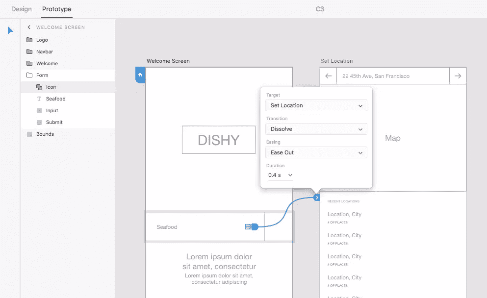
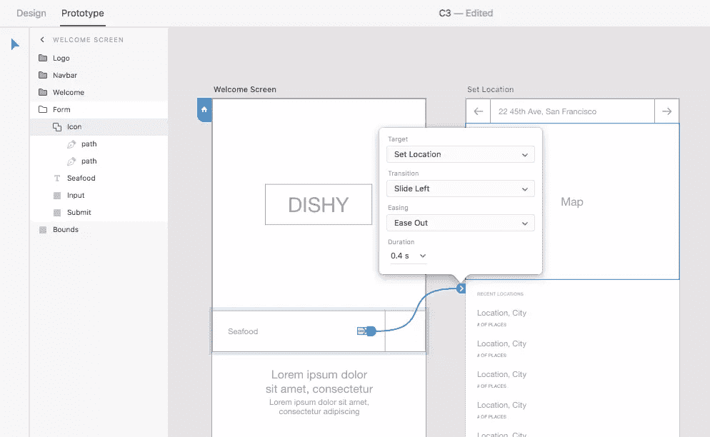
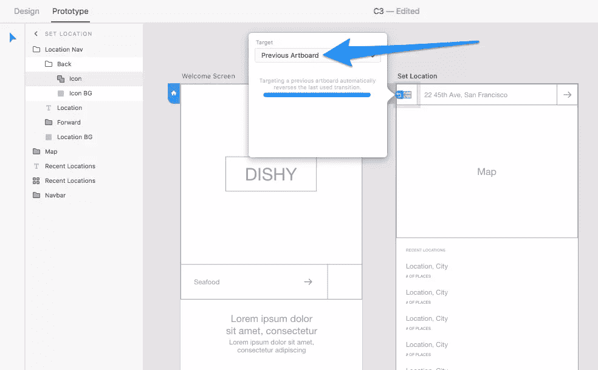
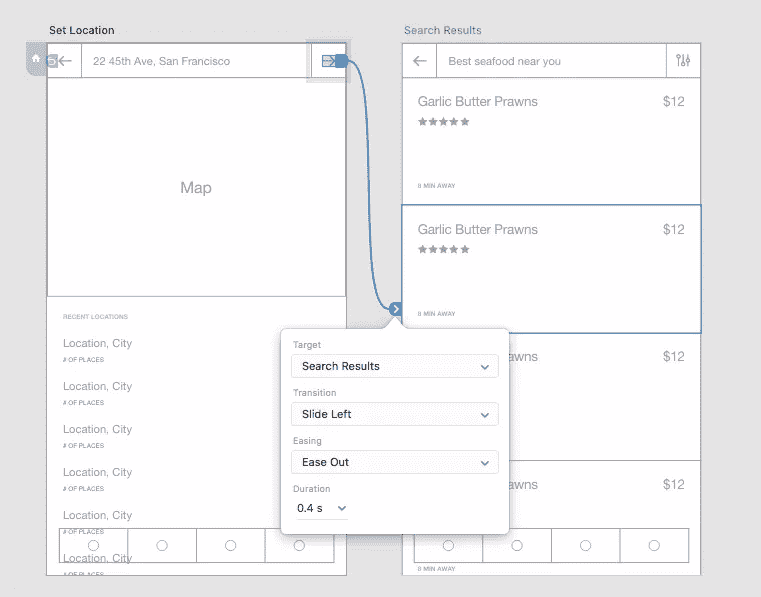
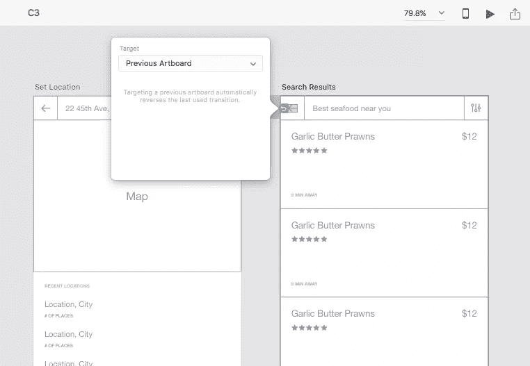
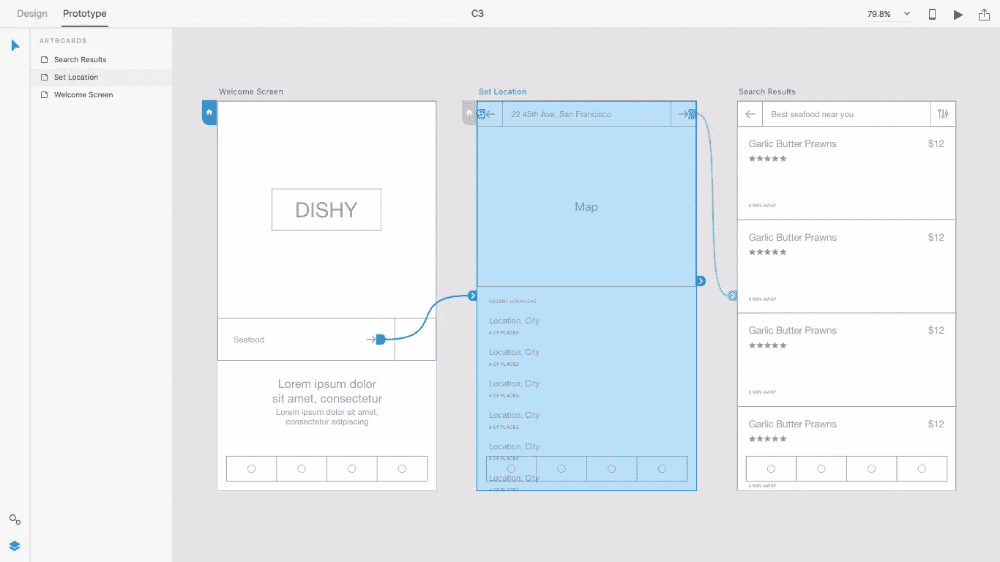

# 如何建立与 Adobe XD 交互的原型

> 原文：<https://www.sitepoint.com/how-to-prototype-interactions-with-adobe-xd/>

下面是我们的书《快速启动 Adobe XD 》的一小段摘录，作者是丹尼尔·施瓦兹，这是一本关于这个神奇的原型制作工具的非常实用的教程。SitePoint Premium 会员可以通过他们的会员身份访问，或者您可以在世界各地的商店购买一份。

## 原型交互

让我们从将欢迎屏幕链接到位置过滤屏幕开始，有效地演示了一个用户流，其中用户搜索一种类型的美食，然后被要求在位置过滤屏幕中指定他们想在哪里吃。单击右箭头图标(在欢迎屏幕的输入字段内)，旁边会出现一个蓝色的箭头标签。

将此蓝色选项卡拖放到位置过滤器屏幕中。将会创建一个用户流，并且会出现一个小的模式，您可以在其中指定该用户流的过渡设置，即屏幕将如何过渡到下一个用户流(动画效果的类型、动画的持续时间等)。

稍后(当我们学习如何预览/测试我们的原型时)，我们将能够点击这个图标并进入下一个屏幕，就像我们正在使用一个真正的应用程序一样——这就是我们(和我们的开发人员，可能还有*甚至是*我们的客户)如何在承诺之前使用原型工作空间来测试我们的概念。

接下来，我们将为此用户流指定转换设置。

### 设计过渡

动画有自己的一套 UX 挑战。缓慢的过渡会让用户觉得你的应用花了太多时间，而过快的过渡会让用户不知道到底发生了什么。然后是过渡本身的风格。你不需要做一个渐变-翻转-滑动的组合来让用户惊叹，一个细微的动作就足以说明用户交互的结果。让我们探索一些可以在 Adobe XD 中使用的过渡和过渡设置。

*   *目标*(屏幕转换成什么样子):
    *   无:基本上删除流
    *   上一个画板:返回上一个屏幕
    *   [画板名称]:链接到另一个屏幕
*   *过渡*(视觉效果):
    *   无:无过渡
    *   融合:简单的淡入淡出过渡
    *   向左滑动:从左侧滑过
    *   向右滑动:从右侧滑过
    *   向上滑动:从顶部滑过
    *   滑下:从底部滑过
    *   Push ←/→/↑/↓:与滑动过渡相同，只是屏幕滑入*会将当前屏幕推出*
*   *缓和*(过渡的每个间隔的速度):
    *   放松:过渡将全速开始/缓慢结束
    *   渐入:过渡将缓慢开始/全速结束
    *   渐入渐出:开始慢，中间全速，结束慢
    *   无:过渡不会加速/减速(线性)
*   *持续时间*:完成转换所需的总时间

关于季节的进一步阅读(特别是不同类型的季节及其对用户体验的影响)，请查看我在 SitePoint 上关于[微交互和季节的文章。](https://www.sitepoint.com/animations-using-easings-to-craft-smarter-interactions/)

因为我们将欢迎屏幕链接到设置位置屏幕，所以已经定义了*目标*设置。*向左滑动*是*过渡*设置的合适选项，因为它创建了运动(目标屏幕从右边滑入，暗示它是一系列屏幕中的下一个屏幕——这是 iOS 和 Android 某些区域的默认设置)。

*缓出*对于这种用户流来说是一种合适的缓出，因为它迫使动画在开始时更快，创建一个看似快速的过渡，不会过多地延迟用户，然后优雅地慢下来，这样用户就有一点额外的时间来理解发生了什么。在大多数情况下，0.4 秒的默认*持续时间*设置比最佳值更好。

让我们用这些设置开始吧。

从*设置位置*屏幕，创建一个返回到*欢迎屏幕*的用户流。选择*上一个画板*作为*目标*，这将自动反转上次使用的过渡。例如，如果您使用*向左滑动*进入屏幕，当您返回上一屏幕时，将使用*向右滑动*。

重复这些步骤，将*设置位置*链接到*搜索结果*。

反之亦然。

您可以随时单击画板，查看链接到哪些屏幕以及链接到哪些屏幕的概览。原型在 Adobe XD 中非常可视化！

虽然像漫威、Framer、Origami 和 InVision 这样的应用程序在原型开发方面肯定更加强大(固定元素、动态输入字段和可嵌入的 web 内容等功能已经在这些应用程序中存在了一段时间)，但 Adobe XD 每月都会发布功能更新。它的发展速度很快，每个版本都相当稳定。

除此之外，Adobe XD 提供了其他设计应用程序所没有的东西:统一的设计+原型制作体验。XD 不是 Photoshop 或 Sketch 等设计应用的伴侣，它*是*设计应用、*和*原型应用。能够在*设计*和*原型*工作空间之间无缝切换使得使用 Adobe XD 进行设计和原型制作如丝般流畅。

## 分享这篇文章