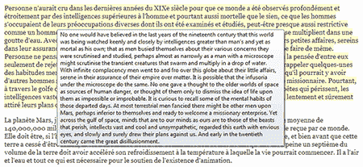

# 如何通过谷歌翻译接触全球受众

> 原文：<https://www.sitepoint.com/how-to-reach-a-global-audience-with-google-translate/>

像许多英国人一样，我希望每个人都能流利地说我们的语言。与其花几个小时去学习基本的短语，慢慢地说并疯狂地做手势要容易得多。这就是为什么我最终买了一个填充食蚁兽，而不是我真正想要的啤酒和花生。

在网上，只说英语的态度会让你失去客户。网络是全球性的；甚至用英国英语发布内容也会在美国引起混乱。然而，我们中很少有人有时间、金钱或资源来翻译我们的网页。

幸运的是，自动化工具可以帮助你接触到国际观众。它们不能代替精确的人工翻译，但是它们可以帮助访问者理解你想要表达的意思。最新的翻译工具是由谷歌开发的，所以你知道它可能会比大多数竞争对手提供更多。

谷歌翻译工具可从 http://translate.google.com/translate_tools 获得。要使用它:

1.  选择您的网站语言。
2.  选择翻译成所有支持的语言或特定的选择。
3.  将提供的代码复制到您的网页中。

与大多数翻译工具一样，在您的页面上粘贴代码的位置会提供一个受支持语言的下拉列表:

但是，如果您的浏览器设置为默认语言，而不是您正在查看的语言，翻译栏会自动出现在页面顶部。该栏以访问者的语言提供，并提供一键翻译流程:

最后，对于翻译中丢失的短语，谷歌工具提供了一个有用的悬停弹出框，其中包含原文:

[**用谷歌翻译**查看示例页面](https://blogs.sitepointstatic.com/examples/tech/translate/index.html)

谷歌翻译工具支持 50 多种语言。甚至威尔士语。我不能保证它的准确性，但鉴于我有限的法语和西班牙语知识，它看起来不错。

你觉得谷歌翻译工具怎么样？准确吗？你会用它吗？

链接:

*   [谷歌翻译工具](http://translate.google.com/translate_tools)
*   [示例页面](https://blogs.sitepointstatic.com/examples/tech/translate/index.html)

*图片来源:[zboog](http://www.flickr.com/photos/zboog/)*

## 分享这篇文章