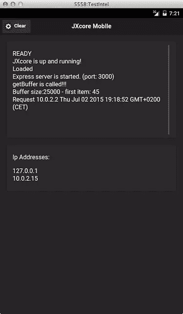
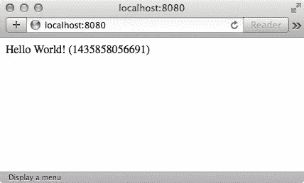
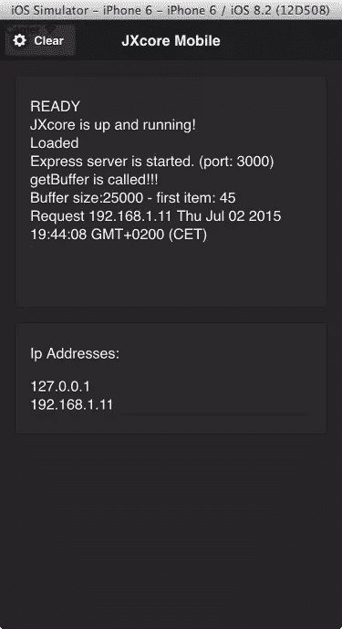

# 如何在移动设备上使用 Express 运行 Node.js

> 原文：<https://www.sitepoint.com/how-to-run-node-js-with-express-on-mobile-devices/>

我们最近为 [Apache Cordova](http://cordova.apache.org/) 发布了一个 [JXcore](http://jxcore.com) 插件，在本文中我将展示如何用 Cordova 运行一个节点 [express](https://www.npmjs.com/package/express) 应用程序。

在编写[时，github 上的 jxcore-cordova](https://github.com/jxcore/jxcore-cordova) 项目已经为运行 express 模块准备了两个样本。


该项目包含一个 [install_and_run](https://github.com/jxcore/jxcore-cordova/blob/master/install_and_run.sh) 脚本(此处记录为，它简化了创建 Cordova 应用程序和运行示例的过程。我将使用本文中的脚本。

## Android 上的快递

该脚本假设您的系统上安装了 Apache Cordova 和 Android SDK。如果没有，请参考有关如何操作的单独文档。

将 android 设备插入 USB 插座(启用 USB 调试)，除非您想在 Android 模拟器上运行应用程序。

下载[脚本](https://github.com/jxcore/jxcore-cordova/blob/master/install_and_run.sh)并保存到一个空文件夹中。使用示例文件夹名称作为参数运行它，例如“express sample”:

```
$ ./install_and_run.sh "express sample"
```

很快，您应该会看到以下屏幕:



应用程序显示设备正在使用的 IP 地址以及 express 服务器正在哪个端口上运行(在我们的例子中是 3000)。获取该 URL 并在您的浏览器中使用，即:

```
http://10.0.2.15:3000
```



我们可以看到，浏览器能够连接到运行在设备上的 Express 服务器，并接收请求的正确答案。

**给模拟器用户的一个提示**:你可能在上面的屏幕上注意到了，我没有使用之前提到的 IP 和端口，而是使用了 [http://localhost:8080](http://localhost:8080) 。这是因为我在一个 AVD (Android 虚拟设备)上运行这个例子，并且这个 IP 在模拟器的内部路由器之外是不可达的(参见[模拟器联网](http://developer.android.com/tools/devices/emulator.html#emulatornetworking)了解更多细节)。因此，我的解决方案是建立一个简单的端口重定向:

```
telnet localhost 5558
redir add tcp:8080:3000
```

它将所有来自我的本地主机 8080 的 http 请求重定向到模拟器的 T2 3000 端口。 *5558* 号是我的 AVD 运行的端口(可以在 AVD 的标题栏看到)。

## iOS 上的 Express

我们可以在 iOS 设备上运行相同的示例。 *install_and_run.sh* 脚本可以处理它，但是 iOS 支持目前被注释掉了，运行这些命令:

```
# or run on ios
$ cordova platforms add ios
$ cordova run ios
```



这个时候从浏览器访问快递服务器就更直接了，比如*[http://192 . 168 . 1 . 11:3000](http://192.168.1.11:3000)*。

## 查看代码

查看位于 *express 示例*的 *www/jxcore* 文件夹中的 *app.js* 文件，express 服务器的实现方式与常规 Node.js 应用程序相同:

```
var express = require('express');
var app = express();

app.get('/', function (req, res) {
  res.send('Hello World! (' + Date.now() + ")");
});

var server = app.listen(3000, function () {
  clog("Express server is started. (port: 3000)");
});
```

## Express server 在另一个线程上运行

让我们看看另一个例子:

```
$ ./install_and_run.sh "express performance sample"
```

这个例子执行起来很相似，但是有一个主要的区别。它在一个单独的线程中运行 express 服务器，不阻塞主线程。JXcore 很容易做到这一点，因为它甚至在移动平台上出现之前就提供了多任务处理。

这是代码:

```
jxcore.tasks.addTask(function() {
  var clog = require('./utilities').log;
  var express = require('express');
  var app = express();

  app.get('/', function (req, res) {
    res.send('Hello World! (' + Date.now() + ")");
  });

  var server = app.listen(3000, function () {
    clog("Express server is started. (port: 3000)");
  });
});
```

**注**:代码与上例类似。但是封装在一个`jxcore.tasks.addTask()`调用中，该调用处理与在一个单独的实例中运行该块相关的逻辑。

## 结论

Express web 框架是节点中最流行和最重要的模块之一。JS 生态系统。有了 JXcore，就有可能让它在移动设备上运行，它带来了一系列可以在移动世界中使用的特性(包括多线程/多任务和打包)。

## 分享这篇文章