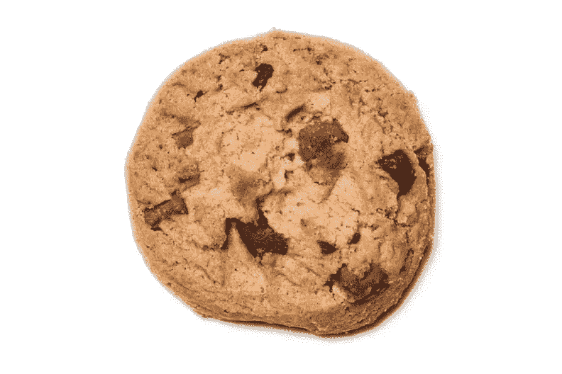

# 如何在 WordPress 中设置、获取和删除 Cookies

> 原文：<https://www.sitepoint.com/how-to-set-get-and-delete-cookies-in-wordpress/>

与大多数现代网络应用不同，WordPress 是无状态的。如果你打算在 WordPress 上构建一个 web 应用程序，你需要某种系统来维护会话。



Cookies 提供了一种简单、传统的机制来管理已经在前端登录的用户的某些设置。

在这篇文章中，我们将简要讨论 cookies，为什么 WordPress 需要它们，以及网站管理员如何从中受益。我们还将引导您完成设置、获取和删除 cookies 的过程。

我们开始吧！

## Cookies 概述

cookie 是网站发送给用户网络浏览器的一小段数据。cookie 包含有关用户的信息，比如他们的用户名/密码，他们可能在电子商务网站上添加到购物车中的商品等。当用户再次访问网站时，浏览器会发回 cookie，让网站知道用户以前的活动。

通常，cookies 是加密文件。cookies 的目的是帮助用户。当您经常访问的网站记住您的用户名和密码时，您不必每次都重新验证自己。当你在网上购物时，cookies 会帮助网站向你展示你更有可能购买的商品。

正如你所看到的，cookies 对一个站点来说是非常重要的。我们将向你展示如何给你的 WordPress 站点添加 cookie 功能。

在我们进入代码之前，让我们先讨论一些预备知识:

*   我们将在本教程中使用 PHP 代码。
*   我们将在`HTTP headers`中发送 cookie。
*   我们将在`init`动作时运行所有功能。
*   代码将被添加到活动主题目录中的`function.php`文件中。

## 在 WordPress 中设置 Cookies

**为什么我们需要设置 Cookies？**
当用户访问你的 web 应用程序时，他们会在前端的表格中输入他们的信息(用户名、密码、个人信息等)。你的网站应该以某种方式通知他们，他们的信息将被保存在一个 cookie 中。例如，一些网站允许用户选择“记住我”选项。

我们将使用`setcookie()`函数在 WordPress 中设置 cookies，这样我们就可以在以后检索它的值，并在需要时修改它。流程的高级视图表明，我们将把 cookie 和另一个`HTTP headers`一起发送。

**如何设置 cookie**
`setcookie()`函数相当简单。语法如下:

```
setcookie(name, value, expire, path, domain, secure, httponly); 
```

你所要做的就是传入你想要存储的值。如果您想存储访问者的用户名，代码应该是这样的:

```
 <?php
    add_action( 'init', 'my_setcookie_example' );
    function my_setcookie_example() {
   setcookie( $visitor_username, $username_value, 3 * DAYS_IN_SECONDS, COOKIEPATH, COOKIE_DOMAIN );
    }
?> 
```

请注意，时间值设置为三天，这意味着 cookie 将在创建三天后过期。`DAYS_IN_SECONDS`值是 WordPress 提供的常量。你不必担心最后两个参数——WordPress 自己定义了它们。`COOKIEPATH`定义了站点的路径，而`COOKIE_DOMAIN`是站点的域。

如果您更精通 PHP 编码，您可以根据用户输入设置到期时间。你有没有碰到过一个网站问“记住我 X 天”？它们遵循相同的原则，即根据用户输入/选择的值 X 来设置 cookie 的到期时间。

当我们运行该函数时，我们可以看到 cookies 已经被添加到浏览器中。为了修改 cookie，您所要做的就是使用`setcookie()`函数再次设置 cookie。

## 在 WordPress 中获取 Cookies

**为什么我们需要在 WordPress 中获取 Cookies？**
一旦你创建了 cookies，当你的访问者再次访问你的网站时，你需要从这些 cookies 中检索数据。为了防止任何不必要的错误，我们将首先使用`isset()`函数来确定 cookie 中是否有值，即它是否被设置。

如果设置了 cookie，我们将`echo`要检索的值，以便显示它。

**如何在 WordPress**
中获取 cookie 为了检索我们在上面的例子中创建的 cookie，我们将使用`$_COOKIE`变量，它本质上是一个关联数组。为了获得我们创建的 cookie 的值，我们需要在数组中通过名称来定位它。

```
 <?php
    if(!isset($_COOKIE[$visitor_username])) {
    echo "The cookie: '" . $visitor_username . "' is not set.";
    } else {
    echo "The cookie '" . $visitor_username . "' is set.";
    echo "Value of cookie: " . $_COOKIE[$visitor_username];
    }
?> 
```

注意，在我们实际将 cookie 的名称传递给`$_COOKIE`变量之前，我们必须确保 cookie 已经设置。在上面的例子中，我们通过使用`isset()`函数来实现。如果 cookie 已经被设置，则`isset()`函数返回*真*，否则返回*假*。

这里需要注意的一个关键点是，当我们设置一个 cookie 并在`HTTP header`中发送它时，它的值是自动编码为的 [URL。类似地，当我们检索 cookie 时，默认情况下会对值进行解码。如果出于某种原因，您希望在发送 cookie 时避免 URL 编码，您可以使用`setrawcookie()`函数来代替。](http://www.w3schools.com/php/php_cookies.asp)

## 在 WordPress 中删除 Cookies

**为什么我们需要删除 WordPress 中的 Cookies？**
现在你已经成功设置并获取了 cookies，你可能想知道我们将如何删除它们。我们需要一个新的功能吗？答案是否定的。

正如我之前提到的，WordPress 中的 cookie 操作很简单。要删除(或取消设置)cookie，我们将取消设置 cookie，然后使用我们用来设置它的相同函数来删除它。这是不是有点令人困惑？别担心，坚持住。唯一不同的是有效期。

```
 <?php
    unset( $_COOKIE[$visitor_username] );
    setcookie( $visitor_username, '', time() - ( 15 * 60 ) );
?> 
```

在代码的第一行，我们使用`unset()`函数从`$_COOKIE`关联数组中删除 cookie 的值。在第二行中，我们通过将其值设置为空值并传入过去的时间戳来强制 cookie 过期。

第一个参数是 cookie 变量的名称，第二个参数是空值，第三个参数表示过去的 15 分钟(15 * 60)。

当你删除了 cookie，你会想把你的访问者重定向到 WordPress 主页。为此，请将以下代码添加到文件中:

```
 wp_redirect( home_url(), 302 );
exit; 
```

你不需要立即将用户重定向到 WordPress 主页。您可以在删除 cookie 之后执行其他内务处理任务。但是迟早你必须将用户重定向到另一个页面，按照惯例，这个页面应该是主页。

## 包装它

在本文中，我们通过一个简单的教程来使用 PHP 在 WordPress 中设置、获取和删除 cookies。我们还讨论了在这个过程中你会遇到的一些变量以及它们实际上的作用。

对于任何了解 PHP 基础知识的人来说，WordPress 中的 Cookie 操作都很容易——对于那些不了解的人来说，现在他们知道了！

你也可以点击这里查看 WordPress 和 cookies 上的官方文档。

您遇到过 cookie 操作的问题吗？你还有其他方法来设置、获取或删除 cookies 吗？我们希望在下面的评论区听到你的意见。

## 分享这篇文章