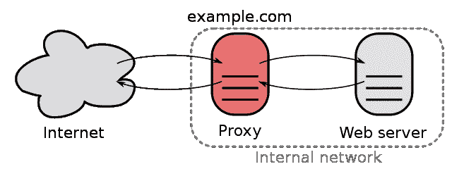

# 如何在阿里云上设置反向 NGINX 代理

> 原文：<https://www.sitepoint.com/how-to-set-up-a-reverse-nginx-proxy-on-alibaba-cloud/>

*本文是与[阿里云](https://int.alibabacloud.com/m/1000016094/)合作创作的。感谢您对使 SitePoint 成为可能的合作伙伴的支持。*

**你认为充分利用阿里云服务有更好的建议吗？请告诉我们，并有机会赢取 MacBook Pro(以及其他很酷的东西)。[点击](https://www.sitepoint.com/alibaba-competition)了解更多信息。**

需要从一台 Linux 机器上为多个网站提供服务，优化资源，并自动化网站启动流程？那么让我们认真起来，使用 Ubuntu、NGINX 和 Docker 建立一个生产就绪的环境——所有这些都在阿里云上。

这是一个有点高级的教程，我们将假设一些网络、服务器管理和软件容器的知识。

## 了解场景

如果您正在阅读本指南，那么很可能**您需要管理一个服务器集群，或者越来越多的网站**——如果不是两者都需要的话——并且您正在考虑如何选择一个安全、高性能且灵活的环境。那么，你来对地方了！

### 为什么是反向代理

简而言之，反向代理接受来自客户机的请求(通常来自互联网)，将其转发给能够满足该请求的服务器(通常在内部网中)，最后将服务器的响应返回给客户机。



图片:[加拿大隐私](https://privacycanada.net/)

向代理发出请求的人可能不知道内部网络。

因此，反向代理是位于应用程序网络边缘的“公众面孔”，处理所有请求；因此，在某种程度上，它类似于负载平衡器。但是，虽然实现负载平衡器只有在您有多台服务器时才有意义，但您可以部署一个反向代理，仅用一台 web 服务器托管多个站点，当这些站点有不同的配置需求时，这可能特别有用。

这种方法有一些好处:

*   **性能**。许多可以实现的 web 加速技术，包括:
    *   **压缩**:服务器响应可以在返回给客户端之前进行压缩，以减少带宽。
    *   **SSL 终止**:解密请求和加密响应可以释放后端资源，同时保护连接。
    *   **缓存**:当另一个客户端发出相同的请求时，返回内容的存储副本，可以减少后端服务器的响应时间和负载。
*   **安全**。恶意客户端无法直接访问您的 web 服务器，代理实际上充当了额外的防御；并且可以限制连接数，最大限度地减少分布式拒绝服务(DDoS)攻击的影响。
*   **灵活性**。一个 URL 可以是多个服务器的访问点，而不管它们背后的网络结构如何。这也允许请求被分布，最大化速度并防止过载。客户端也只能知道反向代理的 IP 地址，因此您可以透明地更改后端的配置，因为它更适合您的流量或架构需求。

### 为什么选择 NGINX


> NGINX Plus 和 NGINX 是 Dropbox、网飞和 Zynga 等高流量网站使用的最佳反向代理解决方案。全球超过[2.87 亿个网站](https://news.netcraft.com/archives/2018/07/19/july-2018-web-server-survey.html)，包括[100，000 个最繁忙网站](http://w3techs.com/technologies/cross/web_server/ranking)中的大多数，依靠 NGINX Plus 和 NGINX 快速、可靠、安全地交付内容。
> 
> [什么是反向代理服务器？](https://www.nginx.com/resources/glossary/reverse-proxy-server/)由 NGINX。

**Apache 很棒，可能是最适合**的——一个多用途网络服务器，包括所有电池。但是正因为这个原因，它也需要更多的资源。此外，Apache 是[多线程的](https://en.wikipedia.org/wiki/Multithreading_(computer_architecture))，即使对于单个网站来说，这本身并不是一件坏事，尤其是对于多核系统，但这可能会在托管多个网站时增加大量 CPU 和内存使用的开销。

调整 Apache 的性能是可能的，但是需要悟性和时间。NGINX 在其设计中采取了相反的方法——一个极简的 web 服务器，你需要调整它来添加更多的功能，公平地说，这也需要一些悟性。

简而言之，NGINX 在开箱即用的性能和资源消耗方面胜过 Apache。对于一个单独的站点，你甚至可以选择不关心，**在一个集群上或者托管多个站点时，NGINX 肯定会有所作为**。

### 为什么选择阿里云


在撰写本文时，[阿里云](https://int.alibabacloud.com/m/1000016094/)作为阿里巴巴集团(Alibaba.com，全球速卖通)的一部分，已经存在了近十年。是**中国最大的公有云服务提供商，全球第三**；因此，它并不是云服务领域的“新玩家”。

然而，直到最近，阿里巴巴才果断地走出中国和亚洲市场，潜入“西方世界”。这是一个功能齐全的产品:弹性计算、数据库服务、存储和 CDN、应用服务、域和网站、安全、网络、分析，**阿里云涵盖了所有内容**。

## 部署到阿里云

你需要一个阿里云帐户，然后才能设置你的 Linux 机器。好消息是你可以免费得到一个！有关全部详情，请参见[如何注册和开始](https://int.alibabacloud.com/m/1000016093/)。

因为本指南将使用 Ubuntu Linux，所以你可以参见[如何在阿里云上设置你的第一个 Ubuntu 16.04 服务器](https://int.alibabacloud.com/m/1000016097/)指南。请注意，你可以使用 [Debian](https://int.alibabacloud.com/m/1000016501/) 、 [CentOS](https://int.alibabacloud.com/m/1000016502/) ，事实上，你可以继续查看[三种在阿里云](https://int.alibabacloud.com/m/1000016098/)上设置 Linux 服务器的方法。

一旦你获得了你的阿里云账户，你的 Linux 机器启动并运行，你就可以开始了。

## 把手举起来。

### 安装 NGINX

如果我们想自己使用整个过程，我们首先需要安装 NGINX。

在 Ubuntu 上，我们会使用以下命令:

```
$ sudo apt-get update
$ sudo apt-get install nginx 
```

您可以使用`systemctl`检查 web 服务器的状态:

```
$ systemctl status nginx 
```

用`systemctl`你还可以`stop` / `start` / `restart`服务器，以及`enable` / `disable`在引导时启动 NGINX。

这是我们感兴趣的两个主要目录:

*   `/var/www/html` NGINX 默认网站位置。
*   `/etc/nginx` NGINX 配置目录。

现在，设置反向代理可能有点麻烦，因为当我们在代理后面添加站点/节点时，我们需要经历许多网络设置，并且需要更新文件。

当然，那是**除非我们使用软件容器自动化整个事情…**

### 码头工人来救援了

在我们开始使用软件容器来自动化我们的工作流程之前，我们首先需要安装 Docker，这对于 Ubuntu 来说是一个相当简单的过程。

卸载任何旧版本:

```
$ sudo apt-get remove docker docker-engine docker.io 
```

安装最新的 Docker CE 版本:

```
$ sudo apt-get update
$ sudo apt-get install docker-ce 
```

如果你想安装一个特定的 Docker 版本，或者设置 Docker 库，参见 [Get Docker CE for Ubuntu](https://docs.docker.com/install/linux/docker-ce/ubuntu/) 。

### 设置网络

设置反向代理基础设施的一部分是正确设置网络规则。

所以让我们用 Docker 创建一个网络:

```
$ docker network create nginx-proxy 
```

而且信不信由你，**网络已定！**

### ngnx 代理伺服器！

现在我们已经在 Ubuntu 服务器上运行了 Docker，我们可以简化安装、设置反向代理和启动新网站的过程。

Jason Wilder 做了一件很棒的工作，他整合了一个 Docker 映像来做这件事——jwilder/nginx-proxy，一个使用 [docker-gen](https://github.com/jwilder/docker-gen) 的 Docker 容器的自动化 NGINX 代理，开箱即用。

以下是运行代理的方法:

```
$ docker run -d -p 80:80 -p 443:443 --name nginx-proxy --net nginx-proxy -v /var/run/docker.sock:/tmp/docker.sock:ro jwilder/nginx-proxy 
```

本质上:

*   我们告诉 Docker 将 NGINX 作为守护进程/服务运行(`-d`)，
*   将代理的 HTTP 和 HTTPS 端口(80 和 443)映射到它后面的 web 服务器端口(`-p 80:80 -p 443:443`)，
*   将 NGINX 代理命名为未来参考(`--name nginx-proxy`)，
*   使用我们之前设置的网络(`--net nginx-proxy`)，
*   映射 Docker 守护进程正在监听的 UNIX 套接字，以便在网络中使用它(`-v /var/run/docker.sock:/tmp/docker.sock:ro`)。

信不信由你，**NGINX 反向代理已经启动并运行了！**

### 发射地点，很多地点

通常当你使用 Docker 时，你会启动一个“容器化”的应用程序，一个标准的 WordPress 站点，一个特定的 Moodle 配置，或者你自己的图片和你自己的定制应用程序。

现在启动代理容器就像用`VIRTUAL_HOST=subdomain.yourdomain.com`指定虚拟域一样简单:

```
$ docker run -d --net nginx-proxy -e VIRTUAL_HOST=subdomain.yourdomain.com --name site_name your_docker_image 
```

其中`your_docker_image`可能是一个 WordPress 站点，你自己的 web 应用程序等等。

信不信由你，你的网络应用已经上线了！

…但是好吧，让我们解释一下刚才发生了什么。jwilder/nginx-proxy 透明地使用您提供的主机名创建所有的 nginx 配置文件，并对运行您的应用程序的软件容器进行所有必要的网络路由；所有这些都只有一行 bash 代码——这难道不疯狂吗？

请注意，您将用来访问 web 应用程序的 IP 地址将始终是相同的，您的站点的内部路由和设置已经处理好了，但您只需要确保您已经将您的域和子域适当地映射到代理。

## 额外提示:使用 Docker 撰写

对于那些 Docker 超级用户来说，我们可以通过 Docker Compose 进一步实现自动化。

将所有内容放在一个`docker-compose.yml`文件中:

```
version: "2"

services:
  nginx-proxy:
    image: jwilder/nginx-proxy
    networks:
      - nginx-proxy
    ports:
      - "80:80"
      - "443:443"
    volumes:
      - /var/run/docker.sock:/tmp/docker.sock:ro

  app_name:
    container_name: your_app_name
    image: your_docker_image
    environment:
      - VIRTUAL_HOST: subdomain.yourdomain.com
    networks:
      - nginx-proxy

networks:
  nginx-proxy:
    external:
      name: nginx-proxy
  back:
    driver: bridge 
```

此外，使用 Docker Compose，您还可以设置几乎所有您需要的基础设施——数据库、您的所有应用程序，每个应用程序都有自己的 Apache/NGINX 配置，等等。这超出了本文的范围，但是您可以在 Docker Compose 的[概述中找到更多信息。](https://docs.docker.com/compose/overview/)

## 资源

关于**阿里云**:

*   [阿里云](https://int.alibabacloud.com/m/1000016094/)，云产品、服务和解决方案的集成套件。
*   [免费试用](https://int.alibabacloud.com/m/1000016095/)，
    价值 300-1200 美元的免费试用，了解和体验阿里云的强大。
*   [阿里云入门](https://int.alibabacloud.com/m/1000016096/)。

关于 **NGINX** :

*   [NGINX](https://www.nginx.com/) ，高性能负载均衡器，web 服务器，反向代理。
*   [NGINX 反向代理](https://docs.nginx.com/nginx/admin-guide/web-server/reverse-proxy/)。
*   Jason Wilder 为 Docker 开发的自动化 Nginx 反向代理。

关于**码头工人**:

*   [Docker](https://www.docker.com/) ，随时随地构建、发布和运行任何应用。
*   [了解 Docker、容器和更安全的软件交付](https://www.sitepoint.com/docker-containers-software-delivery/)。

## 包装它

我们刚刚完成了一些非常复杂的事情——能够从单个入口点管理数百个站点的基础架构，重点关注资源优化和自动化管道。太棒了。

正如我们提到的，反向代理可以只是实现[服务器负载均衡](https://int.alibabacloud.com/m/1000016605/) (SLB)、一个 [web 应用防火墙](https://int.alibabacloud.com/m/1000016606/) (WAF)、甚至一个[内容交付网络](https://int.alibabacloud.com/m/1000016607/) (CDN)时的起点。我们将在未来深入探讨这一点。

## 分享这篇文章