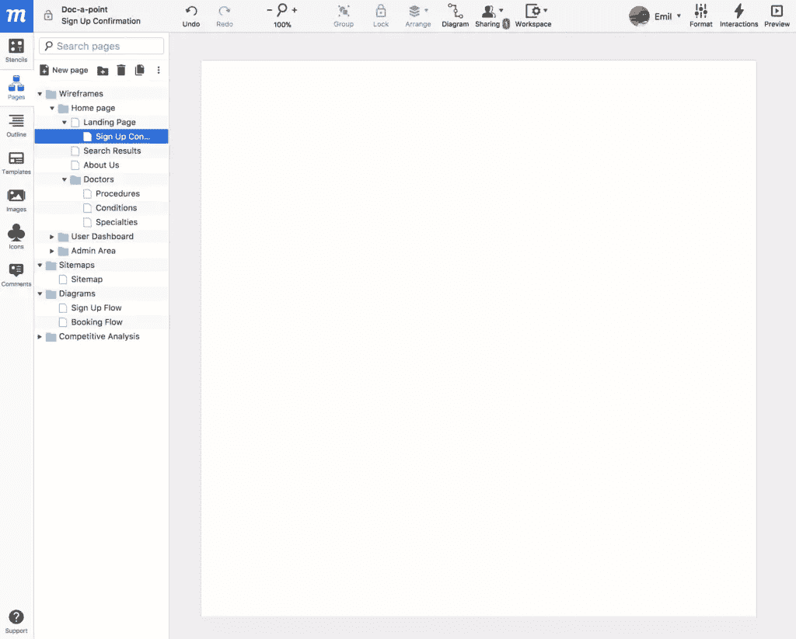
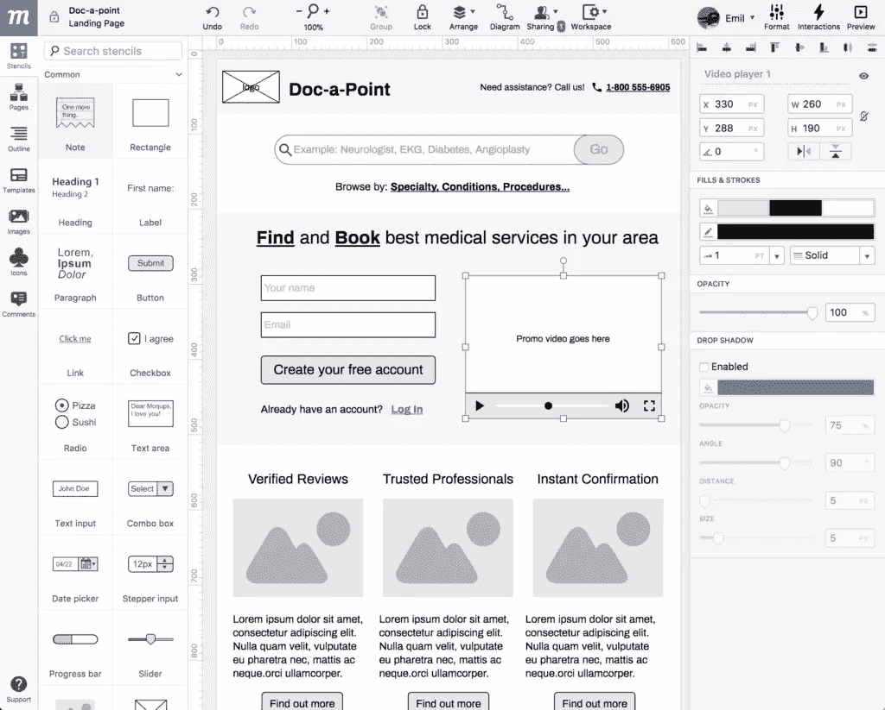
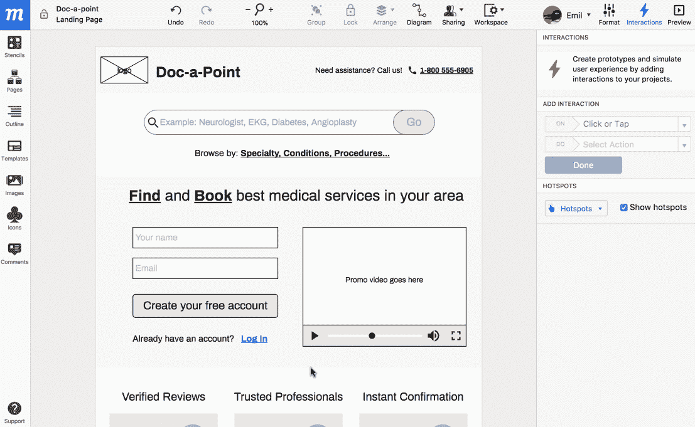
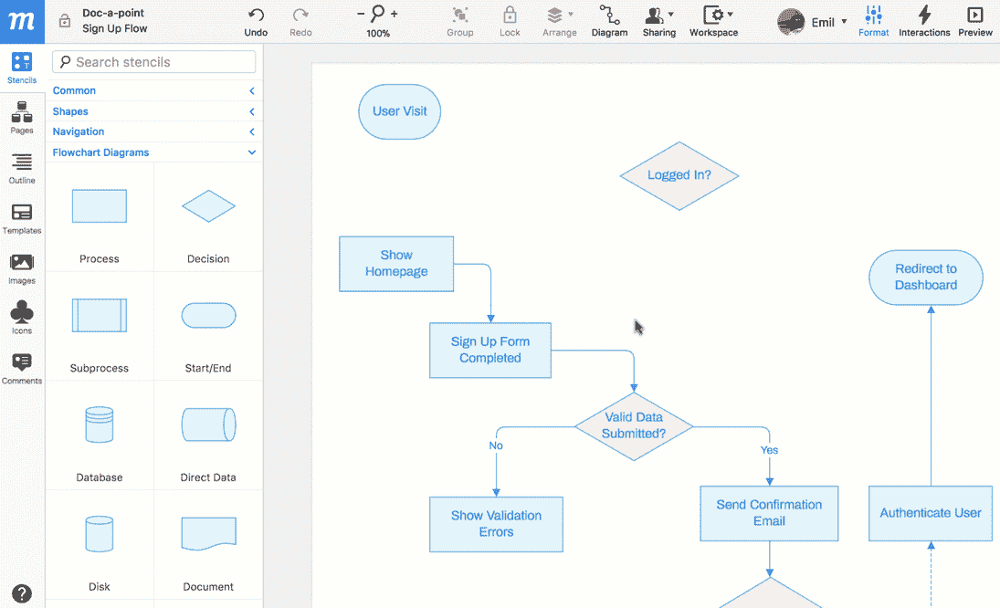
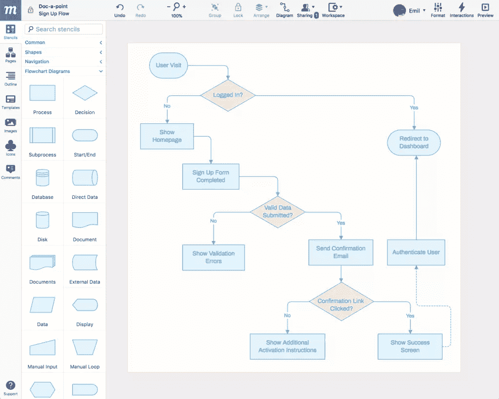
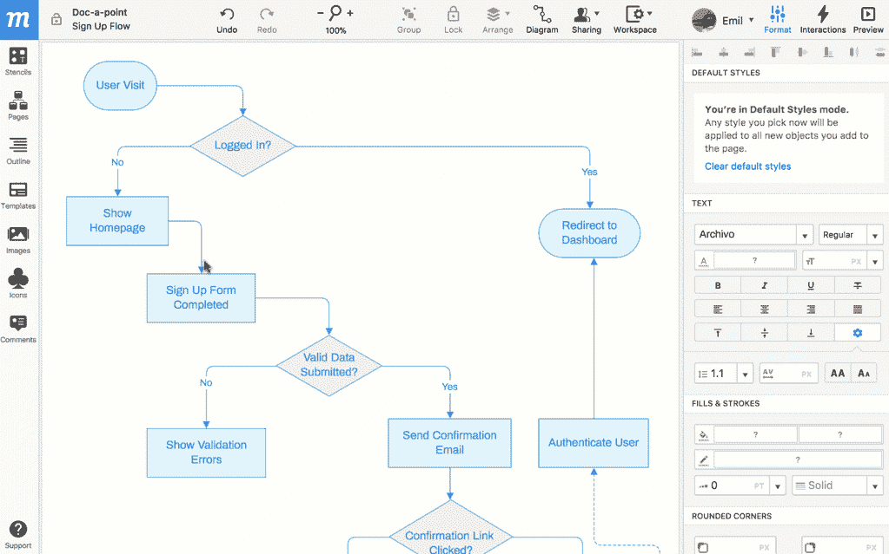
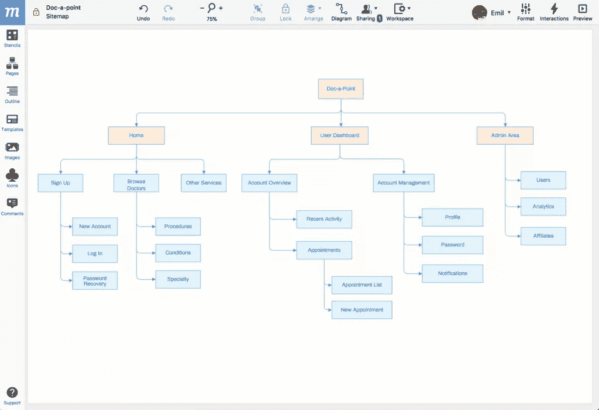

# 如何用 Moqups 将你的想法从概念变成创作

> 原文：<https://www.sitepoint.com/how-to-take-your-idea-from-concept-to-creation-with-moqups/>

*本文是与 [Moqups](https://moqups.com/) 合作创作的。感谢您对使 SitePoint 成为可能的合作伙伴的支持。*

所以，你有个好主意。

你已经告诉了你的家人、朋友和同事，反馈非常好。每个人都喜欢这个概念，并能看到它的潜力。他们认为你应该放手一搏！

但是，你知道事情没那么简单。

在投入时间和金钱——无论是你的还是别人的——之前，你需要面对现实，解决细节问题。

当你把你的概念从构想变为现实时，你需要组建你的团队，筹集资金。这意味着向广泛的行业专业人士推销:产品经理、开发人员、设计师、业务分析师、营销人员和投资者。

为了向他们展示你的愿景是可行的和可执行的，你的推介需要足够抽象以抓住他们的想象力，但也要足够具体以清晰可信。

你需要建立你的概念，评估它的技术复杂性，并绘制出它的完整规模。换句话说，你需要面对现实。

这也是 Moqups 可以提供帮助的地方。

我们将 Moqups 设计为一个在线、一体化的创意平台，以便它可以带您从第一次头脑风暴会议(捕捉和连接想法)一直到完全实现的交互式高保真原型。

我们的目标是创建一个完美的“低投入高影响”的应用程序。

我们认为 Moqups 真正的优势在于它的 UI 既直观又容易掌握。因此，无需切换应用程序，您就可以制作出概述项目需求的各种材料，包括工作流程图、网站地图、线框、模型和交互式原型。

当然，对于这些特定的工件中的每一个，都有许多更复杂和详细的工具(例如，仅仅绘制图表的应用程序，或者专门关注线框或原型的应用程序)。

但是当你疯狂地构建你的概念时，每花一个小时在一个新的不熟悉的界面上，就有一个小时没有花在你自己产品的未来上。

那么，让我们来看看您可能希望作为最终推介包的一部分的三个工件:

*   线框和原型
*   流程图
*   网站地图

## 从任何地方开始

在孵化过程中，你可能是唯一能理解你的视觉的人。但是，即使你脑子里有了所有这些信息——或者正因为如此——你解释其复杂性的能力可能仍然是模糊和混乱的。

你能做的最好的事情就是把那些分散的想法从你的大脑中取出来，放到纸上。这样，你就可以把它们变成有形的、有组织的东西。

但是从哪里开始呢？

布鲁斯·毛在他的不完整的增长宣言中有一个很好的提示:

> 从任何地方开始。约翰·凯奇告诉我们，不知道从哪里开始是瘫痪的一种常见形式。他的建议是:从任何地方开始。

所以不要担心规定性的方法。只需要依靠你的直觉。无论你从哪里开始，随着你的愿景变得清晰和具体，每个工件都将告知其他工件——并平行发展。

像 Moqups 这样的一体化工具的一个真正的优势是，它可以让您在资产开发过程中无缝地来回切换。

所以，我们走吧！

如果你想一起玩，只需前往[moqups.com](https://moqups.com/)，点击“立即免费试用”。

## 线框和原型

软件通过引导用户完成一系列步骤来帮助他们实现某些目标——你的概念也不例外。构建一个线框将帮助你理解你的用户，让你站在他们的立场上，帮助你想象他们的每一步。

创建一个线框图也是将你的设想从头脑中释放出来并放到页面上的最直接的方法，因为它让你可以尝试不同的选项和布局——而不用担心颜色、字体、标志、精确尺寸等细节。

很有可能，你已经确定了一些主要的用例，并且想象出了用户应该遵循的步骤顺序。线框让你有机会弄清楚这些屏幕需要哪些基本元素——内容、输入框、按钮、菜单——以及你可能忽略了哪些元素。

所以，选择一个单一的目标。在这种情况下，我选择了“创建帐户”作为我的目标。我决定将注册字段直接嵌入到主页中——希望能抓住更多的线索。

现在，确定实现该目标所需的步骤:

1.  访问登录页面，并在注册字段中输入个人凭据
2.  获得确认

在这个 Moqups 项目中，我希望每个目标——在这种情况下，“创建一个帐户”——都有自己的页面。此外，该页面将包含一系列嵌套页面，详细说明实现该目标所需的步骤/屏幕。

在 Moqups 应用程序中，您的资产(模板、页面、图标、图像等。)可从左侧栏访问。格式和交互性是通过右边栏控制的。

在左侧边栏中，点击**页面选项卡。**在页面面板中，您可以创建、命名和嵌套文件夹和页面。

如果您想更改页面尺寸以适应您正在设计的设备，顶部工具栏(小齿轮图标)中的**工作区下拉菜单**将让您访问页面设置，以及对齐、参考线和网格。

(Moqups 的用户界面很直观，所以我不会在这里讲太多的细节……但是如果你需要更详细的说明，请访问[帮助中心](https://support.moqups.com/hc/en-us),它非常全面和用户友好。)

现在，是时候开始模拟你的屏幕了。

点击左侧工具条中的**模板标签**。从打开的面板中，您可以搜索要添加到屏幕上的相关模板；例如，帐户注册表单由文本输入、复选框、单选按钮和按钮组成。

只需将这些模板拖放到页面上。然后使用右边栏中的**格式标签**移动它们，调整它们的大小，或者设置它们的样式。

添加尽可能多的细节，但不要太费力。在这一点上，美学并不重要。你可以随时回来润色你的作品。更重要的是，你要发现用户需要什么样的输入，以及基本导航如何为他们服务。

看着你的不确定的愿景变成具体的形状会非常有活力……所以你可能想要添加一些颜色和调整字体，只是为了让你的血液流动起来，并给你一个关于你未来品牌的鼓舞人心的感觉。重要的是继续前进、建设和进步。您可以随时更改、编辑和迭代。

你可能想更进一步，通过增加交互性把你的线框变成一个初步的原型。这可以为你的利益相关者提供用户体验(UX)和导航的直觉。

一个构造良好的线框/原型不仅可以帮助你以一种全面和可理解的方式传达你的愿景，而且也是你的设计师和开发人员开始工作所需要的那种文档。

## 流程图

既然您已经使用线框/原型探索了用户界面，并且对导航有了感觉，那么是时候通过创建流程图来探索项目的业务方面了。

流程图将用户在产品中的“流动”形象化。它们有时被称为“决策树”,因为它们描绘了用户在实现其目标时可以做出的一系列步骤——包括决策和行动。用专业术语来说，流程图表示用户流程从头到尾的执行顺序。

如果你曾经玩过棋盘游戏，那么你会在这里如鱼得水。一个好的流程图就像是*蛇和梯子*和*垄断*的组合——除了你是设计棋盘、制定游戏规则和在卡片上写指令的人。

规划项目时，流程图有助于确定每个用户步骤背后的确切逻辑。它还可以帮助你的团队发现复杂的、被忽视的或者隐藏的用户界面状态。

隐藏状态可能是一个错误屏幕，或者是用户在响应某个事件时需要采取的额外步骤。这些细节在规划阶段很容易被忽略，但通常情况下，它们最终会在开发过程中被发现。在最糟糕的时候，这会导致项目延期和成本增加。

Moqups 非常适合创建流程图，有许多专门为此设计的模板可供选择。你可以通过点击**模板标签**并向下滚动到面板的**流程图部分**来找到它们。将其中一些模具拖到新页面上。

现在，您可以通过切换到**图表模式**来开始绘制用户流。只需点击顶部工具栏中的**图标按钮**。您的光标将变成十字准线，一系列蓝点(称为连接点)将出现在每个对象周围。

要在任意两个对象之间画一条线，单击其中一个点，并将光标拖向第二个对象。然后，单击连接器本身，从连接器面板中选择头部、尾部、宽度和颜色，或者双击添加标签。

使用 Moqups 绘制图表的最大好处之一就是连接器是“智能的”,这意味着即使你调整它们的大小和重新排列它们，它们也不会纠缠在一起。

如你所见，我绘制了一个扩展版的“创建账户”流程，这是我们在构建线框时使用的。

如果你想更加雄心勃勃，这里有一个快速提示，可以帮助你的流程图和你的线框一起工作。确定图中的哪些对象代表您的线框中的实际页面。现在，使用**交互面板**(在右边栏中)向该对象添加一个**页面交互**(反之亦然)，这样，只需单击一下，您的团队就可以在两者之间快速来回导航——并且总是知道它们在流程和 UI 中的位置。

通过创建流程图，您和您的开发人员将获得远见，以便您可以在游戏早期提出基本问题——从而在开始编码时获得更好的估计、更高的可信度和更少的误解。

设计师也发现这些工件非常有用，因为他们开始设计 UI 的粒度细节。

## 网站地图

线框和流程图可以描绘出你的愿景的内容、布局和用户流，但它是一个网站地图，将所有信息汇集在一起，提供一个全面的、鸟瞰项目所有模块的视图。

站点地图层次结构是内容的分类，最终将成为设计者和开发者的路线图，决定站点的结构和导航。

这个过程的技术术语是‘信息架构设计’(IA 设计)，但是不要被吓倒！几乎每个人都曾在职业生涯中的某个时候制作过“积木”图。

就像流程图一样，你将使用 Moqups 的图表模式来构建你的站点地图。只需拖动几个文本模板到页面上，然后点击顶部工具栏中的**图按钮**开始连接你的对象和构建你的层次结构。

你可以从你喜欢的抽象或详细开始——然后不断地添加和修改。事实上，Moqups 通过其智能连接器鼓励和促进这种即兴创作和实验。因为这些连接器可以快速连接，并且在页面上重新排列元素时保持连接，所以您可以快速而轻松地进行迭代。

您可以在右侧边栏的格式面板中自定义模板的字体、颜色、笔画和圆角，如果您单击连接器，您也可以设置它们的样式。

看看下面的例子——在这个例子中，是一个“Doc-a-Point”的网站地图，这是一个帮助用户找到并预订他们所在地区的医疗服务的在线服务。

同样，就像流程图一样，你可以总是雄心勃勃，使用交互将特定的构建块连接到它们所代表的屏幕(在你的线框中)，或者连接到任何其他外部内容源(如 Google Drive)。

## 结论

一旦你创建了你的线框，流程图和网站地图，你将有一个完整的，具体的和可信的项目表现。这三个工件将使您更容易传达您的愿景，传达其技术复杂性的准确感觉，并定义您的设计和开发需求。反过来，这就更容易找到合作伙伴，向他们推销你的想法，并让他们加入进来。

Moqups 的美妙之处在于它不仅仅是一个“入门”应用。它足够专业和强大，一旦你雇佣了你的团队，这些专家中的任何一个都可以接管你的 Moqups 项目，并在同一个平台上继续开发——没有额外的购买或损失连续性。

通过创建您自己的线框、流程图和网站地图，您将为您的团队提供一个清晰的思路，让他们知道要讨论什么、要问什么问题以及从哪里开始工作，从而让他们有一个良好的开端。那是*真的*变得真实！

## 分享这篇文章