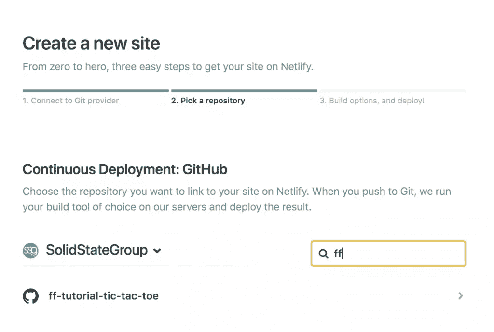
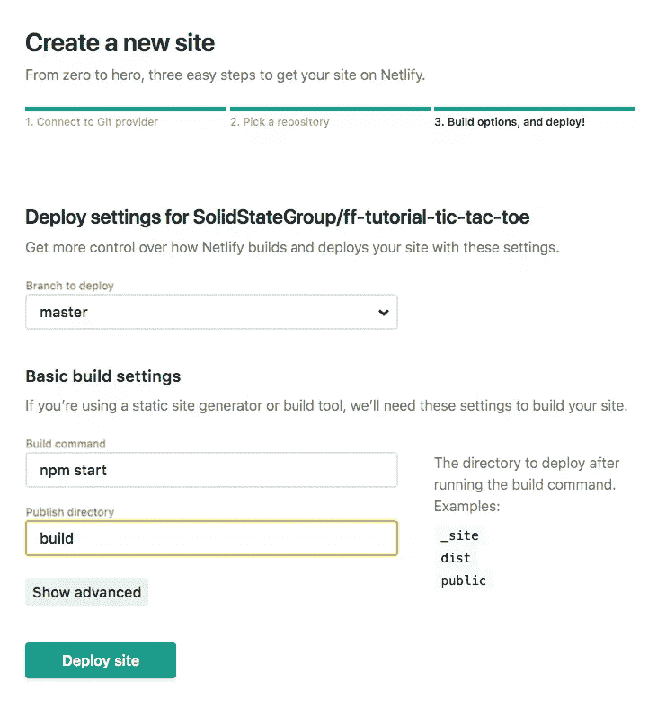
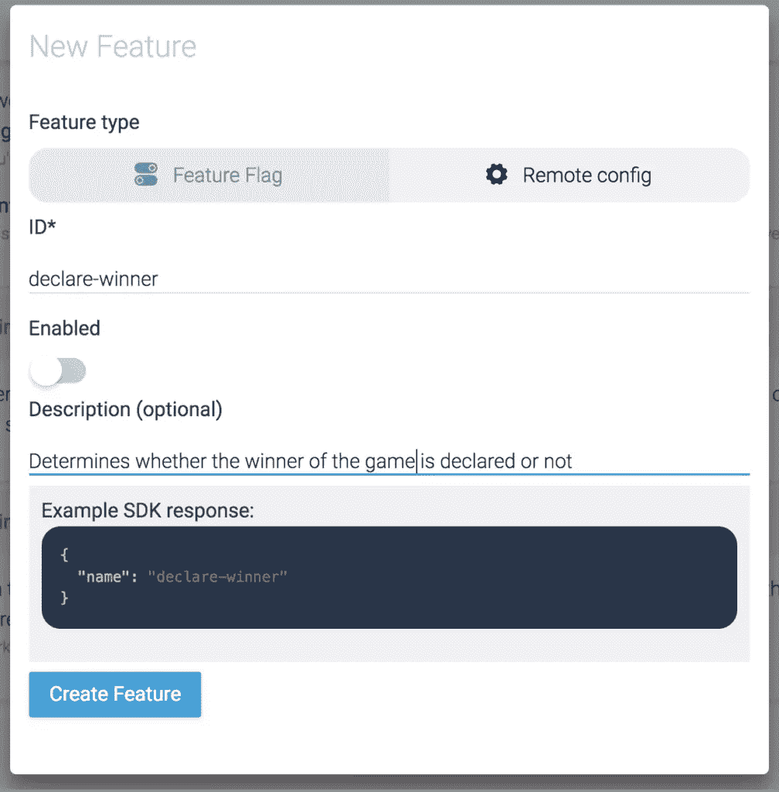
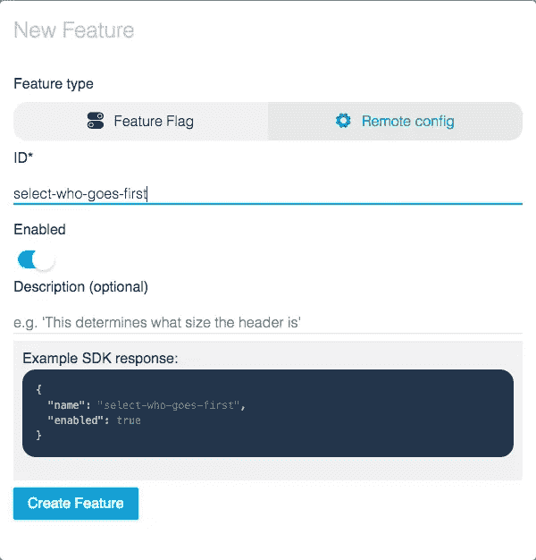

# 如何在持续集成中使用特性标志

> 原文：<https://www.sitepoint.com/how-to-use-feature-flags-in-continuous-integration/>

关于在生产系统中实现真正的持续集成(CI)的好处已经写了很多。本教程将演示一个实现 CI 的简单工作流。我们将使用特性标志和远程配置来避免 Git 中对特性分支的需求，以及任何类型的测试或测试环境。我们将用来演示这种方法的两个主要工具是 [Netlify](https://www.netlify.com/) 和[子弹头列车](http://bullet-train.io/?utm_source=sitepoint)。

## 我们所说的配置项和功能标志是什么意思

持续集成是一种开发方法，其中开发人员能够不断地发布他们的代码。开发人员在完成开发时推出他们的新功能，在这一点上，他们被自动测试并立即发布到一个真实的环境中。

功能标志提供了一种从远程控制面板控制这些新功能的方式，允许您随意关闭和打开它们，而无需对代码进行任何更改。这允许你开发一个特性，并把它发布到产品中，从用户的角度来看，实际上不需要做任何改变。

## CI 为何如此强大

以更小的块和更频繁的方式集成代码，允许开发团队更快地发现问题，并尽可能快地为用户提供新功能。CI 还消除了对任何大型发布的需求，在这些发布中，工程师团队需要保持清醒直到深夜，以最大限度地减少对用户的干扰。

## 特性标志如何帮助持续集成

特性标志在发布新特性时提供了额外的信心。通过将新特性包装在特性标志中，开发人员和产品团队能够根据需要快速启用或禁用他们的特性。假设我们在生产中引入了一个新特性，但是我们可以立即发现新代码中有一个 bug，因为生产环境中的一些特定的东西在测试中并不明显(让我们面对现实吧，这在每个人身上都发生过…不止一次)。

在以前，这意味着(可能)漫长而(肯定)痛苦的回滚过程，以及在错误被修复后的另一天重新安排一个不合适的时间发布。取而代之的是，只需拨动一下开关，所有用户或部分用户就可以关闭该功能，痛苦也就烟消云散了。一旦确定并修复了 bug，就可以部署补丁发布，并重新启用该特性。

## 我们示例项目的大纲

为了演示集成特性标志和远程配置，我们将基于井字游戏的[事实上的 React JS](https://reactjs.org/tutorial/tutorial.html) 教程来创建我们的初始代码库。这是一个学习 React 基础知识的很好的教程，所以如果你还没有的话，一定要去看看。

如果您不太了解 React 或 Javascript，也不用担心。我们将要讨论的概念都是关于过程和工具的，而不是关于代码的。

我们不是从头开始重复本教程，而是从我们已经开始运行一个基本的井字游戏的地方开始。

此时，我们将使用功能标志和远程配置来持续配置、推送和部署新功能。为了将这个概念发挥到极致，我们将不断努力去掌握它；不会使用其他分支。我们将引入一个 bug(当然是故意的！)并将修复推送到 master，以演示如何处理这种情况不需要完全回滚或额外的分支。

如果您希望在本教程中继续编写代码，您可以将[库分支到这里的](https://github.com/SolidStateGroup/ff-tutorial-tic-tac-toe)。

## 实现 CI

自动化持续集成最常见的方法是在您将变更推送到 git 存储库时触发构建过程。不同的构建工具以不同的方式实现这一点。

我们将在我们的项目中使用网络寿命。Netlify 允许您连接一个 Git 存储库，并在每次推送分支时自动部署构建。

要使用 Netlify，只需注册一个免费帐户，并选择仪表板右上角的“从 Git 新建网站”选项。一旦你连接了你的 GitHub 账户(或者，如果你想使用 Bitbucket 或者 GitLab ),你应该会看到下面的选项。



在下一步中，配置 Netlify 运行应用程序，如下所示。



Netlify 现在将开始为您构建您的应用程序。这将需要几分钟的时间，但是一旦完成，您应该会看到如下内容:


浏览到该网址应该显示你的井字游戏在其所有的荣耀。

## 为我们的项目设置特性标志

我们将使用特征标志来控制井字游戏中获胜者的声明。为了创建和管理我们的功能标志，我们将使用[子弹列车](https://bullet-train.io)，因为它目前是免费的，但还有许多其他功能标志产品。我们会让你挑一个你觉得合适的。

要继续使用我们的服务，请在子弹头列车上创建一个免费帐户。点击“创建项目”按钮，创建您的项目。我们把我们的命名为 FF 教程。


接下来，我们需要创建一个宣布获胜者的新特性。
点击下一个屏幕底部的“创建您的第一个功能”按钮，调出以下表格并添加详细信息。



注意，我们一开始就禁用了这个特性。

请注意该特性下的两个可用代码片段，这将有助于我们下一步的工作。

## 实现功能标志

首先，让我们在开发环境中运行这个项目。从命令行中，导航到项目文件夹并运行命令`npm i`来安装必要的依赖项。

接下来运行`npm run dev`，在浏览器中转至`http://localhost:8080`。您应该会看到与您在 Netlify URL 上看到的相同的井字游戏。

我们现在将在现有代码中实现我们的新特性标志。让我们从安装 JavaScript 的子弹头列车客户端开始，打开另一个命令行并在项目目录中运行以下命令:

`npm i bullet-train-client --save`

在您喜欢的编辑器中打开项目并编辑`./web/App.js`。

找到`calculateWinner(squares)`函数。这个函数根据是否能找到相同形状的线来确定是否有赢家。我们将让这个函数基于我们的特征标志的值返回`null`,这样我们就可以测试填充棋盘而不需要它宣布赢家。

在 App.js 的最顶端，添加以下行:

```
var declareWinner = true; 
```

现在，让我们初始化之前安装的子弹头列车客户端。从子弹头列车界面的 Features 页面中复制所有代码示例 2，并将其粘贴到刚刚添加的行的下方。

代码片段中的环境 ID 将是与子弹头列车项目中的开发环境相关联的正确环境 ID。如果您愿意，可以通过浏览“环境设置”页面来检查这一点。

我们现在需要在刚刚粘贴的代码中编辑`bulletTrain.init()`函数中的`onChange()`函数，以满足我们的需要。用一行代码替换所有代码:

```
declareWinner = bulletTrain.hasFeature("declare-winner"); 
```

现在你应该在你的 App.js 的顶部有这个

```
var declareWinner = true;
import bulletTrain from "bullet-train-client"; //Add this line if you're using bulletTrain via npm

bulletTrain.init({
    environmentID:"<your-environment-id>",
    onChange: (oldFlags,params)=>{ //Occurs whenever flags are changed
        declareWinner = bulletTrain.hasFeature("declare-winner");
    }
}); 
```

向下滚动到`calculateWinner(squares)`函数，在顶部，就在`lines`常量声明的上方，让我们添加一行:

```
if (!declareWinner) return null; 
```

就是这样！我们的特征标志现在将决定在游戏的每一次渲染中是否计算出获胜者。刷新浏览器并玩游戏。你不能再赢了，取而代之的是整个棋盘现在都被 x 和 o 填满了。

回到子弹头列车管理，使用右边的开关切换该功能。


刷新你的浏览器，游戏又可以赢了。在此查看本部分[结尾的代码。](https://github.com/SolidStateGroup/ff-tutorial-tic-tac-toe/tree/step-2-declare-winner-feature-flag)

提交并推送你的代码(是的，全部在 master 上)，Netlify 会自动部署你的代码。再次浏览到分配给您的 Netlify URL，并切换功能标志以查看它在生产环境中的工作情况。太棒了。

## 研究一个错误

我们现在将有目的地在井字游戏中引入一个 bug，并展示如何使用功能标志来删除导致问题的功能。

我们要添加的功能是在游戏开始时选择谁先走。为此，我们将添加几个只在游戏开始时出现的按钮，并防止在板上点击添加形状。

首先，让我们设置特性标志来包装新特性。在您的子弹列车项目中，创建一个名为`select-who-goes-first`的新特性，如下所示。让我们从禁用它开始。



现在，让我们添加我们的新功能。在`render()`函数中，如果游戏还没有开始，我们将渲染按钮，而不是状态。在`render()`功能返回的顶部，替换该行:

```
<div className="status">{status}</div> 
```

…使用以下代码:

```
{!this.state.selected ? (
    <div>
        Who goes first?
        <button onClick={() => this.setState({selected: true})}>X</button>
        <button onClick={() => this.setState({selected: true, xIsNext: false})}>O</button>
    </div>
) : (
    <div className="status">{status}</div>
)} 
```

现在，我们要编写代码，用我们创建的特性标志来控制我们的新特性。和以前一样，这需要放在`bulletTrain.init({...})`函数中。

首先，让我们将生命周期函数`componentDidMount()`添加到 Board 组件中，然后将整个`bulletTrain.init({...})`函数移入其中，这样我们就可以在检索到标志后更新组件的状态:

```
class Board extends React.Component {
    componentDidMount() {
        bulletTrain.init({
            environmentID:"<your-environment-id>",
            onChange: (oldFlags,params)=>{ //Occurs whenever flags are changed
                declareWinner = bulletTrain.hasFeature("declare-winner");
            }
        });
    }

    // [rest of class]
} 
```

如果我们将`bulletTrain.init({...})`留在组件之外，我们将无法调用`this.setState()`并让组件根据对我们标志的更改重新呈现自己。

现在让我们添加代码来控制我们的新特性。如果标志被禁用，我们希望应用程序像添加这个特性之前一样运行。要做到这一点，让我们设置`selected`到`true`的状态值，如果标志被禁用。在`bulletTrain.init({...})`方法中，在`declareWinner`行的正下方添加下面一行。

```
this.setState({selected: !bulletTrain.hasFeature("select-who-goes-first")}); 
```

让我们继续推动它(同样，直接进入主页面)。一旦建好了，就去你的网址。您应该会看到什么都没有改变——这是因为该特性在我们的子弹头列车项目中仍然是禁用的。

前往子弹头列车并启用该功能。

太棒了。现在我们可以看到它在工作，但是哦，有一个 bug！没有选择谁先开始游戏是可能的。如果你这样玩游戏，你可以看到状态从来没有设置为显示赢家。这是不对的！

回到子弹头列车上，禁用这个功能，直到我们找出问题所在。这就是子弹头列车的附加功能，如环境和用户，派上用场的地方。在本教程中，我们不会深入讨论这两个问题，但是请查看[文档](http://docs.bullet-train.io)了解更多关于使用多个环境或基于每个用户控制特性的信息。

回到我们的 bug:我们需要在`handleClick()`的顶部添加一行代码，以防止玩家在第一个玩家被选中之前开始游戏。在`handleClick()`函数的顶部添加以下内容。

```
if (!this.state.selected) return; 
```

在子弹头列车中再次打开该功能，并在您的本地环境中进行测试，您应该会看到我们现在会阻止游戏在没有选择谁先开始的情况下开始。太棒了。再次提交给 master，并直接推动它进行部署。

前往您的网络链接，您应该会看到新功能已修复并正常工作。

你可以在本节[末尾的](https://github.com/SolidStateGroup/ff-tutorial-tic-tac-toe/tree/step-3-who-goes-first-bug)这里看到最终代码。

## 远程配置

我们现在来看看特性标志的一个微小变化，叫做远程配置。远程配置允许您控制的不仅仅是某个特性是打开还是关闭，它还允许您远程更改给定值，而无需更改您的代码。这在许多不同的地方都很方便，例如，如果您希望能够配置样式的某些方面。

在我们的教程中，我们将用它来改变游戏中每个玩家使用的形状。让我们创建两个远程配置值，用于在板上使用什么形状。在您的子弹头列车项目中，单击“创建功能”按钮，但这一次，选择“远程配置”选项卡，而不是“功能标志”。按照下面的要求填写数据。


全部完成！现在回到代码。在我们的子弹头列车客户端的`onChange()`函数中，我们需要检索这些值，并将它们设置为组件的状态。让我们将`this.setState()`通话改为:

```
this.setState({
    selected: !bulletTrain.hasFeature("select-who-goes-first"),
    shape1: bulletTrain.getValue("shape-1") || 'X',
    shape2: bulletTrain.getValue("shape-2") || 'O'
}); 
```

我们现在有了两个形状，可以用状态值来代替所有静态使用的“X”和“O”。每个应该有 3 个实例:在`handleClick()`中每个形状 1 个，在`render()`中每个形状 2 个(一个在对`return`的调用中)。下面是更新后的代码，供`handleClick()`参考:

```
handleClick(i) {
    // ...
    squares[i] = this.state.xIsNext ? this.state.shape1 : this.state.shape2;
    // ...
} 
```

请注意，对于`render()`中的`return`调用中的实例，您需要像这样用花括号将 JavaScript 括起来:

```
<button onClick={() => this.setState({selected: true})}>{this.state.shape1}</button> 
```

将它提交到 master 并推送到您的 Git 存储库，以查看您的 Netlify URL 上的更改。如果你做的正确，这个游戏应该像以前一样用“X”和“O”形状来玩。继续将管理中的形状更改为不同的字母，并刷新页面。如果一切顺利，你现在可以玩不同的形状了。

你可以通过远程配置实现更多的功能，比如控制整个游戏的风格，或者控制游戏板的尺寸。我们添加了更多的远程配置值，包括形状颜色和方块大小。你可以在这里看到游戏[的完成代码。](https://github.com/SolidStateGroup/ff-tutorial-tic-tac-toe/tree/step-4-remote-config)

## 其他需要考虑的事情

然而，特性标志不应该被认为是金子弹，它们确实带有一些警告。

例如，如果您正在使用一个为您处理数据库模式的框架，比如 Django 或 Rails，那么在您的模型中实现特性标志时，您需要小心。在模型中使用特性标志可能会导致 DB 模式不匹配，这可能会导致应用程序的某些部分停止运行。

类似地，如果您正在与对其消费者有某些要求的第三方 API 进行交互，那么使用特性标志来控制这些方面可能会导致您的应用程序出现意外错误。同样，反之亦然，如果你的应用程序提供了一个 API 给其他人使用，那么不建议使用特性标志来控制 API 的数据模型，因为这可能会给这些用户带来问题。

最后，我们在上面的教程中使用了[子弹头列车](https://bullet-train.io),因为它目前是免费使用的，也是开源的。有很多其他的产品在做同样的事情或者有稍微不同的变化——你应该检查所有这些来决定什么是最适合你的。比如[发射黑暗](https://launchdarkly.com/)和[飞艇指挥部](https://www.airshiphq.com/)。

## 分享这篇文章