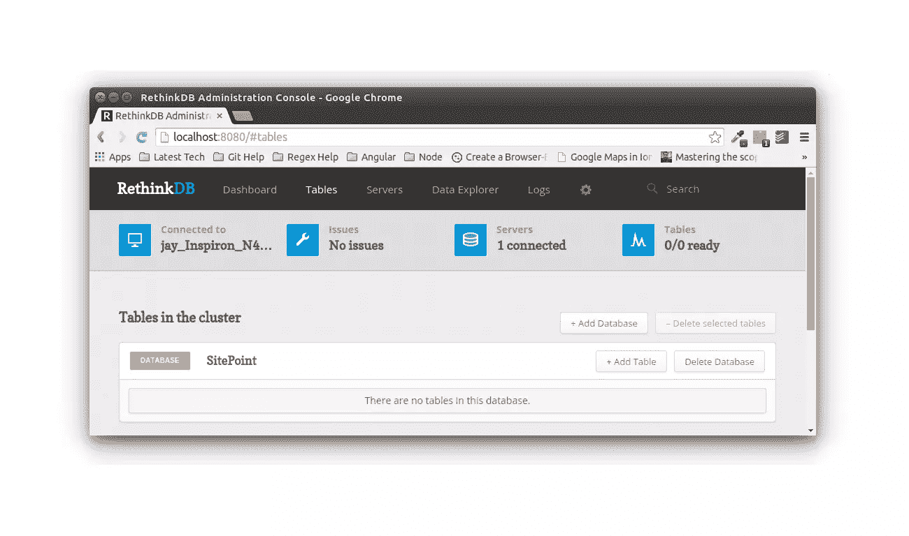

# 如何在 Node.js 应用程序中使用 RethinkDB

> 原文：<https://www.sitepoint.com/how-to-use-rethinkdb-with-node-js-applications/>

*本文由 [Agbonghama Collins](https://github.com/collizo4sky) 和 [Martín Martínez](https://github.com/loqtor) 进行同行评审。感谢 SitePoint 的所有同行评审员使 SitePoint 的内容尽可能做到最好！*

web 应用程序最常见的任务之一是保存数据。如果没有存储数据的能力，用户将无法为应用程序定制偏好、组织数据或完成类似的任务。长期以来，web 一直依赖关系数据库来保存信息。例如，在网络上，PHP 和 MySQL 之间的关系是众所周知的。但并不是所有的数据库都必须是关系！
在本文中，我们将重点介绍如何在 Node.js 应用程序中使用开源 JSON 数据库 RethinkDB。我们将利用名为[的 RethinkDB Node.js 驱动程序连接到数据库。](https://github.com/neumino/rethinkdbdash)

但是在开始之前，让我们看看什么是 RethinkDB，以及我们可能希望在哪里使用它。

## RethinkDB 简介

RethinkDB 是一个为实时 Web 构建的开源 JSON 数据库。

官方文件称:

> RethinkDB 是第一个开源的、可伸缩的 JSON 数据库，完全是为实时 web 而构建的。它通过展示一个令人兴奋的新访问模型，颠覆了传统的数据库架构——开发人员可以告诉 RethinkDB 实时地将更新的查询结果持续推送到应用程序，而不是轮询更改。

它提供了在每次发生更改时从数据库获取实时更新的功能。

RethinkDB 面向需要向连接的客户端发送实时更新的应用程序。例如，让我们考虑一个允许用户协作设计计划的应用程序。当特定用户进行设计更改时，需要将更改实时推送到其他连接的客户端，以保持设计同步。在这种情况下，可以使用 RethinkDB 来实现实时更新。

澄清了 RethinkDB 的用途之后，现在让我们看看如何安装它。

## 安装 Rethinkdb

要在 Ubuntu 上安装 RethinkDB，需要添加存储库。

```
source /etc/lsb-release && echo "deb http://download.rethinkdb.com/apt $DISTRIB_CODENAME main" | sudo tee /etc/apt/sources.list.d/rethinkdb.list
wget -qO- http://download.rethinkdb.com/apt/pubkey.gpg | sudo apt-key add -
```

然后，您必须从新添加的存储库中更新包信息，并安装 RethinkDB。

```
sudo apt-get update
sudo apt-get install rethinkdb
```

[对于其他 OS 口味，可以按照官方安装说明](https://www.rethinkdb.com/docs/install/)进行操作。

完成后，在终端上键入以下命令:

```
rethinkdb
```

如果一切安装正确，RethinkDB 应该启动，并且应该在默认端口 28015 上运行。管理控制台应该可以通过 [http://localhost:8080](http://localhost:8080) 访问。

## 安装 Node.js 客户端重新思考

在本教程的介绍中，我提到了 [rethinkdbdash](https://github.com/neumino/rethinkdbdash) ，我们将使用 Node.js 客户端与 RethinkDB 服务器进行交互。它是一个高级的 Node.js 驱动程序，支持连接池、流等。

要安装`rethinkdbdash`客户端，您可以使用 npm:

```
npm install rethinkdbdash
```

## RethinkDB 入门

我们将首先为我们的演示应用程序创建一个名为`SitePoint`的数据库。作为第一步，创建一个名为`NodeRethinkDB`的项目文件夹。然后，在项目目录中创建一个名为`app.js`的文件。

完成后，在`app.js`文件中导入客户端模块，如下所示:

```
var r = require('rethinkdbdash')();
```

上面的语句连接到默认端口地址`28015`和主机`localhost`。如果您需要不同的配置，您可以按如下方式进行设置:

```
var r = require('rethinkdbdash')({
	port: 28015,
	host: 'localhost'
});
```

## 创建数据库

有了前面的语句，我们就可以创建数据库了。这是通过使用`dbCreate`方法完成的。

```
r.dbCreate('SitePoint')
.run()
.then(function(response){
	console.log(response);
})
.error(function(err){
	console.log('error occured ', err);
});
```

如果一切顺利，您应该会得到如下所示的成功回复。

```
{
  config_changes: [ { new_val: [Object], old_val: null } ],
  dbs_created: 1
}
```

如果您查看一下在端口 8080 上运行的 RethinkDB 管理控制台，您应该能够看到新创建的`SitePoint`数据库。



## 创建表格

现在我们将看到如何使用`rethinkdbdash`客户机在 RethinkDB 数据库中创建一个表。
首先，使用客户端建立到数据库的连接。

```
var r = require('rethinkdbdash')({
	port: 28015,
	host: 'localhost',
	db: 'SitePoint'
});
```

现在，我们将利用`tableCreate`方法在数据库中创建一个表`Employee`。

```
r.tableCreate('Employee')
.run()
.then(function(response){
	console.log(response);
})
.error(function(err){
	console.log('error while creating table ', err);
})
```

默认情况下，主键是`id`。如果需要，可以在创建表时指定它。

```
r.tableCreate('Employee',{ primaryKey: 'name' })
.run()
.then(function(response){
	console.log(response)
})
.error(function(err){
	console.log('error while creating table ',err)
})
```

上述查询返回以下响应:

```
Creating a pool connected to localhost:28015

{
  config_changes: [ { new_val: [Object], old_val: null } ],
  tables_created: 1
}
```

## 插入数据

为了将数据插入到`Employee`表中，我们将使用`insert`方法。

```
r.table("Employee")
.insert({
    name: "Jay",
    company: "SitePoint"
})
.run()
.then(function(response){
	console.log('Success ',response);
})
.error(function(err){
	console.log('error occurred ',err);
})
```

上面的代码将数据插入到`Employee`表中，并返回成功消息。以下是上面查询的响应:

```
Creating a pool connected to localhost:28015

Success

{
  deleted: 0,
  errors: 0,
  generated_keys: [ 'f64a2bdb-1659-47a9-9bc1-89e8f1ebb2ac' ],
  inserted: 1,
  replaced: 0,
  skipped: 0,
  unchanged: 0
}
```

在插入查询中值得注意的一点是，我们还没有指定`id`字段。如果我们愿意，我们可以做。否则，它将具有自动生成的唯一标识符值。

## 从表中选择数据

从表中选择数据非常简单。我们需要指定表的名称，并选择数据。

```
r.table('Employee')
.run()
.then(function(response){
	console.log(response);
})
.error(function(err){
	console.log(err);
})
```

上面的代码片段给出了以下输出:

```
[{
    EmpId: 'bc95940f-084c-48c5-b9fe-dc0a82f380b6',
    name: 'Jay',
    company: 'SitePoint'
}]
```

### 从表中选择特定记录

我们使用`get`方法来获取带有特定主键的记录。例如，如果我们想要选择一个`EmpId`为`bc95940f-084c-48c5-b9fe-dc0a82f380b6`的`Employee`，这是我们必须运行的查询:

```
r.table('Employee')
.get('bc95940f-084c-48c5-b9fe-dc0a82f380b6')
.run()
.then(function(response){
	console.log(response);
})
.error(function(err){
	console.log(err);
})
```

上述查询将返回 ID 为`bc95940f-084c-48c5-b9fe-dc0a82f380b6`的`Employee`的详细信息，如下所示:

```
[{
    EmpId: 'bc95940f-084c-48c5-b9fe-dc0a82f380b6',
    name: 'Jay',
    company: 'SitePoint'
}]
```

## 实时推送更新

RethinkDB 最重要的特性之一是它能够实时推送更改，这减少了轮询开销。从官方文件中，您可以看到:

> 开发人员可以告诉 RethinkDB 实时地不断推送更新的查询结果，而不是轮询更改。

推送更新可以通过订阅实时提要来实现。例如，我们可以订阅`Employee`表中的任何更改，如下所示:

```
r.table('Employee')
.changes()
.run()
.then(function(cursor){
	cursor.each(console.log);
})
.error(function(err){
	console.log(err);
});
```

现在，当向`Employee`中插入记录时，在终端中我们会看到如下日志:

```
{
  new_val: {
     EmpId: '57937293-850b-45af-aeb3-e30d2dfd83a2',
     company: 'SitePoint',
     name: 'Raj'
  },
  old_val: null
}
```

上面的日志是针对 insert 语句的，因此`old_val`为空，而`new_val`有值。如果现有记录被更新，我们将同时拥有`old_val`和`new_val`。

## 结论

在本教程中，我们看到了如何通过名为 [rethinkdbdash](https://github.com/neumino/rethinkdbdash) 的 RethinkDB Node.js 驱动程序将 RethinkDB 用于 Node.js 应用程序。
如果你想深化主题，[我建议你看一下官方文档](https://github.com/neumino/rethinkdbdash)和 [Rethink Db JavaScript 命令参考](http://www.rethinkdb.com/api/javascript/)。
您是否使用过任何其他客户端从 Node.js 连接到 RethinkDB？
在下面的评论中分享你的想法和建议！

## 分享这篇文章