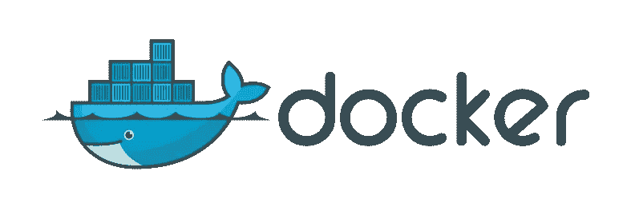
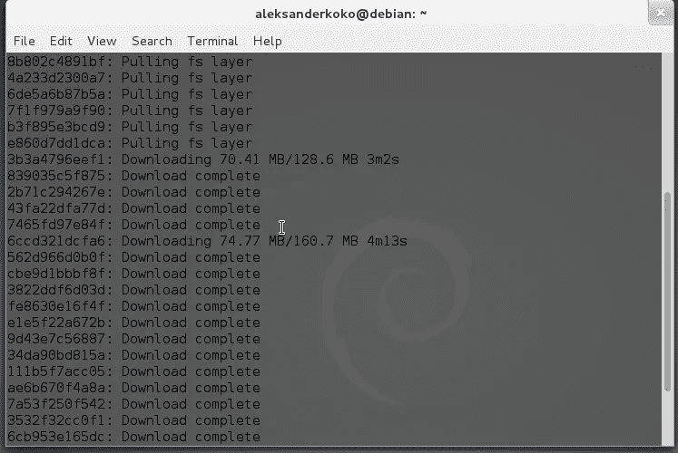
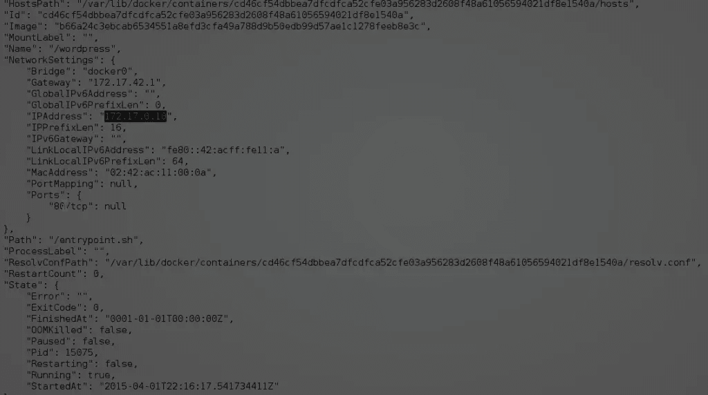
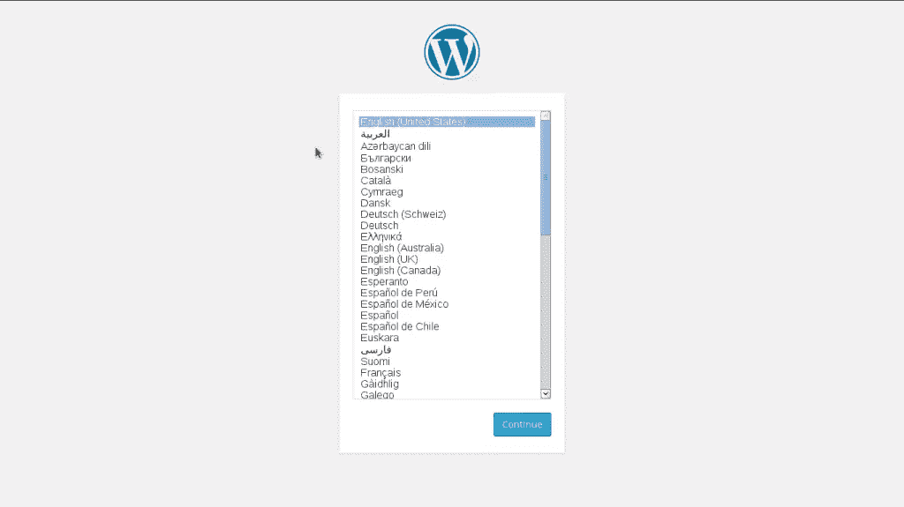

# 如何使用 Docker WordPress 官方图片

> 原文：<https://www.sitepoint.com/how-to-use-the-official-docker-wordpress-image/>

在本系列的前几篇文章中，[我们介绍了什么是 Docker](https://www.sitepoint.com/docker-for-wordpress-developers/)，然后是[如何为 WordPress](https://www.sitepoint.com/how-to-manually-build-docker-containers-for-wordpress/) 手动构建 Docker 容器。



在这篇文章中，我将向你展示如何用一种更简单的方式来设置 Docker。Docker 为 WordPress 提供了一个[官方形象，这使得它更容易上手。我们还将查看类似 Heroku 的配置的](https://registry.hub.docker.com/_/wordpress/) [Docker Compose](http://docs.docker.com/compose/) 。毕竟，手工构建和管理容器可能需要大量的工作。

## 官方的 WordPress Docker 图片

在我们开始之前，请确保您创建了一个新文件夹，并在该文件夹中导航。

在我之前的文章中，我们构建了一个 MySQL 容器。官方的 WordPress 镜像(由 Docker 团队开发)要求你有一个运行的 MySQL 容器。

```
docker run --name wordpressdb -e MYSQL_ROOT_PASSWORD=password -e MYSQL_DATABASE=wordpress -d mysql:5.7
```

接下来，在 Docker Hub 上搜索“WordPress ”,调出图片。

```
docker pull wordpress
```



然后，从它构建一个容器。

```
docker run -e WORDPRESS_DB_PASSWORD=password -d --name wordpress --link wordpressdb:mysql  wordpress
```

我们看到两个环境变量。`WORDPRESS_DB_PASSWORD`是我们用户的数据库密码。但是我们还没有具体说明。不过不要担心，这个图像将使用我们没有指定的环境变量的默认值(当容器第一次被创建时)。举个例子，`WORDPRESS_DB_USER`如果不定义就会是`root`。这同样适用于默认为`wordpress`的数据库名称。查看[官方文档](https://docs.docker.com/compose/cli/)了解更多环境变量。`-d`让容器在后台运行。我们看不到容器的 IP 地址，执行`docker inspect wordpress`来获取它的 IP 和端口。我的是`172.17.0.10`，端口是 80。使用`docker inspect`，您可以找到许多关于容器的有用信息。



在你的浏览器中访问你的 **wordpress** 容器的 IP，你会看到类似这样的内容:



这个例子的问题是我们不能访问 WordPress 文件，而且每次我们启动容器，它都会改变它的 IP。但是我们可以轻松解决这两个问题。

```
docker run -e WORDPRESS_DB_PASSWORD=password -d --name wordpress --link wordpressdb:mysql -p 127.0.0.2:8080:80 -v "$PWD/":/var/www/html  wordpress
```

这是一个很长的命令，我们在这里看到两个新的参数。`-p`和`-v`自变量。`-p`参数用于[端口映射](https://docs.docker.com/userguide/usingdocker/#viewing-our-web-application-container)。在容器内部，Apache 运行在端口`80`上。我们告诉 Docker，我们将使用端口`8080`与容器内部的端口`80`进行通信。此外，我们指定`127.0.0.2`作为这个容器的 IP。`-v "$PWD/":/var/www/html`将映射两个文件夹。默认情况下，容器将 WordPress 文件放在`/var/www/html`目录中，这是容器内部的文件系统(这与我们的本地文件系统无关)。检查你当前的目录，你会看到一些额外的文件在那里。

使用您的新容器，您现在将能够修改我们的文件系统中的文件。在前面的例子中，能够写入我们的文件系统需要做更多的工作。这个方法简单很多。但是还能再简单一点吗？当然可以！

## 复合坞站

到目前为止，我们已经看到了如何在终端上使用命令创建容器。尽管我热爱 Linux 和终端，但我真的不想使用命令行创建容器，并且总是记住各种参数。这就是为什么 [Docker Compose](https://docs.docker.com/compose/) 存在的原因。

这个工具以名字 [Fig](http://www.fig.sh/) (不是 Docker 团队)开始，作为一个开源的、更容易管理多个容器的解决方案。现在该工具由 Docker 官方维护(名为 Docker Compose)。在移动构图之前，确保首先[安装](https://docs.docker.com/compose/install/)。您所需要的只是一个`docker-compose.yml`文件和一个新的项目文件夹。在这个文件中，我们将编写构建 **wordpress** 和 **mysql** 容器所需的所有配置。Docker Compose 就像 Docker CLI 一样，使用 Docker 守护进程来创建容器，所以基本上您可以做几乎所有使用 CLI 做的事情。

让我们看一个例子:

```
web:
    image: wordpress
    links:
     - mysql    environment:
     - WORDPRESS_DB_PASSWORD=password    ports:
     - "127.0.0.3:8080:80" mysql:
    image: mysql:5.7
    environment:
     - MYSQL_ROOT_PASSWORD=password     - MYSQL_DATABASE=wordpress
```

这应该是大多数读者都熟悉的。`web`和`mysql`是容器的名称。当这些容器从 Compose 构建时，实际名称是不同的。从 Compose 创建的容器有一个类似于`[foldername]compose_[containername]_[number]`的名字。`[foldername]`将是`docker-compose.yml`的父文件夹，`[containername]`将是 **web** 或 **mysql** ，而`[number]`将是容器的编号。Compose 的好处是你可以拥有一种类型的多个容器。我们可以有两个 web 容器。在这种情况下，它们的名字是`[foldername]compose_web_1`和`[foldername]compose_web_2`。这也适用于在`docker-compose.yml`中定义的其他容器(例如 **mysql** 容器)。

当使用一种类型的容器时，您需要指定单独的 IP 地址。

```
environment:
     - WORDPRESS_DB_PASSWORD=password
```

这就像`-e WORDPRESS_DB_PASSWORD=password`一样。

```
links:
     - mysql
```

这就像`--link mysql:mysql`一样。

```
ports:
     - "127.0.0.3:8080:80"
```

这就像`-p 127.0.0.3:8080:80`一样。

要了解更多关于 Docker Compose 命令和`docker-compose.yml`的信息，你可以在这里找到[CLI 参考](https://docs.docker.com/compose/cli/)，在这里找到 [docker-compose.yml 参考](https://docs.docker.com/compose/yml/)。

现在您已经得到了您的`docker-compose.yml`文件，执行`docker-compose up`并且 Compose 将开始为您构建容器。导航到`127.0.0.3:8080`，你会再次看到一个欢迎页面。现在，我们需要的是访问 WordPress 文件。

正如我们之前所讨论的，为了访问本地文件系统上的 WordPress 文件，我们需要做一些类似于`-v "$PWD/":/var/www/html`的事情。您应该添加一个工作目录并映射两个文件夹(一个在您的容器上，一个在您的本地文件系统上)。为此，我们只需添加以下两行:

```
 working_dir: /var/www/html
    volumes:
     - wordpress/wp-content/:/var/www/html/wp-content
```

`working_dir`告诉 WordPress 映像在那个目录中安装 WordPress。`volumes:`表现得像`-v "$PWD/wordpress":/var/www/html/wp-content`。WordPress 文件存在于`/var/www/html`文件夹下。我们真的只对`wp-content`文件夹感兴趣，因为那是我们的插件和主题所在的地方。毕竟大部分开发者只处理这个文件夹。

再次执行`docker-compose up`。如果您在 Linux 上，您应该将`wordpress`文件夹(本地文件夹)的权限更改为可写。这是因为容器是由 Docker 守护进程创建的，这个进程在系统引导时启动(由 sudo 用户创建)。要解决这个问题，请执行:

```
sudo chmod -R 777 wordpress
```

现在，您可以对这些文件夹进行写访问了，一切都准备就绪！

## 结论

在这篇文章中，我们看到了如何使用官方的 WordPress Docker 图片，并简要介绍了 Docker Compose。如果您还没有查看本系列之前的文章，您可以在下面找到它们:

*   [面向 WordPress 开发者的 Docker 简介](https://www.sitepoint.com/docker-for-wordpress-developers/)
*   [如何为 WordPress 手动构建 Docker 容器](https://www.sitepoint.com/how-to-manually-build-docker-containers-for-wordpress/)

如果不向您展示如何部署一个 WordPress 项目，这个系列将是不完整的。在下一篇文章中，我将展示如何在 DigitalOcean 上部署一个基于 Docker 的 WordPress 项目。敬请期待！

如果您已经阅读了本系列，那么您现在应该对 Docker 工作原理的基本概念有了更好的理解。您现在应该能够使用抽象和工具来使事情变得更加简单。如果你有任何问题，请在下面留言。我知道这是我第三次问了，但我很感兴趣的是，您是否会考虑在您的下一个项目的生产中使用 Docker？

## 分享这篇文章