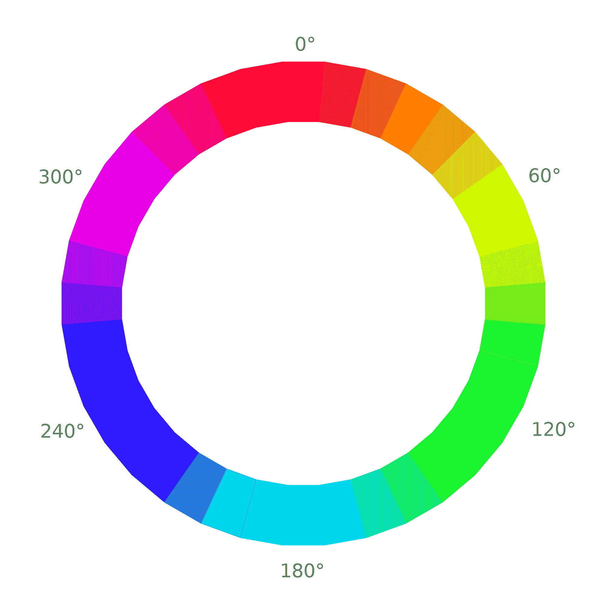
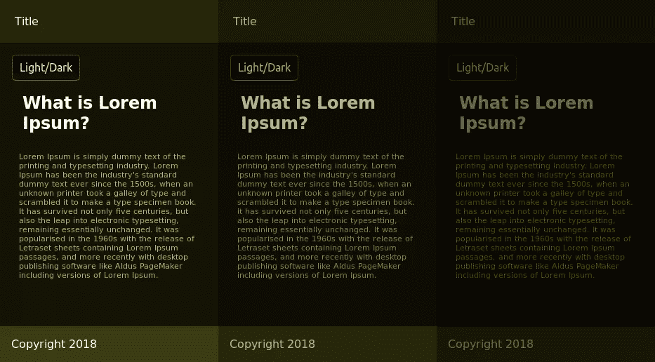

# 如何在 CSS 中使用变量

> 原文：<https://www.sitepoint.com/how-to-use-variables-in-css/>

CSS 变量(官方称为自定义属性)是用户定义的值，可以在整个代码库中设置一次并多次使用。它们使管理颜色、字体、大小和动画值变得更加容易，并确保跨 web 应用程序的一致性。

例如，您可以将品牌颜色设置为 CSS 属性(`--primarycolor: #7232FA`)，并在使用您的品牌颜色(`background: var(--primarycolor);`)的任何组件或样式中使用该值。

除了提供更干净和不重复的代码，CSS 变量还可以用来构建[调色板](#h-color-palettes)、[提高响应能力](#h-media-queries)，以及创建动态类型系统。

这篇文章摘自我的指南 [CSS 大师](https://www.sitepoint.com/premium/books/css-master-3rd-edition/)，它教你写出更好、更高效的 CSS。您还将学习掌握能够改进您的工作流程和构建更好的应用程序的工具。

## 定义 CSS 变量

要定义自定义属性，请选择一个名称并以两个连字符作为前缀。任何字母数字字符都可以是名称的一部分。也允许使用连字符(`-`)和下划线(`_`)字符。许多 Unicode 字符可以是自定义属性名的一部分。这包括表情符号，但为了清晰易读，坚持使用字母数字名称。

这里有一个例子:

```
--primarycolor: #0ad0f9ff; /* RGB alpha hexadecimal color notation */
```

`--`向 CSS 解析器表明这是一个定制属性。当用作变量时，解析引擎用其值替换属性。

自定义属性名*区分大小写*。这意味着`--primaryColor`和`--primarycolor`被认为是两个不同的属性名。这与传统的 CSS 不同，在传统的 CSS 中，属性和值大小写无关紧要。但是，这与 ECMAScript 中的变量名规则是一致的。

与其他属性一样，如`display`或`font`，CSS 自定义属性必须在声明块中定义。一种常见的模式是使用`:root`伪元素作为选择器来定义定制属性:

```
:root {
  --primarycolor: #0ad0f9ff;
}
```

`:root`是一个伪元素，表示文档的根元素。对于 HTML 文档，这是`<html>`元素。对于 SVG 文档，它是`<svg>`元素。使用`:root`使属性在整个文档中立即可用。

## 使用 CSS 变量

要使用自定义属性作为变量，我们需要使用`var()`函数。例如，如果我们想使用我们的`--primarycolor`自定义属性作为背景颜色，我们应该做以下事情:

```
body {
    background-color: var(--primarycolor);
}
```

我们的自定义属性的值将成为`background-color`属性的计算值。

迄今为止，自定义属性只能用作变量来设置标准 CSS 属性的值。例如，您不能将名为的属性*存储为变量，然后重用它。以下 CSS 不起作用:*

```
:root {
    --top-border: border-top; /* Can't set a property as custom property's value */
    var(--top-border): 10px solid #bc84d8; /* Can't use a variable as a property */
}
```

你也不能将一个属性值对*存储为一个变量并重用它。下面的例子也是无效的:*

```
:root {
    --text-color: 'color: orange'; /* Invalid property value */
}
body {
    var(--text-color); /* Invalid use of a property */
}
```

最后，您不能将变量连接为值字符串的一部分:

```
:root {
    --base-font-size: 10;
}
body {
    font: var(--base-font-size)px / 1.25 sans-serif; /* Invalid CSS syntax */
}
```

### CSS 自定义属性与 CSS 变量

“自定义属性”是一个经得起未来考验的名称，它说明了将来某一天可能会如何使用该功能。然而，如果浏览器厂商实现了 [CSS 扩展](https://drafts.csswg.org/css-extensions/)规范，这种情况可能会改变。该规范定义了使用自定义选择器组合、函数和 at-rules 来扩展 CSS 的方法。

我们通常称自定义属性为“变量”，迄今为止，这是我们使用它们的唯一方式。理论上，它们不是完全可以互换的术语。实际上，就目前而言，的确如此。在本文中，我将主要使用*自定义属性*，因为这是它们的专有名称。我会用*变量*让句子更清楚。

### 设置回退值

`var()`函数最多接受两个参数。第一个参数应该是自定义属性名。第二个参数是可选的，但必须是一个声明值。当自定义属性值未定义时，此声明值作为应用的后备值或默认值。

就拿下面这个 CSS 来说吧:

```
.btn__call-to-action {
    background: var(--accent-color, deepskyblue);
}
```

如果定义了`--accent-color`——假设它的值是`#f30`——那么任何带有`.btn__call-to-action`类属性的路径的填充颜色都将是橙红色。如果没有定义，填充将是深蓝色。

声明值也可以嵌套。换句话说，您可以使用一个变量作为`var`函数的后备值:

```
body {
    background-color: var(--books-bg, var(--arts-bg));
}
```

在上面的 CSS 中，如果定义了`--books-bg`，背景颜色将被设置为`--books-bg`属性的值。如果不是，背景颜色将会是分配给`--arts-bg`的值。如果两者都没有定义，背景颜色将是属性的初始值—在本例中是`transparent`。

当自定义属性的值对于与其一起使用的属性无效时，也会发生类似的情况。考虑以下 CSS:

```
:root {
    --text-primary: #600;
    --footer-link-hover: #0cg; /* Not a valid color value */
}
body {
    color: var(--text-primary);
}
a:link {
    color: blue;
}
a:hover {
    color: red;
}
footer a:hover {
    color: var(--footer-link-hover);
}
```

在这种情况下，`--footer-link-hover`属性的值不是有效的颜色。相反，`footer a:hover`继承了`<body>`元素的颜色。

自定义属性的解析方式与其他 CSS 值的解析方式相同。如果值无效或未定义，如果属性是可继承的，CSS 解析器将使用继承的值(如`color`或`font`)，如果属性不是可继承的，则使用初始值(如`background-color`)。

### 级联值

自定义属性也遵循级联规则。它们的值可以被后续规则覆盖:

```
:root {
    --text-color: #190736; /* navy */
}
body {
    --text-color: #333;  /* dark gray */
}
body {
    color: var(--text-color);
}
```

在上面的例子中，我们的正文是深灰色的。我们还可以在每个选择器的基础上重置值。让我们在这个 CSS 中再添加一些规则:

```
:root {
    --text-color: #190736; /* navy */
}
body {
    --text-color: #333;   /* dark gray */
}
p {
    --text-color: #f60;  /* orange */
}
body {
    color: var(--text-color);
}
p {
    color: var(--text-color)
}
```

在这种情况下，任何包含在`<p>`元素标签中的文本都是橙色的。但是`<div>`或其他元素中的文本仍然是深灰色。

您还可以使用`style`属性设置自定义属性的值，例如`style="--brand-color: #9a09af"`。

## 自定义属性和调色板

自定义属性特别适用于管理 HSL 调色板。 **HSL** 代表*色相、饱和度、明度*。这是一种基于光线的颜色模型，类似于 RGB。由于有了`hsl()`和`hsla()`颜色函数，我们可以在 CSS 中使用 HSL 值。`hsl()`函数接受三个参数:色调、饱和度和亮度。`hlsa()`函数还接受第四个参数，表示颜色的 alpha 透明度(一个介于 0 和 1 之间的值)。

RGB 系统将颜色表示为红色、绿色和蓝色的比例，而 HSL 使用色环，其中色调是色环上的度数位置，色调或阴影使用饱和度和亮度值来定义。饱和度的范围从 0%到 100%，其中 0%是灰色，100%是全色。明度的范围也可以从 0%到 100%，其中 0%是黑色，100%是白色，50%是正常颜色。



来自 Openclipart 的 [CrazyTerabyte](https://openclipart.org/detail/226044/chromatic-wheel) 的*色轮。*

在 HSL 颜色系统中，原色红、绿和蓝在 0 度/360 度、120 度和 240 度处相距 120 度。二次色(青色、洋红色和黄色)也相距 120 度，但与原色相对，分别为 180 度、300 度和 60 度/420 度。第三、第四和其他颜色以大约 10 度的增量介于两者之间。使用 HSL 符号书写的蓝色将是`hsl(240, 100%, 50%)`。

### HSL 参数单元

当您为`hsl()`和`hsla()`函数的第一个参数使用无单位值时，浏览器会假设它是一个以度为单位的角度。但是，您可以使用任何支持[的 CSS 角度单元](https://drafts.csswg.org/css-values-4/#angles)。蓝色也可以表示为`hsl(240deg, 100%, 50%)`、`hsl(4.188rad, 100%, 50%)`或`hsla(0.66turn, 100% 50%)`。

这就是有趣的地方。我们可以使用自定义属性设置色调值，并通过调整饱和度和亮度值来设置较亮和较暗的阴影:

```
:root {
    --brand-hue:      270deg;  /* purple */
    --brand-hue-alt:  .25turn; /* green */

  /*
    hsl() and hsla() can accept comma-separated or space-separated arguments,
    but older browsers (such as Internet Explorer 11) only support
    comma-separated arguments.
  */

    --brand-primary:   hsl( var( --brand-hue ) 100% 50% );
    --brand-highlight: hsl( var( --brand-hue ) 100% 75% );
    --brand-lowlight:  hsl( var( --brand-hue ) 100% 25% );
    --brand-inactive:  hsl( var( --brand-hue )  50% 50% );

    --brand-secondary:     hsl( var( --brand-hue-alt ) 100% 50% );
    --brand-2nd-highlight: hsl( var( --brand-hue-alt ) 100% 75% );
    --brand-2nd-lowlight:  hsl( var( --brand-hue-alt ) 100% 25% );
    --brand-2nd-inactive:  hsl( var( --brand-hue-alt )  50% 50% );
}
```

上面的 CSS 给了我们如下所示的调色板。


这是一个简单的版本，但是你也可以使用自定义属性来调整饱和度和亮度值。

### 强大的调色板生成

Dieter Raber 在“[使用自定义属性、HSL 和一点 calc()](https://css-tricks.com/creating-color-themes-with-custom-properties-hsl-and-a-little-calc/) 创建颜色主题”中讨论了一种健壮的调色板生成技术。

另一个想法是将自定义属性和`calc()`函数结合起来，从基本色调生成正方形配色方案。让我们在下一个例子中创建一个正方形配色方案。一个**方形配色方案**由四种颜色组成，这四种颜色在色轮上彼此等距，即相隔 90 度:

```
:root {
    --base-hue: 310deg; /* Hot pink */
    --distance: 90deg;

    --color-a: hsl( var(--base-hue), 100%, 50% );
    --color-b: hsl( calc( var(--base-hue) + var( --distance ) ), 100%, 50% );
    --color-c: hsl( calc( var(--base-hue) + ( var( --distance ) * 2 ) ), 100%, 50% );
    --color-d: hsl( calc( var(--base-hue) + ( var( --distance ) * 3 ) ), 100%, 50% );
}
```

这个 CSS 给了我们热带风格的配色方案，如下所示。


自定义属性也适用于媒体查询，我们将在后面的章节中看到。

### 使用 CSS 变量制作深色主题调色板

您可以使用 CSS 自定义属性为站点上的深色和浅色主题定义变量集。

以下面的页面样式为例，在`:root`中为相应的颜色定义了自定义属性后，我们可以用变量替换不同选择器中的所有 HSL 颜色:

```
:root{
  /*...*/
  --nav-bg-color: hsl(var(--primarycolor) , 50%, 50%);
  --nav-text-color: hsl(var(--primarycolor), 50%, 10%);
  --container-bg-color: hsl(var(--primarycolor) , 50%, 95%);
  --content-text-color: hsl(var(--primarycolor) , 50%, 50%);
  --title-color: hsl(var(--primarycolor) , 50%, 20%);
  --footer-bg-color: hsl(var(--primarycolor) , 93%, 88%);
  --button-text-color: hsl(var(--primarycolor), 50%, 20%);
}
```

已经为自定义属性使用了适当的名称。例如，`--nav-bg-color`是指*导航背景的颜色*，而`--nav-text-color`是指*导航前景/文字的颜色*。

现在复制带有内容的`:root`选择器，但是添加一个带有*暗*值的主题属性:

```
:root[theme='dark']{
  /*...*/
}
```

如果一个带有*暗*值的*主题*属性被添加到`<html>`元素中，这个主题将被激活。

我们现在可以手动调整这些变量的值，通过降低 HSL 颜色的亮度值来提供一个黑暗的主题，或者我们可以使用其他技术，如 CSS 滤镜，如`invert()`和`brightness()`，它们通常用于调整图像的渲染，但也可以用于任何其他元素。

将以下代码添加到`:root[theme='dark']`:

```
:root[theme='dark'] {
  --dark-hue: 240;
  --light-hue: 250;
  --primarycolor: var(--dark-hue);
  --nav-bg-color: hsl(var(--primarycolor), 50%, 90%);
  --nav-text-color: hsl(var(--primarycolor), 50%, 10%);
  --container-bg-color: hsl(var(--primarycolor), 50%, 95%);
  --content-text-color: hsl(var(--primarycolor), 50%, 50%);
  --title-color: hsl(--primarycolor, 50%, 20%);
  --footer-bg-color: hsl(var(--primarycolor), 93%, 88%);
  --button-text-color: hsl(var(--primarycolor), 50%, 20%);
  filter: invert(1) brightness(0.6);
} 
```

`invert()`滤镜反转所选元素中的所有颜色(本例中是每个元素)。反转值可以用百分比或数字来指定。值`100%`或`1`将完全反转元素的色调、饱和度和亮度值。

`brightness()`滤镜使元素变亮或变暗。值`0`导致完全黑暗的元素。

`invert()`滤镜让一些元素变得非常亮。这些通过设置`brightness(0.6)`来减弱。

一个黑暗程度不同的黑暗主题:



#### 用 JavaScript 切换主题

现在让我们使用 JavaScript 在用户点击*暗/亮*按钮时在暗和亮主题之间切换。在您的 HTML 中，使用以下代码在结束`</body>`之前添加一个内联`<script>`:

```
const toggleBtn = document.querySelector("#toggle-theme");
toggleBtn.addEventListener('click', e => {
  console.log("Switching theme");
  if(document.documentElement.hasAttribute('theme')){
    document.documentElement.removeAttribute('theme');
  }
  else{
    document.documentElement.setAttribute('theme', 'dark');
  }
}); 
```

**Document.documentElement** 是指文档的根 DOM 元素——也就是`<html>`。这段代码使用`.hasAttribute()`方法检查一个*主题*属性的存在，如果不存在，添加一个带有*暗*值的属性，导致切换到暗主题。否则，它会移除属性，从而切换到灯光主题。

**注意:**你也应该结合 CSS 中的[偏好颜色方案](https://developer.mozilla.org/en-US/docs/Web/CSS/@media/prefers-color-scheme)特性来使用，该特性可用于从用户的操作系统或用户代理(浏览器)设置中自动改变亮/暗主题。这将在下一节中显示。

## 使用自定义属性和媒体查询

我们还可以在媒体查询中使用自定义属性。例如，您可以使用自定义属性来定义浅色和深色配色方案:

```
:root {
    --background-primary: hsl(34, 78%, 91%);
    --text-primary: hsl(25, 76%, 10%);
    --button-primary-bg: hsl(214, 77%, 10%);
    --button-primary-fg: hsl(214, 77%, 98%);
}
@media screen and ( prefers-color-scheme: dark ) {
    :root {
      --background-primary: hsl(25, 76%, 10%);
      --text-primary: hsl(34, 78%, 91%);
      --button-primary-bg: hsl(214, 77%, 98%);
      --button-primary-fg: hsl(214, 77%, 10%);
  }
}
```

同样，我们可以使用自定义属性来更改屏幕和打印的基本字体大小:

```
:r:root {
    --base-font-size: 10px;
}
@media print {
    :root {
        --base-font-size: 10pt;
    }
}
html {
    font: var(--base-font-size) / 1.5 sans-serif;
}
body {
    font-size: 1.6rem;
}
```

在这种情况下，我们对打印和屏幕使用适合媒体的单位。对于这两种媒体，我们将使用 10 个单位的基本字体大小——像素用于屏幕，磅用于打印。我们还将使用`--base-font-size:`的值来设置根元素(`html`)的起始大小。然后我们可以使用 [`rem`单位](https://www.sitepoint.com/understanding-and-using-rem-units-in-css/)来相对于基本字体大小调整我们的字体大小。

## 在 JavaScript 中使用自定义属性

记住:自定义属性是 CSS 属性，我们可以像这样与它们交互。例如，我们可以使用`CSS.supports()` API 来测试浏览器是否支持自定义属性:

```
const supportsCustomProps = CSS.supports('--primary-text: #000');

// Logs true to the console in browsers that support custom properties
console.log(supportsCustomProps);
```

我们还可以使用`setProperty()`方法来设置一个定制的属性值:

```
document.body.style.setProperty('--bg-home', 'whitesmoke');
```

使用`removeProperty()`的工作方式类似。只需将自定义属性名作为参数传递:

```
document.body.style.removeProperty('--bg-home');
```

要在 JavaScript 中将自定义属性作为值使用，请使用`var()`函数，并将属性名称作为其参数:

```
document.body.style.backgroundColor = 'var(--bg-home)';
```

唉，您不能使用方括号语法或样式对象的 camelCased 属性来设置自定义属性。换句话说，`document.body.style.--bg-home`和`document.body.style['--bg-home']`都不行。

## 自定义属性和组件

React、Angular 和 Vue 等 JavaScript 框架允许开发人员使用 JavaScript 创建可重用、可共享的 HTML 块，通常使用在组件级定义的 CSS。

这里有一个 React 组件的例子，用 **[JSX](https://reactjs.org/docs/introducing-jsx.html)** 编写，是 JavaScript 的语法扩展:

```
import React from 'react';

/* Importing the associated CSS into this component */
import '../css/field-button.css';

class FieldButtonGroup extends React.Component {
    render() {
        return (
            <div className="field__button__group">
                <label htmlFor={this.props.id}>{this.props.labelText}</label>
                <div>
                    <input type={this.props.type}
                      name={this.props.name}
                      id={this.props.id}
                      onChange={this.props.onChangeHandler} />
                    <button type="submit">{this.props.buttonText}</button>
                 </div>
            </div>
        );
    }
}

export default FieldButtonGroup;
```

### 关于 JavaScript 框架的更多信息

如果你想学习更多关于使用 JavaScript 框架的知识，SitePoint 有大量关于 React、Angular 和 Vue 的资源。对于 React，请查看 React 的第一周和 React[的大量文章](https://www.sitepoint.com/tag/react/)。对于 Angular，有 *[学习 Angular:你的第一周](https://www.sitepoint.com/premium/books/learn-angular-your-first-week/read/1/)* 和大量的 [Angular 文章和教程](https://www.sitepoint.com/tag/angular/)。关于 Vue，请查看*[Jump Start Vue . js](https://www.sitepoint.com/premium/books/jump-start-vue-js-2nd-edition/read/1/)*及更多 [Vue 文章](https://www.sitepoint.com/tag/vue/)。

我们的 React 组件将 CSS 导入一个 JavaScript 文件。编译时，`field-button.css`的内容被内联加载。下面是将它用于自定义属性的一种可能方式:

```
.field__button__group label {
    display: block;
}
.field__button__group button {
    flex: 0 1 10rem;
    background-color: var(--button-bg-color, rgb(103, 58, 183)); /* include a default */
    color: #fff;
    border: none;
}
```

在这个例子中，我们使用了一个定制属性——`--button-bg-color`——作为按钮的背景颜色，以及一个默认颜色，以防`--button-bg-color`永远不会被定义。在这里，我们可以在全局样式表中或者通过`style`属性在本地设置`--button-bg-color`的值。

让我们将值设置为一个反应“道具”。反应**道具**(简称*属性*)模仿元素属性。它们是将数据传递给 React 组件的一种方式。在这种情况下，我们将添加一个名为`buttonBgColor`的道具:

```
import FieldButtonGroup from '../FieldButtonGroup';

class NewsletterSignup extends React.Component {
    render() {
        // For brevity, we've left out the onChangeHandler prop.
        return (
            <FieldButtonGroup type="email" name="newsletter" id="newsletter"
              labelText="E-mail address" buttonText="Subscribe"
              buttonBgColor="rgb(75, 97, 108)" />
        );
    }
}

export default NewsletterSignup;
```

现在我们需要更新我们的`FieldButtonGroup`来支持这一变化:

```
class FieldButtonGroup extends React.Component {
    render() {
        /*
        In React, the style attribute value must be set using a JavaScript
        object in which the object keys are CSS properties. Properties
        should either be camelCased (e.g. backgroundColor) or enclosed in
        quotes.
        */

        const buttonStyle = {
            '--button-bg-color': this.props.buttonBgColor
        };

        return (
            <div className="field__button__group">
                <label htmlFor={this.props.id}>{this.props.labelText}</label>
                <div>
                    <input type={this.props.type} 
                      name={this.props.name} id={this.props.id}
                      onChange={this.props.onChangeHandler} />
                    <button type="submit" style={buttonStyle}>
                      {this.props.buttonText}
                    </button>
                </div>
            </div>
        );
    }
}
```

在上面的代码中，我们添加了一个保存自定义属性名称的`buttonStyle`对象，并将它的值设置为我们的`buttonBgColor`属性的值，并为我们的按钮添加了一个`style`属性。

使用`style`属性可能与你学到的关于编写 CSS 的所有东西背道而驰。CSS 的一个卖点是我们可以定义一组样式用于多个 HTML 和 XML 文档。另一方面，`style`属性将 CSS 的范围限制在它所应用的元素上。我们不能重复使用它。我们不能利用瀑布。

但是在基于组件的前端架构中，一个组件可能被多个团队用在多个上下文中，甚至可能被多个客户项目共享。在这些情况下，您可能希望将级联的“全局范围”与由`style`属性提供的狭窄的“局部范围”结合起来。

用`style`属性设置自定义属性值会将效果限制在`FieldButtonGroup`组件的这个特定实例的*上。但是因为我们使用了自定义属性而不是标准 CSS 属性，我们仍然可以选择在链接的样式表中定义`--button-bg-color`,而不是作为组件属性。*

## 结论

自定义属性利用了预处理程序的最佳特性之一——变量——并使它们成为 CSS 的原生特性。使用自定义属性，我们可以:

*   创建可重用的主题组件
*   轻松调整各种视窗大小和媒体的填充、边距和版式
*   提高 CSS 中颜色值的一致性

变量有广泛的应用，在基于组件的设计系统中特别有用。

我希望您现在对如何在 CSS 中使用变量或自定义属性有了更好的理解。查看我的课程， [CSS 大师](https://www.sitepoint.com/premium/books/css-master-3rd-edition/)，扩展你的 CSS 知识，获得更多有用的提示。

## 分享这篇文章