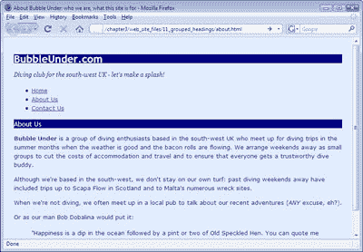

# 学习 HTML 和 CSS:绝对的初学者指南文章

> 原文：<https://www.sitepoint.com/html-css-beginners-guide-17/>

##### 在上下文中查看元素

给你出个谜语:这些物品中哪个更大？一只笔还是一只羊？嗯，答案是要么，看上下文。如果你是个农民，你会发誓这支笔更大。毕竟，你一周要花很多时间把羊群赶到一个又大又结实的围栏里。然而，如果你是一名办公室工作人员，你会选择两只羊中较大的一只——毕竟，你会发现拿起一支笔在手指上弹来弹去要容易得多。

上下文可以彻底改变一种情况，我们可以在 CSS 中利用上下文。根据元素的位置，我们可以用多种不同的方式来设计元素的样式。让我们回到我们的示例站点来上另一课。别害羞，现在！

目前，我们已经设计了段落的样式，使它们以深蓝色、无衬线字体(特别是 Verdana)显示，就像页面上的其他内容一样:

```
body {                 

     font-family: Verdana, Helvetica, Arial, sans-serif;                 

    }                 

    p {                 

      font-size: small;                 

      color: navy;                 

    }
```

这一切都很好，但在我们的网站上有一个段落，就其目的而言，与其他段落略有不同。你能认出是哪一个吗？这是我们的第一段，标语里的那一段。下面是该部分的 XHTML:

**`index.html`(节选)**
`<div id="tagline">                
 <p>Diving club for the south-west UK - let's make a splash!</p>                
</div>`

这是不同的，因为它不是文档内容的一部分，因此，它可能会受益于一些不同的样式。这个特定的段落包含在一个特定的`div`元素中——该元素有一个`tagline`的`id`属性——这一事实可能是有用的。因为它包含在自己的`div`中，所以我们可以只为这一段设置一个规则。

*   打开 CSS 文件进行编辑，在第一个段落规则后添加以下内容:

    ```
    #tagline p {                
           font-style: italic;                
           font-family: Georgia, Times, serif;                
          }
    ```

*   Save the file, then refresh the About Us page (or any of the three, for that matter) in your browser. Your page should now look similar to the one shown below.

    

这里发生了什么事？也许需要 CSS 到英语的翻译。这个 CSS 规则意味着，“对于任何出现在具有`tagline`的`id`元素中的段落元素，将文本设置为斜体，将字体设置为 Georgia、Times 或其他 serif 字体，如果这两种字体都没有的话。”

***注:获取正面 ID***

*CSS 中的`#`符号指的是具有特定`id`属性的元素——在本例中是`tagline`。我们将在后续章节中学习更多关于选择`id`和操纵它们的知识。*

##### 上下文选择器

```
#tagline p is known as a *contextual selector*. Here are some other examples (with their English translations):

```

```
    #navigation a {                
           text-decoration: none;                
          }
    ```

    ```
        Translation: for any link found inside the navigation area (an element with an id of navigation), remove any decoration on that text; in other words, remove the underline (any other links on the page will remain underlined).

    ```

```
    #footer p {                
           line-height: 150%;                
          }
    ```

    ```
        Translation: set the vertical height between lines of text contained in paragraphs inside the footer area (e.g. a div element with an id of footer) to 150%. This would override the browser default of 100%, or other line-height values that might be set, for example, for the body text.

    ```

```
    h1 strong {                
           color: red;                
          }
    ```

    ```
        Translation: for any text inside a level one heading that's marked up as strong, set the color to red (any other instance of strong on the page will not be set to red).

    ```

```
    h2 a {                
           text-decoration: none;                
          }
    ```

    **翻译**:不要给二级标题中的任何链接的文本加下划线(默认设置是给所有链接加下划线，因此页面上的任何其他链接都将保留下划线)。

##### 分组样式

如果你想在一个网页的不同元素上应用相同的样式，你不必重复自己。例如，假设您想将标题级别 1 到 3 设置为黑色背景的黄色文本。也许你会这样做:

```
h1 {                 

     color: yellow;                 

     background-color: black;                 

    }                 

    h2 {                 

     color: yellow;                 

     background-color: black;                 

    }                 

    h3 {                 

     color: yellow;                 

     background-color: black;                 

    }
```

那是非常杂乱和重复的。再加上一旦页面上有了很多样式，维护起来就更难了。如果你能减少一些工作不是很好吗？你可以！方法如下:

```
h1, h2, h3 {                 

     color: yellow;                 

     background-color: black;                 

    }
```

**Translation** :如果元素是一级标题、二级标题或三级标题，则将文本设置为黄色，背景设置为黑色。

*提示:逗号= "Or"*

你可以把 CSS 选择器中的逗号(如上图所示)想象成单词“or”

让我们尝试在我们的项目站点中对一些样式进行分组。我们还没有任何标题，但很快就会有了。

*   编辑你的 CSS 文件(`style1.css`)，在它的底部添加以下内容:

    ```
    h1, *h2, h3* {                
           font-family: "Trebuchet MS", Helvetica, Arial, sans-serif;                
           background-color: navy;                
           color: white;                
          }
    ```

*   保存文件，然后刷新浏览器中的“关于我们”页面。你应该看到如图 3.12 所示的页面，“显示改变的标题样式”。



那个 CSS 确实是一石几鸟(当然是打个比方；我说过不会伤害任何动物！).您不仅可以从一个中心位置(您的 CSS 文件)方便地设计许多页面的样式，还可以一次性设计许多元素的样式。你的 CSS 文件变得更容易管理，而且——一个不错的小好处——更小，因此下载更快。

*提示:样式表的文件名*

*尽管我们已经和`style1.css`一起工作了一段时间，你可能想知道为什么我们这样命名这个文件。这个名字是故意的。以后您可能想在网站上添加另一种样式，而编号是跟踪可应用于网站的样式的一种基本方法。*

*你可能会想，“为什么不把它命名为类似于`marine.css`的名字，因为它使用了海洋颜色，引用了海洋动物等等？”这是一个合理的问题，但重要的是要记住 CSS 是你总是可以在以后改变样式，并且你的命名约定可能在以后与文件包含的样式无关。例如，您可以编辑`marine.css`,使网站中的所有颜色都变成赭色、棕色和沙黄色。这种在一个动作中改变网站设计的能力就是 CSS 的全部意义！有了新的设计，你的网站可能会有一种泥土/沙漠的感觉，然而你仍然可以有 200 或更多的页面引用一个文件名为`marine.css`的样式表。不太对吧？这就是为什么我为 CSS 文件选择了一个抽象的名字，并且我建议你为你开发的网站选择同样的名字。*

但是有趣的事情正在我们的 CSS 文件中发生:似乎我们的规则中有冲突。或者我们有吗？

**Go to page:** [1](https://sitepoint.com/html-css-beginners-guide) | [2](https://sitepoint.com/html-css-beginners-guide-2/) | [3](https://sitepoint.com/html-css-beginners-guide-3/) | [4](https://sitepoint.com/html-css-beginners-guide-4/) | [5](https://sitepoint.com/html-css-beginners-guide-5/) | [6](https://sitepoint.com/html-css-beginners-guide-6/) | [7](https://sitepoint.com/html-css-beginners-guide-7/) | [8](https://sitepoint.com/html-css-beginners-guide-8/) | [9](https://sitepoint.com/html-css-beginners-guide-9/) | [10](https://sitepoint.com/html-css-beginners-guide-10/) | [11](https://sitepoint.com/html-css-beginners-guide-11/) | [12](https://sitepoint.com/html-css-beginners-guide-12/) | [13](https://sitepoint.com/html-css-beginners-guide-13/) | [14](https://sitepoint.com/html-css-beginners-guide-14/) | [15](https://sitepoint.com/html-css-beginners-guide-15/) | [16](https://sitepoint.com/html-css-beginners-guide-16/) | [17](https://sitepoint.com/html-css-beginners-guide-17/) | [18](https://sitepoint.com/html-css-beginners-guide-18/) | [19](https://sitepoint.com/html-css-beginners-guide-19/)

## 分享这篇文章