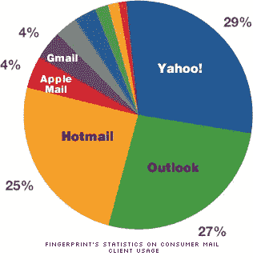

# HTML 电子邮件:人们使用什么邮件客户端？

> 原文：<https://www.sitepoint.com/html-email-what-mail-clients-are-people-using/>

讨厌 HTML 电子邮件的原因有很多，但大多数人最想做的事情可能就是制作 HTML 电子邮件，以发送给数百种不同的邮件客户端和配置。

现在，很明显，在数百个邮件平台上测试你的工作是完全不切实际的，但问题是，你的底线在哪里？一般的浏览器使用统计是相当常见的，但是邮件客户端统计呢？

*   Outlook 2007 的使用率是多少？
*   Gmail 在挑战 Hotmail 吗？
*   家庭用户是否使用不同的客户端开展业务？

在过去，你可以自信地在那些问题上编造任何你喜欢的数字，而不用担心被发现。但这种情况可能正在改变。

Litmus 公司生产了一个优秀的基于网络的浏览器和电子邮件测试套件，现在他们公布了来自他们新的[指纹电子邮件分析系统](http://fingerprintapp.com/email-client-stats)的电子邮件客户端使用统计数据。这是非常有趣的读物。

现在，就像一般的浏览器使用统计一样，这些都是基础广泛的数字，毫无疑问，较小的用户群使用概况可能会有很大的不同。尽管如此，Litmus 声称已经从近 300 万客户的池中提取了这些数据，所以如果你在过去除了直觉什么都没有，这是一个相当大的新闻。

指纹统计讲述的一些更有趣的故事包括:

*   消费者似乎越来越多地放弃他们的桌面邮件客户端，超过 60%的人更喜欢使用网络邮件客户端。
*   尽管 Gmail 为自己开拓了一小部分市场，但网络邮件的老忠实用户 Hotmail 和 Yahoo！邮件仍然统治着网络邮件市场，控制着超过一半的消费者市场和不到一半的商业市场。
*   企业仍然喜欢 Outlook，但不愿意跳到 Outlook 2007。
*   尽管消费者不太可能使用 Outlook，但他们也更有可能使用最新(也是最糟糕的)版本。
*   iPhone 在这两个类别中都进入了前 10 名，分别占据了 1.3%(企业)和 1%(消费者)的可观份额。

显然，Fingerprint 从嵌入在已发送邮件中的一行代码中整理数据，他们[提供一项服务](http://fingerprintapp.com/)，允许你分析自己邮件列表的浏览习惯。

我认为这对于电子邮件设计师、内容提供商和营销人员来说是非常有价值的数据，这一点毋庸置疑，所以如果我能为下一个设计视图组织一些东西，我会给你一个纲要。

## 分享这篇文章