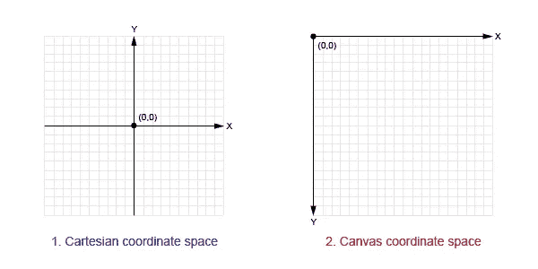

# HTML5 画布教程:简介

> 原文：<https://www.sitepoint.com/html5-canvas-tutorial-introduction/>

对 CSS 动画感兴趣？查看[用 CSS](https://www.sitepoint.com/premium/courses/animating-with-css-2941) 创建动画，这是一个关于 CSS 过渡和关键帧动画的完整课程，由专家 web 开发人员 Donovan Hutchinson 编写，可供 SitePoint 成员使用。对于 HTML5 画布动画的样本，观看下面 HTML5 画布的插图，这是我们的[开始用 HTML5 画布制作动画](https://www.sitepoint.com/premium/courses/start-animating-with-the-html5-canvas-2967)迷你课程中的一个视频。

画家工具箱中最重要的工具之一就是他们的画布。它给了他们以几乎无限的变化和组合来表达各种感觉、印象、想法等等的自由。这种自由只能受到两个因素的限制——他们的技能水平和想象力。

web 开发领域的情况类似。随着 HTML5 及其强大规范的不断发展，web 开发人员已经获得了做过去不可能的事情的能力。由于一种名为 [HTML5 Canvas](http://www.whatwg.org/specs/web-apps/current-work/multipage/the-canvas-element.html) 的技术，在浏览器中直接绘制图形和创建动画现在完全可能。

## HTML5 画布是什么？

canvas 元素是使用`width`和`height`属性在 HTML 代码中定义的元素。然而，canvas 元素的真正威力是通过利用 HTML5 Canvas API 来实现的。这个 API 是通过编写 JavaScript 来使用的，JavaScript 可以通过一组完整的绘图函数来访问画布区域，从而允许动态生成图形。

## HTML5 Canvas 有什么了不起的？

以下是你可能想考虑学习使用 HTML5 的 canvas 特性的一些原因:

*   **互动性。** Canvas 全交互。它可以通过监听键盘、鼠标或触摸事件来响应用户的操作。因此，开发人员不仅仅局限于静态图形和图像。
*   **动画。**画布上绘制的每个对象都可以制作动画。这允许创建所有层次的动画，从简单的弹跳球到复杂的正向和反向[运动学](https://en.wikipedia.org/wiki/Kinematics)。
*   **灵活性。开发人员可以使用 canvas 创建任何东西。它可以显示线条、形状、文本、图像等。—有或没有动画。另外，向画布应用程序添加视频和/或音频也是可能的。**
*   **浏览器/平台支持。** HTML5 Canvas 得到[所有主流浏览器](http://caniuse.com/#feat=canvas)的支持，可以在包括台式机、平板电脑和智能手机在内的各种设备上访问。
*   **人气。**画布的受欢迎程度正在快速稳步增长，因此可用资源并不短缺。
*   这是一个网络标准。与 Flash 和 Silverlight 不同，Canvas 是开放技术，是 HTML5 的一部分。尽管并非所有的浏览器都实现了它的所有功能，但开发者可以肯定 canvas 将会无限期存在。
*   **开发一次，到处跑。** HTML5 Canvas 提供了强大的可移植性。与 Flash 和 Silverlight 不同，一旦创建，画布应用程序几乎可以在任何地方运行——从最大的计算机到最小的移动设备。
*   免费且可访问的开发工具。创建 HTML5 canvas 应用的基本工具只是一个浏览器和一个好的代码编辑器。此外，还有许多很棒的免费库和工具来帮助开发人员进行高级 canvas 开发。

## 用 HTML5 Canvas 可以创建什么应用？

好吧，画布很棒。但是它到底能用来做什么呢？让我们看看。

*   **博彩。**html 5 Canvas 的特性集是制作各种 2D 和 3D 游戏的理想选择。
*   **广告。** HTML5 Canvas 是基于 Flash 的横幅和广告的绝佳替代品。它具备吸引买家注意力的所有必要特征。
*   **数据表示。** HTML5 可以从全局数据源收集数据，并使用它来生成视觉上吸引人的交互式图形和图表，并带有 canvas 元素。
*   **教育和培训。** HTML5 canvas 可用于结合文本、图像、视频和音频，产生有效且有吸引力的学习体验。
*   **艺术与装饰。**利用一点点想象力和 canvas 丰富多样的颜色、渐变、图案、透明度、阴影和剪裁功能，可以绘制出各种艺术和装饰图形。

既然知道了为什么要学习 canvas，那就来看看 HTML5 Canvas 的基础知识，以及如何开始使用它。

## 画布渲染上下文

每个 HTML5 canvas 元素都必须有一个*上下文*。上下文定义了您将使用的 HTML5 画布 API。2d 上下文用于绘制 2D 图形和操作位图图像。3d 上下文用于 3D 图形创建和操作。后者实际上叫做 [WebGL](https://en.wikipedia.org/wiki/WebGL) ，它基于 [OpenGL ES](https://en.wikipedia.org/wiki/OpenGL_ES) 。

## 入门指南

要开始使用 canvas，您需要的只是一个代码编辑器和一个支持 HTML5 canvas 的浏览器。我用的是 Sublime Text 和 Google Chrome，但是你想用什么都可以。

我们的 HTML 将如下所示:

```
<canvas id="exampleCanvas" width="500" height="300">

  <!-- OPTION 1: leave a message here if browser doesn't support canvas -->
    <p>Your browser doesn’t currently support HTML5 Canvas. 
    Please check caniuse.com/#feat=canvas for information on 
    browser support for canvas.</p>

  <!-- OPTION 2: put fallback content (text, image, Flash, etc.) 
                 if the browser doesn't support canvas -->

</canvas>
```

这是我们的 JavaScript，我们可以把它放在 HTML 页面的底部:

```
var canvas = document.getElementById('exampleCanvas'),
    context = canvas.getContext('2d');

    // code examples will continue here...
```

默认情况下，浏览器创建宽度为 300 像素、高度为 150 像素的画布元素，即使这些元素没有在 HTML 中指定。您可以通过指定`width`和`height`来改变大小，就像我在 HTML 中做的那样。

还要注意，我们给了画布一个`id`属性，我们将在 JavaScript 中使用它。最后，如果你愿意，你可以使用 CSS 来添加一个边框，通过一个细框来使画布可见。这不是必需的，它只是作为一种视觉辅助，帮助我们看到画布元素的边界。

注意，在开始和结束的`<canvas>`标记之间，我添加了如果浏览器不支持 canvas 时将显示的内容。这可以是旧浏览器支持的任何类型的内容。

JavaScript 从两行开始。在第一行中，我们创建了一个变量，通过它的 ID 缓存画布元素。第二行使用`getContext()`函数创建一个引用画布的 2D 上下文的变量(`context`)。我们将使用`context`变量来访问所有的画布绘制功能和属性。

我们的 canvas 已经准备就绪，我们可以开始尝试 Canvas API 了。但是在此之前，让我们澄清一下 canvas 特性的几个方面。

## HTML5 画布元素大小与绘图表面大小

除了 canvas 元素的`width`和`height`属性，您还可以使用 CSS 来设置 canvas 元素的大小。然而，用 CSS 调整画布元素的大小与设置元素的`width`和`height`属性是不同的。这是因为画布实际上有两种大小:元素本身的大小和元素绘图面的大小。

当您设置元素的`width`和`height`属性时，您设置了元素的大小和元素的绘图表面的大小；然而，当您使用 CSS 来调整画布元素的大小时，您只设置元素的大小，而不是绘图表面。当画布元素的大小与其绘图图面的大小不匹配时，浏览器会缩放绘图图面以适合该元素。

因此，最好使用 canvas 元素的`width`和`height`属性来调整元素的大小，而不是使用 CSS。

## 了解画布坐标系

在 2D 空间中，使用 X 和 Y 坐标来引用位置。X 轴水平延伸，Y 轴垂直延伸。中心有位置`x = 0`和`y = 0`，也可以表示为`(0, 0)`。这种定位物体的方法，在数学中被称为[笛卡尔坐标系](https://en.wikipedia.org/wiki/Cartesian_coordinate_system)。

然而，画布坐标系将原点放在画布的左上角，X 坐标向右增加，Y 坐标向画布底部增加。因此，与标准的笛卡尔坐标空间不同，画布空间没有可见的负点。使用负坐标不会导致应用程序失败，但是使用负坐标点定位的对象不会出现在页面上。



## 基本画布示例

如上所述，HTML5 Canvas 让你创建许多类型的对象，包括直线、曲线、路径、形状、文本等。在接下来的例子中，你可以看到这些物体是如何绘制的。我不会在 Canvas API 上做过多的描述；这些只是帮助你了解 canvas 工作原理的一些简单方法。

### 画线

为了画线，我们使用四个 canvas API 方法。我们从指示浏览器准备绘制新路径的`beginPath()`方法开始。接下来，我们使用`moveTo(x, y)`方法来设置线条的起点。然后`lineTo(x, y)`法设定终点，通过连接两点画出直线。

在这一点上，线将被绘制，但它仍然是不可见的。为了使它可见，我们使用`stroke()`方法用默认的黑色显示这条线。

```
context.beginPath();
context.moveTo(50, 50);
context.lineTo(250, 150);
context.stroke();
```

参见 [CodePen](http://codepen.io) 上 SitePoint ( [@SitePoint](http://codepen.io/SitePoint) )的笔[画布线条示例](http://codepen.io/SitePoint/pen/EApqr)。