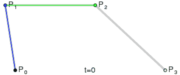
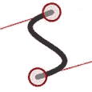
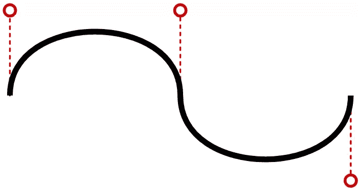

# 如何在 HTML5 SVGs 上绘制三次贝塞尔曲线

> 原文：<https://www.sitepoint.com/html5-svg-cubic-curves/>

**文章“[如何在 SVGs](https://www.sitepoint.com/svg-path-element/) 中创建复杂路径”研究了`<path>`元素，并展示了如何绘制一系列直线和圆弧来创建任何形状。(它通常用于复制字体，而不需要下载完整的字体。)**

属性提供了一些绘制平滑曲线的额外技巧。在本文中，我们将讨论三次贝塞尔曲线，但是您也可以参考“[如何在 SVG 图像上绘制二次贝塞尔曲线](https://www.sitepoint.com/html5-svg-cubic-curves/)”获得稍微简单的选项。

## 什么是三次贝塞尔曲线？

你可能在桌面出版和图形软件包中遇到过三次贝塞尔曲线。它们定义了起点(`P0`)和终点(`P3`)。然而，二次曲线使用一个控制点，而三次贝塞尔曲线有两个:直线的每一端各一个(`P1`和`P2`)。[维基百科的贝塞尔曲线页面](https://en.wikipedia.org/wiki/B%C3%A9zier_curve)提供了一个很好的世代例证:



<small>[图片来源](https://upload.wikimedia.org/wikipedia/commons/d/db/B%C3%A9zier_3_big.gif)</small>

可怕的方程式也可以在 [WolframMathWorld](https://mathworld.wolfram.com/BezierCurve.html) 进行检验。

三次贝塞尔曲线提供了进一步的可能性。这两个控制点可以生成反转方向或环绕自身的曲线。



## 路径谜题

使用路径的`d`属性中的`C`指令定义三次贝塞尔曲线:

```
<path d="M100,250 C100,100 400,100 400,250" /> 
```

初始的`M`指令将笔移动到第一个点(`100,250`)。三个坐标跟随`C`:第一个控制点(`100,100`)，第二个控制点(`400,100`，最后一个终点(`400,250`)。

你也可以用小写的`c`来表示相对坐标而不是绝对坐标。下面的曲线是相同的，可能更容易编码:

```
<path d="M100,250 c0,-150 300,-150 300,0" /> 
```

最后，还有简写的`S`和`s`指令(和往常一样，小写选项表示相对坐标而不是绝对坐标)。它们接受另外两个坐标，通过设置另一个终点及其相关控制点将多条曲线连接在一起。假设起始控制点与前一条曲线上的结束控制点相同。例如，走这条路:

```
<path d="M100,250 C100,100 400,100 400,250 S700,400 700,250" /> 
```

如上所述，从`100,250`(控制点在`100,100`)到`400,250`(控制点在`400,100`)画一条曲线。然后从`400,250`(控制点在`400,100`不变)到`700,250`(控制点在`700,400`)画出另一条曲线:



三次贝塞尔曲线可能有点难以编码和可视化，因此这个快速生成工具将为您生成`<path>`代码:

参见 [CodePen](https://codepen.io) 上的笔 [SVG 三次贝塞尔曲线路径创建工具](https://codepen.io/SitePoint/pen/mdrdpVr)by site point([@ site point](https://codepen.io/SitePoint))
。