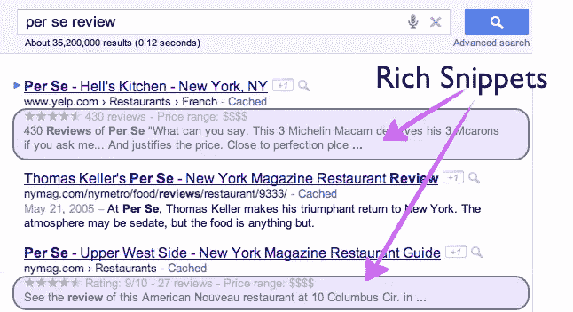

# HTML5 的微数据、搜索和搜索巨头的合作

> 原文：<https://www.sitepoint.com/html5s-microdata-search-and-the-collaboration-of-the-search-giants/>

HTML5 最容易被忽视的新特性之一是微数据。微数据允许我们以机器可读的方式更具体地分类和标记我们的网络内容。为什么这是重要的，因为它可能会积极影响你的搜索结果。

当你在谷歌或其他地方搜索某样东西时，你会得到一个链接列表，下面有几句描述。我们都使用这些描述——谷歌称之为“[丰富片段](http://www.google.com/support/webmasters/bin/answer.py?answer=99170)”——来决定点击哪个链接。



你不希望能够影响你的网站的搜索结果片段中显示的内容吗？如果能够向搜索引擎及其抓取你页面的机器人澄清，“嘿，谷歌，我知道我的页面上有二十张图片，但是*这张*图片，那张是我的简历图片，这不是很好吗？”或者，“嗨，冰，我知道我的页面上有很多链接，但是*这个链接*是与我的活动相关的链接。”

有了微数据，我们可以用一些新的属性来标记现有的 HTML，以便以搜索引擎能够理解并在其丰富的片段中使用的方式来标记和分类我们的内容。

在我们添加这些新属性之前，我们需要挑选一个我们试图描述的事物的词汇表。我们可以写自己的词汇表，也可以用别人的。我们曾经有一个网站，[http://data-vocabulary.org](http://data-vocabulary.org/)，由谷歌用几个词汇维护。但不清楚其他搜索引擎是否支持它。幸运的是，在 2011 年 6 月的，谷歌、微软和雅虎！我们已经就可以在我们的网站上使用的大量词汇达成了一致。

### 三位一体的搜索，一起

很难想象谷歌、微软、雅虎！在任何事情上合作，更不用说与搜索相关的事情了，但这正是他们在 schema.org 网站上所做的。Schema.org 提供了一组我们可以在微数据中使用的词汇表。通过在已定义的 schema.org 上使用诸如人、书和组织之类的词汇，我们可以确保我们的微数据能被 Google、Bing 和 Yahoo！理解。调查

### 它是如何工作的

要使用微数据，我们必须在现有的 HTML 中添加至少三个新属性:

1.  `Itemscope`
2.  `Itemtype`
3.  `Itemprop`

要了解此示例，请参见[演示页面](https://www.sitepoint.com/examples/microdata101.html)。查看完整代码的源代码。

**T2`Itemscope`**

`Itemscope`设定我们用微数据描述的范围。你可以把它看作是定义一个父元素，其中包含其他元素，这些元素包含我们试图提供给搜索引擎的信息。嵌套在带有`itemscope`的元素中的所有元素都将遵循您在#2 中指定的词汇表，即`itemtype`。

如果我们想在他们的在线简历上描述一个人，我们可以在简历周围包装一个 section 元素，并给它一个`itemscope`属性:

```
<section itemscope> 
Audre Lorde was an author, academic, activist and poet, known for 
her many contributions to feminist literature and thought. Perhaps 
her most celebrated work is " 
      <a href="http://t.co/8wbANUC"> 
             Sister Outsider
      </a>," a collection of essays and speeches. She passed away on 
November 17th, 1992\. 
</section>
```

**T2`Itemtype`**

属性是我们声明我们使用什么词汇，以及我们试图描述什么东西的地方。schema.org 最基本的词汇是，嗯，一个[事物](http://schema.org/Thing)。事物词汇表包括我们可以设置的四个属性:描述、图片、名称和 url。所有其他事物(书籍、餐馆、地方)都来源于事物词汇。

为了继续向我们的在线简历添加微数据，我们向我们的人员添加项目类型:

```
<section itemscope itemtype=”http://schema.org/Person”> 
Audre Lorde was an author, academic, activist and poet, known for 
her many contributions to feminist literature and thought. Perhaps 
her most celebrated work is " 
      <a href="http://t.co/8wbANUC"> 
             Sister Outsider 
      </a>," a collection of essays and speeches. She passed away on 
November 17th, 1992\. 
</section>
```

**T2`Itemprop`**

属性是我们如何给大部分内容添加标签的。我们只需将`itemprop`属性添加到包含我们想要标记的内容的现有元素中。我们如何标记内容？这取决于我们赋予`itemprop`属性什么值。值必须是我们的词汇表的属性之一。

在某些情况下，您可能希望用`itemprops`来标记纯文本内容。在这些情况下，没有现有的 HTML 元素可以添加属性，所以通常会添加`spans`或`divs`。

继续我们的例子:

```
<section itemscope itemtype=”http://schema.org/Person”>
    <span itemprop=”name”>Audre Lorde</span> 
was an 
   <span itemprop=”jobTitle”>author,</span> 
   <span itemprop=”jobTitle”>academic,</span> 
   <span itemprop=”jobTitle”>activist</span> and 
   <span itemprop=”jobTitle”>poet</span>, known for her 
many contributions to feminist literature and thought. 

Perhaps her most celebrated work is " 
      <a href="http://t.co/8wbANUC"> 
             Sister Outsider 
      </a>," a collection of essays and speeches. She passed away on 
November 17th, 1992\. 
</section>
```

现在我们已经指定了我们关心的项目属性，但是，搜索引擎如何知道我说的*内容*是什么意思呢？它是否只接受 span 元素内的文本内容(“Audre Lorde”、“author”等)，它如何知道从哪里获取`a`元素上的`itemprop=”url”`的 URL？

好消息是，它本质上总是抓住你希望它抓住的价值。完整列表在[微数据规范](http://dev.w3.org/html5/md/Overview.html#values)中:

*   `A`、`area`或`link`元素取**、`href`、**属性中的值
*   一个`meta`元素取 **`content`** 属性中的值
*   `Audio`、`embed`、`iframe`、`img`、`source`、`track`或`video`元素从 **`src`** 属性中获取绝对 URL
*   `time`元素从 **`datetime`** 属性中获取值
*   `object`元素从 **`data`** 属性中获取绝对 URL
*   所有其他元素都接受元素内部的文本内容。(例如:`span`、`p`、`div`)

### 说到`Datetime`

在我们小小的传记页上有死亡日期。我们能不能只添加`itemprop=”deathDate”`，这是在[人物](http://schema.org/Person)词汇中定义的属性？不幸的是，我们不能。我们需要首先将其包装在新的 HTML5 `time`元素中，以确保我们有一个计算机可读的日期。

```
She passed away on <time itemprop="deathDate" datetime="1992-11-17">November 
17th, 1992</time>.
```

### 这一切听起来很熟悉…

你可能会觉得这些概念很熟悉，因为它们已经存在了一段时间。微格式是过去用来使 HTML 内容机器可读的一种方法。如果你看一下 LinkedIn 个人资料的 HTML，你会发现它用 hCard 微格式标记。脸书事件也是如此。

微格式的一个问题是我们以非标准的方式重载了`class`属性。很难区分“这个类是用于我的 CSS，还是用于微格式？”通过使用新的专用属性`itemscope`、`itemtype`和`itemprop`，微数据避免了这种混淆。

微格式的另一个限制是，您想要包含的任何数据都必须存在于单个父元素中——这可能是有限制的，尤其是当您有相关信息时，比如说，在网站的页脚中。

### 用`Itemref`包含父项目范围之外的项目

让我们假设在这一页的底部，我们有一个页脚，上面有一列关于奥德·洛德的脚注。如果有链接的脚注，最好将它们作为`itemprop=”url”`包含在我们的标记中。

```
<section itemscope itemtype=”http://schema.org/Person”>
    <span itemprop=”name”>Audre Lorde</span> 
was an 
    <span itemprop=”jobTitle”>author,</span> 
    <span itemprop=”jobTitle”>academic,</span> 
    <span itemprop=”jobTitle”>activist</span> and 
    <span itemprop=”jobTitle”>poet</span>, known for her 
many contributions to feminist literature and 
thought[<a href=”#citation1”>1</a>]. 
    <!-- snip --> 
</section> 

    <!-- more HTML --> 
<footer> 
    <a name=”citation1”>[1]</a> 
    <a id=”cite1” itemprop=”url” 
href=”http://en.wikipedia.org/wiki/Audre_Lorde”> 
Audre Lorde on Wikipedia 
    </a> 
</footer>
```

我们如何在页面的页脚中包含这个链接？通过在节开始标记中使用名为`itemref`的属性:

```
<section itemscope itemtype=”http://schema.org/Person” itemref=”cite1”>
```

这将告诉搜索引擎也从`id`为 cite1 的元素中获取相关内容，就像页脚中的 link 元素一样。

如果你想在页面中引用多个`id`怎么办？这样做的方法是简单地在`itemref`中指定一个由空格分隔的`id`列表，就像您可以通过使用空格分隔的列表来指定多个`class`属性一样。

### 摘要

微数据允许我们用机器可读的标签来标记现有的元素和文本，使我们的页面能够被主要的搜索引擎更清楚地看到和理解。谷歌，雅虎！和微软一起给了我们丰富的词汇，我们可以用 http://schema.org 来描述。作为 HTML5 规范的一部分，它有自己专用的属性，一点额外的工作可能会给你的搜索结果带来真正的优势。

更多资源

[入门指南](http://schema.org/docs/gs.html)
[Google Rich snippet](http://www.google.com/support/webmasters/bin/answer.py?hl=en&answer=99170)
[Rich snippet 测试工具](http://www.google.com/webmasters/tools/richsnippets)

## 分享这篇文章