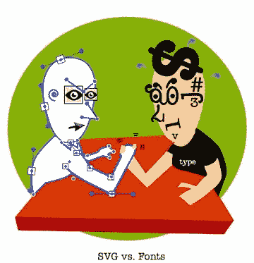
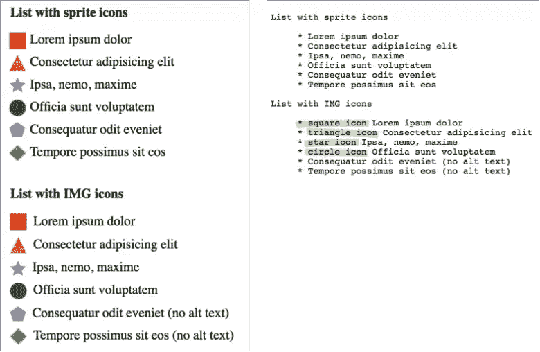

# 图标大辩论:字体 Vs SVG

> 原文：<https://www.sitepoint.com/icon-fonts-vs-svg-debate/>



我们都知道这种感觉:就像你觉得你终于掌握了一些伟大的网络技术…是时候换一种新的更好的东西了。

这种情况在我身上发生过很多次，最近在图标上又发生了一次。在很长一段时间里，图标字体似乎是自然的最佳实践解决方案，SVG 引入了一些有用的创新，这些创新可能已经改变了游戏规则。

选择任何技术都是一项涉及权衡许多主题的任务。当我们处理图标时，我们需要考虑:

*   可访问性:纯文本浏览器或屏幕阅读器是否存在一些问题？
*   **语义** : *图标是用来代表其他东西的符号*(这是我发现的这个概念最简单的定义；它来自于[语义用户界面框架文档](https://semantic-ui.com/elements/icon.html)，那么，我们是否在符号和它们所指的事物之间建立了一种有用的关系？
*   **浏览器兼容性**:我们需要保证一个大的浏览器兼容性吗？
*   HTTP 问题:我们的图标系统会给我们的服务器带来不必要的负担(HTTP 请求)并导致更长的页面加载时间吗？图标文件可以缓存吗？
*   CSS 样式&动画:我们能使用 CSS 排列图标并制作动画吗？

那么，现在最好的选择是什么呢？我们还能继续使用图标字体吗——或者是时候转向 SVG 了？

## 简史

我意识到，当我们谈论图标时，很容易把我们过去一直在讨论的一些话题视为理所当然。他们可以帮助我们更好地组织辩论，但并不是每个人都知道他们。因此，我整理了一份非常简短的“网页创作中图标技术的历史”来帮助澄清这场争论。(如果你觉得历史部分没问题，就直接跳过去)。

回到 90 年代中期——当时浏览器很少甚至没有 CSS 支持——图标是用经典的``标签来管理的。这种技术带来了许多可访问性和语义问题。此外，使用大量图标的页面不得不发出一连串破坏性能的 HTTP 请求:页面中的每个图标一个。

此外，如果你打算引入一个`:hover`效果，你必须用 JavaScript 加载这些二级图像。

令人高兴的是，随着 *CSS 精灵*(或者*图像精灵*)的出现，情况明显好转。这种技术包括将所有图标排列在一个单独的、唯一的文件中(通常是 *GIF* 或 *PNG* )，作为 CSS 背景图像加载。可以通过调整`background-position`属性来显示所需的图像部分，如下图所示(如果你想看一个运行的例子，我还做了一个[笔](https://codepen.io/massimo-cassandro/pen/OVBwQv)):


这种技术仍被许多大型网站使用，如 Youtube 和 Google，它解决了许多问题:

*   只需要一个图像文件，不管你有多少个图标(包括`:hover`效果)，所以 HTTP 请求可以大大减少。
*   许多可访问性(和语义)问题得到了解决，因为背景图像和 CSS 伪元素对文本浏览器或屏幕阅读器是不可见的(而图像是内容)。

我准备了一个小测试来创建两个列表:一个使用精灵图标，另一个使用``标签。在下图的左侧，您可以看到这两个列表几乎完全相同(除了第二个列表需要更多的代码)。

右边是用[Lynx viewer](https://www.delorie.com/web/lynxview.html)(*纯文本*网络浏览器 [Lynx](https://lynx.isc.org/) 的网络模拟器)呈现的相同列表的截图，它可以让你对使用辅助技术时你的网页可能出现的情况有所了解(尽管 A.T .的输出可能差异很大)。

你可以看到第二个列表包含图像`alt`文本(绿色突出显示)，在这个例子中**文本**是完全无用的，因为它们混淆了内容，而不是增加了内容的含义。的确，我们可以通过使用空的`alt`属性来避免这种情况(如最后两项)，但是我们仍然有内容元素(图像)被用作表示属性。



当然，还有 ***和*** 许多情况需要有意义的图标，上面的 CSS sprites 例子并不代表最佳解决方案。我们稍后将回到这个话题。

## 图标字体

尽管它们代表了一大进步，CSS 精灵仍然是位图图像。因此，如果您需要用不同的颜色或分辨率来表示同一个字形，那么每个版本都需要不同的图像。

这个问题通过字体图标解决了:因为字体是矢量，它们是独立于分辨率的，可以很容易地通过 CSS 着色。

将图标字体应用到页面最常见的方式是通过伪元素——就像我们对 CSS 精灵所做的那样。不幸的是，这并没有解决有意义图标的问题，因为这种技术仍然让屏幕阅读器看不到它们。

让我们看看下面的例子(使用[埃里克·弗劳尔斯的天气图标](https://erikflowers.github.io/weather-icons/) ): 

截图的第一部分展示了一个常见的图标实现(使用了一个伪元素)。在这种情况下，图标是内容的一部分，具有非常特殊的含义。不幸的是 Lynx 看不到图标，产生了一个无意义的句子。你可以在图像的第二部分看到结果。

幸运的是，这个问题有一个简单的解决方法:您可以在 icon 元素中添加一个描述(在本例中是一个`<i>`标签)。描述被包装在一个`<span>`中，这个`<span>`被设计成使其内容对浏览器不可见(它通常有一个很大的`text-indent`值)，但对不关心这个*技巧*的屏幕阅读器不可见:

```
 The icon
<i class="wi wi-umbrella">
    <span class="sr-only">"umbrella"</span>
</i>
means that it's raining 
```

现在，屏幕阅读器可以把它理解为一个有意义的句子:

这些话题在[灯丝组博客](https://www.filamentgroup.com/lab/dingbat-webfonts-accessibility-issues.html)、[二十四道](https://24ways.org/2011/displaying-icons-with-fonts-and-data-attributes)和 [CSS 招数](https://css-tricks.com/html-for-icon-font-usage/)的一些老文章里都有深入的论述。

## 关于可访问性的更多信息

虽然关于图标的可访问性问题还没有解决，但是你可以使用 [WAI-ARIA 技术](https://www.w3.org/TR/WCAG20-TECHS/aria)做更多的事情，注意字体大小、颜色对比等等(如果你对这些争论感兴趣，看看 W3C 的[网页内容可访问性指南](https://www.w3.org/TR/WCAG20/))。

但是可访问性不仅仅是屏幕阅读器的问题。即使是普通浏览器的用户也会受到图标选择的严重影响。 [Alex 最近在 SitePoint 上强调](https://www.sitepoint.com/final-nail-icon-fonts-coffin/)引用[Seren Davies](https://speakerdeck.com/ninjanails/death-to-icon-fonts)的一次谈话。它证明了图标字体并不是一个永恒的解决方案，也许是时候继续前进了。

浏览器拥有接收、缩放、渲染和操作文本的完美系统。最终采用该系统来管理和渲染图像只会削弱强大的文本功能。

## SVG 的案例

最后，我们来到 SVG。

SVG 进一步增强了我们所看到的图标字体。Chris Coyer 写了一篇关于[图标字体与 SVG 特性](https://css-tricks.com/icon-fonts-vs-svg/)的有趣文章，所以我将非常简洁地介绍这些主题:

*   两者都是基于矢量的，所以你不必处理分辨率问题或多个文件
*   它们都可以通过 CSS 进行排列和样式化，但是内联 SVG 允许您控制单个图标的各个部分，为您提供多色图标的选项(图标字体也有一些多色解决方案，如[预测字体](https://forecastfont.iconvau.lt/)或本文 [Pixel Ambacht 文章](https://pixelambacht.nl/2014/multicolor-icons/)中描述的字体)。然而，与 SVG 相比，它们都要复杂得多)。此外，使用 SVG，您可以访问字形笔画。
*   我们需要改进图标字体可访问性的变通方法对于 SVG 文件来说是不必要的，因为它们有内置的语义敏感元素(即`<title>`和`<desc>`),与 HTML 页面本身没有什么不同。
*   内联 SVG 不能像图标字体一样被缓存和重用，但是可以缓存外部 SVG 文件，就像处理任何图像文件一样。
*   图标字体浏览器支持复杂但非常全面(包括 IE6+)，而 SVG 至少需要 IE9+。资源管理器不支持外部 SVG 文件，但是有一个 [polyfill](https://css-tricks.com/svg-use-external-source/) 可以实现这个功能。

SVG 图标可以用多种方式实现(我在以前的 [SVG 图标文章](https://www.sitepoint.com/build-svg-icons/)中已经介绍了许多技术)，它们都很有用，但是我认为更好的解决方案是 SVG 符号技术。

SVG 符号为您提供了对图标的最佳控制，因为您可以轻松地更改它们的颜色，并且通过使用相对单位，您可以根据相关文本调整它们的大小。

参见 [CodePen](https://codepen.io) 上马西莫·卡珊德拉([@马西莫-卡珊德拉](https://codepen.io/massimo-cassandro))的 Pen [SVG 示例](https://codepen.io/massimo-cassandro/pen/waOJWr/)。