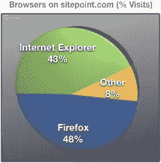
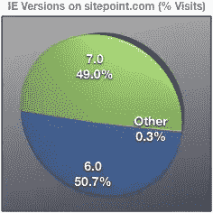

# 针对盗版 Windows 用户的 IE 7 更新

> 原文：<https://www.sitepoint.com/ie-7-update-for-pirated-windows-users/>

[微软 Internet Explorer 博客](http://blogs.msdn.com/ie/)已经[宣布](http://blogs.msdn.com/ie/archive/2007/10/04/internet-explorer-7-update.aspx)Internet Explorer 7 的最新更新将从安装程序中删除 Windows Genuine Advantage (WGA)验证步骤。尽管公告没有明说，但此举的实际效果是让运行盗版 Windows XP 和 Windows Server 2003 的用户获得 IE7 升级。

当微软在一年前的下周首次发布 IE 7 时，他们将其作为 Windows XP 的“强制”更新，希望这将有助于更多人使用新浏览器。对于微软来说，这将有助于让更多的人快速进入更安全的 IE 7 平台。对于网络开发者来说，这将让更多的用户使用更符合标准的 IE 7 渲染引擎。

这有多成功？好吧，让我们来看看 sitepoint.com 的浏览器统计。正如你所料，火狐用户在网站的受众中比例很高(48%)，这反映了将火狐作为主要浏览器的网络开发者的数量。尽管如此，在过去的一个月里，sitepoint.com 43%的访问量仍然来自于 ie 浏览器。

然而，事实证明，只有一半的访问是由运行 Internet Explorer 7 的人进行的。换句话说，**每五个来 sitepoint.com 的游客中，就有一个是使用 Internet Explorer 6.0 作为主要浏览器的。**

微软似乎在押注的是，那些 IE 6 用户中有相当一部分人无法升级到 IE 7，因为他们运行的是盗版 Windows(顺便提一下，这也可能是促使许多新用户使用 Firefox 的一个因素)。

用户可能选择放弃 IE 7 更新的其他原因是，他们受到企业 IT 政策的制约，这些政策在采用此类升级方面进展缓慢，或者他们运行的是不支持 IE 7 的 Windows XP Service Pack 2 之前的版本(SP2 本身不会安装在盗版的 Windows XP 系统上)。

当然，也有用户只是喜欢 IE 6 的用户界面。作为对他们方向的认可，微软在最新的 IE 7 更新中默认显示了传统的菜单栏，解决了首次使用 IE 7 的用户最常见的抱怨之一。

你认识一个固执的 IE 6 用户吗？这一最新的更新会让他们过线吗？不，你认为微软真的需要做些什么来让这些用户使用 IE 7？

## 分享这篇文章