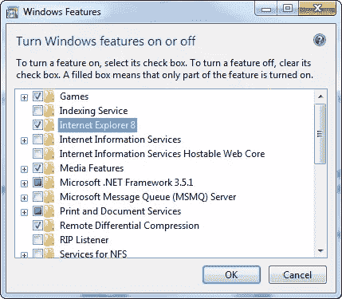

# 可以从 Windows 7 中卸载 Internet Explorer

> 原文：<https://www.sitepoint.com/ie-windows-7-uninstall/>

有几份报告在网上流传，称最新的 Windows 7 测试版将允许最终用户卸载 Internet Explorer 8.0(见博客文章[此处](http://chris123nt.com/2009/03/03/win7-build-7048-ie8-is-removable)和[此处](http://www.aeroxp.org/2009/03/ie8-functionally-removable/))。

应该注意的是，该功能出现在 Windows 7 build 7048 中。微软尚未公开发布该软件，但在某些文件共享网站上可以作为非法盗版获得*(显然，SitePoint 不允许下载、共享或安装该产品)*。在控制面板的“打开或关闭 Windows 功能”对话框中，Internet Explorer 8 (IE8)显示为您可以删除的项目之一。

然而，微软工程师兼博客作者杰克·梅奥现在证实，IE 和其他几个 Windows 组件可以从 Windows 7 中删除。

从 Windows 95 开始就不能删除 IE 了。但是，该选项不会从根本上影响操作系统，它主要是删除 iexplore.exe(尽管需要一些软件重新配置和两次重启)。虽然这将阻止任何人使用浏览器，但 Windows 和第三方应用程序仍然可以访问主要的 Internet Explorer 代码库和库。

卸载选项似乎是对 Windows 7 的快速修复(尽管，公平地说，微软可能在几个月前就计划好了)。然而，这项“功能”是在欧洲委员会裁决迫使微软在 Windows 中提供替代浏览器后不久出现的。微软尚未对委员会的初步结论做出回应，但提供 IE8 卸载选项可能会解决一些潜在的法律问题。

IE 卸载会阻止微软在欧洲和其他地区正在进行的法律战吗？对 Windows 用户和 web 开发者会有帮助还是阻碍？

## 分享这篇文章