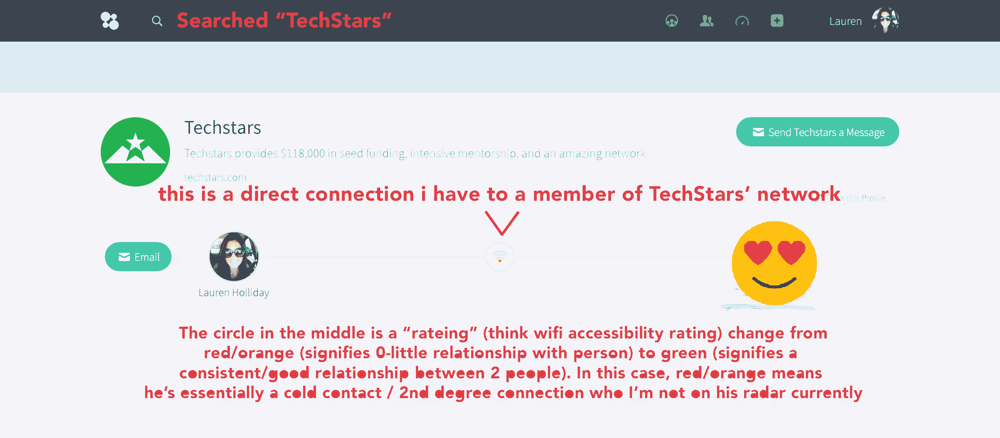
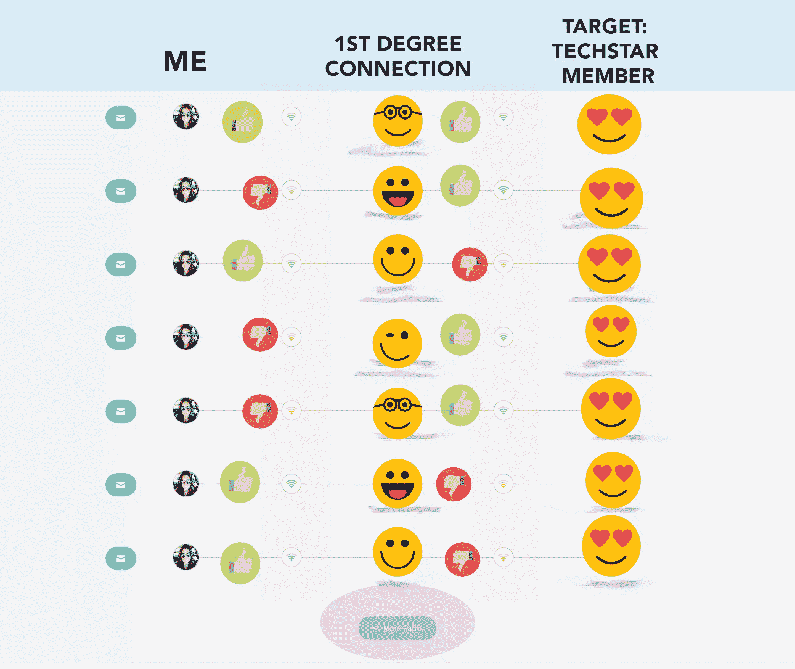

# 如果你正在考虑启动加速器，请阅读这篇文章

> 原文：<https://www.sitepoint.com/if-youre-considering-startup-accelerators-read-this/>

*寻找和应用合适加速器的综合指南*

即时融资、接触有影响力的风险投资家(VC)、来自成功创始人和初创企业战略家的建议、与其他雄心勃勃的企业家的联系以及即时信誉？创业加速器听起来确实是一笔不错的交易。

然而，孵化器并不适合所有人——即使你的初创公司非常适合，也并不意味着你会成功。记住这一点，以下是你需要知道的关于寻找、申请和被顶级创业加速器录取的一切。

## 定义“加速器”

商业加速器是短期的(通常是三到六个月)项目，旨在通过帮助企业家获得牵引力来提高创业公司的增长率。作为股权的回报，创始人通常会得到指导、资金、社交机会和共享工作空间。

许多加速器还在项目结束时提供演示日，在此期间，企业家向一群投资者推销他们的想法。

“商业加速器”、“创业加速器”和“种子加速器计划”可以互换使用，但如果你把加速器称为“孵化器”，你会听起来好像不知道自己在说什么孵化器[从外部雇佣人员](http://www.inc.com/christina-desmarais/difference-between-startup-accelerator-and-incubator.html)将公司内部开发的想法带入生活——巨大的差异。

## 申请还是不申请…

申请加速器需要大量的工作；换句话说，你可能不应该只是为了好玩而申请。

### 你的情况如何？

大多数项目负责人都在寻找具有完整概念的产品，测试产品，甚至是市场吸引力的产品。

### 团队是谁？

他们也希望创业公司由不止一个人经营。正如 YCombinator 合伙人杰西卡·利文斯顿(Jessica Livingston)解释的那样，“我们认为，单身创始人是让成功变得更加困难的一个因素……(因为)初创公司有太多事情要做。”

加速器经理寻求“平衡的团队”——没错，这意味着拥有不同的技能组合和背景，但也意味着至少有一名技术型创始人或早期员工。久负盛名的加速器技术之星[这样说](http://www.techstars.com/faq/):

“如果你是一个伟大的商业布道者，却没有开发人员，我们不太可能接受你加入这个项目，所以去找一个摇滚明星开发人员加入你吧。”

### 潜在投资回报率有多大？

最后，你的产品应该有潜力进入一个相当大的市场。加速器的目标不是投资那些会赚几百万美元的公司，而是投资那些会赚几十亿美元的公司。所以如果你认为你的创业公司没有潜力变得非常非常大，就不要申请。

## 增加你的机会

既然你还在读书，很可能你认为你的创业符合加速器的模式，所以让我们来谈谈申请吧。

众所周知，这些项目的录取率很低。

Techstars [从申请人中抽取 1-2%的人](http://venturebeat.com/2014/11/23/7-key-things-you-need-to-know-about-an-accelerator-like-techstars/)。Y Combinator (YC)目前接受[不到 3%的申请人](http://blog.ycombinator.com/yc-portfolio-stats)。500 家创业公司[占申请](http://tech.co/4-tips-applying-to-500-startups-batch-10-soundbetter-2014-05)的创业公司的 3-6%。基本上，你有更好的机会进入斯坦福或哈佛。*(无压力)*

然而，你可以做两件事来大大增加你被录取的几率。

### 这是“正确的”适合吗？

首先，也是最重要的，集中精力使用右边的*加速器。*

明智的做法是，考虑到许多加速器选择只与非常特殊领域的初创公司合作。

因此，举例来说，如果你已经建立了一个[利益公司(B-Corp)](http://www.nytimes.com/2015/09/21/technology/kickstarters-altruistic-vision-profits-as-the-means-not-the-mission.html?_r=0) ，你不应该申请一个加速器，如[炼金术士加速器](http://alchemistaccelerator.com/)，因为它专门专注于资助企业创业。考虑一个像[和](http://fledge.co/)这样的加速器也是一个好主意，因为“羽翼基金”资助“有社会和环境意识的企业家”

### 额外收获:在 Quora 上的这篇文章中，查看加速器及其垂直行业的详细列表。

如果你的公司不属于这些类别中的任何一类(或者你被基于位置、声誉、人际关系等的特定加速器所吸引。)，然后确保你的初创企业符合加速器现有的公司组合(即加速器已投资公司的列表或数据库)。

也许你已经有了一家广告技术创业公司，你看到加速器已经资助了另一家广告技术创业公司。这是个好兆头。只要确保你提供的不是竞争产品——加速器可能不会想资助它已经投资的公司的竞争对手。

### 你认识谁？

在确定“正确的”加速器后，尝试获得推荐。

从加速器网络中的某个人那里获得介绍——无论是已经通过该计划的创始人，还是加速器的导师和/或合作伙伴——都是脱颖而出的一个超级强大的方法，也是快速进入他们雷达的一个简单方法。

*(注意:重要的是要注意到[的介绍并不保证是“ins”](https://www.sitepoint.com/how-to-get-rejected-by-yc-and-move-on-a-proven-framework/)所以不要停止尽你所能让自己被录取，直到你的收件箱里有了那封录取邮件，并且你已经读了每一个字——两遍，甚至可能三遍。)*

### 没有借口

需要明确的是，你不需要已经建立了联系来获得推荐。

如果你没有，你可以这么做:梳理[合谋](http://conspire.com)和 [LinkedIn](http://linkedin.com) 。

首先，使用[合谋](http://conspire.com)在你想进入的加速器网络中找到一条最不令人毛骨悚然的“路径”。

**搜索依据:加速器名称、公司或个人。然后，collect 将列出所有可能的“路径”，它们将从最有效和最优化的路径到最低效或最麻烦的路径进行组织。**

下面是当前网络成员的“直接”或一级连接或“途径”的屏幕截图。**注意:这是一个弱路径或连接点。我之所以知道这一点，是因为在我和这个人之间有一个看起来很弱的 wifi 符号。**

下一张截图是你在 collect 中搜索时最有可能看到的。这些是与你想要加入的加速器的当前成员连接的“间接”或二级连接或“路径”。

## 完成申请

不用说，你需要一个令人印象深刻的应用程序。但是合作伙伴到底在寻找什么呢？

直截了当的语言:现在是**而不是**使用行话或行业术语的时候。用尽可能少的话说出你要说的话。正如保罗·格拉厄姆[在 2009 年](https://www.ycombinator.com/howtoapply/)、*解释的那样，“一个阅读你的申请的 YC 合伙人当天平均已经阅读了 50 份，还有 50 份要读……所以你必须格外清晰简洁。”*

有效的产品解释:你非常熟悉你的产品——但是阅读你的应用程序的人可能从未听说过它。确保你用特别容易理解的方式描述你的产品，但是让它有趣也很重要。虽然[没有一个确定的“正确”方法](http://firstround.com/review/why-most-startups-dont-get-press/)来做到这一点，但你可以尝试使用一个公式或模板，比如“X 代表 Y”，例如，“Kayak 代表现场活动”，或者“优步代表打扫房间”

**关于你的团队的细节**:艾琳·加尔佩林审查了 300 多份加速器申请，[说](http://www.techfounder.net/2013/08/22/after-reviewing-300-startup-applications-this-is-what-i-learned/)当涉及到“团队”部分时，大多数都是相当“简单”的。

刷过这一段是一个巨大的错误；毕竟，比起创业公司的实际状况，许多投资者更关心创业公司背后的企业家。炫耀为什么你的团队是独一无二的。

*   你在知名公司工作过吗？
*   你有创业成功退出的经验吗？
*   人们一直称赞和/或欣赏你的原因是什么？*(可以是你发表的一个惊人的故事，在网上疯传，也可以是[一个证明你足智多谋的聪明故事](https://www.themuse.com/advice/the-muses-successful-application-to-y-combinator-w12) )*

**提前提交**:一些加速器以滚动方式接受创业公司，这意味着你想成为第一批进门的人。你不仅会被比作更少的公司，而且那些审查你的信息的人会对这个过程有更多的精力和热情。

如果你的申请具备这四个特征，那么你就增加了进入第二轮面试的机会。

## 进行面试

虽然被合伙人质疑肯定很可怕，但至少你知道他们已经看到了你创业的潜力。

通过和你的联合创始人练习来缓解你的紧张(并提高你的面试表现)。

### 知道常见问题的答案

*   你想解决什么问题？(这个问题非常重要，因为尽管你的解决方案可能会改变，但核心问题不会改变。)
*   你是如何想出你的解决方案的？
*   你在这个创业公司有多少股份？(如果你还在做你的“常规工作”，那就有问题了。合伙人正在寻找那些与他们的生意息息相关的人。)
*   为什么你们是合适的人选？(如果你失去了关键的团队成员，你打算如何找到并雇佣他们？)
*   这个市场有多大？你的竞争对手是谁？最接近的现有产品是什么？为什么还没有人开始销售你的产品？是什么让你与众不同？市场中的哪些变化使你的产品成为可能？
*   你会用加速器的资金做什么？
*   你和顾客谈过了吗？只有一个正确的答案。)他们怎么说？什么是几个用例？
*   为什么要加入这个加速器？(准备好具体的理由:“这是这个垂直业务的最佳加速器”，“我真的很想和 X 合作伙伴一起工作，因为他或她在 Y 方面有专长”，“你的特定模式非常适合我们的需求”等等。)

### 避免常见的陷阱

**不要咆哮**
[根据 YC、500 家创业公司和 Angelpad 的合伙人和校友](http://500.co/7-lessons-from-500-yc-angelpad-alum%E2%80%8A-%E2%80%8Ahow-to-prepare-for-any-accelerator-interview/)的说法，最常见的错误是“过度说话”，或者提供无关的细节，跑题和/或试图呈现一个完整的演示。

控制你的激动情绪
记住，你的目标是让面试官对你的产品及其发展方向充满热情，而不是说服他们成为你的顾客。清晰、简洁，最重要的是，*冷静*。

**不要继续防守**
另一个经常出现的错误是防守。当有人真正质疑你的陈述、假设和背景时，很难不感到受到攻击。所以积极提醒自己，这些人不是因为讨厌你的想法或认为你满嘴谎言而盘问你。他们盘问你是因为他们需要确保你有一个可行的产品，你有资格经营一家企业。

**证明你的团队“凝聚在一起”**
最后，确保你和你的联合创始人有一个坚实的面试动力。安德里亚·巴里卡面试了 500 家初创公司的申请人，她解释说她看到了很多联合创始人的紧张感。

不出所料，团队中紧张气氛的表现不会让任何人对你团队的合作能力产生信心。确保你和你的联合创始人就你要说的话以及谁会说达成一致。

一般来说，每个人都应该公平地说话。除非你的联合创始人说了一些完全疯狂或不符合剧本的话，否则不要纠正他们，即使这样，在说出来之前也要好好想想。哦，由于合伙人可能会在联合创始人什么都没说的情况下叫出他/她，所以确认每个团队成员都在同一页上并且能够回答所有“预期”的问题是至关重要的。

如果你选择加速器路线，确保你保持现实的期望。找到合适的加速器只是被加速器接受的艰难旅程的开始。在这个过程中，没有明确的指南或保证。但是如果你能成功，谁知道呢——你可能会成为下一个德鲁·休斯顿或 T2。

## 分享这篇文章