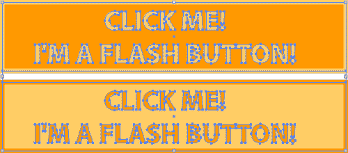
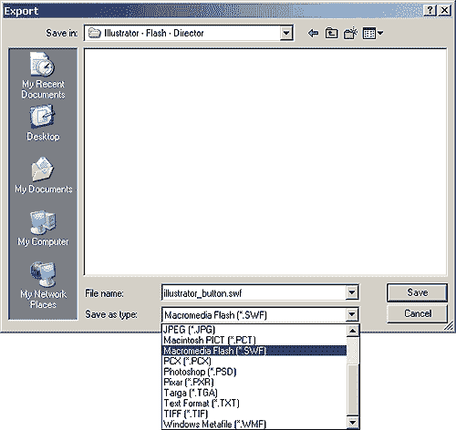
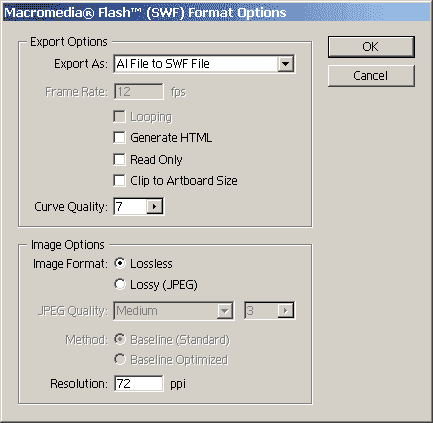
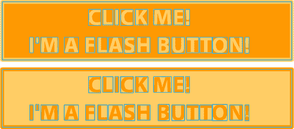
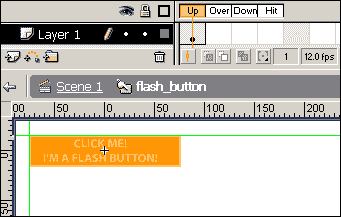
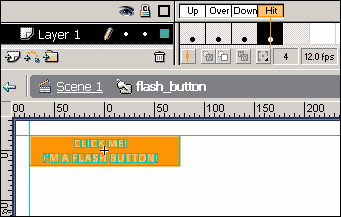
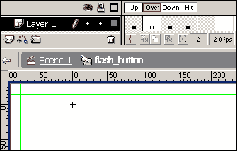
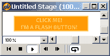
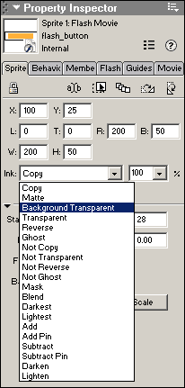

# Flash 和导演插画

> 原文：<https://www.sitepoint.com/illustrator-flash-director/>

我不知道你怎么想，但我对 Flash 提供的创建矢量图形的工具不太感冒。这并不是说工具不好——它们很好；但是我更喜欢使用 Illustrator。

所以你可以想象，当我被演示如何将我的 Illustrator 图形导出为 swf，然后导入并在 Flash 中使用时，我是多么兴奋！然后，我了解到您可以将 Flash 导入到 Director 中，我欣喜若狂！

所以，今天，我要分享这份喜悦！在这里，我将说明如何创建光滑的矢量图形，我们将在 Illustrator 中绘制，在 Flash 中构建，然后导入并在 Director 中使用。我们开始吧！

##### 鼠标悬停

在下图中，我在 Illustrator 中创建了一个矩形，复制它并反转颜色以获得鼠标悬停效果。

现在，在导出按钮之前，我们要做的一件事是在文本上“创建轮廓”。我们可以在 Flash 中使用“分离”功能来实现，但我总是在 Illustrator 中实现。

为此，选择两个按钮上的文本:单击其中一个文本字段，按住“Shift”键，然后单击第二个文本字段。完成选择后，图形应该是这样的:

太棒了。现在点击类型菜单，在这里，不到一半的地方，你会看到“创建轮廓”。选择此选项，然后将图形放大一点(保持选中状态)。它们应该看起来像这样:

我们刚刚将您的文本从文本元素转换为图形元素。这样做的好处在于最终的 Flash 输出。如果您的 Flash 文件的最终用户没有您在他们的系统上使用的特定字体，也没关系:文件将按照您希望的方式显示，因为文本现在是图形，而不是字体。

现在，我们必须导出我们的按钮，以便我们可以将它引入 Flash 并开始使用它。为此，我们单击 Illustrator 中的文件菜单，然后查找“导出”。一旦你点击了它，你应该会看到一些东西(系统，操作系统和设置)，就像下面的窗口。

在这里，Illustrator 询问我们希望将矢量图形导出为什么格式。如您所见，有许多不同的格式可供选择。深蓝色突出显示的是我们想要的:Macromedia Flash (*。SWF)。Adobe 的优秀员工慷慨地给了我们从 Illustrator 导出到 Flash 文件的能力。

让我们开始吧！选择硬盘上要保存文件的区域，命名，单击 Macromedia Flash (*。SWF ),最后点击“保存”。你会得到这样的结果:

这是我们的 SWF 格式选项框。这是我们告诉 Illustrator 我们希望如何构建 Flash 文件的地方。让我们从头开始。

“导出为”下拉列表包含三个选项(AI 是 Adobe Illustrator 扩展):

*   **AI File to SWF File**
    This option will simply export the file and do nothing fancy with it. You’ll get a single layer file that contains all the different elements of your graphic.
*   **AI Layers to SWF Frames**
    This option will create a Flash file that separates your Illustrator layers (if you’ve got any) into a series of frames. Each frame will hold each individual layer’s graphic. 10 layers will get you 10 frames.
*   **AI 图层到 SWF 文件**
    该选项还会分离你的图层，但不是创建一系列帧，而是生成一系列单独的 Flash 文件。因此，如果你有 10 层，你选择这个选项，你会得到 10 个 Flash 文件。

下拉列表如下所示:

***接下来:帧率:*** Flash 默认为每秒 12 帧(FPS)，因此，Illustrator 也是如此(如上图所示)。如果您选择 AI 图层而不是 SWF 帧，此选项会很有用。为什么？因为，通过将层导出为 Flash 帧，您(实质上)正在创建 Flash 动画。该选项将允许您指定动画的帧速率。

***下一步:循环:*** 同样，如果你把图层转换成帧，这个选择很方便。

***下一步:生成 HTML:*** 如果您想要生成一个包含所有嵌入和其他必要标签的 HTML 文件，以将您的 Flash 电影导出到网页中(与在 Flash 中发布相同)，此选项将是合适的。因为我们要将图形导出到 Flash 中，这样我们就可以在那个环境中使用它们，所以我们不需要使用这个选项。

***下一个:只读:*** 还是那句话，这不是我们需要使用的选项。如果您选择了这个选项，您将无法将 SWF 导入 Flash 以用于我们的按钮。基本上，它锁定了你的 SWF。

***下一步:裁剪到画板大小:*** 如果我们将画板重叠了一点，例如，如果我们希望我们的电影是 550px X 400px，我们有一个椭圆形稍微重叠这些尺寸，我们会选择这个选项。我们将选择这个选项，让 Illustrator 在这一点上切断椭圆，而不是在画板上乱搞。

***接下来:曲线质量:*** 这个选项就像优化一样:质量越高，文件越大。我想我以前从来没有改变过这个值，但是如果你比我聪明，你会尝试看看你能想出什么。

***接下来:图片选项:*** 这一个选项我们不想乱来。为什么？这个函数为你的矢量图形创建优化的 JPEGs，破坏了我们最初使用矢量图形的原因。

好吧！就是这样。从现在开始，这就是普通的 Flash 创作了！

现在我们已经将图形导出为 Flash 电影，保存 Illustrator 文件并关闭。

##### 在 Flash 中工作

我们现在需要打开 Flash，把我们的图形放在一个按钮里。首先，我们对 Illustrator 创建的 SWF 文件进行普通的 Flash,“文件”>“导入”。完成后，您的图形将出现在舞台上，如果您选择并缩放它，它应该看起来像这样:

我把这个放大给你看文本。它看起来就像应用了“分开”功能后的 Flash 文本，不是吗？

因此，现在我们有我们的出口按钮图形坐在主舞台上。是时候开始构建我们的按钮了！

选择顶部按钮图形(仅顶部图形)，并通过选择编辑>复制来复制它。然后单击“插入”>“新建符号”。这将打开新的符号属性框。您将看到一个名称框(将被设置为默认的“符号 1”)，您可以保留或重命名。最好给此按钮取一个不同于符号 1 的名称，最好是您能记住的名称。我用了闪光灯按钮。

现在，看下面的名称字段:你会发现你告诉 Flash 你想要创建什么样的符号的区域。在我们的例子中，我们想要创建一个按钮符号。默认情况下，Flash 会将它设置为电影，但你想选择按钮。完成后，单击“确定”!

不，你会发现你的新按钮处于编辑模式。选取“编辑”>“粘贴”,将您拷贝的顶部按钮图形放到画布上。一旦你把它粘贴进去，它应该看起来像这样:

我把指南放在那里，以确保一旦我把它带进来，我就能够排列第二个按钮图形。您可以通过点按“显示”>“标尺”来为自己设置参考线。标尺可见后，您可以像在 Illustrator 或 Photoshop 中一样，将参考线拖放到舞台上。

##### 创建鼠标悬停效果

我们的下一步将包括创建实际的鼠标悬停步骤。我们需要构建关键帧并插入适当的图形。这是我们将使用第二个按钮图形的地方。首先，让我们选择整个图形，我们有权利没有，并点击 F6 键 3 次。这将创建按钮所需的其余 3 个关键帧，并将图形放入这些关键帧中。

一旦你这样做了，你应该有类似下面的截图:

我们要让这个按钮非常简单——我们已经到了需要第二个按钮图形的地步。首先，我们必须准备好它所在的关键帧。寻找第二个关键帧(标记为“Over”)并单击它，选择我们要放置第二个按钮图形的帧。正如您将看到的，我们已经在关键帧中获得了第一个(顶部)按钮图形。别担心，这很容易补救。应选择该图形。如果不是，选择它并点击键盘上的“删除”。搞定了。

现在，您应该有一个如下所示的关键帧:

您的舞台是空白的，第二个关键帧是白色的，这表示它是空的。这很好，这正是我们想要的。现在，在舞台上方，你会看到单词“场景 1”，flash_button 显示在它的右侧。这是我们位置的一点线索:flash_button 是粗体的，出现在末尾，表示我们在按钮的编辑区域。此功能允许在您的 Flash 电影中轻松导航。点击单词“场景 1”，你就回到了我们电影的初始(主)阶段，原来的按钮图形就在这里。

接下来，我们需要选择并复制第二个(底部)按钮图形。一旦完成，我们就必须打开库来找到我们的按钮:按 F11 键就可以了。打开资料库后，您会看到按钮出现。双击你的按钮(在库窗口中)再次打开它的编辑区域。维奥拉。我们又回到了上面的截图。

至于第一个按钮图形，我们现在需要将第二个(底部)按钮图形放在舞台上。选择该图形，并使用辅助线将其放置在适当的位置。它应该是这样的:

##### 在检查中

我们的按钮现在已经完成，可以使用了！对于那些不确定自己刚刚创建了什么的人，您已经构建了一个按钮符号，它将具有鼠标悬停效果。下面是关键帧运行情况:

*   **Up:** 这是按钮的正常(不变)状态
*   **Over:** 这是当鼠标停留在按钮上时，按钮会变成的样子
*   **向下:**点击按钮时显示的图形
*   **Hit:** 这是一个非常重要的关键帧，它告诉 Flash 我们按钮的“热点”在哪里。我们可以让热点变大或变小，甚至可以改变按钮本身的形状。对于这个特殊的例子，我们不需要担心这个状态。当我们第一次设置关键帧时，我们将第一个(顶部)按钮图形放在该区域，因此我们的点击区与按钮的大小和形状相同。

好的…现在我们需要回到我们的初始(主要)阶段。还记得怎么做吗？没错！单击场景 1 链接。

我们仍然有我们的原始图形在这里，我们现在不再需要它们。所以突出显示并从舞台上删除它们。

图书馆还开着吗？如果没有，请按 F11 打开它。现在将按钮拖放到舞台上。完成后，您可以使用对齐工具(“窗口”>“对齐”)将按钮居中，并使用“窗口”>“属性”来调整窗口大小。我调整了窗口的大小，使其比按钮稍大一点(稍后我会解释为什么这么做)。这是我最后得到的结果:

酷！现在我们需要导出我们的 Flash 按钮。我们可以点击文件>导出电影。找到一个你想保存电影的地方，点击“保存”。这将弹出一个选项窗口。此时，我们不想更改这里的细节，所以只需点击 OK。

一旦导出完成(应该很快)，你就可以保存你的 Flash 电影并关闭 Flash。然后，找到您导出的 Flash 电影(SWF)并双击它。如果一切正常，您应该会看到一个显示鼠标悬停效果的按钮。但是，当您单击它时，它不会做任何事情，因为它还没有链接到任何操作。

这就是你如何使用 Illustrator 为你的 Flash 电影创建图形，当然，这只是一个非常简单的例子。您完全可以使用 Flash 绘图环境提供的工具来制作这个按钮，但是如果您熟悉 Illustrator，这个过程会容易得多。

现在是时候更进一步了！让我们把我们的按钮变成导演！

##### 导入到 Director

您可以将 Flash 导入 Director，就像导入您想要使用的任何其他元素一样。首先，启动一个与你的闪光灯按钮尺寸相同的导演电影:200px X 50px。

一旦你做到了这一点，导入闪光按钮，并把它放在我们的舞台上。你会得到这样的结果:

上面有一件事我忘了提，那就是我把我的电影背景涂成黑色，以展示导演令人敬畏的墨迹特征。这就是为什么我给了一些白色背景的闪光灯按钮周围的额外空间。我们可以很容易地摆脱导演。

在上面的截图中，闪光灯按钮没有被选中。通过单击选择它。然后打开“演职人员属性”框。一旦在那里，改变墨水选项为'背景透明'。你最终会得到我在下面截图中得到的东西。

一旦将墨迹设置为背景透明，按钮将如下所示:

就这些了。如果你现在发布电影，你会得到一个包含你的 Flash 电影的冲击波电影！最好的事情是，你不必写任何隐语，或有任何其他图像，使按钮输出鼠标经过！

我还制作了一部 Shockwave 电影，用 Photoshop PSDs 在 Director 中制作了一个鼠标悬停按钮。我这样做是因为我想说明文件大小的区别。使用矢量图形的另一个非常重要的好处是可扩展性……但那是另外一个教程了！

[下载此文件](https://www.sitepoint.com/examples/Illustratorflashtute/example.zip)查看所有这些按钮的运行情况！

## 分享这篇文章