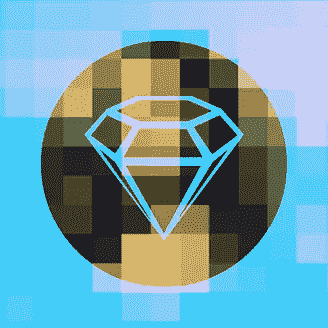
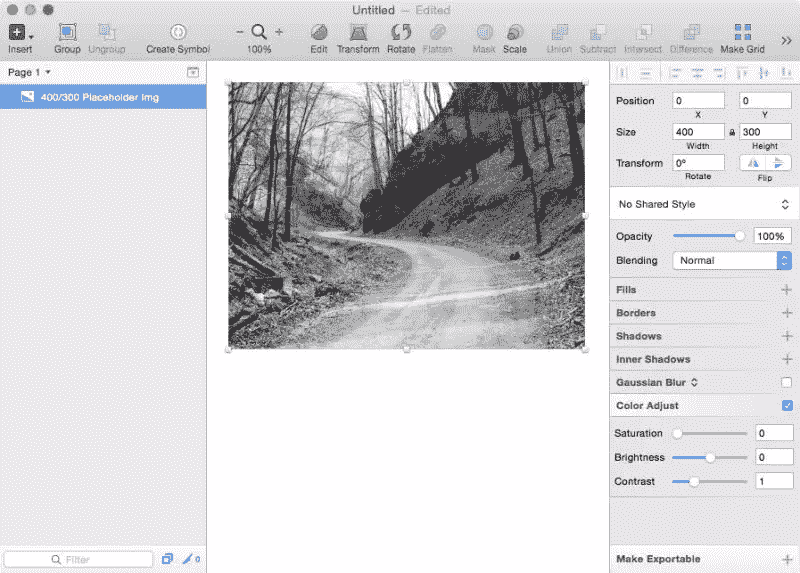
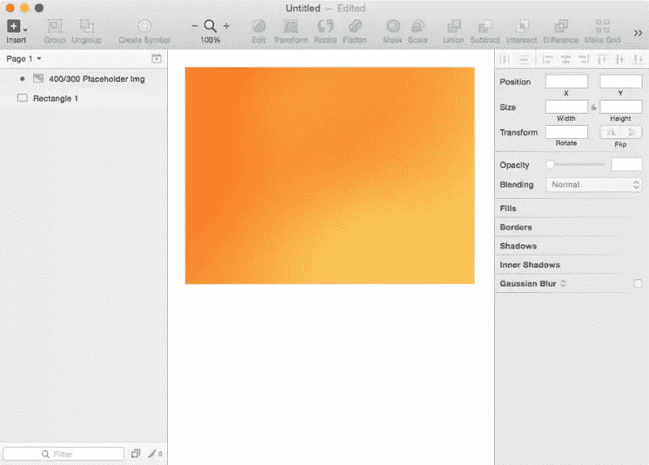
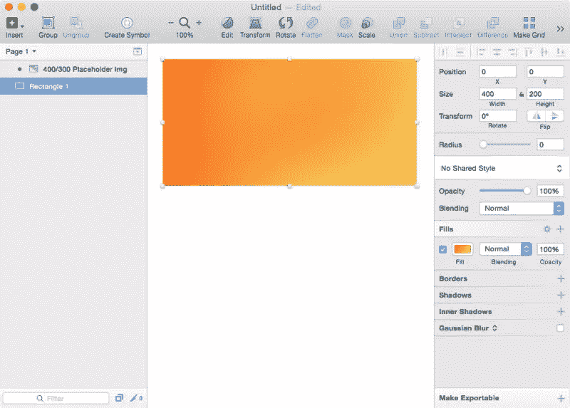
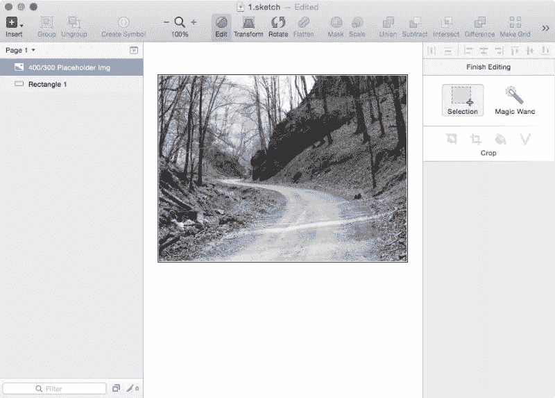

# 在 Sketch App 3 中掌握基本的图像编辑

> 原文：<https://www.sitepoint.com/image-editing-in-sketch-app-3/>

最近一直在说素描 App。我永远不会忘记提到它是移动应用程序和用户界面设计师的一个优秀工具。

我也说过，我认为将 Sketch 与 Photoshop 相比较是愚蠢的，因为它是一个照片编辑工具。

但事实是，Photoshop 已经变得如此多功能，以至于我们几乎可以将其与其他所有设计工具相比较——Sketch 3 也不例外。

事实上，Sketch 更像 Adobe Fireworks，这对于开发人员(波西米亚编码)来说是幸运的，因为 Fireworks 已经不再开发了。幸运的时机，直观的商业策略；不管你想怎么称呼它，Sketch App 填补了一个空白，而且填补得很好。

如果你过去两年一直住在火星上，这里有一些关于这个问题的背景故事。Sketch App 目前坐拥 3.2 版本(稳定)，你可以从[波西米亚编码](http://bohemiancoding.com/sketch/)购买，一次性费用 99 美元。

尽管它只适用于 Mac OS X，但它已经席卷了设计行业。

## 所以我们不能用草图编辑图像？

*Ehhh，有点儿*。

其实…可以，但是不要指望复杂的图像调整，滤镜和动作。相反，您应该期待最简单的位图图像编辑形式，例如以下功能:

*   浸透
*   聪明
*   对比
*   高斯模糊
*   混合模式
*   种植
*   魔杖

连我感觉的*魔棒*工具都太多了。就用户界面设计而言，我一直不明白它存在的原因。

然而，许多其他功能允许我们根据当前趋势进行设计。摄影和“大图像”目前风靡一时，无论我们使用高对比度、有冲击力的图像还是模糊的背景。将大图像融入纯色或“超级渐变”背景也是一大趋势。

但那是针对网页设计的，即便如此，在 Photoshop 中完成这样的事情并将最终的位图复制到 Sketch 中也可能是一种本能的习惯。

当然，如果你想操纵你的狗的头部，并用激光眼睛创造一个狗/青蛙的混合体，那么 Photoshop 肯定是你最好的选择，但是如果你能坚持使用单一的应用程序，你的工作流程将会及时地输出更好的、非破坏性的结果。如果你渴望了解更多关于非破坏性设计的知识，你应该完整地看一下*在 Sketch 中创建插图并将其导出为 SVG* (如下)，这是我们[用 Sketch 设计用户界面](https://www.sitepoint.com/premium/courses/user-interface-design-with-sketch-4-2927)课程的一部分。

让我们从颜色调整开始。

## 颜色调整

首先将位图图像复制到画布上，一系列自定义选项将立即出现在右侧；Sketch 应用程序将这个区域称为“检查器”,我们在这里调整和设计图层。

首先，选中标有“颜色调整”的方框。在这里，我们将能够调整图像的亮度、饱和度和对比度，但是为了这个小教程，我们将只把饱和度降低到零。

## 混合模式

按“R”启动一个*矩形*形状，并将其直接绘制在图像顶部。Sketch 的 snap-to 自动对齐应该会使这变得轻而易举，但是你可以在*检查器*中仔细检查尺寸。当你在那里的时候，取消选择*边框*，选择*填充→线性渐变*，然后使用键盘快捷键 *Cmd + Alt + Down* 对你的两个图层重新排序。

切换回图像(现在应该在顶部)，将*不透明度*改为“25%”，将*混合模式*改为“柔光”——这就是我们如何使用混合模式来创建色彩丰富但微妙的网站背景。

提示:混合模式实际上适用于所有类型的图层，而不仅仅是图像。

## 高斯模糊

搅动*不透明度*回到“100%”。相反，我们将使背景变得模糊，这是现代网页设计的一个普遍趋势，它允许在具有大图像闪屏的网站上更好地关注排版。选中“高斯模糊”框，把它调到 50px。

你应该立刻注意到模糊超过了我们的盒子的尺寸——我们可以通过应用遮罩来解决这个问题。右键单击层工具条(左侧)中的矩形，然后单击“用作蒙版”。

请注意，所有这些变化都是**非破坏性的**；我们可以快速测试多种想法(*颜色、模糊、强度等等*)，这些变化永远不会是最终的。

## 裁剪(最佳方式)

现在选择矩形并尝试调整它的大小，或者你可以使用检查器来声明新的尺寸。由于图像被屏蔽了，它**永远不会**超出我们矩形的边界，这是目前为止完成裁剪的最好方法，因为我们不仅可以声明具体的尺寸，而且我们没有对图像造成任何破坏性的破坏。

## 裁剪(假定的方式)

在这个阶段，通过使用 *CMD + Z* 并撤销我们到目前为止所做的一切，回滚到最开始可能是有用的；你应该在画布上留下的只是你的原始图像。如果你双击图片，你会看到一系列更具破坏性的动作，比如*裁剪*和*反转*。

你首先需要做一个选择，你可以用*选择*或者*魔棒*来完成。魔棒像预期的那样工作，但它没有 Photoshop 那样的公差控制，基本的*选择*不提供任何类型的捕捉功能或规则——你必须完全依靠自己的直觉和鼠标控制。除了*裁剪*和*反转*之外，你还可以选择*填充*或*矢量化*你所做的选择。

## 结论

我最后的结论是，我们仍然应该使用 Photoshop 来完成复杂或破坏性的图像编辑任务。

Sketch App 只是没有为我们提供足够的灵活性来有效地使用这些工具。然而，我们确实学到了一些简单的技巧，可以让我们在涉及位图图像时不必打开 Photoshop，这对我们这些使用 Photoshop 多年的人来说很快就会成为一种习惯。

当你理解了 Sketch App 3 的用途及其局限性后，成为 Sketch App 3 中的图像编辑大师就很容易了。

我在文章开头提到的功能，*亮度*、*高斯模糊*和*混合模式*(仅举几个例子)，现在甚至可以在使用 CSS 滤镜的现代网页设计中实现。这可能是为什么这些图像编辑功能工作完美，而其他一些功能效率较低。

## 分享这篇文章