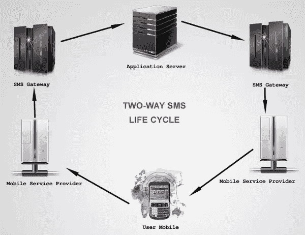

# 用 PHP 实现双向短信

> 原文：<https://www.sitepoint.com/implement-two-way-sms-with-php/>

如今，短信被用于各种目的。例如，Gmail 和脸书等主要网站使用短信来改进他们的身份验证过程，通过多因素身份验证和通知用户更新。这些是单向 SMS 应用程序，因为消息仅从这些站点发送给用户。

双向 SMS 应用程序比单向应用程序更复杂。在双向短信应用程序中，用户可以通过发送消息来发起对话，然后应用程序根据用户的命令做出响应。

在本文中，我将解释双向短信交互的过程，并向您展示如何将它整合到您的 PHP 应用程序中。世界上有许多流行的提供双向消息传递的 SMS 网关；在我的解释中，我将使用 Clickatell。

## 双向短信生命周期

双向短信的生命周期可分为如下所示的 4 个主要步骤:



1.  用户向短信网关发送请求
2.  SMS 网关将请求转发到应用服务器
3.  应用服务器处理请求并响应短信网关
4.  SMS 网关将请求转发回用户

### 步骤 1–用户到短信网关

用户通过向网关发送 SMS 消息来发起对话。最初，它必须通过用户的移动服务提供商。这部分对我们来说并不重要，因为它属于本地服务提供商的领域。SMS 网关通过本地服务提供商接收消息。

用户显然需要一个特定的号码来发送他的信息。您可以使用特定于您的双向通信应用的短码或专用长号码(DID)。这些号码由短信网关提供，通常您需要购买这些号码。

专用长号码是标准的电话号码，如+94112367899。短码是一个 4-6 位数的代码。各有利弊:

*   短代码比专用的长号码更容易记忆。
*   专用号码可以在全球范围内使用，而短码通常仅限于给定国家的单个服务提供商。
*   与短码号码相比，专用长码号码在给定时间内可以处理更多的消息。

选择使用短码还是专用长码最终取决于您。

一旦网关收到 SMS，它就应该被路由到应用程序进行处理。在路由消息之前，网关需要做两件事:

*   以应用程序能够理解的方式准备消息数据
*   将应用程序 URL 映射到专用的长号码或短代码

每个网关都有自己的向应用服务器传输数据的方法，尽管通过 HTTP 连接的 XML 或 SOAP 通常是最流行的。网关应该为所使用的方法提供某种 API 文档。

应用程序开发人员必须在系统中创建一个特定的入口点来处理从网关收到的消息；这称为应用程序 URL。将应用程序 URL 映射到专用号码或短代码的过程因网关而异。有些允许直接通过用户账户界面进行配置，比如 Clickatell。如果这个选项不可用，我们必须联系网关的技术支持资源，并向他们提供要配置的应用程序 URL。

### 阶段 2–应用服务器的 SMS 网关

然后，应用程序所有者必须决定如何从网关接收数据。Clickatell 允许您在用户帐户中指定这个方法。如果不可用，您需要再次联系特定网关的技术团队。

下面的代码示例向您展示了 Clickatell 如何通过 HTTP GET 方法发送数据，现在您可以接收它了。其他网关也将提供类似的方法。

```
https://www.example.com/sms/sms.php?api_id=12345&from=279991235642&to=27123456789&timestamp=2008-08-0609:43:50&text=Hereisthe%20messagetext&charset=ISO-8859-1&udh=&moMsgId=b2aee337abd962489b123fda9c3480fa
```

```
<?php
$fromNo = $_GET["from"];
$toNo = $_GET["to"];
$message = $_GET["text"];
$msgID = $_GET["moMsgId"];

// Process the user command and generate output
...
```

这里有一个例子，数据以 XML 文档的形式发布。

```
<?xml version="1.0"?>
<clickmo>
  <api_id>xxx</api_id>
  <moMsgId>fa6ba35b330ce1bc7e2008e5d92d57aa</moMsgId>
  <from>handset_number_here</from>
  <to>mo_number_here</to>
  <timestamp>2007-02-26 14:36:50</timestamp>
  <text>xxx</text>
  <charset>ISO-8859-1</charset>
  <udh></udh>
</clickmo>
```

```
<?php
$data = $_POST["data"];

$xmlDoc = new DOMDocument();
$xmlDoc->loadXML($data);

$fromNo = $xmlDoc->getElementsByTagName("from");
$fromNo = $fromNo->item(0)->nodeValue;

$toNo = $xmlDoc->getElementsByTagName("to");
$toNo = $toNo->item(0)->nodeValue;

$message = $xmlDoc->getElementsByTagName("text");
$message = $message->item(0)->nodeValue;

// Process User Message and Generate Response
...
```

应用程序需要使用一种可用的方法来捕获传入的数据，并处理用户的命令。在一个简单的场景中，用户的消息少于 160 个字符，这段代码可以完美地工作。但是如果消息超过 160 个字符会发生什么呢？

让我们假设一个电视台开始了一个广告活动，用户可以通过短信发送广告。一旦 SMS 被发送，用户将从服务器接收广告将被显示的时间段。广告仅为文本，将显示在屏幕底部。我们还假设我们有预定义的发送消息的格式，如下所示。

```
advertisement *sports* title *your advertisement* title *message content of your advertisement*
```

消息中的所有内容都显示为值对。`advertisement`将是标签，运动将是代表广告类别的值。然后，`title`是下一个标签，它的值将是广告的标题。`message`是最终的标签，将是用户希望在广告中显示的内容。

根据标题和消息的长度，此短信可能超过 160 个字符。每当收到一条很长的消息时，网关会将其分成多个 160 个字符的部分。但是我们仍然必须将这两部分作为一条消息来处理。

如果我们使用前面的代码示例来解析消息，同一条消息的第 1 部分和第 2 部分将作为两条不同的消息来处理。由于这两部分都没有完整的命令，应用程序会向用户返回一个错误。UDH 是这个问题的解决方案。

### 什么是 UDH？

UDH 代表用户数据头。当我们发送一条很长的消息时，发送设备(手机)会将消息拆分，作为单独的消息发送出去。UDH 值将被分配到每个消息部分的开头，以便接收设备可以将它们识别为属于单个消息，并重新组合它们。

前面场景中的 UDH 值如下所示:

```
Part 1 - 05 00 03 CC 02 01
Part 2 - 05 00 03 CC 02 02
```

最后两个十六进制值将是 UDH 中最重要的值。在上述代码中，倒数第二个数字是 02，它定义了消息中的部分数。所以，这条信息被分成两部分。如果有三个部分可用，那么这个值应该是 03，依此类推。下一个数字定义了消息的零件号。01 表示是第一部分，02 表示第二部分，以此类推。

现在我们有了处理被分成多个部分的较长消息所需的信息。

```
<?php
$fromNo = $_GET["from"];
$toNo = $_GET["to"];
$message = $_GET["text"];
$msgID = $_GET["moMsgId"];
$udh = $_GET["udh"];

$total = 1;
$count = 1;
if ($udh) {
    $tmp = str_split($udh, 2);
    $total = hexdec($tmp[4]);
    $count = hexdec($tmp[5]);
}

if ($count != $total) {
    // Save the message fragment in database
    saveMessagePart($db, $from, $message, $udh);
}
else if ($total != 1) {
	$prevParts = getMessageParts($db, $from);
	$message = $prevParts . $message;
}

// process $message
...
```

既然我们可以处理完整的消息并对其进行操作，这就完成了请求周期的这个阶段。接下来的两个阶段展示了如何通过网关将响应发送回用户。

### 阶段 3 和 4–应用服务器到 SMS 网关，网关到用户

在前一阶段，我解释了从网关接收消息并在应用程序中处理它的过程。一旦处理了请求并生成了响应，我们需要将它发送回网关。

通常，SMS 网关为我们提供一个回调 URL 来传递响应数据。您通常必须提供接收者的号码、发送者的号码、消息内容和某种认证信息。确切的参数会因网关而异，但对于 Clickatell 来说，它们是`to`、`from`、`text`和`api_id`、`username`和`password`。

```
<?php
$message = array(
    "to" => 942288345,
    "from" => 944488345,
    "text" => "sample message",
    "api_id" => API_KEY,
    "user" => "myUsername",
    "password" => "secret"
);

$apiUrl = "http://api.clickatell.com/http/sendmsg?";
foreach ($message as $parameter => $value ) {
    $apiUrl .= $parameter . "=" . urlencode($value) . "&";
}
$apiUrl = rtrim($apiUrl, "&");

$ch = curl_init();
curl_setopt($ch, CURLOPT_HEADER, 0);
curl_setopt($ch, CURLOPT_RETURNTRANSFER, 1); 
curl_setopt($ch, CURLOPT_URL, $apiUrl);

curl_exec($ch);
curl_close($ch);
```

上面的代码示例首先使用`urlencode()`对所有参数进行编码，并将它们附加到 API 的回调 URL。然后，我们初始化一个 cURL 请求并调用 URL。响应消息现在已经发送到网关，这结束了步骤 3。

第 4 步很简单，在这个过程中我们不需要做任何事情。网关负责以正确的顺序将所有消息发送到用户手机。

## 摘要

我们从讨论什么是双向短信以及它为什么有用开始了本教程。然后，我们通过 4 个主要阶段讨论了双向消息传递的过程。现在，您应该能够将这里介绍的概念应用于任何给定的 SMS 网关，并在您的 PHP 应用程序中实现双向 SMS。

图片 via[Fotolia](http://us.fotolia.com/?utm_source=sitepoint&utm_medium=website_link&utm=campaign=sitepoint "Royalty Free Stock Photos at Fotolia.com")

## 分享这篇文章