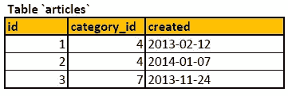

# 实施多语言支持

> 原文：<https://www.sitepoint.com/implementing-multi-language-support/>

建立一个多语言网站可能是吸引新客户的好方法，也可能是吸引更多人参与你的项目的好方法。翻译一个只有几个静态页面的简单网站可能并不复杂，但是当启动多语言支持时，更复杂的 PHP web 应用程序可能需要大量的工作。在这篇文章中，我将介绍在网站国际化时需要考虑的不同类型的内容。请继续阅读，了解如何将它们翻译成不同的语言。

### 多语言静态内容

首先，您的站点可能包含硬编码在项目文件中的文本内容，需要翻译成其他语言。模板文件中的文本字符串或 PHP 脚本中处理的通知消息就是这种内容的例子。如果在编写这些部分的代码时，您没有打算国际化，那么您将不得不遍历每一行并处理存储在那里的文本字符串的翻译。

但是实际的翻译应该怎么做呢？处理多语言内容的常见方式是使用[Gettext](http://www.gnu.org/software/gettext/)——一种软件解决方案，用于处理用不同编程语言编写的应用程序中的翻译。它也可以在 PHP 中作为[单独的扩展](http://php.net/manual/en/book.gettext.php)使用。使用 Gettext 可以将应用程序翻译从源代码中分离出来。结果，负责准备翻译的人不必钻研代码，可以独立于 web 开发人员工作。当翻译完成后，它们被放在一个单独的文件中，由 PHP 脚本读取。应用程序将翻译与存储在代码中的源文本字符串进行匹配，最终用户可以看到以正确语言显示的站点。
作为开发者你需要做的是将 PHP 应用中的纯文本字符串转换成 Gettext 可以处理的字符串。您必须将文本包装在 [gettext()函数](http://www.php.net/manual/en/function.gettext.php)中，该函数通常使用别名`_()`来访问(函数名是下划线)。通过这样做，您指定了某个文本字符串需要被翻译，并且可以由 Gettext 处理。
如果你想了解如何在 PHP 应用程序中管理 Gettext 翻译的细节，有一个完整的教程详细解释了这个主题，作者是 Abdullah Abouzekry: [以“正确的方式”本地化 PHP 应用程序](https://www.sitepoint.com/localizing-php-applications-1/)。我鼓励你阅读它，看看我上面描述的逻辑的一些实际例子。
还要记住，如果你使用一个框架作为你的 PHP 应用程序的基础，它可能有一个负责管理翻译的组件。查看您的框架文档，检查是否有工具可以简化多语言支持的处理。

### 数据库内容

在更复杂的应用程序中，网站的大部分内容可能存储在数据库中。如果网站只支持一种语言，你只需要保存一个版本的资源，在需要的时候就可以获取。但是实现多语言网站需要您改变在数据库中存储数据的方式。特定于语言的资源现在必须由语言代码来标识，并且必须以访问者设置的语言版本来获取。对于开发人员来说，这意味着您可能需要更改数据库结构来处理翻译。

要了解如何为多语言网站创建数据库结构的最佳实践，您可以查看不同框架使用的解决方案。一些框架提供了`behaviors`(为模型提供额外功能的模块)，负责处理特定模型的翻译。在将翻译行为附加到模型之后，框架将使用能够处理多语言支持的数据库结构来读写不同语言版本的数据。

例如， [CakePHP 框架](http://cakephp.org/)提供了[翻译行为](http://book.cakephp.org/2.0/en/core-libraries/behaviors/translate.html)，这可能会附加到你的模型上。为此，您需要指定哪些模型字段是语言相关的。让我们假设您有一个`articles`表，它有两个这样的字段:`title`和`text`:

要存储翻译，您需要将这些语言相关的字段移动到单独的翻译表中。翻译表中的每一行都由语言版本、型号和引用基表的字段名来标识。因此`articles`表现在看起来如下:

文章标题和文本已被移到保存翻译的单独表格中。如您所见，这些字段的单个翻译存储在单独的行中:

最重要的是，CakePHP 框架自动处理翻译数据的数据库读写。在附加了 Translate 行为之后，您可以像以前一样调用您的模型方法，并且框架将主表与 translations 表本身链接起来。在保存新行时，您不必担心在 select 语句中进行连接或向多个表中插入数据。只需浏览[文档](http://book.cakephp.org/2.0/en/core-libraries/behaviors/translate.html)就可以看到一些用这种方式处理翻译的代码示例。

其他框架经常提供类似的解决方案，就像上面描述的那样。如果你在使用 [Symfony2 框架](http://symfony.com/)和[教条 ORM](http://www.doctrine-project.org/) ，只需检查[教条可翻译行为](https://github.com/l3pp4rd/DoctrineExtensions/blob/master/doc/translatable.md)就能看到一个例子。如果您的站点不能在任何框架上运行，那么在实现您自己的数据库翻译处理方式时，您可以参考上面描述的解决方案。

### 用户提交的内容

如果你的网站允许访问者写与文章或产品相关的评论，你也必须处理这些内容的翻译。

首先，您需要保存用户在提交表单时输入的内容的语言版本。你可能只需要假设它等于用户设置的网站语言版本。你也可以使用一个外部 API(例如 [Google Translate API](https://developers.google.com/translate/) )来检测特定文本的语言。

然后，您需要将给定的文本翻译成您的站点支持的所有语言版本。你可以使用一个外部 API 来代替手动翻译，这个 API 将为你提供由你的站点的访问者提交的内容的机器翻译。ProgrammableWeb 站点列出了超过 60 种翻译 API，因此您可能会很容易找到适合您需求的解决方案。如果您正在寻找如何在 PHP 应用程序中实现翻译 API 的特定教程，我鼓励您阅读我在 Google Translate API 上的文章:
–[将 Google Translate API 与 PHP 结合使用](https://www.sitepoint.com/using-google-translate-api-php/)，其中解释了将 PHP 脚本与 API 集成的基础知识，
–[使用 Google Translate API](https://www.sitepoint.com/auto-translating-user-submitted-content-using-google-translate-api/) 自动翻译用户提交的内容，其中包含如何处理翻译 PHP 网站上用户提交的内容的完整代码示例。

当然，您可以选择不翻译用户提交的内容，而以原始语言版本显示。但是在我看来，显示机器翻译比显示不同语言的内容要好，即使从 API 中获取的翻译并不完美。

### 资源

因为你的站点可能不仅仅是由文本内容组成，你还必须处理在你的网页上共享的各种资源的翻译。图像、视频、附件、PDF 文件–所有这些类型的内容都必须得到处理。为了简化在网页上显示文件正确版本的方式，您可以将所有文件存储在一个目录结构中，该结构反映了站点上可用的语言。文件的英文版本将存储在`en`目录下，法文版本存储在`fr`目录下，以此类推。然后，您可以编写一个简单的助手方法，根据用户当前设置的语言版本获取适当的文件。如果特定资源有一个默认版本，如果没有找到特定语言的版本，您可以扩展该方法并获取默认文件。

### 其他类型的内容

处理上述内容类型的翻译通常不足以使网站完全支持不同的语言版本。记住，一个 PHP 网站通常包括其他内容来源。修改 DOM 树或显示通知消息的 JavaScript 代码通常包含需要翻译的文本字符串。此外，在使用附加到网页的外部 API 或小工具(如社交插件)时，不要忘记设置正确的语言版本。在实施多语言支持之前浏览您的网站可能会为您提供更多类型的内容，在准备翻译时必须加以考虑。

### 摘要

正如你所看到的，启动一个提供多语言支持的网站需要你以不同的方式翻译不同类型的内容。如果你打算翻译你的网站，我鼓励你列出一份需要完成的翻译类型的清单。它可以作为评估需要完成的工作量和实现翻译的良好起点。

如果你对这篇文章有任何问题或评论，欢迎在下面发表。也可以通过 [Google Plus](https://plus.google.com/112138584619019192671?rel=author) 联系我。

## 分享这篇文章