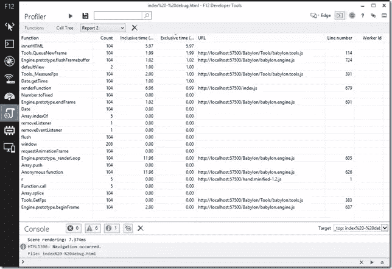
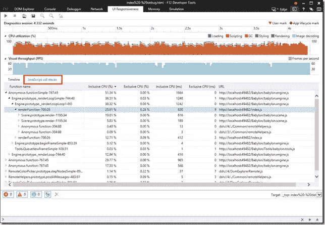
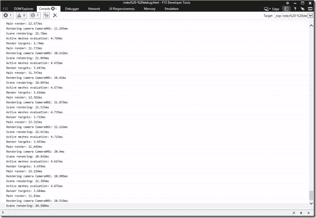
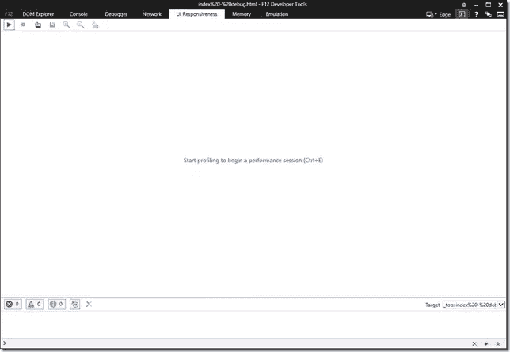
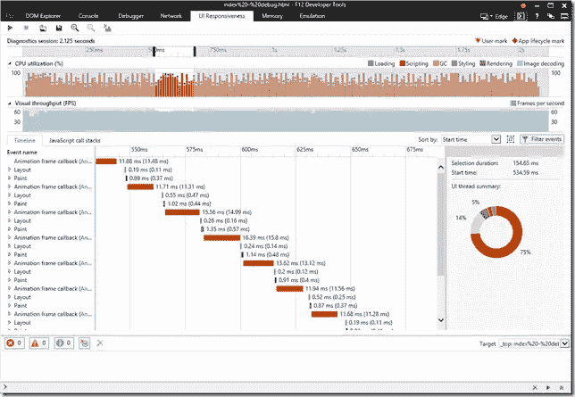
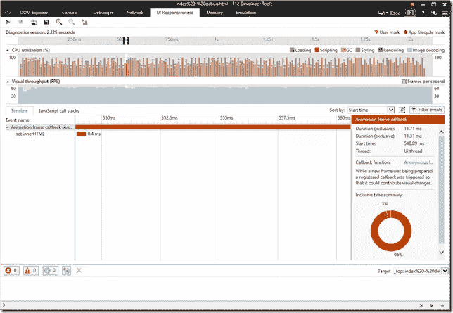
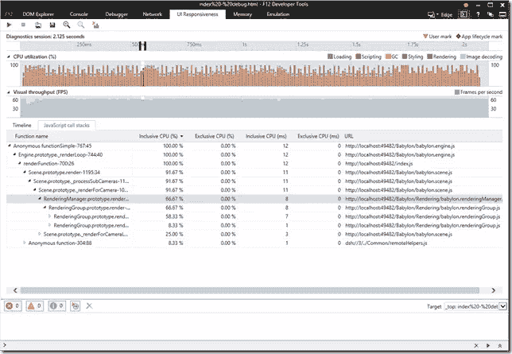
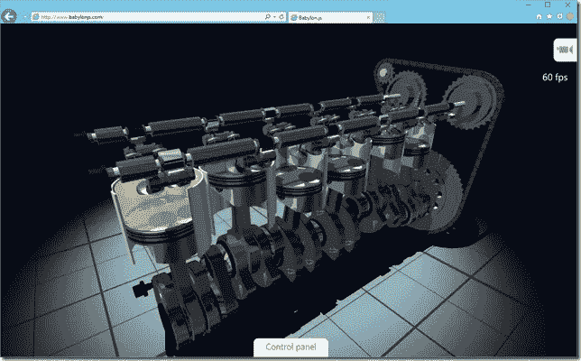
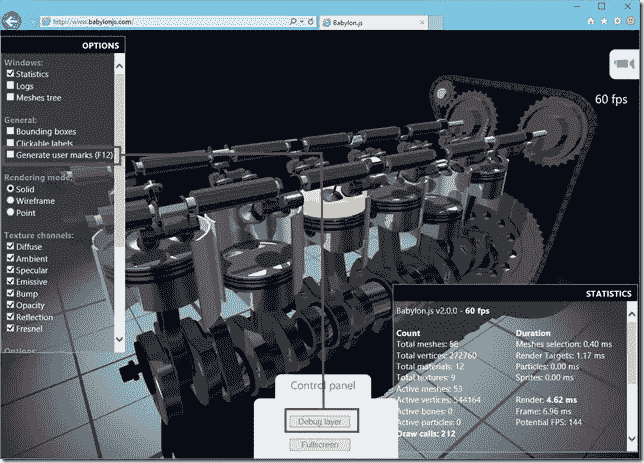
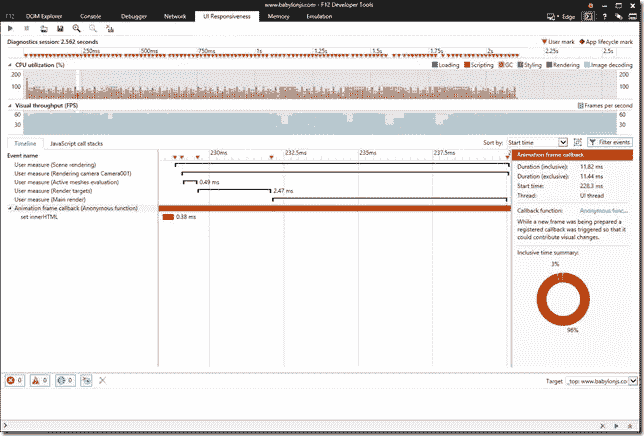

# 利用用户标记改进 JavaScript 性能分析结果

> 原文：<https://www.sitepoint.com/improve-javascript-performance-analysis-results-user-marks/>

本文是微软网站开发技术系列的一部分。感谢您对使 SitePoint 成为可能的合作伙伴的支持。

当处理高级 JavaScript 代码时，比如 3D 引擎，您可能会问自己可以做些什么来优化性能，以及应该花多少时间处理特定的代码片段。在本教程中，我将分享几个工具，它们提供了对代码执行情况的洞察，并向您展示如何充分利用内存图中的用户标记来分析您的性能。

迫不及待想看看这篇文章是关于什么的？看[这个视频](http://www.catuhe.com/msdn/usermarks.mp4)。

*如果你想讨论这篇文章，请随时在 Twitter 上 [ping 我](https://twitter.com/deltakosh)！*

## 需要侧写员吗？

我想到的一个是集成的分析器，你可以使用 Internet Explorer F12 开发工具的新[更新找到它，这些增强也将用于](http://blogs.msdn.com/b/ie/archive/2015/01/27/updates-for-the-f12-developer-tools-in-the-windows-10-january-technical-preview.aspx?WT.mc_id=13388-DEV-sitepoint-article12)[项目 Spartan](http://blogs.msdn.com/b/ie/archive/2015/02/26/a-break-from-the-past-the-birth-of-microsoft-s-new-web-rendering-engine.aspx?WT.mc_id=13388-DEV-sitepoint-article12) 。当然，您可以在您的 dev box 上使用任何您喜欢的类似工具。如果你想在 Android、iOS 或 Mac OS 上尝试一下，你也可以使用[遥控器。IE](http://remote.modern.ie/?utm_source=SitePoint&utm_medium=content&utm_campaign=article12) 在几分钟内获得一个运行 [Windows 10 技术预览版](http://insider.windows.com/?WT.mc_id=13388-DEV-sitepoint-article12)的实例。然后打开你一直在回避的 Internet Explorer“e”(它是一个临时的客户端外壳，配置了 Project Spartan 的新渲染引擎)，点击“F12 ”,现在你可以看到我将向你展示的内容:



请注意，借助我们随 [Windows 10 技术预览版](http://insider.windows.com/?WT.mc_id=13388-DEV-sitepoint-article12)提供的新 F12 工具，profiler 现已成为 UI 响应窗口的一部分:



让我们看看其他选项，它们可以让您更深入地了解代码的执行情况。

## 控制台.时间

你只需要围绕你想要评估的代码调用`console.time()`和`console.timeEnd()`。其结果是在您的控制台中出现一个字符串，显示从`time`到`timeEnd`之间经过的时间。

这是非常基本的，可以很容易地模拟，但我发现这个函数非常简单易用。

更有趣的是，您可以指定一个字符串来获取度量的标签。

这就是我为`Babylon.js`所做的:

```
console.time(&amp;quot;Active meshes evaluation&amp;quot;);
this._evaluateActiveMeshes();
console.timeEnd(&amp;quot;Active meshes evaluation&amp;quot;);
```

这种代码可以在所有主要特性中找到，然后，当启用性能日志记录时，您可以获得非常有用的信息:



*请注意，将文本渲染到控制台会消耗 CPU 能力*

即使这个功能不是标配，但浏览器兼容性还是相当棒的，Chrome、Firefox、IE、Opera、Safari 都支持。

## 绩效目标

如果您想要更直观的东西，也可以使用 performance 对象。在[其他有趣的功能](http://msdn.microsoft.com/en-us/library/ff975075?WT.mc_id=13388-DEV-sitepoint-article12)中，你可以找到一个叫做`mark`的功能，它可以发出用户标记。

用户`mark`是名称与时间值的关联。为了获得精确的值，您可以使用这个 API 来度量部分代码。你可以在[网站](https://www.sitepoint.com/discovering-user-timing-api/?WT.mc_id=13388-DEV-sitepoint-article12)上找到奥雷里奥·德·罗萨关于这个 API 的一篇很棒的文章。

今天的想法是使用这个 API 在 UI 响应屏幕上可视化特定用户`marks`:



此工具允许您捕获会话并分析 CPU 的使用情况:



然后，我们可以通过选择一个名为`Animation frame callback`的条目并右键单击它来选择`filter to event`来放大特定的帧。

所选帧将被过滤，然后:



多亏了新的 F12 工具，您可以切换到 JavaScript 调用堆栈，以获得关于该事件中发生的事情的更多细节:



这里的主要问题是，不容易理解代码在事件期间是如何调度的。

**这是用户标记进入游戏**的地方。我们可以添加我们自己的**标记**，然后能够分解一帧，看看哪个特征是最昂贵的等等。

```
performance.mark(&amp;quot;Begin something…just now!&amp;quot;);
```

此外，当你创建自己的框架时，用**度量**来检测你的代码是非常方便的:

```
performance.mark(&amp;quot;Active meshes evaluation-Begin&amp;quot;);
this._evaluateActiveMeshes();
performance.mark(&amp;quot;Active meshes evaluation-End&amp;quot;);
performance.measure(&amp;quot;Active meshes evaluation&amp;quot;, &amp;quot;Active meshes evaluation-Begin&amp;quot;, &amp;quot;Active meshes evaluation-End&amp;quot;);
```

让我们看看你能用 [babylon.js](http://www.babylonjs.com/?V8) 得到什么，例如“V8”场景:



您可以通过使用`debug layer`让`babylon.js`为您发出用户标记和测量:



然后，使用 UI responsiveness analyzer，您可以看到这个屏幕:



您可以看到用户标记显示在事件本身的顶部(橙色三角形)以及每个小节的分段上:


这是非常容易确定的，例如，渲染目标和主渲染阶段是最昂贵的。

`babylon.js`使用的允许用户测量各种特性性能的完整代码如下:

```
Tools._StartUserMark = function (counterName, condition) {
  if (typeof condition === &amp;quot;undefined&amp;quot;) { condition = true; }
  if (!condition || !Tools._performance.mark) {
    return;
  }
  Tools._performance.mark(counterName + &amp;quot;-Begin&amp;quot;);
};

Tools._EndUserMark = function (counterName, condition) {
  if (typeof condition === &amp;quot;undefined&amp;quot;) { condition = true; }
  if (!condition || !Tools._performance.mark) {
    return;
  }
  Tools._performance.mark(counterName + &amp;quot;-End&amp;quot;);
  Tools._performance.measure(counterName, counterName + &amp;quot;-Begin&amp;quot;, counterName + &amp;quot;-End&amp;quot;);
};

Tools._StartPerformanceConsole = function (counterName, condition) {
  if (typeof condition === &amp;quot;undefined&amp;quot;) { condition = true; }
  if (!condition) {
    return;
  }

  Tools._StartUserMark(counterName, condition);

  if (console.time) {
    console.time(counterName);
  }
};

Tools._EndPerformanceConsole = function (counterName, condition) {
  if (typeof condition === &amp;quot;undefined&amp;quot;) { condition = true; }
  if (!condition) {
    return;
  }

  Tools._EndUserMark(counterName, condition);

  if (console.time) {
    console.timeEnd(counterName);
  }
};
```

多亏了 F12 工具和用户标记，你现在可以得到一个很好的仪表盘，显示你的代码的不同部分是如何协同工作的。

## JavaScript 文章的更多实践

这可能会让你感到惊讶，但是微软有许多关于开源 JavaScript 主题的免费课程，随着 [Project Spartan 即将到来](http://blogs.msdn.com/b/ie/archive/2015/02/26/a-break-from-the-past-the-birth-of-microsoft-s-new-web-rendering-engine.aspx?WT.mc_id=13388-DEV-sitepoint-article12)，我们正在努力创造更多的课程。查看我自己的:

*   [web GL 3D 和 HTML5 以及巴比伦介绍。JS](http://www.microsoftvirtualacademy.com/training-courses/introduction-to-webgl-3d-with-html5-and-babylon-js?WT.mc_id=13388-DEV-sitepoint-article12)

*   [用 ASP.NET 和安古拉杰构建单页应用](http://channel9.msdn.com/Events/Build/2014/3-644?WT.mc_id=13388-DEV-sitepoint-article12)

*   [HTML 中的前沿图形](http://channel9.msdn.com/events/Build/2014/3-558?WT.mc_id=13388-DEV-sitepoint-article12)

或者我们团队的学习系列:

*   [让你的 HTML/JavaScript 更快的实用性能技巧](http://channel9.msdn.com/Series/Practical-Performance-Tips-to-Make-Your-HTMLJavaScript-Faster/06?WT.mc_id=13388-DEV-sitepoint-article12)(从响应式设计、休闲游戏到性能优化的七部分系列)

*   现代网络平台快速启动(HTML、CSS 和 JS 的基础)

*   [使用 HTML 和 JavaScript JumpStart 开发通用 Windows 应用](http://www.microsoftvirtualacademy.com/training-courses/developing-universal-windows-apps-with-html-and-javascript-jump-start?WT.mc_id=13388-DEV-sitepoint-article12)(使用您已经创建的 JS 来构建应用)

以及一些免费工具: [Visual Studio 社区](http://www.visualstudio.com/en-us/products/free-developer-offers-vs.aspx?WT.mc_id=13388-DEV-sitepoint-article12)、 [Azure 试用版](http://azure.microsoft.com/en-us/pricing/free-trial/?WT.mc_id=13388-DEV-sitepoint-article12)，以及[针对 Mac、Linux 或 Windows 的跨浏览器测试工具](http://modern.ie/?utm_source=SitePoint&utm_medium=content&utm_campaign=article12)。

本文是微软网站开发技术系列的一部分。我们很高兴与你分享斯巴达项目的[和它的](http://blogs.msdn.com/b/ie/archive/2015/01/22/project-spartan-and-the-windows-10-january-preview-build.aspx?WT.mc_id=13388-DEV-sitepoint-article12)[新渲染引擎](http://blogs.msdn.com/b/ie/archive/2015/02/26/a-break-from-the-past-the-birth-of-microsoft-s-new-web-rendering-engine.aspx?WT.mc_id=13388-DEV-sitepoint-article12)。在 [modern 获得免费虚拟机或在您的 Mac、iOS、Android 或 Windows 设备上进行远程测试。即](http://modern.ie/?utm_source=SitePoint&utm_medium=content&utm_campaign=article12)。

## 分享这篇文章