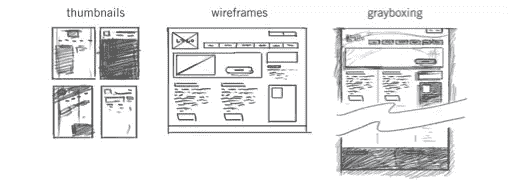
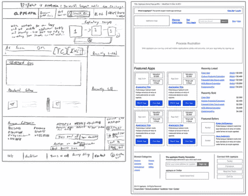
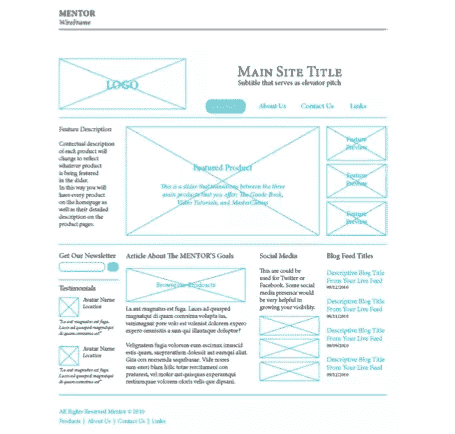
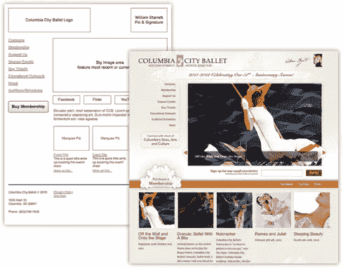
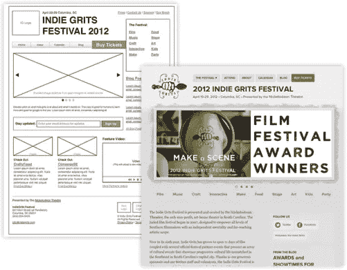

# 从网页设计师的路线图中洞察形式和功能

> 原文：<https://www.sitepoint.com/insights-into-form-and-function-from-the-web-designer39s-roadmap/>

在 SitePoint 的新书 [*网页设计师的路线图*](https://www.sitepoint.com/blog/) 中，作者 Giovanni DiFeterici 探索了网页设计过程中形式和功能的平衡。

交给你了，乔瓦尼…

“…到目前为止，我们主要关注如何为设计流程做准备的想法。我们探索了灵感资源、有助于产生概念的技术，以及将松散的视觉想法组织成我们可以用来与客户沟通的交付物的方法。

一旦所有的计划都完成了，我们最初的想法也清楚了，我们必须开始把具体的设计和结构放在一起。最终，当我们在 Photoshop(或者浏览器，如果适合你的话)中工作时，我们会达到精心制作像素完美设计的地步，但首先我们需要确定我们在设计什么。

图 4.1。设计过程中的步骤

在这一章中，我们将讨论缩略图、线框和灰框，如图 4.1 所示。我们将了解它们如何融入我们的工作流程，以及它们的用途。

## 为什么不直接上 Photoshop？

老实说，这取决于你喜欢如何工作。没有一种方法适合所有人，你可以相信自己的直觉，一口气完成你的设计。如果是这样的话，你会得到更多的权力，但我对此表示怀疑。我们大多数人都需要一个小结构来整理我们的思想和想法，然后才能处理它们。

我认识一些设计师，他们基本上跳过了过程中的预设计阶段，直接去 Photoshop 做模型。他们推像素，直到他们找到一个他们满意的设计，并提供给客户。有时它会起作用，设计被接受，被标记，然后被运出去。有时候不会。

通常情况下，不需要草图或线框就能做出伟大设计的设计师有一个快速的内部决策过程。设计师要么接受第一个想法，要么有能力快速果断地接受或拒绝想法。事实上，他们正在经历我所概述的相同过程，他们只是在内部这样做。无论哪种方式，当他们攻击空白的 Photoshop 画布时，仍然会发生一个过程。

预先警告，通常内部解决这些问题的能力需要大量的经验。我只是相信，一个明确的过程所提供的结构可以帮助确保你给予设计的每一个方面它所需要和应该得到的关注。

## 结构和形式

当我提到设计的结构时，我指的是两件事。设计必须以页面为基础，在视觉上进行组织。布局必须易于解析，内容的组织方式应该让用户知道什么是重要的，什么是次要的。除了组织页面的内容，我们的设计还必须让网站的其他部分易于访问和解析。它应该给用户反馈他们在哪里，他们刚刚做了什么，以及他们如何才能到达下一个他们想要的信息或功能。

我认为它为可见(页面上可见的信息)和隐藏(当前页面上没有的所有内容)的信息提供了结构。两者同等重要，最好的设计能找到融合两者的方法。

## 线框

> “对于客户服务，有时你需要为客户开发一个可交付的线框，有时你不需要。当你不这样做时，有时你仍然会开发它，但对你自己来说……我认为不应该有一种方法每次都做所有的事情。”
> 
> <cite>—丹·鲁宾</cite>

好吧。现在是我们处理好事情的时候了。

线框是超低保真度(这意味着简单:线，框，文本)设计，侧重于内容层次，一般布局和功能。线框应该排除颜色，纹理或图像。相反，它是一个纯粹的结构化文档，试图组织内容和交互，而没有设计元素可能造成的所有视觉混乱。同一个项目的两个线框例子见图 4.2。

图 4.2。两个线框，一个项目:快速而松散与紧凑而详细

在一些公司里，UX 设计师和界面设计师是同一个人，但也不总是这样。如果你在一个机构或团队中工作，线框化的任务可能会落到另一个人身上。无论是谁在做 UX，都可能会给你一堆线框来工作，所以我建议与那个人坦率地交谈，以确保你收到对你有用的详细程度的线框。

### 我应该做多详细的线框？

进入线框的细节层次是一个主观决定。一个线框的深度通常取决于有多少决策过程是留给界面设计师的，有多少是由 UX 设计师控制的。一个详细的线框意味着 UX 设计师已经在布局和内容层次上做出了强有力的选择。通常，线框并不是“一成不变”的文档，所以界面设计者在制作最终模型时有相当大的自由度来移动内容。

线框细节也会受到页面内容数量或内容类型的影响，如图 4.3 所示。一个有几行文字和几幅大图片的主页不需要详细的线框。因为页面上的元素很少，所以实际上没有必要小心地按层次组织它们。

图 4.3。线框可以如你所愿的那样简单或复杂

相比之下，一个新闻网站的主页包含多列内容、专题报道、社交媒体订阅源和视频剪辑，需要预先规划。在像新闻网站这样繁忙的网站上，由于结构的需要，线框应该得到更多的关注。

通常情况下，线框的质量取决于线框的使用方式。在某些情况下，一个线框可以用来锤出非常具体的布局和层次结构的决定。在其他情况下，线框是设计师在设计时参考的一般指南。

保真度很低的线框在设计布局时可以给你很大的灵活性，但通常很少提供关于功能细节和设计结构要求的线索。高保真线框可以提供很多关于页面细节的信息，但是会让你觉得被你的设计所束缚。您的设计也不必完全遵循线框，如图 4.4 所示。

图 4.4。线框可以作为所需设计元素及其预期位置的快速参考

线框是最终设计的一种简写。因此，公共元素具有简化的表示。图像被表示为一个有交叉线条穿过的正方形。表格是顶部有标题的盒子。水平导航元素是带有均匀间距标题的长框。文字是…嗯，文字。但让我强调一下:没什么花哨的！如图 4.5 所示，一个线框几乎与最终设计没有任何关系。

图 4.5。如果适合你的工艺，可以不严格地使用线框

绘制线框时，你应该问自己四个问题:

*   页面上需要什么内容？
*   不同的内容是如何相互关联的？
*   他们怎么可能被安排？
*   用户应该如何与内容交互？

就是这样。如果你在考虑字体和图像，很可能你超越了自己。只需关注内容和结构……”

—

深入了解 Giovanni 的新书和网页设计流程:

*   [下载免费样章](https://www.sitepoint.com/blog/)
*   [观看视频集锦](https://www.sitepoint.com/shaun-inman-don-norman-amp-daniel-burka-share-their-web-design-insights/) …来自唐·诺曼、肖恩·因曼等的采访。

## 分享这篇文章