# 在 Windows 上安装和配置 ColdFusion MX 6.1

> 原文：<https://www.sitepoint.com/install-coldfusion-mx-windows/>

**我已经[为 ColdFusion](https://www.sitepoint.com/article/making-case-coldfusion) 做了案例，但是你仍然需要知道如何安装它！在本教程中，我将向您展示如何在 Windows 计算机上安装 ColdFusion 6.1，并引导您完成基本的设置过程。如果您没有运行 Windows，不要担心:您可以直接跳到设置过程，并按照我们的要求调整服务器。**

我们都听说过 ColdFusion 有多强大，我们大多数人都曾经体验过这种力量。我们也听说过与目前可用的其他语言相比，使用 ColdFusion 编程是多么容易。但是，有一件事你没有听说，那就是安装和设置 ColdFusion 服务器是多么容易。对某些人来说，设置和配置服务器是轻而易举的事；对其他人来说，这并不容易。

在本教程中，我将向您展示如何在您的家庭计算机(Windows 2000 或 XP)上设置 ColdFusion 开发服务器，以及如何让它与 Apache 2.x 一起工作(我还将向您展示如何安装它)。

在我们开始之前，你需要一些东西:

*   ColdFusion MX 的副本(如果您还没有 CD，我将向您展示如何获得副本)
*   具有以下最低要求的计算机:

*   英特尔奔腾处理器(或 AMD 同等产品)
*   256 MB 内存(最好是 512 MB 或 1 GB)
*   400MB 硬盘空间(这只针对服务器；你需要更多的空间来存放你的站点和代码)

*   Apache 2.x 安装程序的副本

*   时间:留出一个小时或更多的时间进行安装和配置。如果你通读了整个指南，你可能需要两个小时。当然，如果你必须下载软件的话，时间会更长。

现在你知道你需要什么了，是时候开始了。

##### 获得 ColdFusion MX 6.1

首先，我假设您没有 ColdFusion MX 6.1 光盘。所以，去 Macromedia 网站和[下载开发者版](http://www.macromedia.com/cfusion/tdrc/index.cfm?product=coldfusion)(如果你有 DreamWeaver MX 或 MX 2004，你可以从这张 CD 上下载 CF 服务器)。

根据您访问 Macromedia.com 的频率，系统会自动向您显示下载 ColdFusion MX 6.1 服务器的页面(见下图)，或者向您显示登录屏幕。如果您有 Macromedia 帐户，请在此时登录；否则，您需要注册一个 Macromedia 帐户，然后才能下载 ColdFusion 服务器。

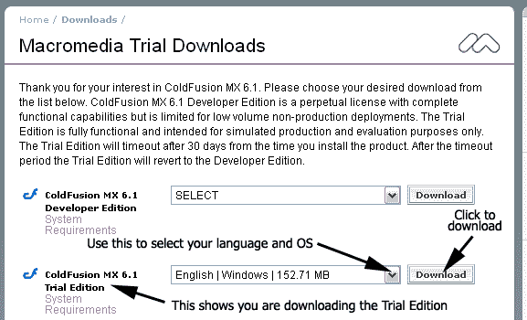

从这里，您需要选择 ColdFusion MX 6.1 开发人员版或 ColdFusion MX 6.1 试用版。您选择哪个并不重要，因为 30 天后，试用版将成为开发版。

您需要选择您的语言版本的服务器的 Windows 版本。对我来说，这是英文版的 Windows 操作系统(如果你想使用另一个操作系统，请随意选择你的操作系统版本)。

做出选择后，点击“下载”按钮开始下载。我建议你要么把它保存到你的桌面，你的 c 盘，或者任何你能找到它的地方。请记住，这个文件有 152.71 MB，下载需要一些时间。我用的是 4 MB 的电缆调制解调器，以 250-270 kb/秒的速度用了大约 10 分钟。

如果您运行下载管理器软件，请注意它可能无法从 Macromedia 网站下载 ColdFusion 服务器。我使用 GetRight，在下载文件之前，我必须关闭它。

现在您已经下载了文件，让我们开始安装过程。

##### 安装 Apache

在开始安装 ColdFusion 之前，您需要安装并运行一个 Web 服务器。对于本教程，我选择了 Apache，因为它对大多数 Web 开发人员来说很容易获得，也很熟悉。对于 Apache 的新手来说，没有必要担心——Apache 有一个庞大的社区，里面有非常乐于助人的人，他们中的许多人也可以在 [SitePoint 论坛](https://www.sitepoint.com/forums)中找到。

你可能会奇怪我为什么不选 IIS，Windows 2000 和 XP Pro 上都有。答案是这些服务器只允许你安装一个网站。然而，大多数从事开发工作的人通常同时在多个站点上工作。这也是我决定避开它的原因之一。更多信息，请查看 [IISAnswers](http://www.iisanswers.com/IIS51.htm) 。

如果您还没有安装，请[下载最新版本的 Apache](http://httpd.apache.org/) 。出于本文的目的，我下载了 Apache 2.0.50 for Windows。我抓住了 MSI 安装程序，而不是。zip 安装程序，但你可以使用任何一个。如果你是 Apache 的新手，或者你是微软的高级用户，我强烈推荐 MSI 选项，因为它很容易安装。

下载 MSI 安装程序后，双击它开始安装过程。您将看到一个如下所示的启动屏幕:

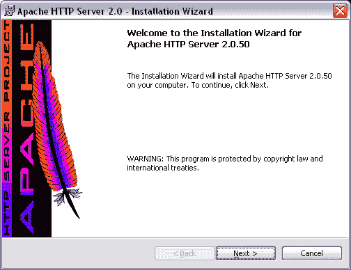

单击“下一步”按钮，您将看到许可协议。

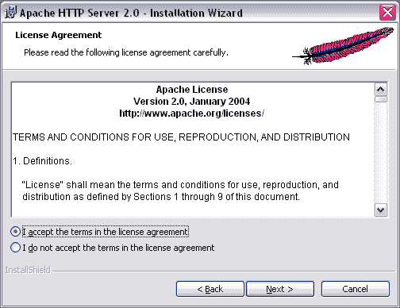

通读一遍，选择“我接受…”单选按钮，然后单击“下一步”。

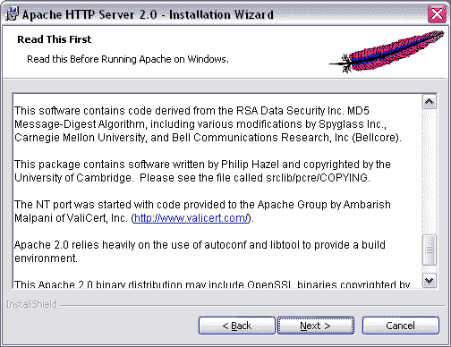

这里你会看到“先读这个”屏幕。这包含了大量的法律术语，并且看到 Apache 人在该表扬的地方给予表扬。再次通读，然后单击下一步。

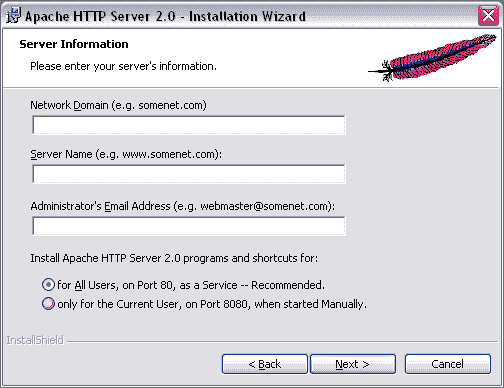

现在，您需要填写您的网络服务器名称和管理员电子邮件地址。请随意输入“localhost”作为网络域和服务器名称，并输入您的电子邮件地址。

在屏幕的底部，你会看到关于安装 Apache HTTP Server 2.0 程序和快捷方式的问题。我选择了“面向所有用户”选项，因为我是计算机上唯一的用户，我希望 Apache 在加载时启动，并作为服务运行。

如果您的电脑有多个用户，并且您有安全意识，我建议您选择“仅针对当前用户”选项。该选项在端口 8080 上运行服务器，每次需要使用它时，都需要手动启动 Apache。这需要做更多的工作，但是这个选项也让您可以完全控制服务，以及它何时运行。

填写完网络信息后，单击下一步—您将看到安装类型屏幕。您可以选择典型或定制。在我看来，你应该只选择自定义，如果你需要某些东西不被安装，或者如果你想调整一些东西。否则，典型的选择对我们 99%的人来说是完美的。点击下一步，让我们继续。

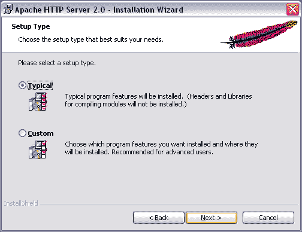

下一个屏幕是您的目标文件夹屏幕。这是你可以告诉 Apache 安装的地方；也是在这一点上，Apache 为您配置了默认网站(实际上是几个文件夹之下)。同样，除非你有足够的理由或知识去改变它，否则就让它保持原样，然后单击下一步按钮。

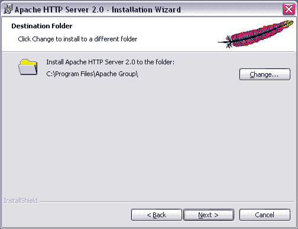

您看到的最后一个屏幕将是您的“准备安装”提示。这是您点击后退按钮并对您的配置进行任何更改的最后机会。如果您准备好安装了，请单击 install 按钮，在 Apache 安装和启动时放松下来。

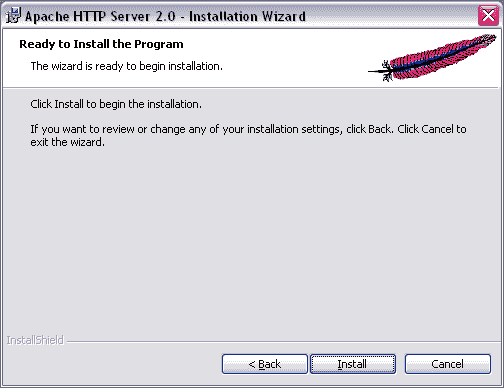

安装 Apache 后，确认它正在运行(您应该在系统托盘中看到图标)。如果没有，请从开始>程序> Apache 2.x 文件夹启动它。

您还可以打开浏览器，浏览到 http://localhost/，在这里您应该会看到默认的 Apache 欢迎页面。

一旦您确认 Apache 已经启动，请继续并关闭任何打开的窗口。我们稍后将回到阿帕奇。现在，是时候安装 ColdFusion 服务器了！

##### 安装 ColdFusion MX 6.1

我正在我的 Windows XP 笔记本电脑上安装(P4 3.06GHz，1 GB 内存)，你看到的大多数屏幕截图都会反映这一点。那些使用 Windows 2000 的人应该可以很容易地理解。

这也是指出开发者版可以安装在微软 Windows 98、me、NT 4 SP6A、2000 SP3、XP 或 2003 上的好时机。但是，98 和 ME 安装仅用于开发目的，不支持生产级服务。

双击安装文件(`coldfusion-61-win.exe`)开始安装过程。您应该会看到以下窗口。

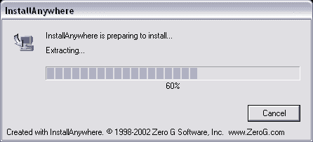

这表明安装程序正在准备安装文件，并将所有文件解压到一个临时文件夹中。只是坐下来，给安装人员几秒钟的时间来做它的事情。

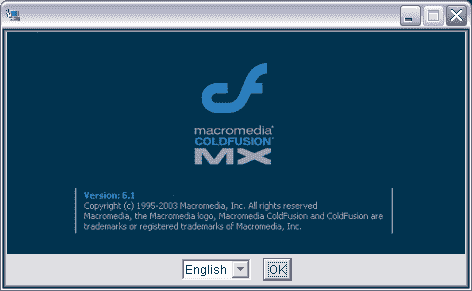

当您看到此窗口时，选择您的语言并单击确定。很可能只有一个选项可用，即您下载的语言，但请仔细检查以确保正确。

单击“确定”后，您将看到以下窗口:

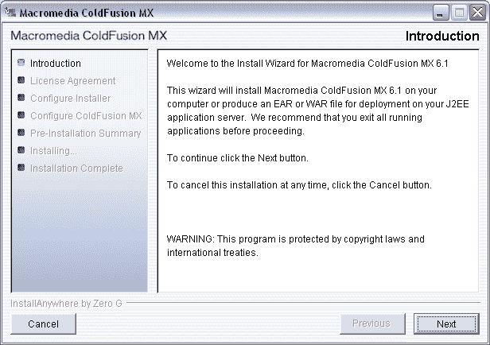

这只是一个介绍，告诉你你将要做什么。在这里，它告诉你这个向导是为在你的计算机上安装 CF MX 6.1 而设计的，或者为 J2EE 服务器的安装生成一个 EAR 或 WAR 文件。如果您不知道什么是 EAR 或 WAR，请不要担心——在本文中我们不会走这条路。

单击 Next，您将看到服务器的许可协议。在选择“我接受”单选按钮并单击“下一步”之前，请随意通读并做出明智的决定。当然，如果你不接受，你就不能安装服务器，你也不需要完成这篇文章的其余部分…

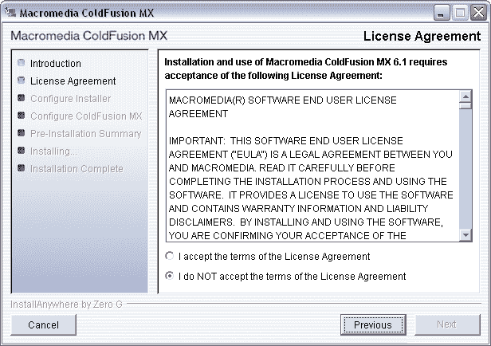

在你点击接受单选按钮之后，你将会看到一个屏幕，在这个屏幕上你可以做一些事情！好吧，它不多，但它是这次安装过程中的两个关键点之一。

下一个屏幕是安装类型窗口。

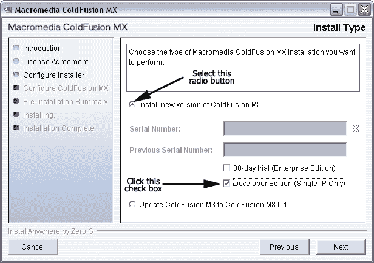

在此窗口中，您需要选择“安装 ColdFusion MX 的新版本”并勾选“开发人员版(仅限单 IP)”选项。如果您愿意，您可以选择 30 天试用版(企业版)，但只有当您计划在未来 30 天内购买服务器，或者您需要在未来 30 天内有多个 IP 访问服务器时，您才需要这样做。

30 天后，试用版变成了开发者版，这意味着服务器被限制在单个 IP 访问，但这并不妨碍任何功能。基本上，您将拥有一个可以由本地计算机(127.0.0.1 / localhost)访问的企业版副本和一个外部 IP 地址。如果你决定在一台专用计算机上设置这个服务器，并在另一台计算机上编码，然后上传到服务器进行调试和测试，这是很好的。

单击“下一步”按钮查看该屏幕，该屏幕提供了三种不同的安装选择。

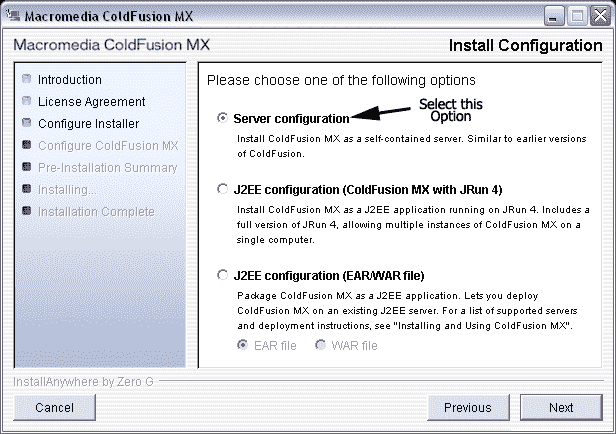

安装程序在这里有点模糊，所以希望我的解释会更有启发性。

*   **服务器配置**—这是您在本教程中要检查的选项，也可能是您未来大多数安装的选项。此选项将 ColdFusion 创建为一个独立的服务器，可连接到您的 Web 服务器(IIS、Apache 等)。这是大多数 ColdFusion 早期版本的安装方式，也可能是您最习惯的选项。
*   **J2EE 配置(带 JRun 4 的 ColdFusion MX)**如果您希望将 cold fusion 安装为 J2EE 应用程序并在 Macromedia JRun 应用程序服务器上运行，您可以选择此选项。如果您熟悉应用服务器(Websphere、JRun、Sun One、Tomcat 等。)那么您可能会喜欢这个选项——尤其是如果您计划集成或捆绑大量 Java 编程的话。
*   **J2EE 配置(EAR/WAR 文件)**如果您希望将 ColdFusion 作为 J2EE 应用程序安装在另一个应用程序服务器上，请选择此选项。这将创建一个 EAR 或 WAR 文件，然后您可以将其部署到 J2EE 服务器上并从中运行 ColdFusion。

这里不讨论这两个 J2EE 选项，因为对于没有或很少有 J2EE 应用服务器经验的人来说，它们可能非常复杂。

出于我们的目的，我们将选择服务器配置并单击下一步按钮。

您将看到的下一个屏幕会询问您希望在哪里安装 ColdFusion 服务器。

我建议您保持默认设置，除非您有特定的理由将它安装在其他地方。

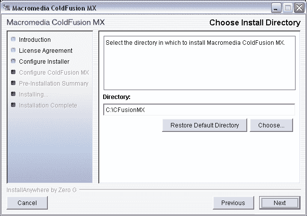

如果你不小心在这里输入了什么，或者决定不把文件放到另一个目录，你可以点击“恢复默认目录”按钮，让它默认回到 C:CFusionMX 文件夹。

在您告诉安装程序在哪里安装 ColdFusion 之后，您需要告诉它在哪里安装 CF Administrator。我建议您保留默认设置，除非您在 Apache 安装期间做了一些更改。

继续并点击下一步按钮。您应该会看到如下所示的屏幕:

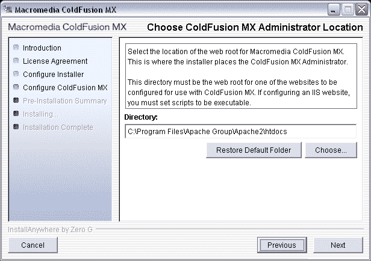

此屏幕允许您选择希望 ColdFusion 配置用于 ColdFusion MX 和您的 CFML 页面的 Web 服务器。

您会注意到这里没有列出 Web 服务器/站点，但是不要担心——这没问题。我们必须告诉 ColdFusion 我们想使用 Apache Web 服务器。为此，请单击“添加”按钮。

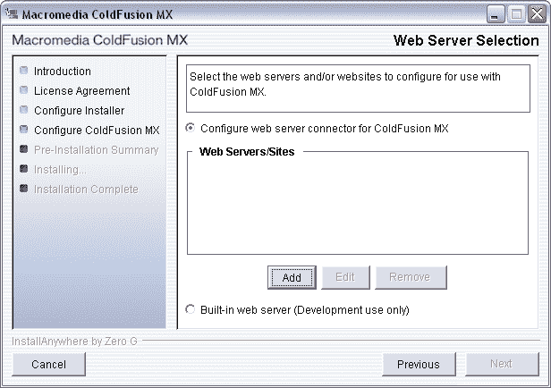

此时，您可以选择“内置 Web 服务器(仅用于开发)”选项，因为我们正在构建一个开发环境。不过，我倾向于回避这个选项，因为我坚信让您的开发环境尽可能地模拟您的生产环境。例如，如果您使用内置的 Web 服务器，但是您的主机有 Apache，并且您的代码在主机上有问题，但不是在本地，那么您可能要花费几个小时或几天的时间。

一旦你点击这个按钮，你会得到一个新的窗口，你可以输入一些数据。填写完成后，窗口应该是这样的:

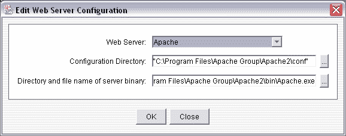

确保选择 Apache 作为您的 Web 服务器，如果您保留 Apache 安装的默认值，您可以使用“C:Program files Apache group Apache 2 conf”作为配置目录，使用“C:Program files Apache group Apache 2 binapache . exe”作为服务器二进制文件的目录和文件名。

完成后，点按“好”按钮。您的屏幕现在应该看起来像这样:

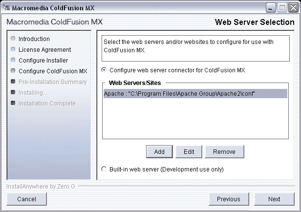

做出选择后，单击“下一步”按钮继续该过程。您将看到一个屏幕，询问 ColdFusion MX 管理员的位置。这使您有机会确定要将 CFIDE 文件夹及其所有内容(包括 CF 管理代码)放在哪里。同样，我建议将它保留在默认目录下，除非您为管理员设置了一个特定的站点，或者对您正在做的事情有一个好的想法。

完成后，再次单击“下一步”按钮。您将看到一个屏幕，允许您键入您的管理员密码-您将用于 ColdFusion 管理员登录的密码。

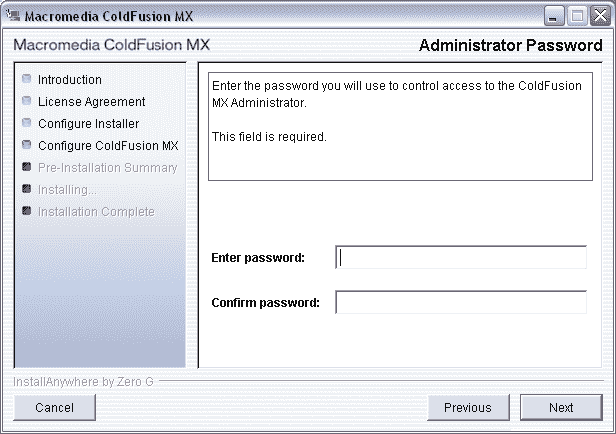

我建议你从这里开始好好练习，选择一个强密码。试着想一些有大写和小写字母的东西，试着加入一些数字，甚至一两个特殊的字符。你越神秘越好。尽管这只是一个开发环境，但是养成使用良好安全实践的习惯永远不会太晚。

在文本字段中输入密码后，单击“下一步”按钮。您应该会看到安装确认屏幕。


这将概述您所做的选择，以及您输入的一些数据。请随意查看此屏幕，准备好之后，单击安装按钮。

单击安装按钮后，您将进入安装过程。根据机器的速度，这可能需要几分钟到几分钟的时间。在安装过程中，CF 徽标下方会显示一些消息，让您随时了解情况。在此图中，安装程序告诉我们它正在安装核心 ColdFusion 文件。

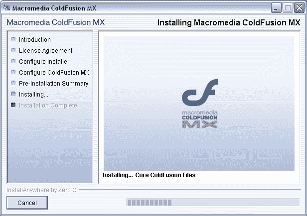

给聪明人一个忠告:如果你开始 ColdFusion 安装过程，不要停止它。当然，在左下角有一个取消按钮，但是我收到很多人的报告，说在这一点上取消会破坏安装，并阻止以后的安装。让安装程序完成它的工作，如果你需要，你可以在这个过程完成后卸载并重新安装。

安装完成后，您将看到以下内容:

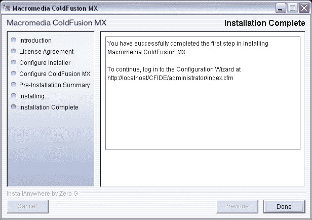

继续并单击“完成”按钮，您将看到一个打开 ColdFusion 管理员登录页面的浏览器窗口。

如果您的浏览器打开时，您看到一个空白页面或 HTTP 500 内部服务器错误，不要担心。我们只需要在 Apache 中做一点配置就可以让事情完美地运行。保持此窗口打开，并继续阅读本文的下一部分以了解更多详细信息。

##### ColdFusion 安装后 Apache 配置

Apache 需要很少的安装后修改，但是这并不意味着没有我们不能做的事情。我总是仔细检查以确保“安装”脚本在编辑`httpd.conf`时做了它应该做的事情。

如果您还没有确认 Apache 正在运行，请打开您的浏览器并将其指向 http://localhost/(除非您在安装过程中指定了一个真实的 URL)。您应该会看到精彩的 Apache 测试页面！如果您看到一个错误，请检查上面的步骤以确保您遵循了所有的 Apache 安装步骤，并检查您的日志文件以获得更详细的错误。

现在我们知道 Apache 正在运行，但是 ColdFusion 呢？将浏览器指向 http://localhost/CFIDE/administrator/index . cfm，看看会发生什么。可能发生三种故障之一:

1.  ***Failure #1:*** Your browser prompts you to save the .cfm file to your computer.
    ***Resolution:*** Two things come to mind as quick fixes here. The first is to restart Apache, since it probably hasn’t been restarted since you installed ColdFusion. The second is to check your httpd.conf file to make sure the ColdFusion module is being loaded. Locate your httpd.conf file (mine was in C:Program FilesApache GroupApache2conf), and see if you can’t locate this line:

    ```
    LoadModule jrun_module "C:/CFusionMX/runtime/lib/wsconfig/1/mod_jrun20.so"
    ```

    我搜索了一下`mod_jrun20.so`，得到了两个结果，其中一个是评论。

    如果这一行存在，它可能就在 httpd.conf 文件的最底部。这没什么大不了的，但是为了方便起见，剪切并粘贴它，使其与其他`LoadModule`命令一起作为最后一个条目出现，这些命令位于“Listen 80”行之后不久。

    一旦在 httpd.conf 文件中有了装载模块行，检查以确保`index.cfm`是`DirectoryIndex`选项之一。只需在 httpd.conf 文件中搜索这个命令——您应该会看到它被附加到列表的末尾。如果你愿意，你也可以把`index.cfml`添加到这个列表中。

    重新启动 Apache 并浏览到 http://localhost/CFIDE/administrator/index . cfm URL。如果一切正常，请跳到本文的配置 ColdFusion 部分。如果您仍然收到错误，请检查您的日志文件，并确认 CFIDE 文件夹和文件安装在您的 webroot 目录(`C:Program FilesApache GroupApache2htdocs`)中。

4.  ***故障#2:*** 你得到一条消息，说 CFIDE 文件夹不存在或者找不到文件。
    ***解决方法:*** 很可能该文件夹及其文件被放在了其他地方，或者您让 Apache 查看的文件夹与您告诉 ColdFusion 安装程序安装 CF Administrator 的文件夹不同。首先要做的是检查 CFIDE 文件夹是否在您的 webroot 文件夹中。如果是，请检查 Apache httpd.conf 文件，确保“DocumentRoot”行反映了您为 ColdFusion 安装程序提供的安装 CF Administrator 的位置。如果您必须对`httpd.conf`文件进行任何更改，请确保在尝试访问 URL 之前保存并重启 Apache。

6.  ***故障#3:*** 如果您遇到了#1 或#2 中没有提到的错误，或者您仍然有问题，您可能配置了错误的东西。仔细检查上面的步骤，确保你正确地遵循了它们。如果您发现您没有错过或跳过任何内容，我建议您在 SitePoint 的 ColdFusion 论坛上发帖以获得帮助。

既然已经安装并配置了 Apache，并且安装了 ColdFusion，那么就该开始配置 ColdFusion MX 6.1 了。

##### ColdFusion MX 的安装后配置

您可以通过浏览 http://localhost/CFIDE/administrator/index . cfm 来确认 Apache 和 ColdFusion 都已安装并正在运行。您应该会看到类似以下内容的屏幕:

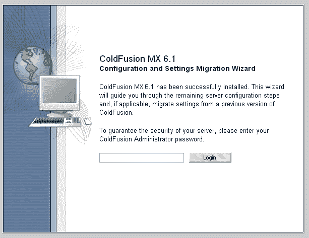

继续输入您的 ColdFusion 管理员密码。在接下来的几个屏幕中，我们将为 ColdFusion 设置一些基本的初始配置和安装后任务。

第一个屏幕将让我们设置 RDS 系统。就我个人而言，我并不喜欢 RDS，尤其是在生产服务器上，但我知道许多 Dreamweaver 用户喜欢它。在开发盒上，我看不出有任何问题，所以我建议您保持安装状态，并将 RDS 密码设置为与 ColdFusion 管理员密码相匹配。

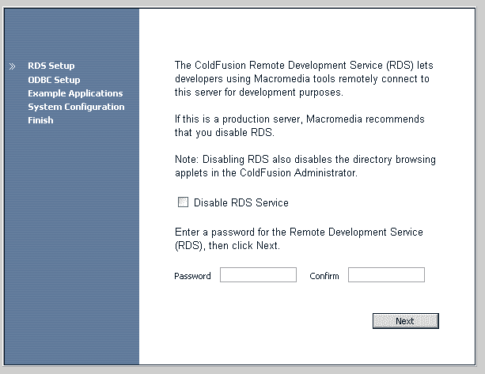

如果您在生产服务器上执行此操作，我强烈建议您调查运行 RDS 的漏洞，并选择一个与您的 ColdFusion 管理员密码完全不同的强密码。

禁用 RDS 不会妨碍您开发任何东西，但这意味着您无法使用 ColdFusion Administrator 中的目录浏览小程序。如果你知道你的服务器的布局，这没什么大不了的，但是小程序可以节省时间和配置。同样，选择最适合您的开发车间和协议的选项。

输入密码(两次)后，单击“下一步”按钮。下一个屏幕安装 ODBC 服务。请耐心等待—安装完成后，屏幕会自动刷新。

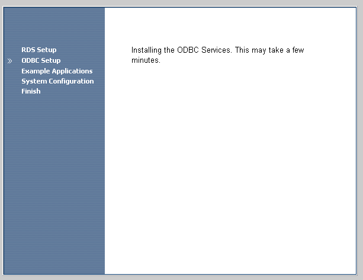

此时您应该不会遇到任何错误，但是如果您确实在 [SitePoint 的 ColdFusion 论坛](https://www.sitepoint.com/forums/forumdisplay.php?f=214)中发布了这些错误，并在继续之前获得了一些帮助。

下一个屏幕会询问您是否要安装 ColdFusion 随附的示例应用程序。

正如本文所警告的，您不应该在生产服务器上这样做。然而，在开发服务器上，这可能是一件好事，尤其是如果您是 ColdFusion 的新手，或者在构建应用程序时希望参考真实世界的代码。

我从未安装过这些示例应用程序，但我建议您[了解更多关于它们的信息](http://livedocs.macromedia.com/coldfusion/6.1/htmldocs/part_get.htm)，并做出自己的决定。

做出选择后，单击“下一步”按钮继续。如果您选择不安装示例应用程序，请在脚本运行过程中稍等片刻。您应该会看到这个屏幕:

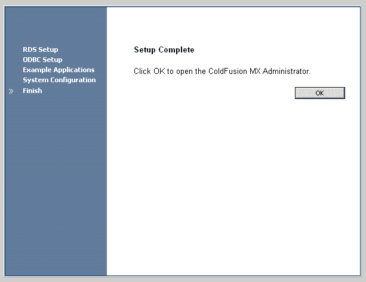

继续并点击 OK 按钮。您将看到 ColdFusion 管理员。当您第一次启动 ColdFusion Administrator 时，您会看到类似如下的屏幕:

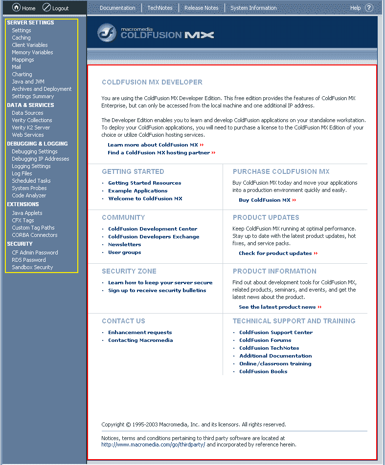

此屏幕是 ColdFusion 管理员的主登录页面。用红色圈出的区域(仅在本文中；它在管理员中实际上不是红色的)是我所说的“操作”区域。在这里，您可以“做”一些事情，比如配置数据源、映射等。，或“获取”信息，如读取日志文件或使用代码分析器。

用黄色标出的区域(同样仅用于演示目的)是菜单区域。如果你用过 ColdFusion 5，你会注意到这个菜单更简洁。另外，你会注意到你所有的“活动”都在一页上。

对于那些不熟悉它的人来说，ColdFusion 5 的管理菜单顶部有 3 个按钮，允许您更改菜单并更深入地了解 ColdFusion 5。有些人喜欢这种方法；其他人不喜欢它。显然那些不喜欢它的人赢了，因为我们在 ColdFusion MX (6.x)中看到了这个新菜单。

现在，我将向您展示一些非常基本的设置，以帮助您入门。要更深入地了解 ColdFusion Administrator，您必须等待我的下一篇文章，在那篇文章中，我们将一点一点地介绍 ColdFusion Administrator。

##### 开始时的简单设置

ColdFusion 管理器最受欢迎的区域之一是数据源区域。在这里，您可以设置和配置用于 ColdFusion 编程的数据源。

要开始，请单击左侧菜单中的“数据源”链接。您应该会看到如下所示的屏幕:

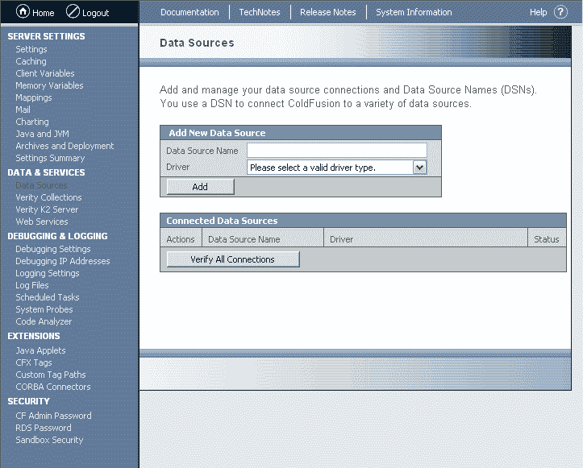

这里有两个有趣的地方。第一个是“添加新数据源”框，您可以在其中向 ColdFusion 服务器添加新数据源。第二个是连接的数据源，它列出了当前在此服务器上设置和配置的所有数据源。

让我们从创建一个到 MS SQL server 的数据源开始(下面的屏幕与其他数据源非常相似)。

首先，我们需要为这个连接键入一个数据源名称。对于这个测试，我称之为`TestConnection1`。然后，我们从 Driver 下拉菜单中选择我们的驱动器，并单击 Add New Data Source 区域中的 Add 按钮。

填写数据源名称后，选择一个驱动程序并单击“添加”按钮。您将看到以下屏幕。

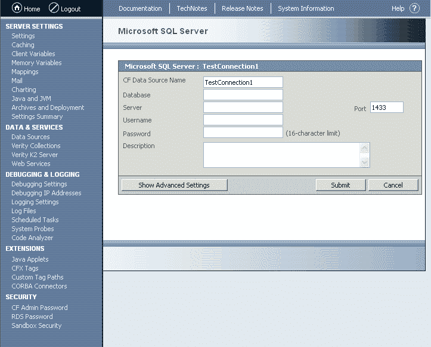

在这个屏幕上，键入数据库的名称、服务器的名称(完全限定的域名；IP 地址或网络名称)、运行服务器的端口、连接到该数据库的用户名和密码以及简短描述。

你可以把所有这些都留空，但这当然是没有意义的。有些人确实喜欢只输入数据库名称和服务器，而将用户名和密码留空；然后这些必须通过你的`cfquery`标签传入。除非您有这样做的理由，否则我建议您尽可能完整地填写这个表单，以便在编写应用程序时，您只需记住数据源名称。

完成表格后，单击提交按钮。ColdFusion 将尝试建立与此数据源的连接，以确保它存在并且可以使用给定的值访问。任何连接或身份验证错误都将被报告回来，以便您可以解决手头的问题。另请注意，您可以随时单击主数据源页面中的“验证所有连接”按钮，让 ColdFusion 检查所有当前配置的数据源。

除了数据源之外，您可能需要尽快进入的另一个领域是映射。在菜单区域找到 Mappings 链接，并单击它以获得此屏幕。

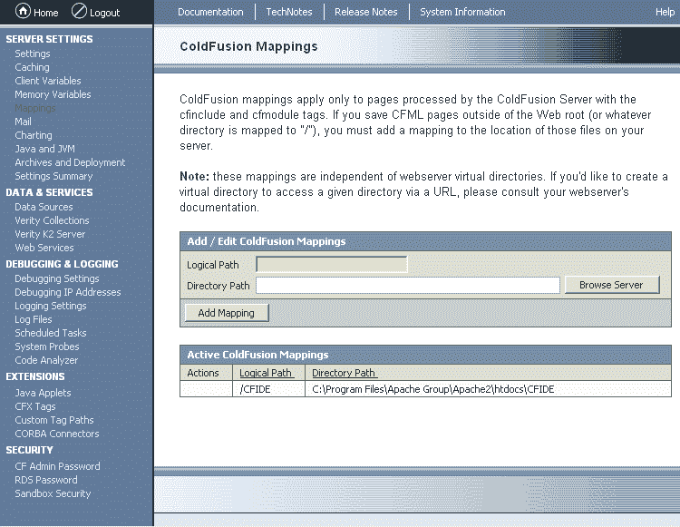

映射就像 IIS 中的虚拟目录，或者 windows 中的快捷方式。当您创建映射时，它会告诉 ColdFusion 服务器“将此目录引用视为 xyz”。当遍历根文件夹之外时，映射允许你避免相对点的噩梦。让我来给你解释一下。

假设您的 webroot 位于`c:webrootwwwmysite1`，您想要创建一个 includes 目录，但是您不想将其作为`../../includes`引用。通过映射，您将能够告诉 ColdFusion 任何对`/includes = ../../includes`的引用。

为此，将`/includes`放入逻辑路径文本字段，将`c:webrootincludes`放入目录路径文本字段。现在，只要你在代码中引用`/includes`，ColdFusion 就会自动知道引用`c:webrootincludes`中的文件。

当一台机器上有多个站点时，映射非常有用。您可以为每个站点(`mysite1`、`mysite2`、`mysite3`)创建一个映射，而不是将每个站点称为`c:webrootwwwmysite1`或`c:webrootwwwmysite2`，您可以简单地将其称为`/mysite1`或`/mysite2`。

##### 结论

本教程到此为止！请随意展开您的翅膀，探索 ColdFusion Administrator 的其他领域，并关注我的下一篇文章，我们将从上到下浏览每一项。

## 分享这篇文章