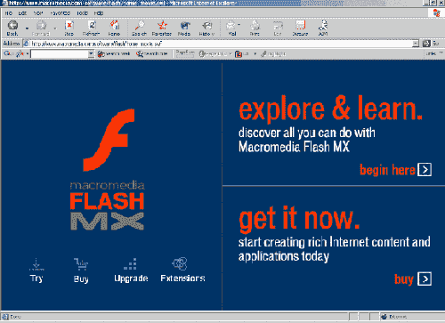
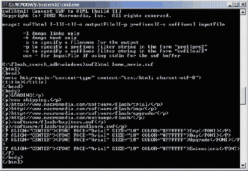

# 闪存通过 FAST 获得即时可见性

> 原文：<https://www.sitepoint.com/instant-visibility-fast/>

到目前为止，很难将 Flash 内容编入索引。你唯一能做的事情就是将 Flash 与 HTML 文本链接结合使用，使页面能够被搜索引擎蜘蛛抓取——这种解决方案还有一个优点，就是让没有 Flash 插件的用户也能阅读 Flash 页面。当然，HTML 文本链接在一段时间内仍将是一个好主意，因为许多人仍在抵制插件。但是，如果 Flash 页面被直接索引就更好了……

现在他们是了。FAST 刚刚宣布 all the web 及其合作伙伴网站将对 Macromedia Flash 内容和应用程序进行索引，这是一项突破，使许多受欢迎的网站能够通过搜索引擎获得更大的可见性。

Flash 网站曝光率的增加对设计者和用户都是好消息，因为这意味着所有的 Web、Lycos、InfoSpace 和其他使用 FAST 技术的合作伙伴网站都可以很容易地显示用户以前无法获得的 Flash 内容缓存的链接。

##### 高级搜索选项

仅 AllTheWeb 每月就为超过 1 亿用户提供服务。其用户现在可以通过使用网站的[高级功能部分](http://www.alltheweb.com/advanced)来进一步完善他们在 Macromedia Flash 内容和应用程序中的搜索。

您将在这里找到几个新选项:

1.  **一个新的嵌入内容选项**，您可以在其中指定是包含还是排除图像、音频、视频、RealVideo & RealAudio、Macromedia Flash、Java applets、JavaScript 和 VBScript 文件中的嵌入内容。
2.  **新的结果限制选项**，允许您在查询搜索词时指定目录级别的文档深度。也就是说，您可以要求搜索出现在主页级别和上面或下面的搜索项，一直到站点架构的第 10 级目录。或者，您可以搜索“所有文档深度”

Macromedia 表示:“FAST 的这一新的高级搜索功能为数百万人提供了一个成功的解决方案，这些人希望在包含我们技术的数百万个网站上对 Macromedia Flash 内容中包含的相关信息执行高度专业化的搜索”。在我看来，这些新的高级搜索选项肯定能改善用户体验——前提是普通用户意识到并使用它们。

##### Flash 问答

当我们在办公室第一次听说这项新功能时，运营经理不确定自己是否理解正确。因此，她向“快速搜索和转移”的企业沟通总监彼得·戈尔曼(Peter Gorman)询问:

***问题:*** 是快速能够进入一个站点的嵌入式。swf 文件来抓取和索引该文件中的文本，就像搜索引擎处理 HTML 文档一样？

***回答:*** 是的，FAST 会抓取文档中出现的链接，并在转换时将 Flash 文件视为 HTML。FAST 使用的是 Flash 搜索引擎 SDK，基本上是把 Flash 的 app 转换成 HTML 文件。

[更多关于 Flash 搜索引擎 SDK 的信息](http://www.macromedia.com/software/flash/download/search_engine/search_engine_faq.html)有更多细节。

我们立即从 Macromedia 网站下载了 Flash 搜索引擎 SDK，并且能够进行转换。swf 文件转换成 html。该工具不仅允许 FAST 索引闪存。swf 内容，它可以让我们分析我们的客户的 Flash 文件，并帮助他们优化他们的网站。随着其他搜索引擎在索引 Flash 内容方面跟随 FAST 的步伐，这将变得非常重要。

##### 转换中。swf 文件转换为 HTML

一旦我们下载了 Macromedia 应用程序，我们就在几个。从 Macromedia 网站下载的 swf Flash 文件。下面是其中一个文件的屏幕截图——您可以看到通过浏览器可以看到的链接和文本。

现在，当您从 DOS 提示符下运行 swf2html 应用程序并键入命令来转换。swf 文件转换为 HTML，您会得到以下内容，这表明还有其他。嵌入在第一个。swf 文件，以及文本链接和常规文本。因为很多。swf 文件是相互嵌入的，我们假设 FAST 会一直转换所有文件，直到它完成并完全索引了站点。

我们想知道 Flash 页面的搜索引擎列表的标题和描述有多快。我们假设这些元素来自原始 HTML 文档的 `<TITLE>` 和 meta description 标签，简单地将页面上的任何 Flash 转换成 HTML，除了 HTML 页面内容之外，还将这些数据添加到索引中。

但是如果 Flash 站点不是嵌入在 HTML 文档中，而只是一个. swf 文件呢？Fast 从哪里获得其列表标题和描述？

我们从 FAST 工程师 Rolf Michelsen 那里得到了答案，他证实了我们最初的假设是正确的。“当 Flash 文件作为 HTML 文档的一部分嵌入时，我们使用文档标题和各种试探法来提取搜索结果的标题和摘要。用于提取预告的试探法可以使用元描述标签，如果存在的话，”Michelsen 说。

“当索引一个独立的 Flash 文件时，我们直接从 Flash 文件中提取标题和摘要，基本上是试图从 Flash 文件中提取的前几个句子组成一个摘要，”Michelsen 总结道。

所以你有它——从马的嘴。这就是设计者应该始终嵌入他们的。HTML 文档中的 swf Flash 文件，并添加一个`<TITLE>`、元描述和元关键字标签，以确保他们基于 Flash 的页面将在搜索引擎中被索引，并带有他们认可的标题和描述。否则，列表可能会显示“无标题”，并且描述将是文件中第一个索引的文本，这可能并不有利。

## 分享这篇文章