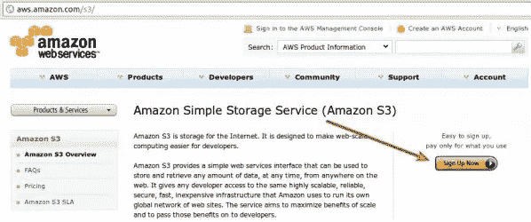
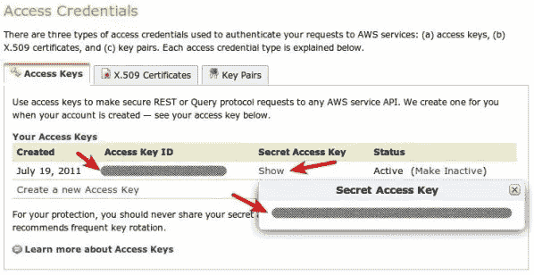

# 使用 PEAR 集成亚马逊 S3

> 原文：<https://www.sitepoint.com/integrating-amazon-s3-using-pear/>

我最近在为我正在开发的一个应用程序寻找托管服务。我决定调查 Orchestra.io，因为我预计它会在每年的特定时间点获得流量，并且需要应用程序相应地扩展。在查看 Orchestra.io 文档的过程中，我发现[不允许上传文件](http://docs.orchestra.io/kb/system-constraints/system-constraints#file-uploads-hosting "System Constraints / System Constraints / Knowledge Base - Orchestra Support")。相反，建议使用[亚马逊 S3](http://aws.amazon.com/s3/ "Amazon Simple Storage Service (Amazon S3)") 进行文件托管。

如果你不熟悉它，S3 是一个在线存储网络服务，是亚马逊网络服务(AWS)的一部分。它通过各种 web 服务接口提供对相当便宜的存储的访问。本文将演示如何注册一个亚马逊 S3 账户，并在自己的应用程序中使用 PEAR 的`Services_Amazon_S3`包与 S3 进行交互。

## 注册亚马逊 S3

这个过程的第一步是在[aws.amazon.com/s3](http://aws.amazon.com/s3/ "Amazon Simple Storage Service (Amazon S3)")注册自己的 S3 账户。在那里，找到并点击右边的“立即注册”按钮，然后简单地按照提供的指示。



不久之后，您应该会在您提供的地址收到一封电子邮件，其中包含进一步的说明。如果你没有，或者你丢失了你的拷贝，你可以简单地去 AWS 管理控制台在[console.aws.amazon.com/s3](https://console.aws.amazon.com/s3/ "Amazon Web Services")。网站的这个区域将为您提供访问标识符，这是您向 S3 写入数据所需的凭据。如果您已经使用了需要访问令牌的 web 服务 API，那么这些访问标识符的作用是相同的。打开控制台页面后，在右上角寻找标有您名字的菜单。单击它将其展开，然后单击“安全凭证”选项。


进入“安全凭证”页面后，向下滚动并找到“访问凭证”部分。在这里，您会发现显示了您的访问密钥 ID。点击它旁边的“显示”链接，显示您的秘密访问密钥。这两条信息是访问您的 S3 帐户所需的全部信息。一定要保证他们的安全。



“访问密钥”选项卡旁边的两个选项卡专用于 S3 以外的服务。更具体地说，X.509 证书用于在使用 AWS SOAP APIs 时进行安全请求(S3 和 Mechanical Turk 的证书除外，它们使用访问密钥),密钥对用于 Amazon CloudFront 和 EC2。

现在您已经有了访问标识符，请返回控制台页面。在左边你会发现一个桶列表，开始是空的。一个桶就是一组文件的命名容器。如果您在多个站点上使用 S3，这种机制可以帮助您将每个站点的文件分开并组织起来。在继续之前，您需要[创建一个存储桶](http://docs.amazonwebservices.com/AmazonS3/latest/gsg/index.html?CreatingABucket.html "Create a Bucket - Amazon Simple Storage Service")。

## 安装服务 _ 亚马逊 _S3

接下来，您需要安装`Services_Amazon_S3` PEAR 包。有可能但不太可能你的服务器已经有一个了，除非你有管理权限。因此，你可能需要一个适合共享主机环境的本地 PEAR 副本。

最简单的方法是在您有管理权限的机器上创建这个安装，并且已经安装了 PEAR，然后将这个安装复制到您想要的宿主环境中。在*NIX 系统上，这可以通过从终端运行以下命令来实现:

```
root@foobox:~# pear config-create `pwd` .pearrc
root@foobox:~# pear -c .pearrc install -o Services_Amazon_S3
```

这将在当前工作目录中创建一个`pear`目录。该目录中有一个 php 目录，其中包含已安装的 PEAR 包及其依赖项的实际 PHP 代码。这是您需要在自己的代码中使用 S3 代码的唯一目录；您可以将它或其内容按原样复制到项目中为第三方依赖项保留的任何目录中。

为了实际使用代码，您需要将包含`Services`子目录的目录添加到您的`include_path`中。如果`/path/to/dir`是包含`Services`的目录的完整路径，它可以被添加到`include_path`，如下所示:

```
<?php
set_include_path(get_include_path() . PATH_SEPARATOR . "/path/to/dir");
```

本文的剩余部分假设您有一个合适的自动加载器,可以在使用类时从这个目录中加载它们。

## 使用服务 _ 亚马逊 _S3

有两种使用`Services_Amazon_S3`的方式:通过编程使用 API，或者通过流使用流包装器。虽然使用流的代码可能更简洁，但它也容易受到 PHP 核心中与流上下文相关的错误的影响。这方面的一个例子是 PHP 5.3.4 中修复的一个 bug，如果提供了参数值的话，`copy()`函数实际上并没有使用`$context`参数值。建议您在决定使用哪种方法之前，对照您的 PHP 版本检查 PHP changelog。

### 使用 S3 流包装器

让我们先看看 streams 方法。除了访问密钥 ID 和秘密访问密钥，S3 还需要关于文件的两条信息:定义谁有权访问文件的字符串(默认为`private`)和指示文件内容类型的 MIME 类型(默认为浏览器不会尝试呈现的通用二进制类型)。当使用流包装器时，所有这些信息都是通过流上下文来传递的。让我们看一下文件上传的处理过程:

```
<?php	
if (is_uploaded_file($_FILES["fieldname"]["tmp_name"])) {
    Services_Amazon_S3_Stream::register();
    $context = stream_context_create(array(
      "s3" => array(
          "access_key_id" => "access_key_id",
          "secret_access_key" => "secret_access_key",
          "content_type" => $_FILES["fieldname"]["type"],
          "acl" => "public-read")));
    copy($_FILES["fieldname"]["tmp_name"],
        "s3://bucketname/" . $_FILES["fieldname"]["name"],
        $context);
}
```

这段代码处理使用 HTML 表单提交的文件上传。该表单包含一个名为`fieldname`的文件字段。由`$_FILES`超级全局变量为`content_type`上下文选项分配了为该字段提供的 MIME 类型。`acl`上下文选项控制文件上传后谁可以访问它。在这种情况下，因为我使用 S3 托管公共静态文件，所以我使用了一个简单的`public-read` [固定 ACL](http://docs.amazonwebservices.com/AmazonS3/2006-03-01/dev/index.html?CannedACL.html "Canned ACL - Amazon Simple Storage Service") ，允许任何人查看它。 [S3 访问控制](http://docs.amazonwebservices.com/AmazonS3/2006-03-01/dev/index.html?ACLOverview.html "Access Control List (ACL) Overview - Amazon Simple Storage Service")允许更细粒度的权限；我的是一个非常普通但简单的用例。

一旦创建了流上下文，就可以使用`copy()`函数将文件上传到 S3。来源是由`$_FILES`提供的路径，指向上传文件的临时本地副本；一旦请求终止，该副本将被删除。目的地引用`s3`包装器、包含文件的存储桶的名称(`bucketname`)，最后是文件的名称，在本例中是上传时从`$_FILES`检索到的文件的原始名称。

请注意，可以指定相对路径，而不仅仅是名称。如果[严格模式](http://pear.php.net/package/Services_Amazon_S3/docs/latest/Services_Amazon_S3/Services_Amazon_S3_Stream.html#class_details "Docs For Class Services_Amazon_S3_Stream")被禁用(这是默认的)，S3 将简单地接受路径并在 AWS 控制台中使用适当的目录结构。在这种情况下，不需要预先创建目录。

我的特定用例的另一个情况是，对应于特定数据库记录的文件可能已经被上传到 S3。文件上传到 S3 时，支持和维护了多个文件扩展名。因此，记录的文件名不一定总是相同的，在上传新文件之前，我需要删除与记录对应的任何现有文件。

如果我为一个记录存储任何现有文件的名称，这样做相对来说是微不足道的。否则，由于流包装器使用 API 的方式，它有点笨拙；我不得不遍历目录中的文件，以找到一个匹配预定前缀的文件，该前缀表示它对应于记录。以下是处理这两种情况的方法:

```
<?php
// If the existing filename is known...
unlink("s3://bucketname/path/to/file");

// If the existing filename is not known...
$it = new DirectoryIterator("s3://bucketname/path/to/dir");
foreach ($it as $entry) {
    $filename = $entry->getFilename();
    if (strpos($filename, $prefix) === 0) {
        unlink("s3://bucketname/path/to/dir/$filename");
        break;
    }
}
```

### 使用 S3 API

使用 S3 API 上传的相同文件如下所示:

```
<?php
$s3 = Services_Amazon_S3::getAccount("access_key_id", "secret_access_key");
$bucket = $s3->getBucket("bucketname");
$object = $bucket->getObject($_FILES["fieldname"]["name"]);
$object->acl = "public-read";
$object->contentType = $_FILES["fieldname"]["type"];
$object->data = file_get_contents($_FILES["fieldname"]["tmp_name"]);
$object->save();
```

所有相同的信息都被提供给代码，只是通过方法调用和对公共属性的赋值来完成，而不是流上下文和 URL。同样，在这个例子中，可以提供桶内的相对路径来代替名称。正如您所看到的，使用 API 上传文件需要更多的跳跃，在显式地将对象保存到 S3 之前，需要检索对象和手动读入文件数据。

然而，API 确实使得删除带有给定前缀的现有文件比使用`s3`流包装器更容易一些。在获得表示包含文件的桶的对象后，您可以简单地这样做:

```
<?php
foreach ($bucket->getObjects($prefix) as $object) {
    $object->delete();
}
```

## 摘要

即使你以前从未使用过 S3，这个包也能让你轻松快速地使用它。它为您处理与 S3 交互的所有底层细节，让您指定想要操作什么数据以及想要执行什么操作。

您选择哪种方法，streams 还是 API，实际上取决于您如何使用 S3 以及您的个人偏好。正如本文所示，根据您正在做的事情，使用任何一种方法，代码都可能或多或少有些冗长。

希望这篇文章已经让您对 S3 即服务的能力有了一点了解。我鼓励你[阅读更多关于 S3](http://aws.amazon.com/s3/ "Amazon Simple Storage Service (Amazon S3)") 的内容，研究`Services_Amazon_S3`的[示例](http://pear.php.net/manual/en/package.webservices.services-amazon-s3.php "Manual :: Services_Amazon_S3")和 [API 文档](http://pear.php.net/package/Services_Amazon_S3/docs/latest/ "Services_Amazon_S3 0.3.5")，并考虑将它们集成到你的应用程序中。

图像通过[马尔西左袋](http://www.shutterstock.com/gallery-7475p1.html "Stock Photos | Shutterstock: Royalty-Free Subscription Stock Photography & Vector Art") / [分流仓](http://www.shutterstock.com "Stock Photos and Royalty-Free Images by Subscription")

## 分享这篇文章