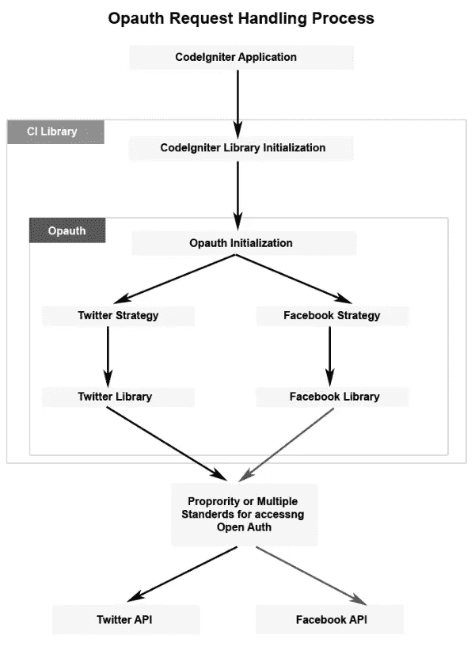

# 使用 Opauth 集成开放式身份验证

> 原文：<https://www.sitepoint.com/integrating-open-authentication-using-opauth/>

近年来，开放认证已经发展成为第三方认证的标准，允许我们通过标准接口安全地认证应用程序的用户。Twitter 和脸书是众多认证服务提供商中的佼佼者。当然，我们可以找到许多用于访问身份验证提供者的开源库，但是这些库的一个大问题是，不同的开发人员有不同的风格和方式来实现相同的系统。很难以标准的方式使用这些库或者用一个库替换另一个库。

Opauth 是一个开源库，旨在标准化各种服务提供商之间的认证过程。在本文中，我们将探讨如何有效地使用 Opauth 来标准化我们的身份验证策略。我将在这里使用 CodeIgniter，但是即使您不熟悉 CodeIgniter，我也建议您继续阅读，因为它对于其他框架也是类似的。一旦理解了集成的必要细节，适应任何框架都是超级简单的。

## Opauth 的重要性

Opauth 充当应用程序和开放身份验证提供程序库之间的接口。它可以被视为这些身份验证库的标准适配器。一旦设置了 Opauth，就可以使用一组标准的方法来请求任何服务，而不用学习各种不同的 API。它还允许我们以标准格式接收成功或失败执行的响应。Opauth 具有高度的可移植性，使我们能够通过微小的修改来改变开放的 auth 服务库以及我们选择的 PHP 框架。

## Opauth 执行过程

首先，让我们看一下下图，它显示了 Opauth 处理应用程序请求的过程:



最初，应用程序从 CodeIgniter 库中请求开放的身份验证细节。该库通过创建一个 Opauth 类对象来初始化 Opauth 进程。Opauth 根据提供的 URL 请求标准策略。策略是与身份验证提供者对话并处理他们的响应的一组指令。该策略使用一个特定的库来发起实际的身份验证请求。最后，我们可以访问服务提供商各自的 API。

正如您在图像中看到的，我已经分离了 Opauth 部分。Opauth 包含初始化、服务提供者库和各自的策略接口。在 Opauth 标准化请求的过程完成后，实际的身份验证请求开始。

Opauth 站点上目前列出了大约 18 个库，它带有一个内置的 Opauth 策略类。如果服务提供商没有策略类，我们可以使用[策略贡献指南](https://github.com/opauth/opauth/wiki/Strategy-contribution-guide "Strategy contribution guide - opauth/opauth Wiki")创建自己的类。

## 集成 Opauth 和 CodeIgniter

Opauth 集成库可用于许多更流行的框架，但也有一个简单的“普通”版本的库用于那些不使用框架的框架。理想情况下，你应该知道如何将普通 PHP 版本集成到一个框架中，这样你就可以使用那些目前不支持的版本。CodeIgniter 是我的最爱之一，所以我将解释如何从头开始将普通的 Opauth 版本集成到 CodeIgniter 中。

首先，我们必须从 GitHub 下载普通版本的 Opauth 库，并将下载的目录复制到您的`application/libraries`目录中(因为我们使用的是 Codeigniter，所以它需要集成为一个插件或库)。我已经将目录命名为`Opauth_lib`，如果有必要，您可以删除其中的`example`和`test`目录。

我想向您展示如何使用定制的 Codeigniter 库将 Opauth 集成到 CodeIgniter 中，因此创建库文件为`Opauth_lib.php`并需要位于 lib 目录中的`Opauth.php`文件。

```
<?php
$opauth_lib_dir = dirname(__FILE__) . '/Opauth_lib/lib/Opauth/';
require $opauth_lib_dir . 'Opauth.php';
```

现在为库创建类。

```
<?php
class OpauthLib
{
    protected $configurations;
    protected $opauth_obj;

    public function __construct($configurations) {
        $this->configurations = $configurations;
    }
}
```

要使 Opauth 工作，配置是必要的，所以我已经将配置数据传递给了库类的构造函数。我喜欢在`application/config`目录中使用一个配置文件来包含 Opauth 的必要信息，如下所示:

```
<?php
$config['opauth'] = array(  
    'path' => '/auth/login/',
    'callback_url' => 'http://example.com/auth/authenticate/',
    'callback_transport' => 'post',
    'security_salt' => 'rakhithanimesh123',

    'Strategy' => array(
        'Twitter' => array(
            'key' => 'twitter app key',
            'secret' => 'twitter app secret'
        ),
        'LinkedIn' => array(
            'api_key' => 'linkedin app key',
            'secret_key' => 'linkedin app secret'
        )
    ),
);
```

让我们讨论一下上面代码中每个参数的含义。

*   **路径**–定义您访问登录链接的位置。由于我已经安装了 Codeigniter 作为根目录，所以路径会是`/auth/login/`，分别是控制器和函数名。
*   **callback _ url**–定义在认证成功或失败后处理响应的 URL。我用过相同的控制器，但功能不同。这里我们必须定义完整的 URL，而不是相对 URL。
*   **callback _ transport**–定义如何处理响应。默认为“会话”。因为 CodeIgniter 不使用本地会话，所以我为回调传输指定了“post”。对于此参数，可以使用“会话”、“获取”或“发送”。
*   **security _ salt**–为 oauth 响应签名定义一个随机安全密钥。
*   **策略**–为您的应用定义一系列服务提供商信息。我们需要为每个策略提供必要的参数及其值。这里我使用 Twitter 和 LinkedIn 作为策略，使用它们的应用程序键作为参数。

一旦在配置中定义了策略，我们必须获得各自的库及其策略类，并将它们复制到`OpauthLib/lib/Opauth/Strategy`目录中。在 Opauth 中，服务提供者被称为供应商，下面的屏幕显示了特定策略的内容。


## 实现开放式身份验证登录

现在我们已经集成了 CodeIgniter，下一步是为我们在配置文件中定义的每个策略创建登录链接。我已经使用了路径`/auth/login`，所以我们需要用`login()`方法创建一个控制器。

```
<?php
class Auth extends CI_Controller
{
    protected $open_auth_config;

    public function __construct() {
        parent::__construct();
        $this->open_auth_config = $this->config->item('opauth');
        $this->load->library('opauth_lib', $this->open_auth_config);
    }

    public function login($stratergy = "") {
        if ($stratergy != "") {
            $this->opauth_lib->initialize();
        }
        else {
            foreach ($this->open_auth_config['Strategy'] as $strategy => $strategy_detail) {
                echo "<p><a href='".$this->config->item('base_url')."auth/login/".strtolower($strategy)."'>".$strategy."</a></p>";
            }
        }
    }
}
```

构造函数接收 Opauth 配置信息，并加载我们在上一节中创建的库。`login()`方法创建登录链接，将用户重定向到相应的站点进行身份验证。Opauth 登录 URL 是通过将策略添加到 path 参数中来配置的。例如，Twitter 的登录网址是`/auth/login/twitter`，LinkedIn 的网址是`/auth/login/linkedin`。

策略作为可选参数传递给我们的`login()`方法。因此，当策略为空时，我们使用 Opauth 配置为所有策略生成登录链接。当用户单击登录链接时，策略不会为空，我们调用 Opauth 库的 initialize 方法重定向用户进行身份验证。下面是库类`Opauth_lib`中 initialize 方法的实现。

```
<?php
public function initialize() {
    $this->opauth_obj = new Opauth($this->configurations);
    $this->opauth_obj->run();
}
```

它需要做的就是用配置初始化核心 Opauth 库中的`Opauth`类，并调用`run()`方法。它将通过 URL 自动识别所请求的策略，并重定向用户进行身份验证。

## 处理开放身份验证响应

让我们假设用户点击了 Twitter 登录链接。一旦她通过登录 Twitter 对应用程序进行授权，重定向将把用户带回到我们在配置中指定的回调 URL 的位置。在这种情况下，响应将通过`Auth`的`authenticate()`方法来处理。下面是它的实现:

```
<?php
public function authenticate() {
    $response = null;
    $response = unserialize(base64_decode($_POST['opauth']));
    echo "<pre>";print_r($response);exit;
}
```

因为我在配置中指定了 post 方法，所以可以使用`$_POST['opauth']`来访问响应。现在，用户已经使用开放式身份验证登录到我们的系统，响应将包含标准格式的用户详细信息、用户令牌和其他必要信息。您可以在会话或数据库中保存所需的信息，以便在许多请求中保持用户的登录活动。

要实现注销方法，只需清除用于保持用户登录的相应信息，并重定向回登录链接。

## 最后

在本文中，我们讨论了如何将 Opauth 与 CodeIgniter 集成。下面是将 Opauth 与任何给定的 PHP 框架集成的一般指南:

1.  下载 Opauth 的普通版本，并根据您的框架创建一个库或插件。
2.  创建新的配置文件或将配置详细信息复制到框架的现有配置文件中。
3.  添加任意数量的带有所需参数的策略。
4.  获取每个已定义策略的服务提供者库，并复制到 Opauth 中的库目录中。
5.  创建两个函数来处理可用策略的登录链接和响应。
6.  初始化 Opauth 类并调用它的`run()`方法来使事情正常运行。

您可以从 GitHub 获取本文使用的源代码副本。

让我知道你对使用 Opauth 来标准化你的认证机制的想法。尝试为其他 PHP 框架创建 Opauth 插件，支持开源社区。

图片 via[Fotolia](http://us.fotolia.com/?utm_source=sitepoint&utm_medium=website_link&utm=campaign=sitepoint "Royalty Free Stock Photos at Fotolia.com")

## 分享这篇文章